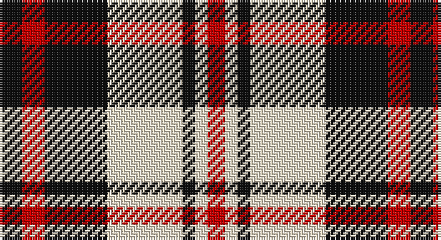

This page is one **sett** — a single exact thread-count. It belongs to the [tartan](/setts/k9r9k25w30k5w5r7/)
(the same proportion at any scale), whose colour order is pattern [KRKWKWR](/stripes/krkwkwr/).

Sourced from tartans-authority.  It is a [7 stripe tartan](/stripes/stripes7/).

Original link http://www.tartansauthority.com/tartan-ferret/display/8020/

## Register references

External register numbers recorded for this tartan.

- Scottish Register of Tartans: [8020](https://www.tartanregister.gov.uk/tartanDetails?ref=8020)
- Scottish Tartans Authority (ITI): 8020

## Thread count
K/9 R9 K25 W30 K5 W5 R/7

One full sett is **164 threads**.

## Palette

Palette: <strong>Tartan Register</strong> <small style="color:#888">(2 of 3 colours)</small>
<table><thead><tr><th>Colour</th><th>Threads</th><th>Shade</th><th>Base</th><th>OKLCh</th></tr></thead><tbody><tr><td>K/</td><td style="text-align:right;font-variant-numeric:tabular-nums">9</td><td><code style="background-color:#101010;">#101010</code> <small style="color:#888">#101010</small></td><td>K <code style="background-color:#000000;">#000000</code></td><td><small style="color:#888">oklch(17.3% 0.000 89.9)</small></td></tr><tr><td>R</td><td style="text-align:right;font-variant-numeric:tabular-nums">9</td><td><code style="background-color:#C80000;">#C80000</code> <small style="color:#888">#C80000</small></td><td>R <code style="background-color:#CC0000;">#CC0000</code></td><td><small style="color:#888">oklch(52.3% 0.215 29.2)</small></td></tr><tr><td>K</td><td style="text-align:right;font-variant-numeric:tabular-nums">25</td><td><code style="background-color:#101010;">#101010</code> <small style="color:#888">#101010</small></td><td>K <code style="background-color:#000000;">#000000</code></td><td><small style="color:#888">oklch(17.3% 0.000 89.9)</small></td></tr><tr><td>W</td><td style="text-align:right;font-variant-numeric:tabular-nums">30</td><td><code style="background-color:#F0E4CC;">#F0E4CC</code> <small style="color:#888">#F0E4CC</small></td><td>W <code style="background-color:#F7F7F7;">#F7F7F7</code></td><td><small style="color:#888">oklch(92.2% 0.034 84.6)</small></td></tr><tr><td>K</td><td style="text-align:right;font-variant-numeric:tabular-nums">5</td><td><code style="background-color:#101010;">#101010</code> <small style="color:#888">#101010</small></td><td>K <code style="background-color:#000000;">#000000</code></td><td><small style="color:#888">oklch(17.3% 0.000 89.9)</small></td></tr><tr><td>W</td><td style="text-align:right;font-variant-numeric:tabular-nums">5</td><td><code style="background-color:#F0E4CC;">#F0E4CC</code> <small style="color:#888">#F0E4CC</small></td><td>W <code style="background-color:#F7F7F7;">#F7F7F7</code></td><td><small style="color:#888">oklch(92.2% 0.034 84.6)</small></td></tr><tr><td>R/</td><td style="text-align:right;font-variant-numeric:tabular-nums">7</td><td><code style="background-color:#C80000;">#C80000</code> <small style="color:#888">#C80000</small></td><td>R <code style="background-color:#CC0000;">#CC0000</code></td><td><small style="color:#888">oklch(52.3% 0.215 29.2)</small></td></tr></tbody></table>

# Sample pattern

## Nearest tartans

The nearest existing variants by ΔTartan distance, with this tartan at the top so the swatches line up against it.

ΔTartan

Tartan

Sett

—

<a href="/ttd/edit/#slug=k9r9k25w30k5w5r7">Rocket Dog (Fashion)</a> <a class="nn-out" href="/variants/s7/k9r9k25w30k5w5r7/" title="open its dictionary page">↗</a>

0.95

<a href="/ttd/edit/#slug=w5r5w5k15r2~x2&amp;base=k9r9k25w30k5w5r7">Braes High School Falkirk (School)</a> <a class="nn-out" href="/variants/s5/w5r5w5k15r2~x2/" title="open its dictionary page">↗</a>

1.13

<a href="/ttd/edit/#slug=w23t6w6r5k35r10~x2&amp;base=k9r9k25w30k5w5r7">Merrilees</a> <a class="nn-out" href="/variants/s6/w23t6w6r5k35r10~x2/" title="open its dictionary page">↗</a>

1.29

<a href="/ttd/edit/#slug=k23b6k6r5w35r10~x2&amp;base=k9r9k25w30k5w5r7">Merrilees Dress (Dance)</a> <a class="nn-out" href="/variants/s6/k23b6k6r5w35r10~x2/" title="open its dictionary page">↗</a>

1.31

<a href="/ttd/edit/#slug=n12dt2n2dt2n2dt10w12dt3~x2&amp;base=k9r9k25w30k5w5r7">Grey Watch Dress (Fashion)</a> <a class="nn-out" href="/variants/s8/n12dt2n2dt2n2dt10w12dt3~x2/" title="open its dictionary page">↗</a>

1.31

<a href="/ttd/edit/#slug=w5k20w2r5w20r2~x2&amp;base=k9r9k25w30k5w5r7">Gangs of New York Fashion Check Tartan</a> <a class="nn-out" href="/variants/s6/w5k20w2r5w20r2~x2/" title="open its dictionary page">↗</a>

1.34

<a href="/ttd/edit/#slug=lb10k3w3k3w3k3lb10r6k15r3~x2&amp;base=k9r9k25w30k5w5r7">Edinburgh, City of</a> <a class="nn-out" href="/variants/s10/lb10k3w3k3w3k3lb10r6k15r3~x2/" title="open its dictionary page">↗</a>

1.34

<a href="/ttd/edit/#slug=k10ly2k10w2k2ly13w3~x2&amp;base=k9r9k25w30k5w5r7">Nooten-Boom (Personal)</a> <a class="nn-out" href="/variants/s7/k10ly2k10w2k2ly13w3~x2/" title="open its dictionary page">↗</a>

1.34

<a href="/ttd/edit/#slug=lb23k4lb4k4lb4k22o23lo5~x2&amp;base=k9r9k25w30k5w5r7">Aberlour</a> <a class="nn-out" href="/variants/s8/lb23k4lb4k4lb4k22o23lo5~x2/" title="open its dictionary page">↗</a>

1.35

<a href="/ttd/edit/#slug=r3w2r9dt15w2dt15lb9r2lb3~x2&amp;base=k9r9k25w30k5w5r7">Dogrobes</a> <a class="nn-out" href="/variants/s9/r3w2r9dt15w2dt15lb9r2lb3~x2/" title="open its dictionary page">↗</a>

1.35

<a href="/ttd/edit/#slug=w4k4w21k12w4k12ly4&amp;base=k9r9k25w30k5w5r7">Mazda</a> <a class="nn-out" href="/variants/s7/w4k4w21k12w4k12ly4/" title="open its dictionary page">↗</a>

## Neighbour map

Every grey dot is one of 14360 variants placed by the first two principal components of the ΔTartan feature space (44% of its variance). Red is this tartan; blue dots are its nearest — click one to open its page.

<svg viewBox="0 0 640 380" role="img" style="max-width:100%;height:auto;border:1px solid #e0e0e0;border-radius:4px;display:block" xmlns="http://www.w3.org/2000/svg"><image href="/nn/cloud.v1.png" width="640" height="380"/><a href="/variants/s5/w5r5w5k15r2~x2/"><circle cx="213.3" cy="229.2" r="4" fill="#3465a4"><title>Braes High School Falkirk (School)</title></circle></a><a href="/variants/s6/w23t6w6r5k35r10~x2/"><circle cx="156.5" cy="194.7" r="4" fill="#3465a4"><title>Merrilees</title></circle></a><a href="/variants/s6/k23b6k6r5w35r10~x2/"><circle cx="153.6" cy="191.5" r="4" fill="#3465a4"><title>Merrilees Dress (Dance)</title></circle></a><a href="/variants/s8/n12dt2n2dt2n2dt10w12dt3~x2/"><circle cx="172.4" cy="218.5" r="4" fill="#3465a4"><title>Grey Watch Dress (Fashion)</title></circle></a><a href="/variants/s6/w5k20w2r5w20r2~x2/"><circle cx="249.8" cy="188.6" r="4" fill="#3465a4"><title>Gangs of New York Fashion Check Tartan</title></circle></a><a href="/variants/s10/lb10k3w3k3w3k3lb10r6k15r3~x2/"><circle cx="125.3" cy="197.1" r="4" fill="#3465a4"><title>Edinburgh, City of</title></circle></a><a href="/variants/s7/k10ly2k10w2k2ly13w3~x2/"><circle cx="234.8" cy="220.3" r="4" fill="#3465a4"><title>Nooten-Boom (Personal)</title></circle></a><a href="/variants/s8/lb23k4lb4k4lb4k22o23lo5~x2/"><circle cx="130.3" cy="193.0" r="4" fill="#3465a4"><title>Aberlour</title></circle></a><a href="/variants/s9/r3w2r9dt15w2dt15lb9r2lb3~x2/"><circle cx="204.3" cy="184.2" r="4" fill="#3465a4"><title>Dogrobes</title></circle></a><a href="/variants/s7/w4k4w21k12w4k12ly4/"><circle cx="206.7" cy="224.2" r="4" fill="#3465a4"><title>Mazda</title></circle></a><circle cx="188.1" cy="215.6" r="5" fill="#c00000"/></svg>

ID: /variants/s7/k9r9k25w30k5w5r7/
