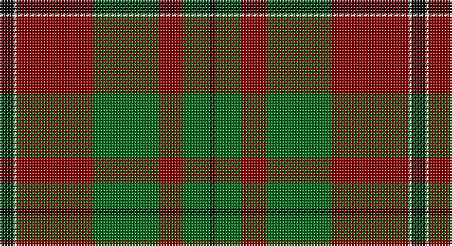

This page is one **sett** — a single exact thread-count. It belongs to the [tartan](/setts/k9w2r50g42r16g17k4/)
(the same proportion at any scale), whose colour order is pattern [KGRGRWK](/stripes/kgrgrwk/).

Sourced from tartans-authority.  It is a [7 stripe tartan](/stripes/stripes7/).

Original link http://www.tartansauthority.com/tartan-ferret/display/6917/

## Register references

External register numbers recorded for this tartan.

- Scottish Tartans Authority (ITI): 6917

## Thread count
K/9 LN2 DR50 G42 DR16 G17 K/4

One full sett is **267 threads**.

## Palette

Palette: <strong>Tartan Register</strong>
<table><thead><tr><th>Colour</th><th>Threads</th><th>Shade</th><th>Base</th><th>OKLCh</th></tr></thead><tbody><tr><td>K/</td><td style="text-align:right;font-variant-numeric:tabular-nums">9</td><td><code style="background-color:#101010;">#101010</code> <small style="color:#888">#101010</small></td><td>K <code style="background-color:#000000;">#000000</code></td><td><small style="color:#888">oklch(17.3% 0.000 89.9)</small></td></tr><tr><td>LN</td><td style="text-align:right;font-variant-numeric:tabular-nums">2</td><td><code style="background-color:#E0E0E0;">#E0E0E0</code> <small style="color:#888">#E0E0E0</small></td><td>W <code style="background-color:#F7F7F7;">#F7F7F7</code></td><td><small style="color:#888">oklch(90.7% 0.000 89.9)</small></td></tr><tr><td>DR</td><td style="text-align:right;font-variant-numeric:tabular-nums">50</td><td><code style="background-color:#880000;">#880000</code> <small style="color:#888">#880000</small></td><td>R <code style="background-color:#CC0000;">#CC0000</code></td><td><small style="color:#888">oklch(39.4% 0.162 29.2)</small></td></tr><tr><td>G</td><td style="text-align:right;font-variant-numeric:tabular-nums">42</td><td><code style="background-color:#006818;">#006818</code> <small style="color:#888">#006818</small></td><td>G <code style="background-color:#006100;">#006100</code></td><td><small style="color:#888">oklch(45.0% 0.142 145.0)</small></td></tr><tr><td>DR</td><td style="text-align:right;font-variant-numeric:tabular-nums">16</td><td><code style="background-color:#880000;">#880000</code> <small style="color:#888">#880000</small></td><td>R <code style="background-color:#CC0000;">#CC0000</code></td><td><small style="color:#888">oklch(39.4% 0.162 29.2)</small></td></tr><tr><td>G</td><td style="text-align:right;font-variant-numeric:tabular-nums">17</td><td><code style="background-color:#006818;">#006818</code> <small style="color:#888">#006818</small></td><td>G <code style="background-color:#006100;">#006100</code></td><td><small style="color:#888">oklch(45.0% 0.142 145.0)</small></td></tr><tr><td>K/</td><td style="text-align:right;font-variant-numeric:tabular-nums">4</td><td><code style="background-color:#101010;">#101010</code> <small style="color:#888">#101010</small></td><td>K <code style="background-color:#000000;">#000000</code></td><td><small style="color:#888">oklch(17.3% 0.000 89.9)</small></td></tr></tbody></table>

# Sample pattern

## Nearest tartans

The nearest existing variants by ΔTartan distance, with this tartan at the top so the swatches line up against it.

ΔTartan

Tartan

Sett

—

<a href="/ttd/edit/#slug=k9w2r50g42r16g17k4">McNee (Name)</a> <a class="nn-out" href="/variants/s7/k9w2r50g42r16g17k4/" title="open its dictionary page">↗</a>

0.89

<a href="/ttd/edit/#slug=r3dg9lr1dg9r3dg6r18k2~x2&amp;base=k9w2r50g42r16g17k4">Cumming SM</a> <a class="nn-out" href="/variants/s8/r3dg9lr1dg9r3dg6r18k2~x2/" title="open its dictionary page">↗</a>

1.19

<a href="/ttd/edit/#slug=r12db2r3g20k4g20r30k2r1~x2&amp;base=k9w2r50g42r16g17k4">Oriel #1 (District)</a> <a class="nn-out" href="/variants/s9/r12db2r3g20k4g20r30k2r1~x2/" title="open its dictionary page">↗</a>

1.20

<a href="/ttd/edit/#slug=ly2dg17g4r15dg1~x2&amp;base=k9w2r50g42r16g17k4">Christmas</a> <a class="nn-out" href="/variants/s5/ly2dg17g4r15dg1~x2/" title="open its dictionary page">↗</a>

1.23

<a href="/ttd/edit/#slug=r5k2dg1k2r5k2dg18lo3~x2&amp;base=k9w2r50g42r16g17k4">Midpac Tissue (non woven)</a> <a class="nn-out" href="/variants/s8/r5k2dg1k2r5k2dg18lo3~x2/" title="open its dictionary page">↗</a>

1.30

<a href="/ttd/edit/#slug=r3g9w1g9r3g6r18k2~x2&amp;base=k9w2r50g42r16g17k4">Cumming #2</a> <a class="nn-out" href="/variants/s8/r3g9w1g9r3g6r18k2~x2/" title="open its dictionary page">↗</a>

1.31

<a href="/ttd/edit/#slug=lo1db14r28g14r1g14lo1~x2&amp;base=k9w2r50g42r16g17k4">Abernethy (Colerain USA) (Personal)</a> <a class="nn-out" href="/variants/s7/lo1db14r28g14r1g14lo1~x2/" title="open its dictionary page">↗</a>

1.33

<a href="/ttd/edit/#slug=k2r16dg6r3dg8lr1~x2&amp;base=k9w2r50g42r16g17k4">MacAulay</a> <a class="nn-out" href="/variants/s6/k2r16dg6r3dg8lr1~x2/" title="open its dictionary page">↗</a>

1.33

<a href="/ttd/edit/#slug=k2r16dg6r3dg8lr1&amp;base=k9w2r50g42r16g17k4">MacAulay</a> <a class="nn-out" href="/variants/s6/k2r16dg6r3dg8lr1/" title="open its dictionary page">↗</a>

1.34

<a href="/ttd/edit/#slug=dg12b6dg6r15k1r1k2~x2&amp;base=k9w2r50g42r16g17k4">(2) Cook</a> <a class="nn-out" href="/variants/s7/dg12b6dg6r15k1r1k2~x2/" title="open its dictionary page">↗</a>

1.34

<a href="/ttd/edit/#slug=y36k2y2k2y3k12t10r20~x2&amp;base=k9w2r50g42r16g17k4">Georgia, State of (District)</a> <a class="nn-out" href="/variants/s8/y36k2y2k2y3k12t10r20~x2/" title="open its dictionary page">↗</a>

## Neighbour map

Every grey dot is one of 14360 variants placed by the first two principal components of the ΔTartan feature space (44% of its variance). Red is this tartan; blue dots are its nearest — click one to open its page.

<svg viewBox="0 0 640 380" role="img" style="max-width:100%;height:auto;border:1px solid #e0e0e0;border-radius:4px;display:block" xmlns="http://www.w3.org/2000/svg"><image href="/nn/cloud.v1.png" width="640" height="380"/><a href="/variants/s8/r3dg9lr1dg9r3dg6r18k2~x2/"><circle cx="330.6" cy="190.5" r="4" fill="#3465a4"><title>Cumming SM</title></circle></a><a href="/variants/s9/r12db2r3g20k4g20r30k2r1~x2/"><circle cx="344.2" cy="146.3" r="4" fill="#3465a4"><title>Oriel #1 (District)</title></circle></a><a href="/variants/s5/ly2dg17g4r15dg1~x2/"><circle cx="301.4" cy="200.9" r="4" fill="#3465a4"><title>Christmas</title></circle></a><a href="/variants/s8/r5k2dg1k2r5k2dg18lo3~x2/"><circle cx="308.5" cy="164.4" r="4" fill="#3465a4"><title>Midpac Tissue (non woven)</title></circle></a><a href="/variants/s8/r3g9w1g9r3g6r18k2~x2/"><circle cx="312.5" cy="177.9" r="4" fill="#3465a4"><title>Cumming #2</title></circle></a><a href="/variants/s7/lo1db14r28g14r1g14lo1~x2/"><circle cx="278.2" cy="162.4" r="4" fill="#3465a4"><title>Abernethy (Colerain USA) (Personal)</title></circle></a><a href="/variants/s6/k2r16dg6r3dg8lr1~x2/"><circle cx="342.2" cy="198.2" r="4" fill="#3465a4"><title>MacAulay</title></circle></a><a href="/variants/s6/k2r16dg6r3dg8lr1/"><circle cx="342.2" cy="198.2" r="4" fill="#3465a4"><title>MacAulay</title></circle></a><a href="/variants/s7/dg12b6dg6r15k1r1k2~x2/"><circle cx="274.9" cy="211.3" r="4" fill="#3465a4"><title>(2) Cook</title></circle></a><a href="/variants/s8/y36k2y2k2y3k12t10r20~x2/"><circle cx="289.7" cy="167.3" r="4" fill="#3465a4"><title>Georgia, State of (District)</title></circle></a><circle cx="339.0" cy="185.4" r="5" fill="#c00000"/></svg>

ID: /variants/s7/k9w2r50g42r16g17k4/
