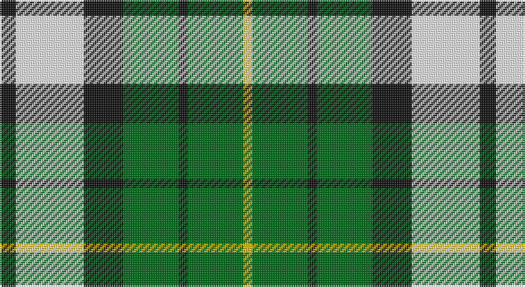

This page is one **sett** — a single exact thread-count. It belongs to the [tartan](/setts/k9w38k22g31k5g31ly5/)
(the same proportion at any scale), whose colour order is pattern [KWKGKGY](/stripes/kwkgkgy/).

Sourced from register-of-tartans.  It is a [7 stripe tartan](/stripes/stripes7/).

Original link https://www.tartanregister.gov.uk/tartanDetails.aspx?ref=2071

2 attestations — the source records this cloth was collapsed from (oldest owns this page)

<ul>
<li>01/01/2003 — Lawsons' Whisky (register-of-tartans, <a href="https://www.tartanregister.gov.uk/tartanDetails.aspx?ref=2071">record</a>)</li>
<li>pre 2003 — Lawsons' Whisky (Corporate) (tartans-authority, <a href="http://www.tartansauthority.com/tartan-ferret/display/5957/">record</a>)</li>
</ul>

## Register references

External register numbers recorded for this tartan.

- Scottish Register of Tartans: [2071](https://www.tartanregister.gov.uk/tartanDetails.aspx?ref=2071)
- Scottish Tartans Authority (ITI): 5957

## Thread count
K/9 W38 K22 G31 K5 G31 Y/5

One full sett is **268 threads**.

## Palette

Palette: <strong>Tartan Register</strong>
<table><thead><tr><th>Colour</th><th>Threads</th><th>Shade</th><th>Base</th><th>OKLCh</th></tr></thead><tbody><tr><td>K/</td><td style="text-align:right;font-variant-numeric:tabular-nums">9</td><td><code style="background-color:#101010;">#101010</code> <small style="color:#888">#101010</small></td><td>K <code style="background-color:#000000;">#000000</code></td><td><small style="color:#888">oklch(17.3% 0.000 89.9)</small></td></tr><tr><td>W</td><td style="text-align:right;font-variant-numeric:tabular-nums">38</td><td><code style="background-color:#F8F8F8;">#F8F8F8</code> <small style="color:#888">#F8F8F8</small></td><td>W <code style="background-color:#F7F7F7;">#F7F7F7</code></td><td><small style="color:#888">oklch(97.9% 0.000 89.9)</small></td></tr><tr><td>K</td><td style="text-align:right;font-variant-numeric:tabular-nums">22</td><td><code style="background-color:#101010;">#101010</code> <small style="color:#888">#101010</small></td><td>K <code style="background-color:#000000;">#000000</code></td><td><small style="color:#888">oklch(17.3% 0.000 89.9)</small></td></tr><tr><td>G</td><td style="text-align:right;font-variant-numeric:tabular-nums">31</td><td><code style="background-color:#006818;">#006818</code> <small style="color:#888">#006818</small></td><td>G <code style="background-color:#006100;">#006100</code></td><td><small style="color:#888">oklch(45.0% 0.142 145.0)</small></td></tr><tr><td>K</td><td style="text-align:right;font-variant-numeric:tabular-nums">5</td><td><code style="background-color:#101010;">#101010</code> <small style="color:#888">#101010</small></td><td>K <code style="background-color:#000000;">#000000</code></td><td><small style="color:#888">oklch(17.3% 0.000 89.9)</small></td></tr><tr><td>G</td><td style="text-align:right;font-variant-numeric:tabular-nums">31</td><td><code style="background-color:#006818;">#006818</code> <small style="color:#888">#006818</small></td><td>G <code style="background-color:#006100;">#006100</code></td><td><small style="color:#888">oklch(45.0% 0.142 145.0)</small></td></tr><tr><td>Y/</td><td style="text-align:right;font-variant-numeric:tabular-nums">5</td><td><code style="background-color:#E8C000;">#E8C000</code> <small style="color:#888">#E8C000</small></td><td>Y <code style="background-color:#F2BF00;">#F2BF00</code></td><td><small style="color:#888">oklch(81.9% 0.168 93.7)</small></td></tr></tbody></table>

# Sample pattern

## Nearest tartans

The nearest existing variants by ΔTartan distance, with this tartan at the top so the swatches line up against it.

ΔTartan

Tartan

Sett

—

<a href="/ttd/edit/#slug=k9w38k22g31k5g31ly5">Lawsons' Whisky</a> <a class="nn-out" href="/variants/s7/k9w38k22g31k5g31ly5/" title="open its dictionary page">↗</a>

0.87

<a href="/ttd/edit/#slug=k4w19k11dg15k3dg16ly3~x2&amp;base=k9w38k22g31k5g31ly5">Lawson, William 2002</a> <a class="nn-out" href="/variants/s7/k4w19k11dg15k3dg16ly3~x2/" title="open its dictionary page">↗</a>

1.07

<a href="/ttd/edit/#slug=k4g14k14g2w14b3~x2&amp;base=k9w38k22g31k5g31ly5">MacKay, Dress (Corporate)</a> <a class="nn-out" href="/variants/s6/k4g14k14g2w14b3~x2/" title="open its dictionary page">↗</a>

1.14

<a href="/ttd/edit/#slug=dg14o5dg14w5k2o5k2w9~x4&amp;base=k9w38k22g31k5g31ly5">Unnamed (Hip Flask)</a> <a class="nn-out" href="/variants/s8/dg14o5dg14w5k2o5k2w9~x4/" title="open its dictionary page">↗</a>

1.24

<a href="/ttd/edit/#slug=db8ly1dg5ly12r1dg2~x6&amp;base=k9w38k22g31k5g31ly5">McCabe (2016)</a> <a class="nn-out" href="/variants/s6/db8ly1dg5ly12r1dg2~x6/" title="open its dictionary page">↗</a>

1.24

<a href="/ttd/edit/#slug=ly5k5g17k6y24k6ly3~x2&amp;base=k9w38k22g31k5g31ly5">Cape Breton</a> <a class="nn-out" href="/variants/s7/ly5k5g17k6y24k6ly3~x2/" title="open its dictionary page">↗</a>

1.27

<a href="/ttd/edit/#slug=w16g2k5r2k10g11ly2g11k2~x2&amp;base=k9w38k22g31k5g31ly5">Unnamed 9</a> <a class="nn-out" href="/variants/s9/w16g2k5r2k10g11ly2g11k2~x2/" title="open its dictionary page">↗</a>

1.30

<a href="/ttd/edit/#slug=ly6k6y30k8lb18k6ly3~x2&amp;base=k9w38k22g31k5g31ly5">Cape Breton (yellow stripes)</a> <a class="nn-out" href="/variants/s7/ly6k6y30k8lb18k6ly3~x2/" title="open its dictionary page">↗</a>

1.32

<a href="/ttd/edit/#slug=k4g23k23g2w23b4~x2&amp;base=k9w38k22g31k5g31ly5">MacKay Dress</a> <a class="nn-out" href="/variants/s6/k4g23k23g2w23b4~x2/" title="open its dictionary page">↗</a>

1.32

<a href="/ttd/edit/#slug=r3w8db4g14r4db2~x2&amp;base=k9w38k22g31k5g31ly5">MacIntosh, dress</a> <a class="nn-out" href="/variants/s6/r3w8db4g14r4db2~x2/" title="open its dictionary page">↗</a>

1.35

<a href="/ttd/edit/#slug=p6lg15g15k2~x2&amp;base=k9w38k22g31k5g31ly5">Thistle and Kudzu Scottish Socie Corporate Tartan</a> <a class="nn-out" href="/variants/s4/p6lg15g15k2~x2/" title="open its dictionary page">↗</a>

## Neighbour map

Every grey dot is one of 14360 variants placed by the first two principal components of the ΔTartan feature space (44% of its variance). Red is this tartan; blue dots are its nearest — click one to open its page.

<svg viewBox="0 0 640 380" role="img" style="max-width:100%;height:auto;border:1px solid #e0e0e0;border-radius:4px;display:block" xmlns="http://www.w3.org/2000/svg"><image href="/nn/cloud.v1.png" width="640" height="380"/><a href="/variants/s7/k4w19k11dg15k3dg16ly3~x2/"><circle cx="148.1" cy="225.5" r="4" fill="#3465a4"><title>Lawson, William 2002</title></circle></a><a href="/variants/s6/k4g14k14g2w14b3~x2/"><circle cx="120.0" cy="223.8" r="4" fill="#3465a4"><title>MacKay, Dress (Corporate)</title></circle></a><a href="/variants/s8/dg14o5dg14w5k2o5k2w9~x4/"><circle cx="188.6" cy="213.0" r="4" fill="#3465a4"><title>Unnamed (Hip Flask)</title></circle></a><a href="/variants/s6/db8ly1dg5ly12r1dg2~x6/"><circle cx="187.4" cy="175.9" r="4" fill="#3465a4"><title>McCabe (2016)</title></circle></a><a href="/variants/s7/ly5k5g17k6y24k6ly3~x2/"><circle cx="132.4" cy="201.1" r="4" fill="#3465a4"><title>Cape Breton</title></circle></a><a href="/variants/s9/w16g2k5r2k10g11ly2g11k2~x2/"><circle cx="112.4" cy="173.9" r="4" fill="#3465a4"><title>Unnamed 9</title></circle></a><a href="/variants/s7/ly6k6y30k8lb18k6ly3~x2/"><circle cx="147.5" cy="180.5" r="4" fill="#3465a4"><title>Cape Breton (yellow stripes)</title></circle></a><a href="/variants/s6/k4g23k23g2w23b4~x2/"><circle cx="144.1" cy="195.9" r="4" fill="#3465a4"><title>MacKay Dress</title></circle></a><a href="/variants/s6/r3w8db4g14r4db2~x2/"><circle cx="150.5" cy="217.2" r="4" fill="#3465a4"><title>MacIntosh, dress</title></circle></a><a href="/variants/s4/p6lg15g15k2~x2/"><circle cx="157.5" cy="246.5" r="4" fill="#3465a4"><title>Thistle and Kudzu Scottish Socie Corporate Tartan</title></circle></a><circle cx="151.0" cy="213.0" r="5" fill="#c00000"/></svg>

ID: /variants/s7/k9w38k22g31k5g31ly5/
