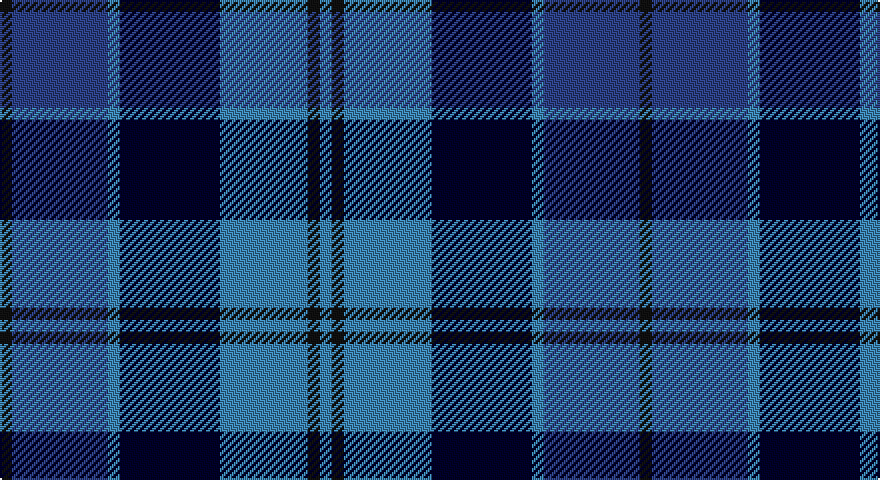

This page is one **sett** — a single exact thread-count. It belongs to the [tartan](/setts/ki3db24t3k25t22ki3t3/)
(the same proportion at any scale), whose colour order is pattern [BKBKBBK](/stripes/bkbkbbk/).

Part of the [Strathclyde](/tartans/strathclyde/) tartan — the named design grouping this sett with its other cloths.

Sourced from register-of-tartans.  It is a [7 stripe tartan](/stripes/stripes7/).

Original link https://www.tartanregister.gov.uk/tartanDetails.aspx?ref=3981

## Also known as

This cloth is also recorded under:

- Strathclyde blue

## Register references

External register numbers recorded for this tartan.

- Scottish Register of Tartans: [3981](https://www.tartanregister.gov.uk/tartanDetails.aspx?ref=3981)
- Scottish Tartans World Register: 2433

## Thread count
K/6 Ba48 B6 DB50 B44 K6 B/6

One full sett is **320 threads**.

## Palette

Palette: <strong>Tartan Register</strong> <small style="color:#888">(3 of 4 colours)</small>
<table><thead><tr><th>Colour</th><th>Threads</th><th>Shade</th><th>Base</th><th>OKLCh</th></tr></thead><tbody><tr><td>K/</td><td style="text-align:right;font-variant-numeric:tabular-nums">6</td><td><code style="background-color:#101010;">#101010</code> <small style="color:#888">#101010</small></td><td>K <code style="background-color:#000000;">#000000</code></td><td><small style="color:#888">oklch(17.3% 0.000 89.9)</small></td></tr><tr><td>Ba</td><td style="text-align:right;font-variant-numeric:tabular-nums">48</td><td><code style="background-color:#2C4084;">#2C4084</code> <small style="color:#888">#2C4084</small></td><td>B <code style="background-color:#2A418A;">#2A418A</code></td><td><small style="color:#888">oklch(39.4% 0.117 268.3)</small></td></tr><tr><td>B</td><td style="text-align:right;font-variant-numeric:tabular-nums">6</td><td><code style="background-color:#3C82AF;">#3C82AF</code> <small style="color:#888">#3C82AF</small></td><td>B <code style="background-color:#2A418A;">#2A418A</code></td><td><small style="color:#888">oklch(58.1% 0.099 239.8)</small></td></tr><tr><td>DB</td><td style="text-align:right;font-variant-numeric:tabular-nums">50</td><td><code style="background-color:#000028;">#000028</code> <small style="color:#888">#000028</small></td><td>K <code style="background-color:#000000;">#000000</code></td><td><small style="color:#888">oklch(12.5% 0.087 264.1)</small></td></tr><tr><td>B</td><td style="text-align:right;font-variant-numeric:tabular-nums">44</td><td><code style="background-color:#3C82AF;">#3C82AF</code> <small style="color:#888">#3C82AF</small></td><td>B <code style="background-color:#2A418A;">#2A418A</code></td><td><small style="color:#888">oklch(58.1% 0.099 239.8)</small></td></tr><tr><td>K</td><td style="text-align:right;font-variant-numeric:tabular-nums">6</td><td><code style="background-color:#101010;">#101010</code> <small style="color:#888">#101010</small></td><td>K <code style="background-color:#000000;">#000000</code></td><td><small style="color:#888">oklch(17.3% 0.000 89.9)</small></td></tr><tr><td>B/</td><td style="text-align:right;font-variant-numeric:tabular-nums">6</td><td><code style="background-color:#3C82AF;">#3C82AF</code> <small style="color:#888">#3C82AF</small></td><td>B <code style="background-color:#2A418A;">#2A418A</code></td><td><small style="color:#888">oklch(58.1% 0.099 239.8)</small></td></tr></tbody></table>

# Sample pattern

## Compared to the master

This cloth is one sett of its design; the master sett (the exemplar the design is anchored on) is below for comparison.

<figure style="margin:0"><figcaption style="color:#888;font-size:smaller">this sett</figcaption></figure>
<figure style="margin:0"><figcaption style="color:#888;font-size:smaller"><a href="/setts/k4db2k15w10b15db2b4/">master sett →</a></figcaption></figure>

## Nearest tartans

The nearest existing variants by ΔTartan distance, with this tartan at the top so the swatches line up against it.

ΔTartan

Tartan

Sett

—

<a href="/ttd/edit/#slug=ki3db24t3k25t22ki3t3~x2">Strathclyde blue</a> <a class="nn-out" href="/variants/s7/ki3db24t3k25t22ki3t3~x2/" title="open its dictionary page">↗</a>

0.35

<a href="/variants/s7/k3db24t3ki25t22k3t3~x2/">Strathclyde blue</a>

0.90

<a href="/ttd/edit/#slug=db25k3db7k15b25k2b2w4~x2&amp;base=ki3db24t3k25t22ki3t3~x2">Sabema</a> <a class="nn-out" href="/variants/s8/db25k3db7k15b25k2b2w4~x2/" title="open its dictionary page">↗</a>

0.98

<a href="/ttd/edit/#slug=r8b32k24db24k3b3~x2&amp;base=ki3db24t3k25t22ki3t3~x2">MacCorquodale #2</a> <a class="nn-out" href="/variants/s6/r8b32k24db24k3b3~x2/" title="open its dictionary page">↗</a>

1.19

<a href="/ttd/edit/#slug=k16db8k6db8k6db20k6db6k14b41r4&amp;base=ki3db24t3k25t22ki3t3~x2">Merchiston Castle School</a> <a class="nn-out" href="/variants/s11/k16db8k6db8k6db20k6db6k14b41r4/" title="open its dictionary page">↗</a>

1.22

<a href="/ttd/edit/#slug=n12k2n2k2n2k12db12b3w1~x2&amp;base=ki3db24t3k25t22ki3t3~x2">de Franck, Matt (Personal)</a> <a class="nn-out" href="/variants/s9/n12k2n2k2n2k12db12b3w1~x2/" title="open its dictionary page">↗</a>

1.30

<a href="/ttd/edit/#slug=lo1b12k6db1k1db1k1db6lo1~x4&amp;base=ki3db24t3k25t22ki3t3~x2">Elgin City Band</a> <a class="nn-out" href="/variants/s9/lo1b12k6db1k1db1k1db6lo1~x4/" title="open its dictionary page">↗</a>

1.40

<a href="/ttd/edit/#slug=dbi26w2dbi3db15t26db2t3ly4~x2&amp;base=ki3db24t3k25t22ki3t3~x2">Banff, and Buchan</a> <a class="nn-out" href="/variants/s8/dbi26w2dbi3db15t26db2t3ly4~x2/" title="open its dictionary page">↗</a>

1.41

<a href="/ttd/edit/#slug=dt9w2dt24k8w5k8db15k3db15k2~x2&amp;base=ki3db24t3k25t22ki3t3~x2">Scottish Claymores</a> <a class="nn-out" href="/variants/s10/dt9w2dt24k8w5k8db15k3db15k2~x2/" title="open its dictionary page">↗</a>

1.41

<a href="/ttd/edit/#slug=r7k4t28k24ti24k4t4~x2&amp;base=ki3db24t3k25t22ki3t3~x2">MacCorquodale</a> <a class="nn-out" href="/variants/s7/r7k4t28k24ti24k4t4~x2/" title="open its dictionary page">↗</a>

1.42

<a href="/ttd/edit/#slug=k1db6t1dt6t6k1w1~x6&amp;base=ki3db24t3k25t22ki3t3~x2">Mary Washington</a> <a class="nn-out" href="/variants/s7/k1db6t1dt6t6k1w1~x6/" title="open its dictionary page">↗</a>

## Neighbour map

Every grey dot is one of 14360 variants placed by the first two principal components of the ΔTartan feature space (44% of its variance). Red is this tartan; blue dots are its nearest — click one to open its page.

<svg viewBox="0 0 640 380" role="img" style="max-width:100%;height:auto;border:1px solid #e0e0e0;border-radius:4px;display:block" xmlns="http://www.w3.org/2000/svg"><image href="/nn/cloud.v1.png" width="640" height="380"/><a href="/variants/s7/k3db24t3ki25t22k3t3~x2/"><circle cx="174.8" cy="217.7" r="4" fill="#3465a4"><title>Strathclyde blue</title></circle></a><a href="/variants/s8/db25k3db7k15b25k2b2w4~x2/"><circle cx="215.5" cy="195.5" r="4" fill="#3465a4"><title>Sabema</title></circle></a><a href="/variants/s6/r8b32k24db24k3b3~x2/"><circle cx="200.8" cy="229.8" r="4" fill="#3465a4"><title>MacCorquodale #2</title></circle></a><a href="/variants/s11/k16db8k6db8k6db20k6db6k14b41r4/"><circle cx="209.6" cy="205.2" r="4" fill="#3465a4"><title>Merchiston Castle School</title></circle></a><a href="/variants/s9/n12k2n2k2n2k12db12b3w1~x2/"><circle cx="179.5" cy="184.1" r="4" fill="#3465a4"><title>de Franck, Matt (Personal)</title></circle></a><a href="/variants/s9/lo1b12k6db1k1db1k1db6lo1~x4/"><circle cx="241.5" cy="184.2" r="4" fill="#3465a4"><title>Elgin City Band</title></circle></a><a href="/variants/s8/dbi26w2dbi3db15t26db2t3ly4~x2/"><circle cx="182.0" cy="165.4" r="4" fill="#3465a4"><title>Banff, and Buchan</title></circle></a><a href="/variants/s10/dt9w2dt24k8w5k8db15k3db15k2~x2/"><circle cx="204.8" cy="215.2" r="4" fill="#3465a4"><title>Scottish Claymores</title></circle></a><a href="/variants/s7/r7k4t28k24ti24k4t4~x2/"><circle cx="149.9" cy="221.9" r="4" fill="#3465a4"><title>MacCorquodale</title></circle></a><a href="/variants/s7/k1db6t1dt6t6k1w1~x6/"><circle cx="138.6" cy="228.9" r="4" fill="#3465a4"><title>Mary Washington</title></circle></a><circle cx="182.1" cy="222.7" r="5" fill="#c00000"/></svg>

ID: /variants/s7/ki3db24t3k25t22ki3t3~x2/
