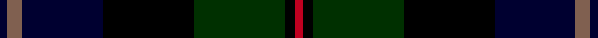
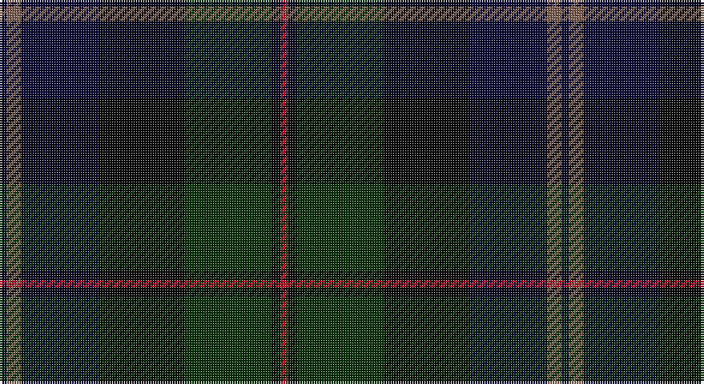

This page is one **sett** — a single exact thread-count. It belongs to the [tartan](/setts/ki3o6ki32k36dg36k4r3/)
(the same proportion at any scale), whose colour order is pattern [KRKKGKR](/stripes/krkkgkr/).

Part of the [McEwan '1856', The](/tartans/mcewan-1856-the/) tartan — the named design grouping this sett with its other cloths.

Sourced from weddslist.  It is a [7 stripe tartan](/stripes/stripes7/).

Original link http://www.weddslist.com/cgi-bin/tartans/pg.pl?source=sts

## Also known as

This cloth is also recorded under:

- McEwan "1856", The

## Thread count
DB/3 LT6 DB32 K36 DG36 K4 R/3

One full sett is **234 threads**.

## Palette

Palette: <strong>Ingles Buchan</strong> <small style="color:#888">(1 of 5 colours)</small>
<table><thead><tr><th>Colour</th><th>Threads</th><th>Shade</th><th>Base</th><th>OKLCh</th></tr></thead><tbody><tr><td>DB/</td><td style="text-align:right;font-variant-numeric:tabular-nums">3</td><td><code style="background-color:#000030;">#000030</code> <small style="color:#888">#000030</small></td><td>K <code style="background-color:#000000;">#000000</code></td><td><small style="color:#888">oklch(14.0% 0.097 264.1)</small></td></tr><tr><td>LT</td><td style="text-align:right;font-variant-numeric:tabular-nums">6</td><td><code style="background-color:#806050;">#806050</code> <small style="color:#888">#806050</small></td><td>R <code style="background-color:#CC0000;">#CC0000</code></td><td><small style="color:#888">oklch(51.7% 0.049 47.8)</small></td></tr><tr><td>DB</td><td style="text-align:right;font-variant-numeric:tabular-nums">32</td><td><code style="background-color:#000030;">#000030</code> <small style="color:#888">#000030</small></td><td>K <code style="background-color:#000000;">#000000</code></td><td><small style="color:#888">oklch(14.0% 0.097 264.1)</small></td></tr><tr><td>K</td><td style="text-align:right;font-variant-numeric:tabular-nums">36</td><td><code style="background-color:#000000;">#000000</code> <small style="color:#888">#000000</small></td><td>K <code style="background-color:#000000;">#000000</code></td><td><small style="color:#888">oklch(0.0% 0.000 0.0)</small></td></tr><tr><td>DG</td><td style="text-align:right;font-variant-numeric:tabular-nums">36</td><td><code style="background-color:#003000;">#003000</code> <small style="color:#888">#003000</small></td><td>G <code style="background-color:#006100;">#006100</code></td><td><small style="color:#888">oklch(26.8% 0.091 142.5)</small></td></tr><tr><td>K</td><td style="text-align:right;font-variant-numeric:tabular-nums">4</td><td><code style="background-color:#000000;">#000000</code> <small style="color:#888">#000000</small></td><td>K <code style="background-color:#000000;">#000000</code></td><td><small style="color:#888">oklch(0.0% 0.000 0.0)</small></td></tr><tr><td>R/</td><td style="text-align:right;font-variant-numeric:tabular-nums">3</td><td><code style="background-color:#C00020;">#C00020</code> <small style="color:#888">#C00020</small></td><td>R <code style="background-color:#CC0000;">#CC0000</code></td><td><small style="color:#888">oklch(50.9% 0.206 24.5)</small></td></tr></tbody></table>

# Sample pattern

## Compared to the master

This cloth is one sett of its design; the master sett (the exemplar the design is anchored on) is below for comparison.

<figure style="margin:0"><figcaption style="color:#888;font-size:smaller">this sett</figcaption></figure>
<figure style="margin:0"><figcaption style="color:#888;font-size:smaller"><a href="/setts/db2dy3db16k18g18k2r2/">master sett →</a></figcaption></figure>

## Nearest tartans

The nearest existing variants by ΔTartan distance, with this tartan at the top so the swatches line up against it.

ΔTartan

Tartan

Sett

—

<a href="/ttd/edit/#slug=ki3o6ki32k36dg36k4r3">McEwan &quot;1856&quot;, The</a> <a class="nn-out" href="/variants/s7/ki3o6ki32k36dg36k4r3/" title="open its dictionary page">↗</a>

1.04

<a href="/ttd/edit/#slug=dg5n3dg32k16db32dp3db5~x2&amp;base=ki3o6ki32k36dg36k4r3">MacThomas LC</a> <a class="nn-out" href="/variants/s7/dg5n3dg32k16db32dp3db5~x2/" title="open its dictionary page">↗</a>

1.04

<a href="/ttd/edit/#slug=dg5n3dg32k16db32dp3db5&amp;base=ki3o6ki32k36dg36k4r3">MacThomas LC</a> <a class="nn-out" href="/variants/s7/dg5n3dg32k16db32dp3db5/" title="open its dictionary page">↗</a>

1.20

<a href="/ttd/edit/#slug=r3k2dg25k28db25k2r3~x2&amp;base=ki3o6ki32k36dg36k4r3">Coarse Kilt</a> <a class="nn-out" href="/variants/s7/r3k2dg25k28db25k2r3~x2/" title="open its dictionary page">↗</a>

1.24

<a href="/ttd/edit/#slug=db22r3db2r3db2k17dg18o4~x2&amp;base=ki3o6ki32k36dg36k4r3">Scotch House 2000, original</a> <a class="nn-out" href="/variants/s8/db22r3db2r3db2k17dg18o4~x2/" title="open its dictionary page">↗</a>

1.25

<a href="/ttd/edit/#slug=dg3dr2dg21k11db21dr2db3~x2&amp;base=ki3o6ki32k36dg36k4r3">MacThomas</a> <a class="nn-out" href="/variants/s7/dg3dr2dg21k11db21dr2db3~x2/" title="open its dictionary page">↗</a>

1.25

<a href="/ttd/edit/#slug=dg3dr2dg21k11db21dr2db3&amp;base=ki3o6ki32k36dg36k4r3">MacThomas</a> <a class="nn-out" href="/variants/s7/dg3dr2dg21k11db21dr2db3/" title="open its dictionary page">↗</a>

1.27

<a href="/ttd/edit/#slug=r3k2dg15k10db20k2ly2~x2&amp;base=ki3o6ki32k36dg36k4r3">MacLeod</a> <a class="nn-out" href="/variants/s7/r3k2dg15k10db20k2ly2~x2/" title="open its dictionary page">↗</a>

1.27

<a href="/ttd/edit/#slug=r3k2dg15k10db20k2ly2&amp;base=ki3o6ki32k36dg36k4r3">MacLeod</a> <a class="nn-out" href="/variants/s7/r3k2dg15k10db20k2ly2/" title="open its dictionary page">↗</a>

1.31

<a href="/ttd/edit/#slug=dg2db12dg1k12dg12r2~x2&amp;base=ki3o6ki32k36dg36k4r3">Gunn</a> <a class="nn-out" href="/variants/s6/dg2db12dg1k12dg12r2~x2/" title="open its dictionary page">↗</a>

1.39

<a href="/ttd/edit/#slug=k2dg12k12r1db12lr2~x2&amp;base=ki3o6ki32k36dg36k4r3">Mitchell</a> <a class="nn-out" href="/variants/s6/k2dg12k12r1db12lr2~x2/" title="open its dictionary page">↗</a>

## Neighbour map

Every grey dot is one of 14360 variants placed by the first two principal components of the ΔTartan feature space (44% of its variance). Red is this tartan; blue dots are its nearest — click one to open its page.

<svg viewBox="0 0 640 380" role="img" style="max-width:100%;height:auto;border:1px solid #e0e0e0;border-radius:4px;display:block" xmlns="http://www.w3.org/2000/svg"><image href="/nn/cloud.v1.png" width="640" height="380"/><a href="/variants/s7/dg5n3dg32k16db32dp3db5~x2/"><circle cx="230.6" cy="214.6" r="4" fill="#3465a4"><title>MacThomas LC</title></circle></a><a href="/variants/s7/dg5n3dg32k16db32dp3db5/"><circle cx="230.6" cy="214.6" r="4" fill="#3465a4"><title>MacThomas LC</title></circle></a><a href="/variants/s7/r3k2dg25k28db25k2r3~x2/"><circle cx="231.2" cy="209.6" r="4" fill="#3465a4"><title>Coarse Kilt</title></circle></a><a href="/variants/s8/db22r3db2r3db2k17dg18o4~x2/"><circle cx="179.0" cy="190.9" r="4" fill="#3465a4"><title>Scotch House 2000, original</title></circle></a><a href="/variants/s7/dg3dr2dg21k11db21dr2db3~x2/"><circle cx="250.7" cy="233.0" r="4" fill="#3465a4"><title>MacThomas</title></circle></a><a href="/variants/s7/dg3dr2dg21k11db21dr2db3/"><circle cx="250.7" cy="233.0" r="4" fill="#3465a4"><title>MacThomas</title></circle></a><a href="/variants/s7/r3k2dg15k10db20k2ly2~x2/"><circle cx="182.4" cy="201.7" r="4" fill="#3465a4"><title>MacLeod</title></circle></a><a href="/variants/s7/r3k2dg15k10db20k2ly2/"><circle cx="182.4" cy="201.7" r="4" fill="#3465a4"><title>MacLeod</title></circle></a><a href="/variants/s6/dg2db12dg1k12dg12r2~x2/"><circle cx="218.2" cy="236.7" r="4" fill="#3465a4"><title>Gunn</title></circle></a><a href="/variants/s6/k2dg12k12r1db12lr2~x2/"><circle cx="170.5" cy="212.5" r="4" fill="#3465a4"><title>Mitchell</title></circle></a><circle cx="211.0" cy="214.2" r="5" fill="#c00000"/></svg>

ID: /variants/s7/ki3o6ki32k36dg36k4r3/
