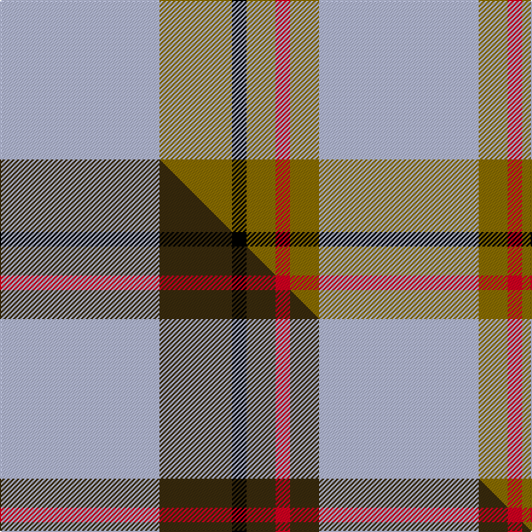

This is one **variant** — a specific cloth: this exact thread count and colourway, with its own
provenance below. It is one weaving of the [sett](/setts/lb11y5k1y2r1y2lb11/) (the scale-free proportion — the
same cloth at any scale or shade), whose colour order is pattern [WGKGRGW](/stripes/wgkgrgw/).

Part of the [Carlisle](/tartans/c/ca/carlisle-2/) tartan — the named design grouping this sett with its other cloths.

Sourced from weddslist.  It is a [7 stripe tartan](/stripes/stripes7/).

Original link [http://www.weddslist.com/cgi-bin/tartans/pg.pl?source=sts](http://www.weddslist.com/cgi-bin/tartans/pg.pl?source=sts)

Dataset <small>— provenance for this record, inherited from the source manifest</small>

<dl class="dataset-prov">
<dt>source</dt><dd><a href="/sources/weddslist/">Weddslist</a></dd>
<dt>data captured from</dt><dd><a href="https://github.com/thetartan/tartan-database/blob/master/data/weddslist/data.csv">https://github.com/thetartan/tartan-database/blob/master/data/weddslist/data.csv</a></dd>
<dt>data date</dt><dd>2016-11-17 <small>(dataset default)</small></dd>
<dt>licence</dt><dd><a href="https://creativecommons.org/licenses/by-nc-nd/4.0/">CC BY-NC-ND 4.0</a></dd>
</dl>

Capture chain <small>— the hands this data passed through, oldest first; each capture carries its own licence</small>

<ol class="capture-chain">
<li><a href="https://www.weddslist.com/tartans/">Weddslist</a> <small>the living privately compiled reference</small></li>
<li><a href="https://github.com/thetartan/tartan-database">thetartan/tartan-database</a> <small>2016-2017</small> · <a href="https://creativecommons.org/licenses/by-nc-nd/4.0/">CC BY-NC-ND 4.0</a> <small>Levko Kravets's frozen compilation — the capture we vendored, and where its CC licence text came from</small></li>
<li>this dictionary <small>captured 2026-06-10 · commit 5bf86c7566</small> <small>each re-capture is a git commit to data/sources</small></li>
</ol>

## Thread count
LB/132 Y60 K12 Y24 R12 Y24 LB/132

One full sett is **528 threads**.

## Palette
<table><thead><tr><th>Colour</th><th>Shade</th><th>OKLCh</th></tr></thead><tbody><tr><td>LB</td><td><code style="background-color:#B5BBDE;">#B5BBDE</code> <small style="color:#888">#B5BBDE</small></td><td><small style="color:#888">oklch(79.9% 0.050 277.6)</small></td></tr><tr><td>K</td><td><code style="background-color:#000000;">#000000</code> <small style="color:#888">#000000</small></td><td><small style="color:#888">oklch(0.0% 0.000 0.0)</small></td></tr><tr><td>R</td><td><code style="background-color:#D60020;">#D60020</code> <small style="color:#888">#D60020</small></td><td><small style="color:#888">oklch(55.2% 0.224 25.5)</small></td></tr><tr><td>Y</td><td><code style="background-color:#8B6E00;">#8B6E00</code> <small style="color:#888">#8B6E00</small></td><td><small style="color:#888">oklch(55.1% 0.113 90.4)</small></td></tr></tbody></table>

# Sample pattern

## Compared to the master

This cloth is one sett of its design; the master sett (the exemplar the design is anchored on) is below for comparison.

Its **ΔTartan distance** from the master is **0.13** — the same measure the nearest-tartans table ranks by (0 is identical; a re-scale of the same cloth is near 0, a recolour or a different proportion further).

<figure class="master-compare" style="margin:0">

this sett
master sett ★

<figcaption style="color:#888;font-size:smaller">One weave of this sett against the <a href="/setts/lb11dy5k1dy2r1dy2lb11/">master sett ★</a>, split on the diagonal: a shared proportion runs seamlessly across it with only the shades shifting; a different proportion breaks on it.</figcaption>
</figure>

## Nearest tartan variants

The nearest existing variants by ΔTartan distance, with this cloth at the top so the swatches line up against it.

ΔTartan

Threads

Variant

Sett

—

528

<a href="/variants/s7/lb11y5k1y2r1y2lb11~x12/">Carlisle</a>

<a href="/ttd/edit/#slug=lb11dy5k1dy2r1dy2lb11~x12&amp;base=lb11y5k1y2r1y2lb11~x12" title="compare in the TTD">0.13</a>

528

<a href="/variants/s7/lb11dy5k1dy2r1dy2lb11~x12/">Carlisle Family Tartan</a>

<a href="/ttd/edit/#slug=lb11y2r1y2r1~x4&amp;base=lb11y5k1y2r1y2lb11~x12" title="compare in the TTD">2.53</a>

88

<a href="/variants/s5/lb11y2r1y2r1~x4/">Carlisle, Ancient</a>

<a href="/ttd/edit/#slug=t130k9t21ly8t21w8t35r70&amp;base=lb11y5k1y2r1y2lb11~x12" title="compare in the TTD">3.47</a>

404

<a href="/variants/s8/t130k9t21ly8t21w8t35r70/">Maud, Mary</a>

<a href="/ttd/edit/#slug=k2lb28g7w3r2~x2&amp;base=lb11y5k1y2r1y2lb11~x12" title="compare in the TTD">3.58</a>

160

<a href="/variants/s5/k2lb28g7w3r2~x2/">Cleland Corporate Tartan</a>

<a href="/ttd/edit/#slug=n27lr3n14k3n13k3ly23~x2&amp;base=lb11y5k1y2r1y2lb11~x12" title="compare in the TTD">3.60</a>

244

<a href="/variants/s7/n27lr3n14k3n13k3ly23~x2/">Grange School</a>

<a href="/ttd/edit/#slug=t6k3t37y41w3y6w3~x2&amp;base=lb11y5k1y2r1y2lb11~x12" title="compare in the TTD">3.77</a>

378

<a href="/variants/s7/t6k3t37y41w3y6w3~x2/">Tilburg Hunting (District)</a>

<a href="/ttd/edit/#slug=k2lb36g12w3r2~x2&amp;base=lb11y5k1y2r1y2lb11~x12" title="compare in the TTD">3.79</a>

212

<a href="/variants/s5/k2lb36g12w3r2~x2/">Cleland</a>

<a href="/ttd/edit/#slug=n16w1n1k1n8ly4r2w2r2~x4&amp;base=lb11y5k1y2r1y2lb11~x12" title="compare in the TTD">3.91</a>

224

<a href="/variants/s9/n16w1n1k1n8ly4r2w2r2~x4/">Middleton, City of</a>

<a href="/ttd/edit/#slug=lb18ly9lb18lr2lb2lr2lb18k9lb18lr2&amp;base=lb11y5k1y2r1y2lb11~x12" title="compare in the TTD">3.99</a>

176

<a href="/variants/s10/lb18ly9lb18lr2lb2lr2lb18k9lb18lr2/">London Fog Blue 2 (Fashion)</a>

<a href="/ttd/edit/#slug=t26lp11t3lp4k2~x4&amp;base=lb11y5k1y2r1y2lb11~x12" title="compare in the TTD">4.00</a>

256

<a href="/variants/s5/t26lp11t3lp4k2~x4/">Debbie Munro Memorial (Corporate)</a>

## Neighbour map

Every grey dot is one of 13656 variants placed by the first two principal components of the ΔTartan feature space (42% of its variance). Red is this tartan; blue dots are its nearest — click one to open its page. The map is a flat projection of a many-dimensional space — [how to read it](/posts/neighbourhood-maps/).

<svg viewBox="0 0 640 380" role="img" style="max-width:100%;height:auto;border:1px solid #e0e0e0;border-radius:4px;display:block" xmlns="http://www.w3.org/2000/svg"><image href="/nn/cloud.v1.png" width="640" height="380"/><a href="/variants/s7/lb11dy5k1dy2r1dy2lb11~x12/"><circle cx="333.0" cy="174.7" r="4" fill="#3465a4"><title>Carlisle Family Tartan</title></circle></a><a href="/variants/s5/lb11y2r1y2r1~x4/"><circle cx="452.2" cy="222.0" r="4" fill="#3465a4"><title>Carlisle, Ancient</title></circle></a><a href="/variants/s8/t130k9t21ly8t21w8t35r70/"><circle cx="385.2" cy="145.5" r="4" fill="#3465a4"><title>Maud, Mary</title></circle></a><a href="/variants/s5/k2lb28g7w3r2~x2/"><circle cx="352.5" cy="153.2" r="4" fill="#3465a4"><title>Cleland Corporate Tartan</title></circle></a><a href="/variants/s7/n27lr3n14k3n13k3ly23~x2/"><circle cx="312.2" cy="203.7" r="4" fill="#3465a4"><title>Grange School</title></circle></a><a href="/variants/s7/t6k3t37y41w3y6w3~x2/"><circle cx="331.7" cy="185.8" r="4" fill="#3465a4"><title>Tilburg Hunting (District)</title></circle></a><a href="/variants/s5/k2lb36g12w3r2~x2/"><circle cx="363.3" cy="147.7" r="4" fill="#3465a4"><title>Cleland</title></circle></a><a href="/variants/s9/n16w1n1k1n8ly4r2w2r2~x4/"><circle cx="369.5" cy="132.4" r="4" fill="#3465a4"><title>Middleton, City of</title></circle></a><a href="/variants/s10/lb18ly9lb18lr2lb2lr2lb18k9lb18lr2/"><circle cx="378.8" cy="192.2" r="4" fill="#3465a4"><title>London Fog Blue 2 (Fashion)</title></circle></a><a href="/variants/s5/t26lp11t3lp4k2~x4/"><circle cx="398.0" cy="210.5" r="4" fill="#3465a4"><title>Debbie Munro Memorial (Corporate)</title></circle></a><circle cx="375.8" cy="189.8" r="5" fill="#c00000"/><text x="320" y="376" text-anchor="middle" font-size="11" fill="#999">ground</text><text x="11" y="190" text-anchor="middle" font-size="11" fill="#999" transform="rotate(-90 11 190)">complexity</text></svg>

ID: /variants/s7/lb11y5k1y2r1y2lb11~x12/
