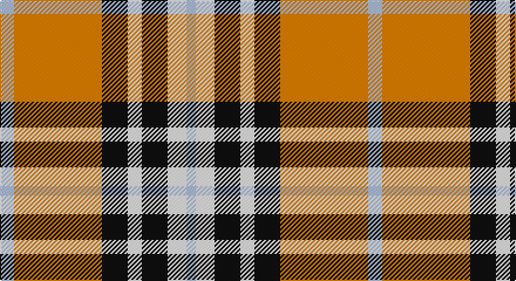

This page is one **sett** — a single exact thread-count. It belongs to the [tartan](/setts/lb12lo75k22w12k22w16lb8/)
(the same proportion at any scale), whose colour order is pattern [WWKWKYW](/stripes/wwkwkyw/).

Sourced from register-of-tartans.  It is a [7 stripe tartan](/stripes/stripes7/).

Original link https://www.tartanregister.gov.uk/tartanDetails.aspx?ref=10105

## Register references

External register numbers recorded for this tartan.

- Scottish Register of Tartans: [10105](https://www.tartanregister.gov.uk/tartanDetails.aspx?ref=10105)

## Thread count
LP/12 O75 K22 W12 K22 W16 LP/8

One full sett is **314 threads**.

## Palette

Palette: <strong>Tartan Register</strong> <small style="color:#888">(2 of 4 colours)</small>
<table><thead><tr><th>Colour</th><th>Threads</th><th>Shade</th><th>Base</th><th>OKLCh</th></tr></thead><tbody><tr><td>LP/</td><td style="text-align:right;font-variant-numeric:tabular-nums">12</td><td><code style="background-color:#ADBEE9;">#ADBEE9</code> <small style="color:#888">#ADBEE9</small></td><td>W <code style="background-color:#F7F7F7;">#F7F7F7</code></td><td><small style="color:#888">oklch(80.3% 0.064 268.1)</small></td></tr><tr><td>O</td><td style="text-align:right;font-variant-numeric:tabular-nums">75</td><td><code style="background-color:#FC8100;">#FC8100</code> <small style="color:#888">#FC8100</small></td><td>Y <code style="background-color:#F2BF00;">#F2BF00</code></td><td><small style="color:#888">oklch(72.9% 0.183 54.1)</small></td></tr><tr><td>K</td><td style="text-align:right;font-variant-numeric:tabular-nums">22</td><td><code style="background-color:#101010;">#101010</code> <small style="color:#888">#101010</small></td><td>K <code style="background-color:#000000;">#000000</code></td><td><small style="color:#888">oklch(17.3% 0.000 89.9)</small></td></tr><tr><td>W</td><td style="text-align:right;font-variant-numeric:tabular-nums">12</td><td><code style="background-color:#FFFFFF;">#FFFFFF</code> <small style="color:#888">#FFFFFF</small></td><td>W <code style="background-color:#F7F7F7;">#F7F7F7</code></td><td><small style="color:#888">oklch(100.0% 0.000 89.9)</small></td></tr><tr><td>K</td><td style="text-align:right;font-variant-numeric:tabular-nums">22</td><td><code style="background-color:#101010;">#101010</code> <small style="color:#888">#101010</small></td><td>K <code style="background-color:#000000;">#000000</code></td><td><small style="color:#888">oklch(17.3% 0.000 89.9)</small></td></tr><tr><td>W</td><td style="text-align:right;font-variant-numeric:tabular-nums">16</td><td><code style="background-color:#FFFFFF;">#FFFFFF</code> <small style="color:#888">#FFFFFF</small></td><td>W <code style="background-color:#F7F7F7;">#F7F7F7</code></td><td><small style="color:#888">oklch(100.0% 0.000 89.9)</small></td></tr><tr><td>LP/</td><td style="text-align:right;font-variant-numeric:tabular-nums">8</td><td><code style="background-color:#ADBEE9;">#ADBEE9</code> <small style="color:#888">#ADBEE9</small></td><td>W <code style="background-color:#F7F7F7;">#F7F7F7</code></td><td><small style="color:#888">oklch(80.3% 0.064 268.1)</small></td></tr></tbody></table>

# Sample pattern

## Nearest tartans

The nearest existing variants by ΔTartan distance, with this tartan at the top so the swatches line up against it.

ΔTartan

Tartan

Sett

—

<a href="/ttd/edit/#slug=lb12lo75k22w12k22w16lb8">Orange Fanaticos</a> <a class="nn-out" href="/variants/s7/lb12lo75k22w12k22w16lb8/" title="open its dictionary page">↗</a>

0.77

<a href="/ttd/edit/#slug=t12lo75k22w12k22w16t8&amp;base=lb12lo75k22w12k22w16lb8">Orange Fanaticos (Corporate)</a> <a class="nn-out" href="/variants/s7/t12lo75k22w12k22w16t8/" title="open its dictionary page">↗</a>

1.06

<a href="/ttd/edit/#slug=y16k4w2k4y6lo11y2lo16~x2&amp;base=lb12lo75k22w12k22w16lb8">Sidney, (Nova Scotia)</a> <a class="nn-out" href="/variants/s8/y16k4w2k4y6lo11y2lo16~x2/" title="open its dictionary page">↗</a>

1.10

<a href="/ttd/edit/#slug=r4ly30k6w13k13w3~x2&amp;base=lb12lo75k22w12k22w16lb8">Thomson, Camel (Fashion)</a> <a class="nn-out" href="/variants/s6/r4ly30k6w13k13w3~x2/" title="open its dictionary page">↗</a>

1.13

<a href="/ttd/edit/#slug=k1r8g1r1w8r1k1~x6&amp;base=lb12lo75k22w12k22w16lb8">Cameron, Hose</a> <a class="nn-out" href="/variants/s7/k1r8g1r1w8r1k1~x6/" title="open its dictionary page">↗</a>

1.17

<a href="/ttd/edit/#slug=k3r28k10w28t3~x2&amp;base=lb12lo75k22w12k22w16lb8">Wallace Dress, Red (Dance)</a> <a class="nn-out" href="/variants/s5/k3r28k10w28t3~x2/" title="open its dictionary page">↗</a>

1.19

<a href="/ttd/edit/#slug=r4lo30k6w13k13w3~x2&amp;base=lb12lo75k22w12k22w16lb8">Thomson Camel</a> <a class="nn-out" href="/variants/s6/r4lo30k6w13k13w3~x2/" title="open its dictionary page">↗</a>

1.19

<a href="/ttd/edit/#slug=g12w1r1w4r1w1r8ly2r1~x4&amp;base=lb12lo75k22w12k22w16lb8">Karibu</a> <a class="nn-out" href="/variants/s9/g12w1r1w4r1w1r8ly2r1~x4/" title="open its dictionary page">↗</a>

1.21

<a href="/ttd/edit/#slug=t1r3k2w1r8w1k2w9k1w3t1~x6&amp;base=lb12lo75k22w12k22w16lb8">MacRae, Dress Red (Dance)</a> <a class="nn-out" href="/variants/s11/t1r3k2w1r8w1k2w9k1w3t1~x6/" title="open its dictionary page">↗</a>

1.32

<a href="/ttd/edit/#slug=r3w33dp8dg18r9g3~x2&amp;base=lb12lo75k22w12k22w16lb8">MacKintosh Dress (Dance)</a> <a class="nn-out" href="/variants/s6/r3w33dp8dg18r9g3~x2/" title="open its dictionary page">↗</a>

1.33

<a href="/ttd/edit/#slug=w4k2w25r21w3r8ly3~x2&amp;base=lb12lo75k22w12k22w16lb8">MacPherson Dress Burgundy (Dance)</a> <a class="nn-out" href="/variants/s7/w4k2w25r21w3r8ly3~x2/" title="open its dictionary page">↗</a>

## Neighbour map

Every grey dot is one of 14360 variants placed by the first two principal components of the ΔTartan feature space (44% of its variance). Red is this tartan; blue dots are its nearest — click one to open its page.

<svg viewBox="0 0 640 380" role="img" style="max-width:100%;height:auto;border:1px solid #e0e0e0;border-radius:4px;display:block" xmlns="http://www.w3.org/2000/svg"><image href="/nn/cloud.v1.png" width="640" height="380"/><a href="/variants/s7/t12lo75k22w12k22w16t8/"><circle cx="197.7" cy="173.0" r="4" fill="#3465a4"><title>Orange Fanaticos (Corporate)</title></circle></a><a href="/variants/s8/y16k4w2k4y6lo11y2lo16~x2/"><circle cx="198.5" cy="188.3" r="4" fill="#3465a4"><title>Sidney, (Nova Scotia)</title></circle></a><a href="/variants/s6/r4ly30k6w13k13w3~x2/"><circle cx="185.0" cy="184.4" r="4" fill="#3465a4"><title>Thomson, Camel (Fashion)</title></circle></a><a href="/variants/s7/k1r8g1r1w8r1k1~x6/"><circle cx="235.2" cy="157.3" r="4" fill="#3465a4"><title>Cameron, Hose</title></circle></a><a href="/variants/s5/k3r28k10w28t3~x2/"><circle cx="182.5" cy="187.0" r="4" fill="#3465a4"><title>Wallace Dress, Red (Dance)</title></circle></a><a href="/variants/s6/r4lo30k6w13k13w3~x2/"><circle cx="189.7" cy="187.9" r="4" fill="#3465a4"><title>Thomson Camel</title></circle></a><a href="/variants/s9/g12w1r1w4r1w1r8ly2r1~x4/"><circle cx="202.8" cy="140.8" r="4" fill="#3465a4"><title>Karibu</title></circle></a><a href="/variants/s11/t1r3k2w1r8w1k2w9k1w3t1~x6/"><circle cx="183.8" cy="138.0" r="4" fill="#3465a4"><title>MacRae, Dress Red (Dance)</title></circle></a><a href="/variants/s6/r3w33dp8dg18r9g3~x2/"><circle cx="175.2" cy="158.8" r="4" fill="#3465a4"><title>MacKintosh Dress (Dance)</title></circle></a><a href="/variants/s7/w4k2w25r21w3r8ly3~x2/"><circle cx="263.6" cy="153.4" r="4" fill="#3465a4"><title>MacPherson Dress Burgundy (Dance)</title></circle></a><circle cx="187.8" cy="161.6" r="5" fill="#c00000"/></svg>

ID: /variants/s7/lb12lo75k22w12k22w16lb8/
