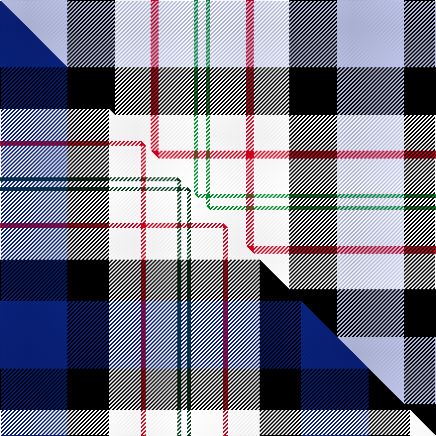

This page is one **sett** — a single exact thread-count. It belongs to the [tartan](/setts/lb17k12w9r2w9g1w2/)
(the same proportion at any scale), whose colour order is pattern [WGWRWKW](/stripes/wgwrwkw/).

Part of the [Ferguson Dress](/tartans/ferguson-dress/) tartan — the named design grouping this sett with its other cloths.

Sourced from register-of-tartans.  It is a [7 stripe tartan](/stripes/stripes7/).

Original link https://www.tartanregister.gov.uk/tartanDetails.aspx?ref=1161

## Register references

External register numbers recorded for this tartan.

- Scottish Register of Tartans: [1161](https://www.tartanregister.gov.uk/tartanDetails.aspx?ref=1161)
- Scottish Tartans Authority (ITI): 92
- Scottish Tartans World Register: 92

## Thread count
LB/68 K48 W36 R8 W36 G4 W/8

One full sett is **340 threads**.

## Palette
<table><thead><tr><th>Colour</th><th>Shade</th><th>OKLCh</th></tr></thead><tbody><tr><td>LB</td><td><code style="background-color:#B5BBDE;">#B5BBDE</code> <small style="color:#888">#B5BBDE</small></td><td><small style="color:#888">oklch(79.9% 0.050 277.6)</small></td></tr><tr><td>G</td><td><code style="background-color:#008B2A;">#008B2A</code> <small style="color:#888">#008B2A</small></td><td><small style="color:#888">oklch(55.4% 0.170 145.9)</small></td></tr><tr><td>K</td><td><code style="background-color:#000000;">#000000</code> <small style="color:#888">#000000</small></td><td><small style="color:#888">oklch(0.0% 0.000 0.0)</small></td></tr><tr><td>W</td><td><code style="background-color:#F7F7F7;">#F7F7F7</code> <small style="color:#888">#F7F7F7</small></td><td><small style="color:#888">oklch(97.6% 0.000 89.9)</small></td></tr><tr><td>R</td><td><code style="background-color:#D60020;">#D60020</code> <small style="color:#888">#D60020</small></td><td><small style="color:#888">oklch(55.2% 0.224 25.5)</small></td></tr></tbody></table>

# Sample pattern

## Compared to the master

This cloth is one sett of its design; the master sett (the exemplar the design is anchored on) is below for comparison.

Its **ΔTartan distance** from the master is **0.36** — the same measure the nearest-tartans table ranks by (0 is identical; a re-scale of the same cloth is near 0, a recolour or a different proportion further).

<figure class="master-compare" style="margin:0">

this sett
master sett ★

<figcaption style="color:#888;font-size:smaller">One weave of this sett against the <a href="/setts/db68k42w32r5w32dg4w6/">master sett ★</a>, split on the diagonal: a shared proportion runs seamlessly across it with only the shades shifting; a different proportion breaks on it.</figcaption>
</figure>

## Nearest tartan variants

The nearest existing variants by ΔTartan distance, with this cloth at the top so the swatches line up against it.

ΔTartan

Threads

Variant

Sett

—

340

<a href="/variants/s7/lb17k12w9r2w9g1w2~x4/">Ferguson Dress</a>

<a href="/ttd/edit/#slug=db68k42w32r5w32dg4w6&amp;base=lb17k12w9r2w9g1w2~x4" title="compare in the TTD">0.36</a>

304

<a href="/variants/s7/db68k42w32r5w32dg4w6/">Ferguson Dress #2</a>

<a href="/ttd/edit/#slug=lb35k23w18dr3w18k2w3~x2&amp;base=lb17k12w9r2w9g1w2~x4" title="compare in the TTD">1.08</a>

332

<a href="/variants/s7/lb35k23w18dr3w18k2w3~x2/">Ferguson Dress Blue (Dance)</a>

<a href="/ttd/edit/#slug=k3w25g16w3db25w3~x2&amp;base=lb17k12w9r2w9g1w2~x4" title="compare in the TTD">1.85</a>

288

<a href="/variants/s6/k3w25g16w3db25w3~x2/">Birnham, Blue (Dance)</a>

<a href="/ttd/edit/#slug=w13g13lb13k10w7y1r1~x4&amp;base=lb17k12w9r2w9g1w2~x4" title="compare in the TTD">1.99</a>

408

<a href="/variants/s7/w13g13lb13k10w7y1r1~x4/">Lachine Historic</a>

<a href="/ttd/edit/#slug=r2db14k6g1w12g1w2~x4&amp;base=lb17k12w9r2w9g1w2~x4" title="compare in the TTD">2.01</a>

288

<a href="/variants/s7/r2db14k6g1w12g1w2~x4/">Davidson (Wedding) (Personal)</a>

<a href="/ttd/edit/#slug=r5w2lb20dy2k16w18k2w5~x2&amp;base=lb17k12w9r2w9g1w2~x4" title="compare in the TTD">2.05</a>

260

<a href="/variants/s8/r5w2lb20dy2k16w18k2w5~x2/">Ailsa Craig (District)</a>

<a href="/ttd/edit/#slug=r5w2db20y2k16w18k2w5~x2&amp;base=lb17k12w9r2w9g1w2~x4" title="compare in the TTD">2.05</a>

260

<a href="/variants/s8/r5w2db20y2k16w18k2w5~x2/">Ailsa, Craig</a>

<a href="/ttd/edit/#slug=k20w4r4w20dg20w5dg2g2~x2~dg1705151-g2307139&amp;base=lb17k12w9r2w9g1w2~x4" title="compare in the TTD">2.22</a>

264

<a href="/variants/s8/k20w4r4w20dg20w5dg2g2~x2~dg1705151-g2307139/">Hackett, William (Coatbridge) (Personal)</a>

<a href="/ttd/edit/#slug=lb13dr1g13w1k1w7k3~x2&amp;base=lb17k12w9r2w9g1w2~x4" title="compare in the TTD">2.25</a>

124

<a href="/variants/s7/lb13dr1g13w1k1w7k3~x2/">Chambers, Christopher J (Personal)</a>

<a href="/ttd/edit/#slug=b34w3dg4g23w24k3dg4~x2&amp;base=lb17k12w9r2w9g1w2~x4" title="compare in the TTD">2.32</a>

304

<a href="/variants/s7/b34w3dg4g23w24k3dg4~x2/">MacLachlan, dress</a>

## Neighbour map

Every grey dot is one of 13620 variants placed by the first two principal components of the ΔTartan feature space (42% of its variance). Red is this tartan; blue dots are its nearest — click one to open its page.

<svg viewBox="0 0 640 380" role="img" style="max-width:100%;height:auto;border:1px solid #e0e0e0;border-radius:4px;display:block" xmlns="http://www.w3.org/2000/svg"><image href="/nn/cloud.v1.png" width="640" height="380"/><a href="/variants/s7/db68k42w32r5w32dg4w6/"><circle cx="144.1" cy="153.7" r="4" fill="#3465a4"><title>Ferguson Dress #2</title></circle></a><a href="/variants/s7/lb35k23w18dr3w18k2w3~x2/"><circle cx="178.5" cy="151.3" r="4" fill="#3465a4"><title>Ferguson Dress Blue (Dance)</title></circle></a><a href="/variants/s6/k3w25g16w3db25w3~x2/"><circle cx="166.9" cy="209.9" r="4" fill="#3465a4"><title>Birnham, Blue (Dance)</title></circle></a><a href="/variants/s7/w13g13lb13k10w7y1r1~x4/"><circle cx="80.2" cy="180.3" r="4" fill="#3465a4"><title>Lachine Historic</title></circle></a><a href="/variants/s7/r2db14k6g1w12g1w2~x4/"><circle cx="137.8" cy="149.8" r="4" fill="#3465a4"><title>Davidson (Wedding) (Personal)</title></circle></a><a href="/variants/s8/r5w2lb20dy2k16w18k2w5~x2/"><circle cx="107.7" cy="163.9" r="4" fill="#3465a4"><title>Ailsa Craig (District)</title></circle></a><a href="/variants/s8/r5w2db20y2k16w18k2w5~x2/"><circle cx="105.6" cy="162.2" r="4" fill="#3465a4"><title>Ailsa, Craig</title></circle></a><a href="/variants/s8/k20w4r4w20dg20w5dg2g2~x2~dg1705151-g2307139/"><circle cx="112.7" cy="164.3" r="4" fill="#3465a4"><title>Hackett, William (Coatbridge) (Personal)</title></circle></a><a href="/variants/s7/lb13dr1g13w1k1w7k3~x2/"><circle cx="135.4" cy="170.2" r="4" fill="#3465a4"><title>Chambers, Christopher J (Personal)</title></circle></a><a href="/variants/s7/b34w3dg4g23w24k3dg4~x2/"><circle cx="136.2" cy="173.5" r="4" fill="#3465a4"><title>MacLachlan, dress</title></circle></a><circle cx="147.7" cy="164.0" r="5" fill="#c00000"/><text x="320" y="376" text-anchor="middle" font-size="11" fill="#999">ground</text><text x="11" y="190" text-anchor="middle" font-size="11" fill="#999" transform="rotate(-90 11 190)">complexity</text></svg>

ID: /variants/s7/lb17k12w9r2w9g1w2~x4/
