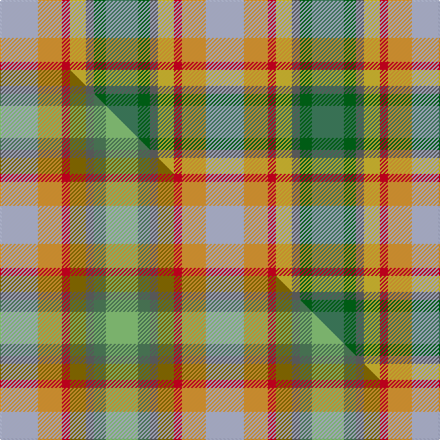

This is one **variant** — a specific cloth: this exact thread count and colourway, with its own
provenance below. It is one weaving of the [sett](/setts/lb19lo12r4ly8n4dg6g16/) (the scale-free proportion — the
same cloth at any scale or shade), whose colour order is pattern [GGBYRYW](/stripes/ggbyryw/).

Part of the [Aberdeenshire Home Colours](/tartans/a/ab/aberdeenshire-home-colours/) tartan — the named design grouping this sett with its other cloths.

Sourced from tartans-authority.  It is a [7 stripe tartan](/stripes/stripes7/).

Original link [https://www.tartanregister.gov.uk/tartanDetails.aspx?ref=11267](https://www.tartanregister.gov.uk/tartanDetails.aspx?ref=11267)

Dataset <small>— provenance for this record, inherited from the source manifest</small>

<dl class="dataset-prov">
<dt>source</dt><dd><a href="/sources/tartans-authority/">Scottish Tartans Authority</a></dd>
<dt>data captured from</dt><dd><a href="https://github.com/thetartan/tartan-database/blob/master/data/tartans-authority/data.csv">https://github.com/thetartan/tartan-database/blob/master/data/tartans-authority/data.csv</a></dd>
<dt>data date</dt><dd>2015 <small>(this record)</small></dd>
<dt>licence</dt><dd><a href="https://creativecommons.org/licenses/by-nc-nd/4.0/">CC BY-NC-ND 4.0</a></dd>
</dl>

Capture chain <small>— the hands this data passed through, oldest first; each capture carries its own licence</small>

<ol class="capture-chain">
<li><a href="https://www.tartansauthority.com/">Scottish Tartans Authority</a> <small>the heritage body's archive — its tartan-ferret record browser is retired (links repaired to the SRT, above)</small></li>
<li><a href="https://github.com/thetartan/tartan-database">thetartan/tartan-database</a> <small>2016-2017</small> · <a href="https://creativecommons.org/licenses/by-nc-nd/4.0/">CC BY-NC-ND 4.0</a> <small>Levko Kravets's frozen compilation — the capture we vendored, and where its CC licence text came from</small></li>
<li>this dictionary <small>captured 2026-06-10 · commit 5bf86c7566</small> <small>each re-capture is a git commit to data/sources</small></li>
</ol>

## Register references

External register numbers recorded for this tartan.

- Scottish Register of Tartans: [11267](https://www.tartanregister.gov.uk/tartanDetails?ref=11267)
- Scottish Tartans Authority (ITI): 11267

## Thread count
LB/38 LO24 R8 LY16 N8 DG12 G/32

One full sett is **206 threads**.

## Palette
<table><thead><tr><th>Colour</th><th>Shade</th><th>OKLCh</th></tr></thead><tbody><tr><td>LB</td><td><code style="background-color:#B5BBDE;">#B5BBDE</code> <small style="color:#888">#B5BBDE</small></td><td><small style="color:#888">oklch(79.9% 0.050 277.6)</small></td></tr><tr><td>G</td><td><code style="background-color:#408060;">#408060</code> <small style="color:#888">#408060</small></td><td><small style="color:#888">oklch(54.8% 0.084 160.1)</small></td></tr><tr><td>DG</td><td><code style="background-color:#006818;">#006818</code> <small style="color:#888">#006818</small></td><td><small style="color:#888">oklch(45.0% 0.142 145.0)</small></td></tr><tr><td>N</td><td><code style="background-color:#636363;">#636363</code> <small style="color:#888">#636363</small></td><td><small style="color:#888">oklch(50.0% 0.000 89.9)</small></td></tr><tr><td>LO</td><td><code style="background-color:#FF9C34;">#FF9C34</code> <small style="color:#888">#FF9C34</small></td><td><small style="color:#888">oklch(77.9% 0.161 61.8)</small></td></tr><tr><td>R</td><td><code style="background-color:#D60020;">#D60020</code> <small style="color:#888">#D60020</small></td><td><small style="color:#888">oklch(55.2% 0.224 25.5)</small></td></tr><tr><td>LY</td><td><code style="background-color:#DCBC32;">#DCBC32</code> <small style="color:#888">#DCBC32</small></td><td><small style="color:#888">oklch(80.0% 0.150 95.2)</small></td></tr></tbody></table>

# Sample pattern

## Compared to the master

This cloth is one sett of its design; the master sett (the exemplar the design is anchored on) is below for comparison.

Its **ΔTartan distance** from the master is **0.15** — the same measure the nearest-tartans table ranks by (0 is identical; a re-scale of the same cloth is near 0, a recolour or a different proportion further).

<figure class="master-compare" style="margin:0">

this sett
master sett ★

<figcaption style="color:#888;font-size:smaller">One weave of this sett against the <a href="/setts/lb19lo12r4y8n4g6lg16/">master sett ★</a>, split on the diagonal: a shared proportion runs seamlessly across it with only the shades shifting; a different proportion breaks on it.</figcaption>
</figure>

## Nearest tartan variants

The nearest existing variants by ΔTartan distance, with this cloth at the top so the swatches line up against it.

ΔTartan

Threads

Variant

Sett

—

206

<a href="/variants/s7/lb19lo12r4ly8n4dg6g16~x2~dg1806142-g2203152/">Aberdeenshire Home Colours</a>

<a href="/ttd/edit/#slug=lb19lo12r4y8n4g6lg16~x2~g2203152-lg3105139&amp;base=lb19lo12r4ly8n4dg6g16~x2~dg1806142-g2203152" title="compare in the TTD">0.15</a>

206

<a href="/variants/s7/lb19lo12r4y8n4g6lg16~x2~g2203152-lg3105139/">Aberdeenshire Home Colours</a>

<a href="/ttd/edit/#slug=ly4o24dy19w3g23n13dy3oi13dy3~x2~n1900000-oi2500000&amp;base=lb19lo12r4ly8n4dg6g16~x2~dg1806142-g2203152" title="compare in the TTD">3.77</a>

406

<a href="/variants/s9/ly4o24dy19w3g23n13dy3oi13dy3~x2~n1900000-oi2500000/">Teallach (Personal)</a>

<a href="/ttd/edit/#slug=r8lo4y3g6lb6dp1~x5&amp;base=lb19lo12r4ly8n4dg6g16~x2~dg1806142-g2203152" title="compare in the TTD">3.81</a>

235

<a href="/variants/s6/r8lo4y3g6lb6dp1~x5/">Pride, The Tartan of</a>

<a href="/ttd/edit/#slug=w3g6gi4rii12w4ri10r5lp8w3lp3~x2~g2408144-gi2504202-rii2806019-ri2406019-r2109032&amp;base=lb19lo12r4ly8n4dg6g16~x2~dg1806142-g2203152" title="compare in the TTD">3.92</a>

220

<a href="/variants/s10/w3g6gi4rii12w4ri10r5lp8w3lp3~x2~g2408144-gi2504202-rii2806019-ri2406019-r2109032/">Ribbons of Hope</a>

<a href="/ttd/edit/#slug=y4r24dy19w3g23o13dy3n13dy3~x2~o2500000-n1900000&amp;base=lb19lo12r4ly8n4dg6g16~x2~dg1806142-g2203152" title="compare in the TTD">3.98</a>

406

<a href="/variants/s9/y4r24dy19w3g23o13dy3n13dy3~x2~o2500000-n1900000/">Teallach Family Tartan</a>

## Neighbour map

Every grey dot is one of 13621 variants placed by the first two principal components of the ΔTartan feature space (42% of its variance). Red is this tartan; blue dots are its nearest — click one to open its page.

<svg viewBox="0 0 640 380" role="img" style="max-width:100%;height:auto;border:1px solid #e0e0e0;border-radius:4px;display:block" xmlns="http://www.w3.org/2000/svg"><image href="/nn/cloud.v1.png" width="640" height="380"/><a href="/variants/s7/lb19lo12r4y8n4g6lg16~x2~g2203152-lg3105139/"><circle cx="117.2" cy="257.4" r="4" fill="#3465a4"><title>Aberdeenshire Home Colours</title></circle></a><a href="/variants/s9/ly4o24dy19w3g23n13dy3oi13dy3~x2~n1900000-oi2500000/"><circle cx="109.8" cy="205.1" r="4" fill="#3465a4"><title>Teallach (Personal)</title></circle></a><a href="/variants/s6/r8lo4y3g6lb6dp1~x5/"><circle cx="116.9" cy="246.9" r="4" fill="#3465a4"><title>Pride, The Tartan of</title></circle></a><a href="/variants/s10/w3g6gi4rii12w4ri10r5lp8w3lp3~x2~g2408144-gi2504202-rii2806019-ri2406019-r2109032/"><circle cx="39.7" cy="237.0" r="4" fill="#3465a4"><title>Ribbons of Hope</title></circle></a><a href="/variants/s9/y4r24dy19w3g23o13dy3n13dy3~x2~o2500000-n1900000/"><circle cx="94.1" cy="195.2" r="4" fill="#3465a4"><title>Teallach Family Tartan</title></circle></a><circle cx="98.5" cy="252.6" r="5" fill="#c00000"/><text x="320" y="376" text-anchor="middle" font-size="11" fill="#999">ground</text><text x="11" y="190" text-anchor="middle" font-size="11" fill="#999" transform="rotate(-90 11 190)">complexity</text></svg>

ID: /variants/s7/lb19lo12r4ly8n4dg6g16~x2~dg1806142-g2203152/
