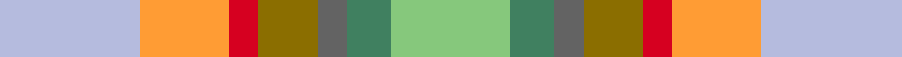

This is one **variant** — a specific cloth: this exact thread count and colourway, with its own
provenance below. It is one weaving of the [sett](/setts/lb19lo12r4y8n4g6lg16/) (the scale-free proportion — the
same cloth at any scale or shade), whose colour order is pattern [WYRGBGY](/stripes/wyrgbgy/).

Part of the [Aberdeenshire Home Colours](/tartans/a/ab/aberdeenshire-home-colours/) tartan — the named design grouping this sett with its other cloths.

Sourced from register-of-tartans.  It is a [7 stripe tartan](/stripes/stripes7/).

Original link [https://www.tartanregister.gov.uk/tartanDetails.aspx?ref=11267](https://www.tartanregister.gov.uk/tartanDetails.aspx?ref=11267)

Dataset <small>— provenance for this record, inherited from the source manifest</small>

<dl class="dataset-prov">
<dt>source</dt><dd><a href="/sources/register-of-tartans/">Scottish Register of Tartans</a></dd>
<dt>data captured from</dt><dd><a href="https://github.com/thetartan/tartan-database/blob/master/data/register-of-tartans/data.csv">https://github.com/thetartan/tartan-database/blob/master/data/register-of-tartans/data.csv</a></dd>
<dt>data date</dt><dd>01/03/2014 <small>(this record)</small></dd>
<dt>licence</dt><dd><a href="https://www.tartanregister.gov.uk/copyright">Crown copyright</a></dd>
</dl>

Capture chain <small>— the hands this data passed through, oldest first; each capture carries its own licence</small>

<ol class="capture-chain">
<li><a href="https://www.tartanregister.gov.uk/">Scottish Register of Tartans</a> · <a href="https://www.tartanregister.gov.uk/copyright">Crown copyright</a> <small>the living register — still published by National Records of Scotland</small></li>
<li><a href="https://github.com/thetartan/tartan-database">thetartan/tartan-database</a> <small>2016-2017</small> · <a href="https://creativecommons.org/licenses/by-nc-nd/4.0/">CC BY-NC-ND 4.0</a> <small>Levko Kravets's frozen compilation — the capture we vendored, and where its CC licence text came from</small></li>
<li>this dictionary <small>captured 2026-06-10 · commit 5bf86c7566</small> <small>each re-capture is a git commit to data/sources</small></li>
</ol>

## Register references

External register numbers recorded for this tartan.

- Scottish Register of Tartans: [11267](https://www.tartanregister.gov.uk/tartanDetails.aspx?ref=11267)

## Thread count
LB/38 LO24 R8 Y16 N8 G12 LG/32

One full sett is **206 threads**.

## Palette
<table><thead><tr><th>Colour</th><th>Shade</th><th>OKLCh</th></tr></thead><tbody><tr><td>G</td><td><code style="background-color:#408060;">#408060</code> <small style="color:#888">#408060</small></td><td><small style="color:#888">oklch(54.8% 0.084 160.1)</small></td></tr><tr><td>LB</td><td><code style="background-color:#B5BBDE;">#B5BBDE</code> <small style="color:#888">#B5BBDE</small></td><td><small style="color:#888">oklch(79.9% 0.050 277.6)</small></td></tr><tr><td>LG</td><td><code style="background-color:#86C87C;">#86C87C</code> <small style="color:#888">#86C87C</small></td><td><small style="color:#888">oklch(77.0% 0.125 141.2)</small></td></tr><tr><td>R</td><td><code style="background-color:#D60020;">#D60020</code> <small style="color:#888">#D60020</small></td><td><small style="color:#888">oklch(55.2% 0.224 25.5)</small></td></tr><tr><td>N</td><td><code style="background-color:#636363;">#636363</code> <small style="color:#888">#636363</small></td><td><small style="color:#888">oklch(50.0% 0.000 89.9)</small></td></tr><tr><td>LO</td><td><code style="background-color:#FF9C34;">#FF9C34</code> <small style="color:#888">#FF9C34</small></td><td><small style="color:#888">oklch(77.9% 0.161 61.8)</small></td></tr><tr><td>Y</td><td><code style="background-color:#8B6E00;">#8B6E00</code> <small style="color:#888">#8B6E00</small></td><td><small style="color:#888">oklch(55.1% 0.113 90.4)</small></td></tr></tbody></table>

# Sample pattern

## Nearest tartan variants

The nearest existing variants by ΔTartan distance, with this cloth at the top so the swatches line up against it.

ΔTartan

Threads

Variant

Sett

—

206

<a href="/variants/s7/lb19lo12r4y8n4g6lg16~x2~g2203152-lg3105139/">Aberdeenshire Home Colours</a>

<a href="/ttd/edit/#slug=lb19lo12r4ly8n4dg6g16~x2~dg1806142-g2203152&amp;base=lb19lo12r4y8n4g6lg16~x2~g2203152-lg3105139" title="compare in the TTD">0.15</a>

206

<a href="/variants/s7/lb19lo12r4ly8n4dg6g16~x2~dg1806142-g2203152/">Aberdeenshire Home Colours</a>

<a href="/ttd/edit/#slug=dg24lo2g16db7do16r5~x2&amp;base=lb19lo12r4y8n4g6lg16~x2~g2203152-lg3105139" title="compare in the TTD">1.84</a>

222

<a href="/variants/s6/dg24lo2g16db7do16r5~x2/">Waterford, County (District)</a>

## Neighbour map

Every grey dot is one of 13621 variants placed by the first two principal components of the ΔTartan feature space (42% of its variance). Red is this tartan; blue dots are its nearest — click one to open its page.

<svg viewBox="0 0 640 380" role="img" style="max-width:100%;height:auto;border:1px solid #e0e0e0;border-radius:4px;display:block" xmlns="http://www.w3.org/2000/svg"><image href="/nn/cloud.v1.png" width="640" height="380"/><a href="/variants/s7/lb19lo12r4ly8n4dg6g16~x2~dg1806142-g2203152/"><circle cx="98.5" cy="252.6" r="4" fill="#3465a4"><title>Aberdeenshire Home Colours</title></circle></a><a href="/variants/s6/dg24lo2g16db7do16r5~x2/"><circle cx="184.8" cy="221.7" r="4" fill="#3465a4"><title>Waterford, County (District)</title></circle></a><circle cx="117.2" cy="257.4" r="5" fill="#c00000"/><text x="320" y="376" text-anchor="middle" font-size="11" fill="#999">ground</text><text x="11" y="190" text-anchor="middle" font-size="11" fill="#999" transform="rotate(-90 11 190)">complexity</text></svg>

ID: /variants/s7/lb19lo12r4y8n4g6lg16~x2~g2203152-lg3105139/
