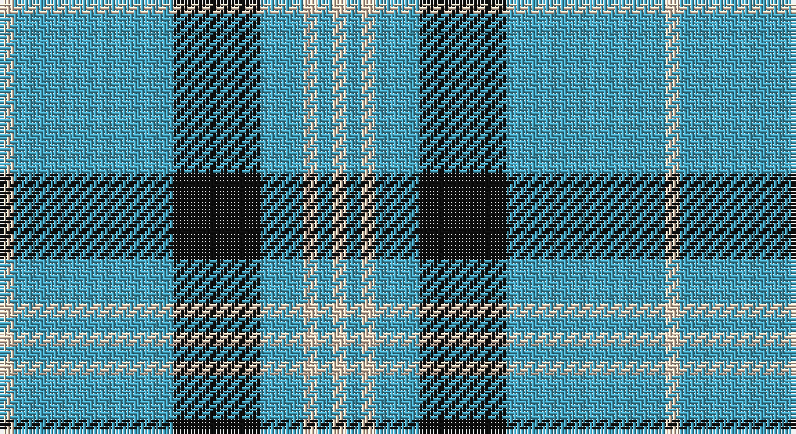

This page is one **sett** — a single exact thread-count. It belongs to the [tartan](/setts/lb1lg11k6lg3lb1lg1lb1/)
(the same proportion at any scale), whose colour order is pattern [WYKYWYW](/stripes/wykywyw/).

Part of the [Angle](/tartans/angle/) tartan — the named design grouping this sett with its other cloths.

Sourced from tartans-authority.  It is a [7 stripe tartan](/stripes/stripes7/).

Original link http://www.tartansauthority.com/tartan-ferret/display/3512/

## Also known as

This cloth is also recorded under:

- Angle Blue
- Angle Green
- Angle, Blue
- Angle, Green

2 attestations — the source records this cloth was collapsed from (oldest owns this page)

<ul>
<li>1986 — Angle, Blue (Fashion) (tartans-authority, <a href="http://www.tartansauthority.com/tartan-ferret/display/3512/">record</a>)</li>
<li>undated — Angle Blue (register-of-tartans, <a href="https://www.tartanregister.gov.uk/tartanDetails.aspx?ref=4882">record</a>)</li>
</ul>

## Register references

External register numbers recorded for this tartan.

- Scottish Register of Tartans: [4882](https://www.tartanregister.gov.uk/tartanDetails.aspx?ref=4882)
- Scottish Tartans Authority (ITI): 3512

## Thread count
LR/4 B44 K24 B12 LR4 B4 LR/4

One full sett is **184 threads**.

## Palette

Palette: <strong>Tartan Register</strong>
<table><thead><tr><th>Colour</th><th>Threads</th><th>Shade</th><th>Base</th><th>OKLCh</th></tr></thead><tbody><tr><td>LR/</td><td style="text-align:right;font-variant-numeric:tabular-nums">4</td><td><code style="background-color:#E8CCB8;">#E8CCB8</code> <small style="color:#888">#E8CCB8</small></td><td>W <code style="background-color:#F7F7F7;">#F7F7F7</code></td><td><small style="color:#888">oklch(86.3% 0.042 57.7)</small></td></tr><tr><td>B</td><td style="text-align:right;font-variant-numeric:tabular-nums">44</td><td><code style="background-color:#48A4C0;">#48A4C0</code> <small style="color:#888">#48A4C0</small></td><td>Y <code style="background-color:#F2BF00;">#F2BF00</code></td><td><small style="color:#888">oklch(67.5% 0.096 221.0)</small></td></tr><tr><td>K</td><td style="text-align:right;font-variant-numeric:tabular-nums">24</td><td><code style="background-color:#101010;">#101010</code> <small style="color:#888">#101010</small></td><td>K <code style="background-color:#000000;">#000000</code></td><td><small style="color:#888">oklch(17.3% 0.000 89.9)</small></td></tr><tr><td>B</td><td style="text-align:right;font-variant-numeric:tabular-nums">12</td><td><code style="background-color:#48A4C0;">#48A4C0</code> <small style="color:#888">#48A4C0</small></td><td>Y <code style="background-color:#F2BF00;">#F2BF00</code></td><td><small style="color:#888">oklch(67.5% 0.096 221.0)</small></td></tr><tr><td>LR</td><td style="text-align:right;font-variant-numeric:tabular-nums">4</td><td><code style="background-color:#E8CCB8;">#E8CCB8</code> <small style="color:#888">#E8CCB8</small></td><td>W <code style="background-color:#F7F7F7;">#F7F7F7</code></td><td><small style="color:#888">oklch(86.3% 0.042 57.7)</small></td></tr><tr><td>B</td><td style="text-align:right;font-variant-numeric:tabular-nums">4</td><td><code style="background-color:#48A4C0;">#48A4C0</code> <small style="color:#888">#48A4C0</small></td><td>Y <code style="background-color:#F2BF00;">#F2BF00</code></td><td><small style="color:#888">oklch(67.5% 0.096 221.0)</small></td></tr><tr><td>LR/</td><td style="text-align:right;font-variant-numeric:tabular-nums">4</td><td><code style="background-color:#E8CCB8;">#E8CCB8</code> <small style="color:#888">#E8CCB8</small></td><td>W <code style="background-color:#F7F7F7;">#F7F7F7</code></td><td><small style="color:#888">oklch(86.3% 0.042 57.7)</small></td></tr></tbody></table>

# Sample pattern

## Nearest tartans

The nearest existing variants by ΔTartan distance, with this tartan at the top so the swatches line up against it.

ΔTartan

Tartan

Sett

—

<a href="/ttd/edit/#slug=lb1lg11k6lg3lb1lg1lb1~x4">Angle, Blue (Fashion)</a> <a class="nn-out" href="/variants/s7/lb1lg11k6lg3lb1lg1lb1~x4/" title="open its dictionary page">↗</a>

1.12

<a href="/ttd/edit/#slug=ly5db15lb5db5lb40ly3~x2&amp;base=lb1lg11k6lg3lb1lg1lb1~x4">Legary</a> <a class="nn-out" href="/variants/s6/ly5db15lb5db5lb40ly3~x2/" title="open its dictionary page">↗</a>

1.12

<a href="/ttd/edit/#slug=t12ly2t1k5t4k2~x4&amp;base=lb1lg11k6lg3lb1lg1lb1~x4">Rea</a> <a class="nn-out" href="/variants/s6/t12ly2t1k5t4k2~x4/" title="open its dictionary page">↗</a>

1.32

<a href="/ttd/edit/#slug=t37w9t3db9w3~x2&amp;base=lb1lg11k6lg3lb1lg1lb1~x4">Loch Lomond</a> <a class="nn-out" href="/variants/s5/t37w9t3db9w3~x2/" title="open its dictionary page">↗</a>

1.42

<a href="/ttd/edit/#slug=n3b2w10b2n6b26k2~x2&amp;base=lb1lg11k6lg3lb1lg1lb1~x4">MacLintock #2</a> <a class="nn-out" href="/variants/s7/n3b2w10b2n6b26k2~x2/" title="open its dictionary page">↗</a>

1.48

<a href="/ttd/edit/#slug=db9lb27db2k4db2lb10db2w3~x2&amp;base=lb1lg11k6lg3lb1lg1lb1~x4">Alaska Highlanders Pipes &amp; Drums Corporate Tartan</a> <a class="nn-out" href="/variants/s8/db9lb27db2k4db2lb10db2w3~x2/" title="open its dictionary page">↗</a>

1.49

<a href="/ttd/edit/#slug=k10t30g3t3g3t3r6~x2&amp;base=lb1lg11k6lg3lb1lg1lb1~x4">Kinding (Personal)</a> <a class="nn-out" href="/variants/s7/k10t30g3t3g3t3r6~x2/" title="open its dictionary page">↗</a>

1.52

<a href="/ttd/edit/#slug=k3t10ly5t29k10r6k2~x2&amp;base=lb1lg11k6lg3lb1lg1lb1~x4">Perkins 2015</a> <a class="nn-out" href="/variants/s7/k3t10ly5t29k10r6k2~x2/" title="open its dictionary page">↗</a>

1.52

<a href="/ttd/edit/#slug=dt5b5dt30w4dt4b18w3dt3~x2&amp;base=lb1lg11k6lg3lb1lg1lb1~x4">Salem Scottish Dancers (Corporate)</a> <a class="nn-out" href="/variants/s8/dt5b5dt30w4dt4b18w3dt3~x2/" title="open its dictionary page">↗</a>

1.53

<a href="/ttd/edit/#slug=t50dr4t12dr23ly4dr4~x2&amp;base=lb1lg11k6lg3lb1lg1lb1~x4">Sligo</a> <a class="nn-out" href="/variants/s6/t50dr4t12dr23ly4dr4~x2/" title="open its dictionary page">↗</a>

1.62

<a href="/ttd/edit/#slug=dt29dr3w10dt2w2lo10dt5w2dt4lo2~x2&amp;base=lb1lg11k6lg3lb1lg1lb1~x4">Stewart Navy Clan Tartan</a> <a class="nn-out" href="/variants/s10/dt29dr3w10dt2w2lo10dt5w2dt4lo2~x2/" title="open its dictionary page">↗</a>

## Neighbour map

Every grey dot is one of 14360 variants placed by the first two principal components of the ΔTartan feature space (44% of its variance). Red is this tartan; blue dots are its nearest — click one to open its page.

<svg viewBox="0 0 640 380" role="img" style="max-width:100%;height:auto;border:1px solid #e0e0e0;border-radius:4px;display:block" xmlns="http://www.w3.org/2000/svg"><image href="/nn/cloud.v1.png" width="640" height="380"/><a href="/variants/s6/ly5db15lb5db5lb40ly3~x2/"><circle cx="332.9" cy="176.2" r="4" fill="#3465a4"><title>Legary</title></circle></a><a href="/variants/s6/t12ly2t1k5t4k2~x4/"><circle cx="363.3" cy="219.2" r="4" fill="#3465a4"><title>Rea</title></circle></a><a href="/variants/s5/t37w9t3db9w3~x2/"><circle cx="381.7" cy="206.8" r="4" fill="#3465a4"><title>Loch Lomond</title></circle></a><a href="/variants/s7/n3b2w10b2n6b26k2~x2/"><circle cx="315.1" cy="170.1" r="4" fill="#3465a4"><title>MacLintock #2</title></circle></a><a href="/variants/s8/db9lb27db2k4db2lb10db2w3~x2/"><circle cx="319.0" cy="150.7" r="4" fill="#3465a4"><title>Alaska Highlanders Pipes &amp; Drums Corporate Tartan</title></circle></a><a href="/variants/s7/k10t30g3t3g3t3r6~x2/"><circle cx="339.2" cy="186.0" r="4" fill="#3465a4"><title>Kinding (Personal)</title></circle></a><a href="/variants/s7/k3t10ly5t29k10r6k2~x2/"><circle cx="316.4" cy="176.8" r="4" fill="#3465a4"><title>Perkins 2015</title></circle></a><a href="/variants/s8/dt5b5dt30w4dt4b18w3dt3~x2/"><circle cx="328.6" cy="204.1" r="4" fill="#3465a4"><title>Salem Scottish Dancers (Corporate)</title></circle></a><a href="/variants/s6/t50dr4t12dr23ly4dr4~x2/"><circle cx="399.6" cy="207.5" r="4" fill="#3465a4"><title>Sligo</title></circle></a><a href="/variants/s10/dt29dr3w10dt2w2lo10dt5w2dt4lo2~x2/"><circle cx="304.2" cy="145.2" r="4" fill="#3465a4"><title>Stewart Navy Clan Tartan</title></circle></a><circle cx="337.9" cy="192.6" r="5" fill="#c00000"/></svg>

ID: /variants/s7/lb1lg11k6lg3lb1lg1lb1~x4/
