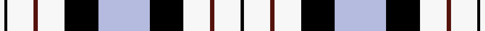

This page is one **sett** — a single exact thread-count. It belongs to the [tartan](/setts/lb35k23w18dr3w18k2w3/)
(the same proportion at any scale), whose colour order is pattern [KWBWKWKWBWKW](/stripes/kwbwkwkwbwkw/).

Part of the [Ferguson Dress](/tartans/ferguson-dress/) tartan — the named design grouping this sett with its other cloths.

Sourced from register-of-tartans.  It is a [12 stripe tartan](/stripes/stripes12/).

Original link https://www.tartanregister.gov.uk/tartanDetails.aspx?ref=1163

## Register references

External register numbers recorded for this tartan.

- Scottish Register of Tartans: [1163](https://www.tartanregister.gov.uk/tartanDetails.aspx?ref=1163)
- Scottish Tartans Authority (ITI): 4845

## Thread count
W/6 K4 W36 DR6 W36 K46 LB70 K46 W36 DR6 W36 K/4

One full sett is **654 threads**.

## Palette
<table><thead><tr><th>Colour</th><th>Shade</th><th>OKLCh</th></tr></thead><tbody><tr><td>B</td><td><code style="background-color:#B5BBDE;">#B5BBDE</code> <small style="color:#888">#B5BBDE</small></td><td><small style="color:#888">oklch(79.9% 0.050 277.6)</small></td></tr><tr><td>DR</td><td><code style="background-color:#55120C;">#55120C</code> <small style="color:#888">#55120C</small></td><td><small style="color:#888">oklch(30.0% 0.099 29.3)</small></td></tr><tr><td>K</td><td><code style="background-color:#000000;">#000000</code> <small style="color:#888">#000000</small></td><td><small style="color:#888">oklch(0.0% 0.000 0.0)</small></td></tr><tr><td>W</td><td><code style="background-color:#F7F7F7;">#F7F7F7</code> <small style="color:#888">#F7F7F7</small></td><td><small style="color:#888">oklch(97.6% 0.000 89.9)</small></td></tr></tbody></table>

# Sample pattern

## Compared to the master

This cloth is one sett of its design; the master sett (the exemplar the design is anchored on) is below for comparison.

Its **ΔTartan distance** from the master is **2.02** — the same measure the nearest-tartans table ranks by (0 is identical; a re-scale of the same cloth is near 0, a recolour or a different proportion further).

<figure style="margin:0"><figcaption style="color:#888;font-size:smaller">this sett</figcaption></figure>
<figure style="margin:0"><figcaption style="color:#888;font-size:smaller"><a href="/setts/db68k42w32r5w32dg4w6/">master sett →</a></figcaption></figure>

## Nearest variants

The nearest existing variants by ΔTartan distance, with this cloth at the top so the swatches line up against it.

ΔTartan

Threads

Variant

Sett

—

654

<a href="/variants/s7/lb35k23w18dr3w18k2w3~x2/">Ferguson Dress Blue (Dance)</a>

<a href="/ttd/edit/#slug=r4w4k4w4k4w4k2lb23w2~x2&amp;base=lb35k23w18dr3w18k2w3~x2" title="compare in the TTD">2.92</a>

192

<a href="/variants/s9/r4w4k4w4k4w4k2lb23w2~x2/">Virtuoso</a>

## Neighbour map

Every grey dot is one of 13620 variants placed by the first two principal components of the ΔTartan feature space (42% of its variance). Red is this tartan; blue dots are its nearest — click one to open its page.

<svg viewBox="0 0 640 380" role="img" style="max-width:100%;height:auto;border:1px solid #e0e0e0;border-radius:4px;display:block" xmlns="http://www.w3.org/2000/svg"><image href="/nn/cloud.v1.png" width="640" height="380"/><a href="/variants/s9/r4w4k4w4k4w4k2lb23w2~x2/"><circle cx="196.0" cy="153.1" r="4" fill="#3465a4"><title>Virtuoso</title></circle></a><circle cx="178.5" cy="151.3" r="5" fill="#c00000"/><text x="320" y="376" text-anchor="middle" font-size="11" fill="#999">ground</text><text x="11" y="190" text-anchor="middle" font-size="11" fill="#999" transform="rotate(-90 11 190)">complexity</text></svg>

ID: /variants/s7/lb35k23w18dr3w18k2w3~x2/
