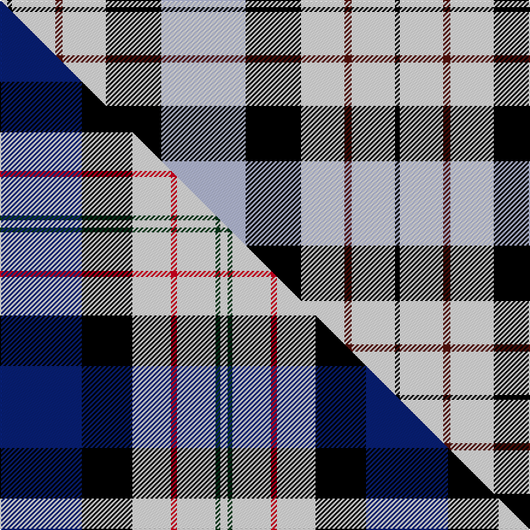

This page is one **sett** — a single exact thread-count. It belongs to the [tartan](/setts/lb35k23w18dr3w18k2w3/)
(the same proportion at any scale), whose colour order is pattern [KWBWKWKWBWKW](/stripes/kwbwkwkwbwkw/).

Part of the [Ferguson Dress](/tartans/ferguson-dress/) tartan — the named design grouping this sett with its other cloths.

Sourced from register-of-tartans.  It is a [12 stripe tartan](/stripes/stripes12/).

Original link https://www.tartanregister.gov.uk/tartanDetails.aspx?ref=1163

## Register references

External register numbers recorded for this tartan.

- Scottish Register of Tartans: [1163](https://www.tartanregister.gov.uk/tartanDetails.aspx?ref=1163)
- Scottish Tartans Authority (ITI): 4845

## Thread count
W/6 K4 W36 DR6 W36 K46 LB70 K46 W36 DR6 W36 K/4

One full sett is **654 threads**.

## Palette
<table><thead><tr><th>Colour</th><th>Shade</th><th>OKLCh</th></tr></thead><tbody><tr><td>LB</td><td><code style="background-color:#B5BBDE;">#B5BBDE</code> <small style="color:#888">#B5BBDE</small></td><td><small style="color:#888">oklch(79.9% 0.050 277.6)</small></td></tr><tr><td>DR</td><td><code style="background-color:#55120C;">#55120C</code> <small style="color:#888">#55120C</small></td><td><small style="color:#888">oklch(30.0% 0.099 29.3)</small></td></tr><tr><td>K</td><td><code style="background-color:#000000;">#000000</code> <small style="color:#888">#000000</small></td><td><small style="color:#888">oklch(0.0% 0.000 0.0)</small></td></tr><tr><td>W</td><td><code style="background-color:#F7F7F7;">#F7F7F7</code> <small style="color:#888">#F7F7F7</small></td><td><small style="color:#888">oklch(97.6% 0.000 89.9)</small></td></tr></tbody></table>

# Sample pattern

## Compared to the master

This cloth is one sett of its design; the master sett (the exemplar the design is anchored on) is below for comparison.

Its **ΔTartan distance** from the master is **1.15** — the same measure the nearest-tartans table ranks by (0 is identical; a re-scale of the same cloth is near 0, a recolour or a different proportion further).

<figure class="master-compare" style="margin:0">

this sett
master sett ★

<figcaption style="color:#888;font-size:smaller">One weave of this sett against the <a href="/setts/db68k42w32r5w32dg4w6/">master sett ★</a>, split on the diagonal: a shared proportion runs seamlessly across it with only the shades shifting; a different proportion breaks on it.</figcaption>
</figure>

## Nearest tartan variants

The nearest existing variants by ΔTartan distance, with this cloth at the top so the swatches line up against it.

ΔTartan

Threads

Variant

Sett

—

654

<a href="/variants/s7/lb35k23w18dr3w18k2w3~x2/">Ferguson Dress Blue (Dance)</a>

<a href="/ttd/edit/#slug=lb17k12w9r2w9g1w2~x4&amp;base=lb35k23w18dr3w18k2w3~x2" title="compare in the TTD">1.08</a>

340

<a href="/variants/s7/lb17k12w9r2w9g1w2~x4/">Ferguson Dress</a>

<a href="/ttd/edit/#slug=db48r10w2r10g17k3w17k3w34~x2&amp;base=lb35k23w18dr3w18k2w3~x2" title="compare in the TTD">2.16</a>

412

<a href="/variants/s9/db48r10w2r10g17k3w17k3w34~x2/">Unidentified #43</a>

<a href="/ttd/edit/#slug=n30k5n19k5n2lb20y2lb20k5y4~x2&amp;base=lb35k23w18dr3w18k2w3~x2" title="compare in the TTD">2.49</a>

380

<a href="/variants/s10/n30k5n19k5n2lb20y2lb20k5y4~x2/">Sonsub</a>

<a href="/ttd/edit/#slug=k9w4k2w4k2w30k9w4b14lo2~x2&amp;base=lb35k23w18dr3w18k2w3~x2" title="compare in the TTD">2.63</a>

298

<a href="/variants/s10/k9w4k2w4k2w30k9w4b14lo2~x2/">Hannay (Clan)</a>

<a href="/ttd/edit/#slug=w10k3w3k3w3k5w5g9k1w2k1g9k10w13r2~x2&amp;base=lb35k23w18dr3w18k2w3~x2" title="compare in the TTD">2.78</a>

292

<a href="/variants/s15/w10k3w3k3w3k5w5g9k1w2k1g9k10w13r2~x2/">MacKenzie (MacGregor-Hastie)</a>

<a href="/ttd/edit/#slug=w4db2w1r2w16db16r16db12k1w4~x2&amp;base=lb35k23w18dr3w18k2w3~x2" title="compare in the TTD">2.79</a>

280

<a href="/variants/s10/w4db2w1r2w16db16r16db12k1w4~x2/">Spirit of Russia, The</a>

<a href="/ttd/edit/#slug=r2k6db4w2k14w1db4w16db2w6r2~x2&amp;base=lb35k23w18dr3w18k2w3~x2" title="compare in the TTD">2.79</a>

228

<a href="/variants/s11/r2k6db4w2k14w1db4w16db2w6r2~x2/">McRae, Dress</a>

<a href="/ttd/edit/#slug=k9w4k2w4k2w29k9w4db14y2~x2&amp;base=lb35k23w18dr3w18k2w3~x2" title="compare in the TTD">2.81</a>

294

<a href="/variants/s10/k9w4k2w4k2w29k9w4db14y2~x2/">Hannay</a>

<a href="/ttd/edit/#slug=k4lb2w11lb5n5w2k1lb2~x2&amp;base=lb35k23w18dr3w18k2w3~x2" title="compare in the TTD">2.83</a>

116

<a href="/variants/s8/k4lb2w11lb5n5w2k1lb2~x2/">Conquergood</a>

<a href="/ttd/edit/#slug=r2db2w26dg25k14db13w26db2r2~x2&amp;base=lb35k23w18dr3w18k2w3~x2" title="compare in the TTD">2.85</a>

440

<a href="/variants/s9/r2db2w26dg25k14db13w26db2r2~x2/">MacNaughton Dress</a>

## Neighbour map

Every grey dot is one of 13620 variants placed by the first two principal components of the ΔTartan feature space (42% of its variance). Red is this tartan; blue dots are its nearest — click one to open its page.

<svg viewBox="0 0 640 380" role="img" style="max-width:100%;height:auto;border:1px solid #e0e0e0;border-radius:4px;display:block" xmlns="http://www.w3.org/2000/svg"><image href="/nn/cloud.v1.png" width="640" height="380"/><a href="/variants/s7/lb17k12w9r2w9g1w2~x4/"><circle cx="147.7" cy="164.0" r="4" fill="#3465a4"><title>Ferguson Dress</title></circle></a><a href="/variants/s9/db48r10w2r10g17k3w17k3w34~x2/"><circle cx="144.8" cy="121.6" r="4" fill="#3465a4"><title>Unidentified #43</title></circle></a><a href="/variants/s10/n30k5n19k5n2lb20y2lb20k5y4~x2/"><circle cx="216.4" cy="160.4" r="4" fill="#3465a4"><title>Sonsub</title></circle></a><a href="/variants/s10/k9w4k2w4k2w30k9w4b14lo2~x2/"><circle cx="230.1" cy="139.7" r="4" fill="#3465a4"><title>Hannay (Clan)</title></circle></a><a href="/variants/s15/w10k3w3k3w3k5w5g9k1w2k1g9k10w13r2~x2/"><circle cx="150.6" cy="153.5" r="4" fill="#3465a4"><title>MacKenzie (MacGregor-Hastie)</title></circle></a><a href="/variants/s10/w4db2w1r2w16db16r16db12k1w4~x2/"><circle cx="181.6" cy="149.1" r="4" fill="#3465a4"><title>Spirit of Russia, The</title></circle></a><a href="/variants/s11/r2k6db4w2k14w1db4w16db2w6r2~x2/"><circle cx="162.1" cy="135.6" r="4" fill="#3465a4"><title>McRae, Dress</title></circle></a><a href="/variants/s10/k9w4k2w4k2w29k9w4db14y2~x2/"><circle cx="217.0" cy="137.4" r="4" fill="#3465a4"><title>Hannay</title></circle></a><a href="/variants/s8/k4lb2w11lb5n5w2k1lb2~x2/"><circle cx="170.2" cy="169.6" r="4" fill="#3465a4"><title>Conquergood</title></circle></a><a href="/variants/s9/r2db2w26dg25k14db13w26db2r2~x2/"><circle cx="150.7" cy="149.6" r="4" fill="#3465a4"><title>MacNaughton Dress</title></circle></a><circle cx="178.5" cy="151.3" r="5" fill="#c00000"/><text x="320" y="376" text-anchor="middle" font-size="11" fill="#999">ground</text><text x="11" y="190" text-anchor="middle" font-size="11" fill="#999" transform="rotate(-90 11 190)">complexity</text></svg>

ID: /variants/s7/lb35k23w18dr3w18k2w3~x2/
