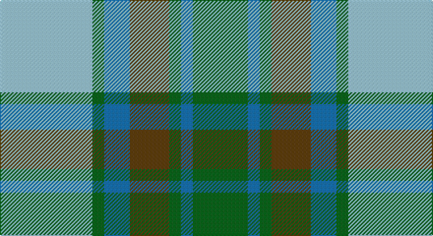

This page is one **sett** — a single exact thread-count. It belongs to the [tartan](/setts/lb47g6b13dy20g6b6g28/)
(the same proportion at any scale), whose colour order is pattern [GBGGBGW](/stripes/gbggbgw/).

Sourced from tartans-authority.  It is a [7 stripe tartan](/stripes/stripes7/).

Original link http://www.tartansauthority.com/tartan-ferret/display/8647/

## Register references

External register numbers recorded for this tartan.

- Scottish Register of Tartans: [8647](https://www.tartanregister.gov.uk/tartanDetails?ref=8647)
- Scottish Tartans Authority (ITI): 8647

## Thread count
LB/94 G12 B26 T40 G12 B12 G/56

One full sett is **354 threads**.

## Palette

Palette: <strong>Tartan Register</strong>
<table><thead><tr><th>Colour</th><th>Threads</th><th>Shade</th><th>Base</th><th>OKLCh</th></tr></thead><tbody><tr><td>LB/</td><td style="text-align:right;font-variant-numeric:tabular-nums">94</td><td><code style="background-color:#98C8E8;">#98C8E8</code> <small style="color:#888">#98C8E8</small></td><td>W <code style="background-color:#F7F7F7;">#F7F7F7</code></td><td><small style="color:#888">oklch(81.0% 0.068 237.9)</small></td></tr><tr><td>G</td><td style="text-align:right;font-variant-numeric:tabular-nums">12</td><td><code style="background-color:#006818;">#006818</code> <small style="color:#888">#006818</small></td><td>G <code style="background-color:#006100;">#006100</code></td><td><small style="color:#888">oklch(45.0% 0.142 145.0)</small></td></tr><tr><td>B</td><td style="text-align:right;font-variant-numeric:tabular-nums">26</td><td><code style="background-color:#1474B4;">#1474B4</code> <small style="color:#888">#1474B4</small></td><td>B <code style="background-color:#2A418A;">#2A418A</code></td><td><small style="color:#888">oklch(54.0% 0.129 245.1)</small></td></tr><tr><td>T</td><td style="text-align:right;font-variant-numeric:tabular-nums">40</td><td><code style="background-color:#604000;">#604000</code> <small style="color:#888">#604000</small></td><td>G <code style="background-color:#006100;">#006100</code></td><td><small style="color:#888">oklch(39.8% 0.083 76.8)</small></td></tr><tr><td>G</td><td style="text-align:right;font-variant-numeric:tabular-nums">12</td><td><code style="background-color:#006818;">#006818</code> <small style="color:#888">#006818</small></td><td>G <code style="background-color:#006100;">#006100</code></td><td><small style="color:#888">oklch(45.0% 0.142 145.0)</small></td></tr><tr><td>B</td><td style="text-align:right;font-variant-numeric:tabular-nums">12</td><td><code style="background-color:#1474B4;">#1474B4</code> <small style="color:#888">#1474B4</small></td><td>B <code style="background-color:#2A418A;">#2A418A</code></td><td><small style="color:#888">oklch(54.0% 0.129 245.1)</small></td></tr><tr><td>G/</td><td style="text-align:right;font-variant-numeric:tabular-nums">56</td><td><code style="background-color:#006818;">#006818</code> <small style="color:#888">#006818</small></td><td>G <code style="background-color:#006100;">#006100</code></td><td><small style="color:#888">oklch(45.0% 0.142 145.0)</small></td></tr></tbody></table>

# Sample pattern

## Nearest tartans

The nearest existing variants by ΔTartan distance, with this tartan at the top so the swatches line up against it.

ΔTartan

Tartan

Sett

—

<a href="/ttd/edit/#slug=lb47g6b13dy20g6b6g28~x2">State Seal of North Carolina (Fash.)</a> <a class="nn-out" href="/variants/s7/lb47g6b13dy20g6b6g28~x2/" title="open its dictionary page">↗</a>

0.96

<a href="/ttd/edit/#slug=b2g13b11y4w9b2~x2&amp;base=lb47g6b13dy20g6b6g28~x2">Loch Leven</a> <a class="nn-out" href="/variants/s6/b2g13b11y4w9b2~x2/" title="open its dictionary page">↗</a>

1.17

<a href="/ttd/edit/#slug=r2ly1b8r1g7ly1r2~x6&amp;base=lb47g6b13dy20g6b6g28~x2">Cercle de Fermieres de St-Elie . . .</a> <a class="nn-out" href="/variants/s7/r2ly1b8r1g7ly1r2~x6/" title="open its dictionary page">↗</a>

1.21

<a href="/ttd/edit/#slug=t60g9r7ly12g33ly33t26&amp;base=lb47g6b13dy20g6b6g28~x2">Supporter.com</a> <a class="nn-out" href="/variants/s7/t60g9r7ly12g33ly33t26/" title="open its dictionary page">↗</a>

1.31

<a href="/ttd/edit/#slug=k3w25g16w3n25w3~x2&amp;base=lb47g6b13dy20g6b6g28~x2">Birnham, Blue (Dance)</a> <a class="nn-out" href="/variants/s6/k3w25g16w3n25w3~x2/" title="open its dictionary page">↗</a>

1.31

<a href="/ttd/edit/#slug=r3b25k16b3g25b3~x2&amp;base=lb47g6b13dy20g6b6g28~x2">Flower of Scotland</a> <a class="nn-out" href="/variants/s6/r3b25k16b3g25b3~x2/" title="open its dictionary page">↗</a>

1.37

<a href="/ttd/edit/#slug=db2g13db11t4w9db2~x2&amp;base=lb47g6b13dy20g6b6g28~x2">Loch Leven Check Trade Tartan</a> <a class="nn-out" href="/variants/s6/db2g13db11t4w9db2~x2/" title="open its dictionary page">↗</a>

1.40

<a href="/ttd/edit/#slug=r2ly1b8r1lg7ly1r2~x6&amp;base=lb47g6b13dy20g6b6g28~x2">Cercle de Fermières de Saint-Élie d'Orford</a> <a class="nn-out" href="/variants/s7/r2ly1b8r1lg7ly1r2~x6/" title="open its dictionary page">↗</a>

1.41

<a href="/ttd/edit/#slug=db9w4g36t36r4&amp;base=lb47g6b13dy20g6b6g28~x2">Alvis of Lee (Personal)</a> <a class="nn-out" href="/variants/s5/db9w4g36t36r4/" title="open its dictionary page">↗</a>

1.41

<a href="/ttd/edit/#slug=g4ly1k1t4g1ly1k1~x12&amp;base=lb47g6b13dy20g6b6g28~x2">Verble (Personal)</a> <a class="nn-out" href="/variants/s7/g4ly1k1t4g1ly1k1~x12/" title="open its dictionary page">↗</a>

1.44

<a href="/ttd/edit/#slug=ly5k5g17k6o24k6ly3~x2&amp;base=lb47g6b13dy20g6b6g28~x2">Cape Breton District Tartan</a> <a class="nn-out" href="/variants/s7/ly5k5g17k6o24k6ly3~x2/" title="open its dictionary page">↗</a>

## Neighbour map

Every grey dot is one of 14360 variants placed by the first two principal components of the ΔTartan feature space (44% of its variance). Red is this tartan; blue dots are its nearest — click one to open its page.

<svg viewBox="0 0 640 380" role="img" style="max-width:100%;height:auto;border:1px solid #e0e0e0;border-radius:4px;display:block" xmlns="http://www.w3.org/2000/svg"><image href="/nn/cloud.v1.png" width="640" height="380"/><a href="/variants/s6/b2g13b11y4w9b2~x2/"><circle cx="131.2" cy="234.4" r="4" fill="#3465a4"><title>Loch Leven</title></circle></a><a href="/variants/s7/r2ly1b8r1g7ly1r2~x6/"><circle cx="184.9" cy="204.3" r="4" fill="#3465a4"><title>Cercle de Fermieres de St-Elie . . .</title></circle></a><a href="/variants/s7/t60g9r7ly12g33ly33t26/"><circle cx="208.1" cy="217.5" r="4" fill="#3465a4"><title>Supporter.com</title></circle></a><a href="/variants/s6/k3w25g16w3n25w3~x2/"><circle cx="179.9" cy="200.3" r="4" fill="#3465a4"><title>Birnham, Blue (Dance)</title></circle></a><a href="/variants/s6/r3b25k16b3g25b3~x2/"><circle cx="210.3" cy="231.2" r="4" fill="#3465a4"><title>Flower of Scotland</title></circle></a><a href="/variants/s6/db2g13db11t4w9db2~x2/"><circle cx="131.0" cy="233.8" r="4" fill="#3465a4"><title>Loch Leven Check Trade Tartan</title></circle></a><a href="/variants/s7/r2ly1b8r1lg7ly1r2~x6/"><circle cx="150.0" cy="183.5" r="4" fill="#3465a4"><title>Cercle de Fermières de Saint-Élie d'Orford</title></circle></a><a href="/variants/s5/db9w4g36t36r4/"><circle cx="213.3" cy="216.7" r="4" fill="#3465a4"><title>Alvis of Lee (Personal)</title></circle></a><a href="/variants/s7/g4ly1k1t4g1ly1k1~x12/"><circle cx="130.7" cy="242.6" r="4" fill="#3465a4"><title>Verble (Personal)</title></circle></a><a href="/variants/s7/ly5k5g17k6o24k6ly3~x2/"><circle cx="152.1" cy="208.8" r="4" fill="#3465a4"><title>Cape Breton District Tartan</title></circle></a><circle cx="165.6" cy="214.9" r="5" fill="#c00000"/></svg>

ID: /variants/s7/lb47g6b13dy20g6b6g28~x2/
