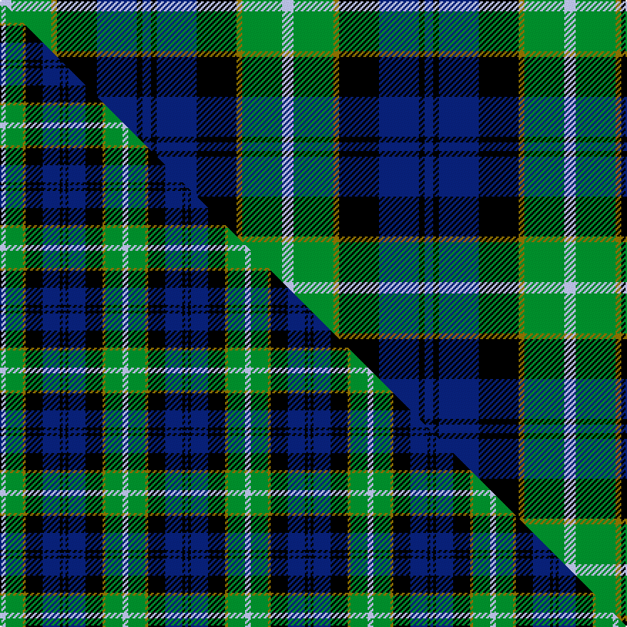

This is one **variant** — a specific cloth: this exact thread count and colourway, with its own
provenance below. It is one weaving of the [sett](/tartans/h/ho/hogarth-of-firhill/) (the scale-free proportion — the
same cloth at any scale or shade), whose colour order is pattern [BKBKGGW](/stripes/bkbkggw/).

Part of the [Hogarth of Firhill](/tartans/h/ho/hogarth-of-firhill/) tartan — the named design grouping this sett with its other cloths.

Sourced from tartans-authority.  It is a [7 stripe tartan](/stripes/stripes7/).

Original link <code>http://www.tartansauthority.com/tartan-ferret/display/198/</code> — retired · [Internet Archive copy](https://web.archive.org/web/*/http://www.tartansauthority.com/tartan-ferret/display/198/*)

## Provenance

Earliest known date: pre 2003 The Lyon Court Books record Bu1, Bk1, Bu6, Bk6, Y1, Gr6, Az2 as the thread count. These figures may be proportionally increased at the weavers discretion.

3 attestations — the source records this cloth was collapsed from (oldest owns this page)

<ul>
<li>pre 1971 — Hogarth of Firhill (Clan) (tartans-authority, <a href="https://web.archive.org/web/*/http://www.tartansauthority.com/tartan-ferret/display/198/*">record</a>)  <em>Registered in the Lyon Court Books No 24, 1st December 1971.Bu1, Bk1, Bu6, Bk6, Y1, Gr6, Az2 as the thread count. These figures may be proportionally increased at the weaver's discretion. Sample in STA Dalgety Collection.</em></li>
<li>pre 2003 — Hogarth of Firhill Family Tartan (house-of-tartan, <a href="http://www.house-of-tartan.scotland.net/house/TartanViewjs.asp?colr=Def&tnam=198">record</a>) </li>
<li>undated — Hogarth, of Firhill (weddslist, <a href="http://www.weddslist.com/cgi-bin/tartans/pg.pl?source=sts">record</a>) </li>
</ul>

Dataset <small>— provenance for this record, inherited from the source manifest</small>

<dl class="dataset-prov">
<dt>source</dt><dd><a href="/sources/tartans-authority/">Scottish Tartans Authority</a></dd>
<dt>data captured from</dt><dd><a href="https://github.com/thetartan/tartan-database/blob/master/data/tartans-authority/data.csv">https://github.com/thetartan/tartan-database/blob/master/data/tartans-authority/data.csv</a></dd>
<dt>data date</dt><dd>pre 1971 <small>(this record)</small></dd>
<dt>licence</dt><dd><a href="https://creativecommons.org/licenses/by-nc-nd/4.0/">CC BY-NC-ND 4.0</a></dd>
</dl>

Capture chain <small>— the hands this data passed through, oldest first; each capture carries its own licence</small>

<ol class="capture-chain">
<li><a href="https://www.tartansauthority.com/">Scottish Tartans Authority</a> <small>the heritage body’s archive — its tartan-ferret record browser is retired; dead record links are shown unlinked, with an Internet Archive copy (ITI numbers are not SRT references)</small></li>
<li><a href="https://github.com/thetartan/tartan-database">thetartan/tartan-database</a> <small>2016-2017</small> · <a href="https://creativecommons.org/licenses/by-nc-nd/4.0/">CC BY-NC-ND 4.0</a> <small>Levko Kravets's frozen compilation — the capture we vendored, and where its CC licence text came from</small></li>
<li>this dictionary <small>captured 2026-06-10 · commit 5bf86c7566</small> <small>each re-capture is a git commit to data/sources</small></li>
</ol>

## Register references

External register numbers recorded for this tartan.

- Scottish Tartans Authority (ITI): 198

## Thread count
LB/8 G28 Y4 K28 DB28 K4 DB/6

One full sett is **198 threads**.

## Palette
<table><thead><tr><th>Colour</th><th>Shade</th><th>OKLCh</th></tr></thead><tbody><tr><td>LB</td><td><code style="background-color:#B5BBDE;">#B5BBDE</code> <small style="color:#888">#B5BBDE</small></td><td><small style="color:#888">oklch(79.9% 0.050 277.6)</small></td></tr><tr><td>DB</td><td><code style="background-color:#082077;">#082077</code> <small style="color:#888">#082077</small></td><td><small style="color:#888">oklch(30.0% 0.149 265.1)</small></td></tr><tr><td>G</td><td><code style="background-color:#008B2A;">#008B2A</code> <small style="color:#888">#008B2A</small></td><td><small style="color:#888">oklch(55.4% 0.170 145.9)</small></td></tr><tr><td>K</td><td><code style="background-color:#000000;">#000000</code> <small style="color:#888">#000000</small></td><td><small style="color:#888">oklch(0.0% 0.000 0.0)</small></td></tr><tr><td>Y</td><td><code style="background-color:#8B6E00;">#8B6E00</code> <small style="color:#888">#8B6E00</small></td><td><small style="color:#888">oklch(55.1% 0.113 90.4)</small></td></tr></tbody></table>

# Sample pattern

## Compared to the master

This cloth is one sett of its design; the master sett (the exemplar the design is anchored on) is below for comparison.

Its **ΔTartan distance** from the master is **0.21** — the same measure the nearest-tartans table ranks by (0 is identical; a re-scale of the same cloth is near 0, a recolour or a different proportion further).

<figure class="master-compare" style="margin:0">

this sett
master sett ★

<figcaption style="color:#888;font-size:smaller">One weave of this sett against the <a href="/setts/lb2g6y1k6db6k1db1/">master sett ★</a>, split on the diagonal: a shared proportion runs seamlessly across it with only the shades shifting; a different proportion breaks on it.</figcaption>
</figure>

## Nearest tartan variants

The nearest existing variants by ΔTartan distance, with this cloth at the top so the swatches line up against it.

ΔTartan

Threads

Variant

Sett

—

198

<a href="/variants/s7/lb4g14y2k14db14k2db3~x2/">Hogarth of Firhill (Clan)</a>

<a href="/ttd/edit/#slug=lb2g6y1k6db6k1db1~x2&amp;base=lb4g14y2k14db14k2db3~x2" title="compare in the TTD">0.21</a>

86

<a href="/variants/s7/lb2g6y1k6db6k1db1~x2/">Hogarth of Firhill</a>

<a href="/ttd/edit/#slug=b2g6y1k6db6k1db1~x2&amp;base=lb4g14y2k14db14k2db3~x2" title="compare in the TTD">0.25</a>

86

<a href="/variants/s7/b2g6y1k6db6k1db1~x2/">Hogarth, of Firhill</a>

<a href="/ttd/edit/#slug=r2g8w1k8db8k1db1~x4&amp;base=lb4g14y2k14db14k2db3~x2" title="compare in the TTD">0.81</a>

220

<a href="/variants/s7/r2g8w1k8db8k1db1~x4/">Colquhoun</a>

<a href="/ttd/edit/#slug=r2g8w1k8db8k1db1~x2&amp;base=lb4g14y2k14db14k2db3~x2" title="compare in the TTD">0.81</a>

110

<a href="/variants/s7/r2g8w1k8db8k1db1~x2/">Colquhoun</a>

<a href="/ttd/edit/#slug=r3g16w2k16db16k2db2~x2&amp;base=lb4g14y2k14db14k2db3~x2" title="compare in the TTD">0.81</a>

218

<a href="/variants/s7/r3g16w2k16db16k2db2~x2/">Colquhoun Clan Tartan</a>

<a href="/ttd/edit/#slug=y5g16k16db16k2db2~x2&amp;base=lb4g14y2k14db14k2db3~x2" title="compare in the TTD">0.81</a>

214

<a href="/variants/s6/y5g16k16db16k2db2~x2/">Hudson Valley Reg. Police P &amp; D (Cor</a>

<a href="/ttd/edit/#slug=db2k2db12k11g12w2~x2&amp;base=lb4g14y2k14db14k2db3~x2" title="compare in the TTD">0.83</a>

156

<a href="/variants/s6/db2k2db12k11g12w2~x2/">Campbell, The White Stripe</a>

<a href="/ttd/edit/#slug=r2g8w1k8t8k1t1~x6&amp;base=lb4g14y2k14db14k2db3~x2" title="compare in the TTD">0.84</a>

330

<a href="/variants/s7/r2g8w1k8t8k1t1~x6/">Colquhoun #2</a>

<a href="/ttd/edit/#slug=db20k6dy4db3k16g20w2~x2&amp;base=lb4g14y2k14db14k2db3~x2" title="compare in the TTD">1.43</a>

240

<a href="/variants/s7/db20k6dy4db3k16g20w2~x2/">Deloughery, Paul</a>

<a href="/ttd/edit/#slug=b4g17k17db17r3db3~x2&amp;base=lb4g14y2k14db14k2db3~x2" title="compare in the TTD">1.60</a>

230

<a href="/variants/s6/b4g17k17db17r3db3~x2/">Royal Highland</a>

## Neighbour map

Every grey dot is one of 13662 variants placed by the first two principal components of the ΔTartan feature space (42% of its variance). Red is this tartan; blue dots are its nearest — click one to open its page. The map is a flat projection of a many-dimensional space — [how to read it](/posts/neighbourhood-maps/).

<svg viewBox="0 0 640 380" role="img" style="max-width:100%;height:auto;border:1px solid #e0e0e0;border-radius:4px;display:block" xmlns="http://www.w3.org/2000/svg"><image href="/nn/cloud.v1.png" width="640" height="380"/><a href="/variants/s7/lb2g6y1k6db6k1db1~x2/"><circle cx="79.5" cy="207.2" r="4" fill="#3465a4"><title>Hogarth of Firhill</title></circle></a><a href="/variants/s7/b2g6y1k6db6k1db1~x2/"><circle cx="89.1" cy="210.5" r="4" fill="#3465a4"><title>Hogarth, of Firhill</title></circle></a><a href="/variants/s7/r2g8w1k8db8k1db1~x4/"><circle cx="102.4" cy="188.1" r="4" fill="#3465a4"><title>Colquhoun</title></circle></a><a href="/variants/s7/r2g8w1k8db8k1db1~x2/"><circle cx="102.4" cy="188.1" r="4" fill="#3465a4"><title>Colquhoun</title></circle></a><a href="/variants/s7/r3g16w2k16db16k2db2~x2/"><circle cx="108.4" cy="186.1" r="4" fill="#3465a4"><title>Colquhoun Clan Tartan</title></circle></a><a href="/variants/s6/y5g16k16db16k2db2~x2/"><circle cx="126.6" cy="221.8" r="4" fill="#3465a4"><title>Hudson Valley Reg. Police P &amp; D (Cor</title></circle></a><a href="/variants/s6/db2k2db12k11g12w2~x2/"><circle cx="123.6" cy="227.8" r="4" fill="#3465a4"><title>Campbell, The White Stripe</title></circle></a><a href="/variants/s7/r2g8w1k8t8k1t1~x6/"><circle cx="97.1" cy="189.8" r="4" fill="#3465a4"><title>Colquhoun #2</title></circle></a><a href="/variants/s7/db20k6dy4db3k16g20w2~x2/"><circle cx="115.6" cy="187.7" r="4" fill="#3465a4"><title>Deloughery, Paul</title></circle></a><a href="/variants/s6/b4g17k17db17r3db3~x2/"><circle cx="96.4" cy="222.1" r="4" fill="#3465a4"><title>Royal Highland</title></circle></a><circle cx="94.7" cy="200.0" r="5" fill="#c00000"/><text x="320" y="376" text-anchor="middle" font-size="11" fill="#999">ground</text><text x="11" y="190" text-anchor="middle" font-size="11" fill="#999" transform="rotate(-90 11 190)">complexity</text></svg>

ID: /variants/s7/lb4g14y2k14db14k2db3~x2/
