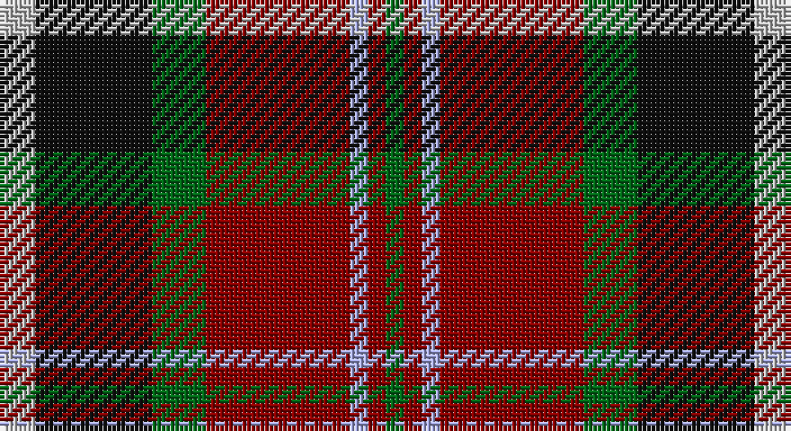

This page is one **sett** — a single exact thread-count. It belongs to the [tartan](/setts/lb4k13g6r16lbi2r2g2/)
(the same proportion at any scale), whose colour order is pattern [GRWRGKW](/stripes/grwrgkw/).

Part of the [Caledonian Brewery](/tartans/caledonian-brewery/) tartan — the named design grouping this sett with its other cloths.

Sourced from house-of-tartan.  It is a [7 stripe tartan](/stripes/stripes7/).

Original link http://www.house-of-tartan.scotland.net/house/TartanViewjs.asp?colr=Def&tnam=2315

## Provenance

Earliest known date: pre 1997 Designed by Kinloch Anderson Ltd to commemorate the opening of the new Caledonian Brewery Malting Building.

## Thread count
N/8 K26 G12 DR32 LP4 DR4 G/4

One full sett is **168 threads**.

## Palette

Palette: <strong>Tartan Register</strong>
<table><thead><tr><th>Colour</th><th>Threads</th><th>Shade</th><th>Base</th><th>OKLCh</th></tr></thead><tbody><tr><td>N/</td><td style="text-align:right;font-variant-numeric:tabular-nums">8</td><td><code style="background-color:#C0C0C0;">#C0C0C0</code> <small style="color:#888">#C0C0C0</small></td><td>W <code style="background-color:#F7F7F7;">#F7F7F7</code></td><td><small style="color:#888">oklch(80.8% 0.000 89.9)</small></td></tr><tr><td>K</td><td style="text-align:right;font-variant-numeric:tabular-nums">26</td><td><code style="background-color:#101010;">#101010</code> <small style="color:#888">#101010</small></td><td>K <code style="background-color:#000000;">#000000</code></td><td><small style="color:#888">oklch(17.3% 0.000 89.9)</small></td></tr><tr><td>G</td><td style="text-align:right;font-variant-numeric:tabular-nums">12</td><td><code style="background-color:#006818;">#006818</code> <small style="color:#888">#006818</small></td><td>G <code style="background-color:#006100;">#006100</code></td><td><small style="color:#888">oklch(45.0% 0.142 145.0)</small></td></tr><tr><td>DR</td><td style="text-align:right;font-variant-numeric:tabular-nums">32</td><td><code style="background-color:#880000;">#880000</code> <small style="color:#888">#880000</small></td><td>R <code style="background-color:#CC0000;">#CC0000</code></td><td><small style="color:#888">oklch(39.4% 0.162 29.2)</small></td></tr><tr><td>LP</td><td style="text-align:right;font-variant-numeric:tabular-nums">4</td><td><code style="background-color:#A8ACE8;">#A8ACE8</code> <small style="color:#888">#A8ACE8</small></td><td>W <code style="background-color:#F7F7F7;">#F7F7F7</code></td><td><small style="color:#888">oklch(76.3% 0.086 281.2)</small></td></tr><tr><td>DR</td><td style="text-align:right;font-variant-numeric:tabular-nums">4</td><td><code style="background-color:#880000;">#880000</code> <small style="color:#888">#880000</small></td><td>R <code style="background-color:#CC0000;">#CC0000</code></td><td><small style="color:#888">oklch(39.4% 0.162 29.2)</small></td></tr><tr><td>G/</td><td style="text-align:right;font-variant-numeric:tabular-nums">4</td><td><code style="background-color:#006818;">#006818</code> <small style="color:#888">#006818</small></td><td>G <code style="background-color:#006100;">#006100</code></td><td><small style="color:#888">oklch(45.0% 0.142 145.0)</small></td></tr></tbody></table>

# Sample pattern

## Compared to the master

This cloth is one sett of its design; the master sett (the exemplar the design is anchored on) is below for comparison.

<figure style="margin:0"><figcaption style="color:#888;font-size:smaller">this sett</figcaption></figure>
<figure style="margin:0"><figcaption style="color:#888;font-size:smaller"><a href="/setts/w4dg20dgi10r25b2r2dgi2/">master sett →</a></figcaption></figure>

## Nearest tartans

The nearest existing variants by ΔTartan distance, with this tartan at the top so the swatches line up against it.

ΔTartan

Tartan

Sett

—

<a href="/ttd/edit/#slug=lb4k13g6r16lbi2r2g2~x2">Caledonian Brewery Corporate Tartan</a> <a class="nn-out" href="/variants/s7/lb4k13g6r16lbi2r2g2~x2/" title="open its dictionary page">↗</a>

0.78

<a href="/ttd/edit/#slug=k10ly2dg11r11w1r1w1k9~x2&amp;base=lb4k13g6r16lbi2r2g2~x2">Unidentified No 5</a> <a class="nn-out" href="/variants/s8/k10ly2dg11r11w1r1w1k9~x2/" title="open its dictionary page">↗</a>

0.81

<a href="/ttd/edit/#slug=lb4dg13g6r16lbi2r2g2~x2&amp;base=lb4k13g6r16lbi2r2g2~x2">Caledonian Brewery (Corporate)</a> <a class="nn-out" href="/variants/s7/lb4dg13g6r16lbi2r2g2~x2/" title="open its dictionary page">↗</a>

0.84

<a href="/ttd/edit/#slug=lb1k1r10g10k5lb5r10k1lb1~x4&amp;base=lb4k13g6r16lbi2r2g2~x2">Graham of Montrose Red</a> <a class="nn-out" href="/variants/s9/lb1k1r10g10k5lb5r10k1lb1~x4/" title="open its dictionary page">↗</a>

0.99

<a href="/ttd/edit/#slug=r12dbi3g5db16ly2g2~x2&amp;base=lb4k13g6r16lbi2r2g2~x2">Dunbog Primary School Corporate Tartan</a> <a class="nn-out" href="/variants/s6/r12dbi3g5db16ly2g2~x2/" title="open its dictionary page">↗</a>

0.99

<a href="/ttd/edit/#slug=ri21r3ri3r3ri3db19g22lt3~x2&amp;base=lb4k13g6r16lbi2r2g2~x2">Akins Clan (Personal)</a> <a class="nn-out" href="/variants/s8/ri21r3ri3r3ri3db19g22lt3~x2/" title="open its dictionary page">↗</a>

1.00

<a href="/ttd/edit/#slug=o56k12o7k12o7g50db50ly10&amp;base=lb4k13g6r16lbi2r2g2~x2">Sikh</a> <a class="nn-out" href="/variants/s8/o56k12o7k12o7g50db50ly10/" title="open its dictionary page">↗</a>

1.01

<a href="/ttd/edit/#slug=o4ly2o21dy11w2k20r3~x2&amp;base=lb4k13g6r16lbi2r2g2~x2">Barbour - Classic</a> <a class="nn-out" href="/variants/s7/o4ly2o21dy11w2k20r3~x2/" title="open its dictionary page">↗</a>

1.04

<a href="/ttd/edit/#slug=r3k20w2dy11o21ly2o2~x2&amp;base=lb4k13g6r16lbi2r2g2~x2">Barbour</a> <a class="nn-out" href="/variants/s7/r3k20w2dy11o21ly2o2~x2/" title="open its dictionary page">↗</a>

1.04

<a href="/ttd/edit/#slug=g1r9g3k3g3r1k9w1~x2&amp;base=lb4k13g6r16lbi2r2g2~x2">Manson Family Tartan</a> <a class="nn-out" href="/variants/s8/g1r9g3k3g3r1k9w1~x2/" title="open its dictionary page">↗</a>

1.05

<a href="/ttd/edit/#slug=k6db3dg20r20ly3~x2&amp;base=lb4k13g6r16lbi2r2g2~x2">Douglas of Roxburgh</a> <a class="nn-out" href="/variants/s5/k6db3dg20r20ly3~x2/" title="open its dictionary page">↗</a>

## Neighbour map

Every grey dot is one of 14360 variants placed by the first two principal components of the ΔTartan feature space (44% of its variance). Red is this tartan; blue dots are its nearest — click one to open its page.

<svg viewBox="0 0 640 380" role="img" style="max-width:100%;height:auto;border:1px solid #e0e0e0;border-radius:4px;display:block" xmlns="http://www.w3.org/2000/svg"><image href="/nn/cloud.v1.png" width="640" height="380"/><a href="/variants/s8/k10ly2dg11r11w1r1w1k9~x2/"><circle cx="173.7" cy="170.9" r="4" fill="#3465a4"><title>Unidentified No 5</title></circle></a><a href="/variants/s7/lb4dg13g6r16lbi2r2g2~x2/"><circle cx="185.0" cy="198.0" r="4" fill="#3465a4"><title>Caledonian Brewery (Corporate)</title></circle></a><a href="/variants/s9/lb1k1r10g10k5lb5r10k1lb1~x4/"><circle cx="198.3" cy="173.1" r="4" fill="#3465a4"><title>Graham of Montrose Red</title></circle></a><a href="/variants/s6/r12dbi3g5db16ly2g2~x2/"><circle cx="180.0" cy="200.4" r="4" fill="#3465a4"><title>Dunbog Primary School Corporate Tartan</title></circle></a><a href="/variants/s8/ri21r3ri3r3ri3db19g22lt3~x2/"><circle cx="145.3" cy="182.3" r="4" fill="#3465a4"><title>Akins Clan (Personal)</title></circle></a><a href="/variants/s8/o56k12o7k12o7g50db50ly10/"><circle cx="142.3" cy="189.5" r="4" fill="#3465a4"><title>Sikh</title></circle></a><a href="/variants/s7/o4ly2o21dy11w2k20r3~x2/"><circle cx="172.0" cy="161.4" r="4" fill="#3465a4"><title>Barbour - Classic</title></circle></a><a href="/variants/s7/r3k20w2dy11o21ly2o2~x2/"><circle cx="166.7" cy="156.9" r="4" fill="#3465a4"><title>Barbour</title></circle></a><a href="/variants/s8/g1r9g3k3g3r1k9w1~x2/"><circle cx="202.7" cy="193.3" r="4" fill="#3465a4"><title>Manson Family Tartan</title></circle></a><a href="/variants/s5/k6db3dg20r20ly3~x2/"><circle cx="164.1" cy="210.7" r="4" fill="#3465a4"><title>Douglas of Roxburgh</title></circle></a><circle cx="171.7" cy="189.2" r="5" fill="#c00000"/></svg>

ID: /variants/s7/lb4k13g6r16lbi2r2g2~x2/
