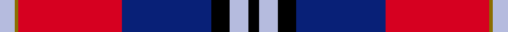
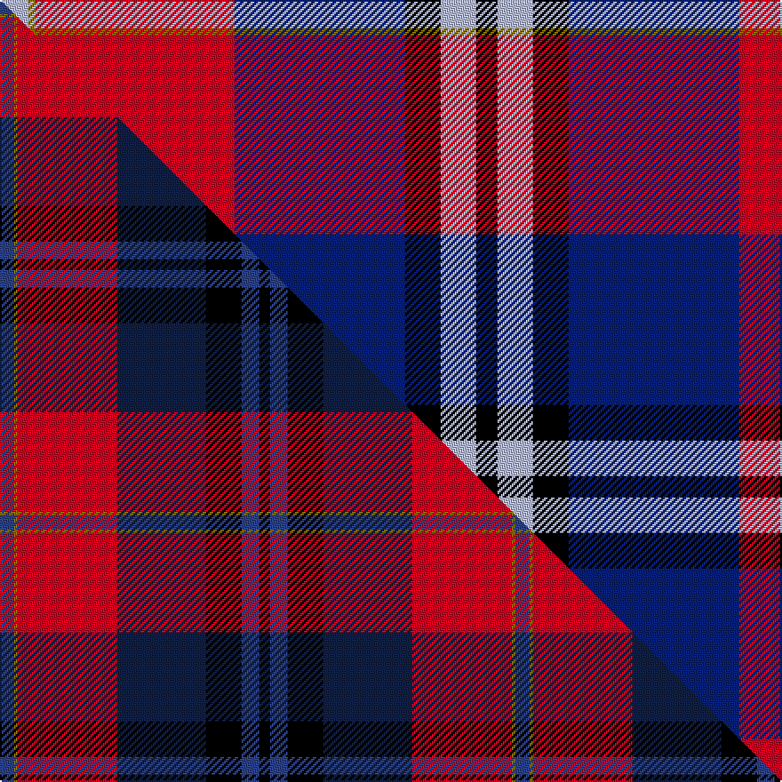

This page is one **sett** — a single exact thread-count. It belongs to the [tartan](/setts/lb4y1r28db24k5lb5k3/)
(the same proportion at any scale), whose colour order is pattern [KWKBRGW](/stripes/kwkbrgw/).

Part of the [McKnight](/tartans/mcknight/) tartan — the named design grouping this sett with its other cloths.

Sourced from register-of-tartans.  It is a [7 stripe tartan](/stripes/stripes7/).

Original link https://www.tartanregister.gov.uk/tartanDetails.aspx?ref=2893

2 attestations — the source records this cloth was collapsed from (oldest owns this page)

<ul>
<li>01/01/2004 — McKnight #2 (Personal) (register-of-tartans, <a href="https://www.tartanregister.gov.uk/tartanDetails.aspx?ref=2893">record</a>)  <em>A personal tartan for the McKnight family from Bearsden - an outskirt of Glasgow.</em></li>
<li>pre 2004 — McKnight (Personal) (tartans-authority, <a href="http://www.tartansauthority.com/tartan-ferret/display/6213/">record</a>)  <em>A personal tartan for the McKnight family from Bearsden - an outskirt of Glasgow.</em></li>
</ul>

## Register references

External register numbers recorded for this tartan.

- Scottish Register of Tartans: [2893](https://www.tartanregister.gov.uk/tartanDetails.aspx?ref=2893)
- Scottish Tartans Authority (ITI): 6213

## Thread count
LB/16 Y4 R112 DB96 K20 LB20 K/12

One full sett is **532 threads**.

## Palette
<table><thead><tr><th>Colour</th><th>Shade</th><th>OKLCh</th></tr></thead><tbody><tr><td>LB</td><td><code style="background-color:#B5BBDE;">#B5BBDE</code> <small style="color:#888">#B5BBDE</small></td><td><small style="color:#888">oklch(79.9% 0.050 277.6)</small></td></tr><tr><td>DB</td><td><code style="background-color:#082077;">#082077</code> <small style="color:#888">#082077</small></td><td><small style="color:#888">oklch(30.0% 0.149 265.1)</small></td></tr><tr><td>K</td><td><code style="background-color:#000000;">#000000</code> <small style="color:#888">#000000</small></td><td><small style="color:#888">oklch(0.0% 0.000 0.0)</small></td></tr><tr><td>R</td><td><code style="background-color:#D60020;">#D60020</code> <small style="color:#888">#D60020</small></td><td><small style="color:#888">oklch(55.2% 0.224 25.5)</small></td></tr><tr><td>Y</td><td><code style="background-color:#8B6E00;">#8B6E00</code> <small style="color:#888">#8B6E00</small></td><td><small style="color:#888">oklch(55.1% 0.113 90.4)</small></td></tr></tbody></table>

# Sample pattern

## Compared to the master

This cloth is one sett of its design; the master sett (the exemplar the design is anchored on) is below for comparison.

Its **ΔTartan distance** from the master is **0.96** — the same measure the nearest-tartans table ranks by (0 is identical; a re-scale of the same cloth is near 0, a recolour or a different proportion further).

<figure class="master-compare" style="margin:0">

this sett
master sett ★

<figcaption style="color:#888;font-size:smaller">One weave of this sett against the <a href="/setts/dbi4y1r28db25k10dbi5k3/">master sett ★</a>, split on the diagonal: a shared proportion runs seamlessly across it with only the shades shifting; a different proportion breaks on it.</figcaption>
</figure>

## Nearest variants

The nearest existing variants by ΔTartan distance, with this cloth at the top so the swatches line up against it.

ΔTartan

Threads

Variant

Sett

—

532

<a href="/variants/s7/lb4y1r28db24k5lb5k3~x4/">McKnight #2 (Personal)</a>

<a href="/ttd/edit/#slug=dbi4y1r28db25k10dbi5k3~x2~dbi1605267-db1003265&amp;base=lb4y1r28db24k5lb5k3~x4" title="compare in the TTD">0.11</a>

290

<a href="/variants/s7/dbi4y1r28db25k10dbi5k3~x2~dbi1605267-db1003265/">McKnight (Personal)</a>

<a href="/ttd/edit/#slug=g3k24ly1r18db18w1~x2&amp;base=lb4y1r28db24k5lb5k3~x4" title="compare in the TTD">1.38</a>

252

<a href="/variants/s6/g3k24ly1r18db18w1~x2/">Hegarty, Philip David (Personal)</a>

<a href="/ttd/edit/#slug=db4y1w10r28db25k10lb5k3~x4&amp;base=lb4y1r28db24k5lb5k3~x4" title="compare in the TTD">1.49</a>

660

<a href="/variants/s8/db4y1w10r28db25k10lb5k3~x4/">McKnight Dress #2 (Personal)</a>

<a href="/ttd/edit/#slug=r27db4k4db4k4lb6y1~x4&amp;base=lb4y1r28db24k5lb5k3~x4" title="compare in the TTD">1.90</a>

288

<a href="/variants/s7/r27db4k4db4k4lb6y1~x4/">MacLeay</a>

<a href="/ttd/edit/#slug=w2db27k1g3k1n10k1r24w2~x2&amp;base=lb4y1r28db24k5lb5k3~x4" title="compare in the TTD">1.96</a>

276

<a href="/variants/s9/w2db27k1g3k1n10k1r24w2~x2/">Scotland's Charity Air Ambulance</a>

<a href="/ttd/edit/#slug=k4db32r30db2w5k2~x2&amp;base=lb4y1r28db24k5lb5k3~x4" title="compare in the TTD">2.20</a>

288

<a href="/variants/s6/k4db32r30db2w5k2~x2/">Masai Shuka 17 (Artefact)</a>

<a href="/ttd/edit/#slug=k2y1k2y8r29n9db24w2db2~x2&amp;base=lb4y1r28db24k5lb5k3~x4" title="compare in the TTD">2.33</a>

308

<a href="/variants/s9/k2y1k2y8r29n9db24w2db2~x2/">Lermontov</a>

2.33

—

<a href="/variants/s9/k2dy1k2dy8r29n9db24w2db2~x2~db1204274/">Lermontov Family Tartan</a>

2.52

—

<a href="/variants/s7/k2dbi2r16db2y1db13w2~x2~dbi1604274-db0805267/">Wishart, dress</a>

2.52

—

<a href="/variants/s7/k2dbi2r16db2y1db13w2~x2~dbi1406275-db1204274/">Wishart Dress Family Tartan</a>

## Neighbour map

Every grey dot is one of 13620 variants placed by the first two principal components of the ΔTartan feature space (42% of its variance). Red is this tartan; blue dots are its nearest — click one to open its page.

<svg viewBox="0 0 640 380" role="img" style="max-width:100%;height:auto;border:1px solid #e0e0e0;border-radius:4px;display:block" xmlns="http://www.w3.org/2000/svg"><image href="/nn/cloud.v1.png" width="640" height="380"/><a href="/variants/s7/dbi4y1r28db25k10dbi5k3~x2~dbi1605267-db1003265/"><circle cx="202.1" cy="128.0" r="4" fill="#3465a4"><title>McKnight (Personal)</title></circle></a><a href="/variants/s6/g3k24ly1r18db18w1~x2/"><circle cx="156.4" cy="126.4" r="4" fill="#3465a4"><title>Hegarty, Philip David (Personal)</title></circle></a><a href="/variants/s8/db4y1w10r28db25k10lb5k3~x4/"><circle cx="130.7" cy="107.3" r="4" fill="#3465a4"><title>McKnight Dress #2 (Personal)</title></circle></a><a href="/variants/s7/r27db4k4db4k4lb6y1~x4/"><circle cx="271.5" cy="102.2" r="4" fill="#3465a4"><title>MacLeay</title></circle></a><a href="/variants/s9/w2db27k1g3k1n10k1r24w2~x2/"><circle cx="187.9" cy="84.9" r="4" fill="#3465a4"><title>Scotland's Charity Air Ambulance</title></circle></a><a href="/variants/s6/k4db32r30db2w5k2~x2/"><circle cx="242.3" cy="147.6" r="4" fill="#3465a4"><title>Masai Shuka 17 (Artefact)</title></circle></a><a href="/variants/s9/k2y1k2y8r29n9db24w2db2~x2/"><circle cx="187.6" cy="91.8" r="4" fill="#3465a4"><title>Lermontov</title></circle></a><a href="/variants/s9/k2dy1k2dy8r29n9db24w2db2~x2~db1204274/"><circle cx="195.9" cy="93.2" r="4" fill="#3465a4"><title>Lermontov Family Tartan</title></circle></a><a href="/variants/s7/k2dbi2r16db2y1db13w2~x2~dbi1604274-db0805267/"><circle cx="193.4" cy="119.2" r="4" fill="#3465a4"><title>Wishart, dress</title></circle></a><a href="/variants/s7/k2dbi2r16db2y1db13w2~x2~dbi1406275-db1204274/"><circle cx="208.1" cy="123.0" r="4" fill="#3465a4"><title>Wishart Dress Family Tartan</title></circle></a><circle cx="207.9" cy="116.8" r="5" fill="#c00000"/><text x="320" y="376" text-anchor="middle" font-size="11" fill="#999">ground</text><text x="11" y="190" text-anchor="middle" font-size="11" fill="#999" transform="rotate(-90 11 190)">complexity</text></svg>

ID: /variants/s7/lb4y1r28db24k5lb5k3~x4/
