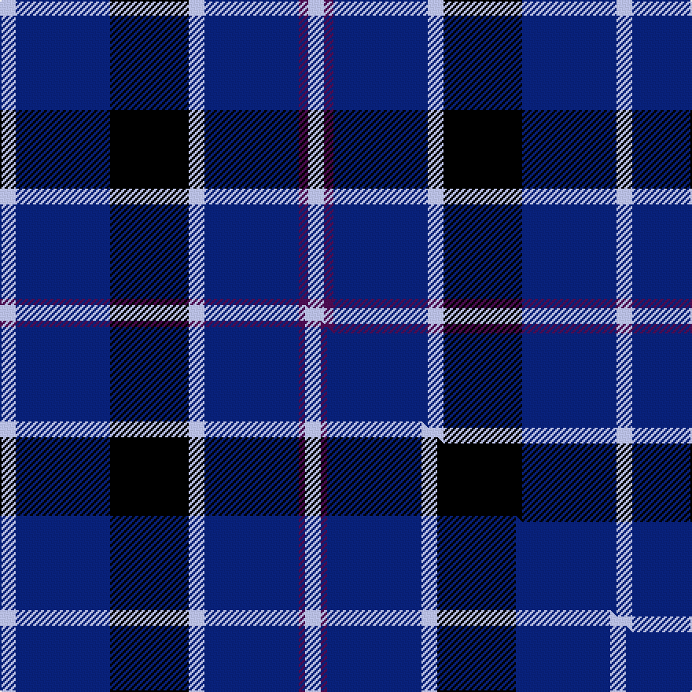

This is one **variant** — a specific cloth: this exact thread count and colourway, with its own
provenance below. It is one weaving of the [sett](/setts/lb5db30k25lb5db30dp3lb5/) (the scale-free proportion — the
same cloth at any scale or shade), whose colour order is pattern [WBBWKBW](/stripes/wbbwkbw/).

Part of the [Van Loo](/tartans/van-loo/) tartan — the named design grouping this sett with its other cloths.

Sourced from house-of-tartan.  It is a [7 stripe tartan](/stripes/stripes7/).

Original link [http://www.house-of-tartan.scotland.net/house/TartanViewjs.asp?colr=Def&tnam=6717](http://www.house-of-tartan.scotland.net/house/TartanViewjs.asp?colr=Def&tnam=6717)

## Provenance

Earliest known date: pre 2005 Nothing

Dataset <small>— provenance for this record, inherited from the source manifest</small>

<dl class="dataset-prov">
<dt>source</dt><dd><a href="/sources/house-of-tartan/">House of Tartan</a></dd>
<dt>data captured from</dt><dd><a href="https://github.com/thetartan/tartan-database/blob/master/data/house-of-tartan/data.csv">https://github.com/thetartan/tartan-database/blob/master/data/house-of-tartan/data.csv</a></dd>
<dt>data date</dt><dd>pre 2005 <small>(this record)</small></dd>
<dt>licence</dt><dd><a href="https://creativecommons.org/licenses/by-nc-nd/4.0/">CC BY-NC-ND 4.0</a></dd>
</dl>

Capture chain <small>— the hands this data passed through, oldest first; each capture carries its own licence</small>

<ol class="capture-chain">
<li><a href="http://www.house-of-tartan.scotland.net/">House of Tartan</a> <small>the weaver/retailer's database — the site is now offline; the URL is kept as the ultimate source's identity</small></li>
<li><a href="https://github.com/thetartan/tartan-database">thetartan/tartan-database</a> <small>2016-2017</small> · <a href="https://creativecommons.org/licenses/by-nc-nd/4.0/">CC BY-NC-ND 4.0</a> <small>Levko Kravets's frozen compilation — the capture we vendored, and where its CC licence text came from</small></li>
<li>this dictionary <small>captured 2026-06-10 · commit 5bf86c7566</small> <small>each re-capture is a git commit to data/sources</small></li>
</ol>

## Thread count
LB/10 DB60 K50 LB10 DB60 DP6 LB/10

One full sett is **392 threads**.

## Palette
<table><thead><tr><th>Colour</th><th>Shade</th><th>OKLCh</th></tr></thead><tbody><tr><td>LB</td><td><code style="background-color:#B5BBDE;">#B5BBDE</code> <small style="color:#888">#B5BBDE</small></td><td><small style="color:#888">oklch(79.9% 0.050 277.6)</small></td></tr><tr><td>DB</td><td><code style="background-color:#082077;">#082077</code> <small style="color:#888">#082077</small></td><td><small style="color:#888">oklch(30.0% 0.149 265.1)</small></td></tr><tr><td>K</td><td><code style="background-color:#000000;">#000000</code> <small style="color:#888">#000000</small></td><td><small style="color:#888">oklch(0.0% 0.000 0.0)</small></td></tr><tr><td>DP</td><td><code style="background-color:#4B0B4F;">#4B0B4F</code> <small style="color:#888">#4B0B4F</small></td><td><small style="color:#888">oklch(30.1% 0.125 325.4)</small></td></tr></tbody></table>

# Sample pattern

## Compared to the master

This cloth is one sett of its design; the master sett (the exemplar the design is anchored on) is below for comparison.

Its **ΔTartan distance** from the master is **0.38** — the same measure the nearest-tartans table ranks by (0 is identical; a re-scale of the same cloth is near 0, a recolour or a different proportion further).

<figure class="master-compare" style="margin:0">

this sett
master sett ★

<figcaption style="color:#888;font-size:smaller">One weave of this sett against the <a href="/setts/lb5db30k25lb5db30dp2lb5/">master sett ★</a>, split on the diagonal: a shared proportion runs seamlessly across it with only the shades shifting; a different proportion breaks on it.</figcaption>
</figure>

## Nearest tartan variants

The nearest existing variants by ΔTartan distance, with this cloth at the top so the swatches line up against it.

ΔTartan

Threads

Variant

Sett

—

392

<a href="/variants/s7/lb5db30k25lb5db30dp3lb5~x2/">Van Loo Tartan</a>

<a href="/ttd/edit/#slug=lb5db30k25lb5db30dp2lb5~x2&amp;base=lb5db30k25lb5db30dp3lb5~x2" title="compare in the TTD">0.38</a>

388

<a href="/variants/s7/lb5db30k25lb5db30dp2lb5~x2/">Van Loo (Personal)</a>

<a href="/ttd/edit/#slug=lo1db6k5db6lb1~x6&amp;base=lb5db30k25lb5db30dp3lb5~x2" title="compare in the TTD">1.33</a>

216

<a href="/variants/s5/lo1db6k5db6lb1~x6/">Bank of Scotland (1995) (Corporate)</a>

<a href="/ttd/edit/#slug=r1db12k5ly3db5lb1~x4&amp;base=lb5db30k25lb5db30dp3lb5~x2" title="compare in the TTD">1.46</a>

208

<a href="/variants/s6/r1db12k5ly3db5lb1~x4/">Massachusetts (Unofficial)</a>

<a href="/ttd/edit/#slug=y4db24k23db30w4~x2&amp;base=lb5db30k25lb5db30dp3lb5~x2" title="compare in the TTD">1.58</a>

324

<a href="/variants/s5/y4db24k23db30w4~x2/">Bank of Scotland Corporate Tartan</a>

<a href="/ttd/edit/#slug=lo1db6k5db6lb1~x6~db1406275-lb3300000&amp;base=lb5db30k25lb5db30dp3lb5~x2" title="compare in the TTD">1.63</a>

216

<a href="/variants/s5/lo1db6k5db6lb1~x6~db1406275-lb3300000/">Bank of Scotland (1995)</a>

<a href="/ttd/edit/#slug=r6db35k36db36w6&amp;base=lb5db30k25lb5db30dp3lb5~x2" title="compare in the TTD">1.71</a>

226

<a href="/variants/s5/r6db35k36db36w6/">Davidson of Tulloch Clan Tartan</a>

<a href="/ttd/edit/#slug=r1db12k5o3db5w1~x4&amp;base=lb5db30k25lb5db30dp3lb5~x2" title="compare in the TTD">1.76</a>

208

<a href="/variants/s6/r1db12k5o3db5w1~x4/">Massachusetts</a>

<a href="/ttd/edit/#slug=r5db35k25db8ly10r5~x2&amp;base=lb5db30k25lb5db30dp3lb5~x2" title="compare in the TTD">1.87</a>

332

<a href="/variants/s6/r5db35k25db8ly10r5~x2/">University of Notre Dame</a>

<a href="/ttd/edit/#slug=db9k4lb1k4db9r1~x4~db1406275&amp;base=lb5db30k25lb5db30dp3lb5~x2" title="compare in the TTD">2.24</a>

184

<a href="/variants/s6/db9k4lb1k4db9r1~x4~db1406275/">Scottish Nuclear</a>

<a href="/ttd/edit/#slug=lb3k19db24r2db2y2db2~x2&amp;base=lb5db30k25lb5db30dp3lb5~x2" title="compare in the TTD">2.30</a>

206

<a href="/variants/s7/lb3k19db24r2db2y2db2~x2/">Mensa</a>

## Neighbour map

Every grey dot is one of 13621 variants placed by the first two principal components of the ΔTartan feature space (42% of its variance). Red is this tartan; blue dots are its nearest — click one to open its page.

<svg viewBox="0 0 640 380" role="img" style="max-width:100%;height:auto;border:1px solid #e0e0e0;border-radius:4px;display:block" xmlns="http://www.w3.org/2000/svg"><image href="/nn/cloud.v1.png" width="640" height="380"/><a href="/variants/s7/lb5db30k25lb5db30dp2lb5~x2/"><circle cx="292.5" cy="174.7" r="4" fill="#3465a4"><title>Van Loo (Personal)</title></circle></a><a href="/variants/s5/lo1db6k5db6lb1~x6/"><circle cx="289.7" cy="243.1" r="4" fill="#3465a4"><title>Bank of Scotland (1995) (Corporate)</title></circle></a><a href="/variants/s6/r1db12k5ly3db5lb1~x4/"><circle cx="284.6" cy="171.1" r="4" fill="#3465a4"><title>Massachusetts (Unofficial)</title></circle></a><a href="/variants/s5/y4db24k23db30w4~x2/"><circle cx="303.6" cy="231.8" r="4" fill="#3465a4"><title>Bank of Scotland Corporate Tartan</title></circle></a><a href="/variants/s5/lo1db6k5db6lb1~x6~db1406275-lb3300000/"><circle cx="287.3" cy="240.5" r="4" fill="#3465a4"><title>Bank of Scotland (1995)</title></circle></a><a href="/variants/s5/r6db35k36db36w6/"><circle cx="267.5" cy="240.8" r="4" fill="#3465a4"><title>Davidson of Tulloch Clan Tartan</title></circle></a><a href="/variants/s6/r1db12k5o3db5w1~x4/"><circle cx="292.6" cy="170.5" r="4" fill="#3465a4"><title>Massachusetts</title></circle></a><a href="/variants/s6/r5db35k25db8ly10r5~x2/"><circle cx="199.8" cy="208.8" r="4" fill="#3465a4"><title>University of Notre Dame</title></circle></a><a href="/variants/s6/db9k4lb1k4db9r1~x4~db1406275/"><circle cx="331.1" cy="211.5" r="4" fill="#3465a4"><title>Scottish Nuclear</title></circle></a><a href="/variants/s7/lb3k19db24r2db2y2db2~x2/"><circle cx="262.8" cy="147.2" r="4" fill="#3465a4"><title>Mensa</title></circle></a><circle cx="275.2" cy="191.4" r="5" fill="#c00000"/><text x="320" y="376" text-anchor="middle" font-size="11" fill="#999">ground</text><text x="11" y="190" text-anchor="middle" font-size="11" fill="#999" transform="rotate(-90 11 190)">complexity</text></svg>

ID: /variants/s7/lb5db30k25lb5db30dp3lb5~x2/
