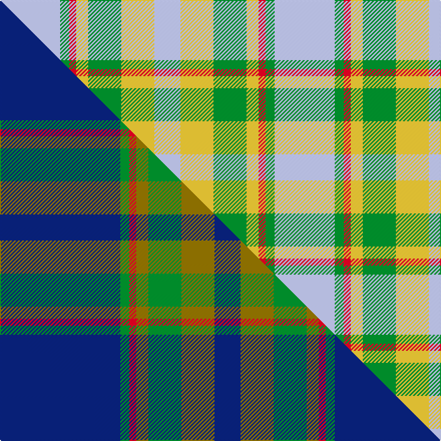

This is one **variant** — a specific cloth: this exact thread count and colourway, with its own
provenance below. It is one weaving of the [sett](/setts/lb60g9r7ly12g33ly33lb26/) (the scale-free proportion — the
same cloth at any scale or shade), whose colour order is pattern [WGRYGYW](/stripes/wgrygyw/).

Part of the [Supporter.com](/tartans/s/su/supporter-com/) tartan — the named design grouping this sett with its other cloths.

Sourced from tartans-authority.  It is a [7 stripe tartan](/stripes/stripes7/).

Original link [https://www.tartanregister.gov.uk/tartanDetails.aspx?ref=11078](https://www.tartanregister.gov.uk/tartanDetails.aspx?ref=11078)

Dataset <small>— provenance for this record, inherited from the source manifest</small>

<dl class="dataset-prov">
<dt>source</dt><dd><a href="/sources/tartans-authority/">Scottish Tartans Authority</a></dd>
<dt>data captured from</dt><dd><a href="https://github.com/thetartan/tartan-database/blob/master/data/tartans-authority/data.csv">https://github.com/thetartan/tartan-database/blob/master/data/tartans-authority/data.csv</a></dd>
<dt>data date</dt><dd>2014 <small>(this record)</small></dd>
<dt>licence</dt><dd><a href="https://creativecommons.org/licenses/by-nc-nd/4.0/">CC BY-NC-ND 4.0</a></dd>
</dl>

Capture chain <small>— the hands this data passed through, oldest first; each capture carries its own licence</small>

<ol class="capture-chain">
<li><a href="https://www.tartansauthority.com/">Scottish Tartans Authority</a> <small>the heritage body's archive — its tartan-ferret record browser is retired (links repaired to the SRT, above)</small></li>
<li><a href="https://github.com/thetartan/tartan-database">thetartan/tartan-database</a> <small>2016-2017</small> · <a href="https://creativecommons.org/licenses/by-nc-nd/4.0/">CC BY-NC-ND 4.0</a> <small>Levko Kravets's frozen compilation — the capture we vendored, and where its CC licence text came from</small></li>
<li>this dictionary <small>captured 2026-06-10 · commit 5bf86c7566</small> <small>each re-capture is a git commit to data/sources</small></li>
</ol>

## Register references

External register numbers recorded for this tartan.

- Scottish Register of Tartans: [11078](https://www.tartanregister.gov.uk/tartanDetails?ref=11078)
- Scottish Tartans Authority (ITI): 11078

## Thread count
LB/60 G9 R7 LY12 G33 LY33 LB/26

One full sett is **274 threads**.

## Palette
<table><thead><tr><th>Colour</th><th>Shade</th><th>OKLCh</th></tr></thead><tbody><tr><td>LB</td><td><code style="background-color:#B5BBDE;">#B5BBDE</code> <small style="color:#888">#B5BBDE</small></td><td><small style="color:#888">oklch(79.9% 0.050 277.6)</small></td></tr><tr><td>G</td><td><code style="background-color:#008B2A;">#008B2A</code> <small style="color:#888">#008B2A</small></td><td><small style="color:#888">oklch(55.4% 0.170 145.9)</small></td></tr><tr><td>R</td><td><code style="background-color:#D60020;">#D60020</code> <small style="color:#888">#D60020</small></td><td><small style="color:#888">oklch(55.2% 0.224 25.5)</small></td></tr><tr><td>LY</td><td><code style="background-color:#DCBC32;">#DCBC32</code> <small style="color:#888">#DCBC32</small></td><td><small style="color:#888">oklch(80.0% 0.150 95.2)</small></td></tr></tbody></table>

# Sample pattern

## Compared to the master

This cloth is one sett of its design; the master sett (the exemplar the design is anchored on) is below for comparison.

Its **ΔTartan distance** from the master is **0.67** — the same measure the nearest-tartans table ranks by (0 is identical; a re-scale of the same cloth is near 0, a recolour or a different proportion further).

<figure class="master-compare" style="margin:0">

this sett
master sett ★

<figcaption style="color:#888;font-size:smaller">One weave of this sett against the <a href="/setts/db120g9r7y12g33y33db26/">master sett ★</a>, split on the diagonal: a shared proportion runs seamlessly across it with only the shades shifting; a different proportion breaks on it.</figcaption>
</figure>

## Nearest tartan variants

The nearest existing variants by ΔTartan distance, with this cloth at the top so the swatches line up against it.

ΔTartan

Threads

Variant

Sett

—

274

<a href="/variants/s7/lb60g9r7ly12g33ly33lb26/">Supporter.com</a>

<a href="/ttd/edit/#slug=lb2o24ly14lb25ly14lb25y20lb2~x2&amp;base=lb60g9r7ly12g33ly33lb26" title="compare in the TTD">3.18</a>

496

<a href="/variants/s8/lb2o24ly14lb25ly14lb25y20lb2~x2/">Froach's Grian</a>

<a href="/ttd/edit/#slug=g4o25g6lb12g12lb3~x2&amp;base=lb60g9r7ly12g33ly33lb26" title="compare in the TTD">3.21</a>

234

<a href="/variants/s6/g4o25g6lb12g12lb3~x2/">Canadian Fancy</a>

<a href="/ttd/edit/#slug=ly8do2ly13r4ly12t22ly5lo3~x2~ly3302138&amp;base=lb60g9r7ly12g33ly33lb26" title="compare in the TTD">3.22</a>

254

<a href="/variants/s8/lg8do2lg13r4lg12t22lg5lo3~x2~lg3302138/">Kildare Irish County Tartan</a>

<a href="/ttd/edit/#slug=lb32o3lb3o3lb3o10g24dr3~x2&amp;base=lb60g9r7ly12g33ly33lb26" title="compare in the TTD">3.47</a>

254

<a href="/variants/s8/lb32o3lb3o3lb3o10g24dr3~x2/">Gammell (Personal)</a>

<a href="/ttd/edit/#slug=n2w2y7o14n2w2~x2~n1900000-o2500000&amp;base=lb60g9r7ly12g33ly33lb26" title="compare in the TTD">3.49</a>

108

<a href="/variants/s6/n2w2y7o14n2w2~x2~n1900000-o2500000/">Cairngorm</a>

<a href="/ttd/edit/#slug=w1o1n4o7lp1w1~x4~o2500000-n1900000&amp;base=lb60g9r7ly12g33ly33lb26" title="compare in the TTD">3.64</a>

112

<a href="/variants/s6/w1o1n4o7lp1w1~x4~o2500000-n1900000/">Lochnagar Plaid (District)</a>

<a href="/ttd/edit/#slug=g3r1g12w4lb15ly1lb3~x4&amp;base=lb60g9r7ly12g33ly33lb26" title="compare in the TTD">3.64</a>

288

<a href="/variants/s7/g3r1g12w4lb15ly1lb3~x4/">Postcode Lottery</a>

<a href="/ttd/edit/#slug=lb12g2lb2g2lb2o8b8o1~x2&amp;base=lb60g9r7ly12g33ly33lb26" title="compare in the TTD">3.65</a>

122

<a href="/variants/s8/lb12g2lb2g2lb2o8b8o1~x2/">Universal, Ancient</a>

<a href="/ttd/edit/#slug=r2ly1t8r1g7ly1r2~x6&amp;base=lb60g9r7ly12g33ly33lb26" title="compare in the TTD">3.69</a>

240

<a href="/variants/s7/r2ly1t8r1g7ly1r2~x6/">Cercle de Fermieres de St-Elie . . .</a>

<a href="/ttd/edit/#slug=t6r6w1r6t6y1~x8~r2607041&amp;base=lb60g9r7ly12g33ly33lb26" title="compare in the TTD">3.74</a>

360

<a href="/variants/s6/t6r6w1r6t6y1~x8~r2607041/">Unidentified Lindley</a>

## Neighbour map

Every grey dot is one of 13621 variants placed by the first two principal components of the ΔTartan feature space (42% of its variance). Red is this tartan; blue dots are its nearest — click one to open its page.

<svg viewBox="0 0 640 380" role="img" style="max-width:100%;height:auto;border:1px solid #e0e0e0;border-radius:4px;display:block" xmlns="http://www.w3.org/2000/svg"><image href="/nn/cloud.v1.png" width="640" height="380"/><a href="/variants/s8/lb2o24ly14lb25ly14lb25y20lb2~x2/"><circle cx="287.9" cy="256.7" r="4" fill="#3465a4"><title>Froach's Grian</title></circle></a><a href="/variants/s6/g4o25g6lb12g12lb3~x2/"><circle cx="301.4" cy="273.3" r="4" fill="#3465a4"><title>Canadian Fancy</title></circle></a><a href="/variants/s8/lg8do2lg13r4lg12t22lg5lo3~x2~lg3302138/"><circle cx="320.8" cy="219.1" r="4" fill="#3465a4"><title>Kildare Irish County Tartan</title></circle></a><a href="/variants/s8/lb32o3lb3o3lb3o10g24dr3~x2/"><circle cx="296.4" cy="199.6" r="4" fill="#3465a4"><title>Gammell (Personal)</title></circle></a><a href="/variants/s6/n2w2y7o14n2w2~x2~n1900000-o2500000/"><circle cx="326.9" cy="250.7" r="4" fill="#3465a4"><title>Cairngorm</title></circle></a><a href="/variants/s6/w1o1n4o7lp1w1~x4~o2500000-n1900000/"><circle cx="347.2" cy="245.9" r="4" fill="#3465a4"><title>Lochnagar Plaid (District)</title></circle></a><a href="/variants/s7/g3r1g12w4lb15ly1lb3~x4/"><circle cx="286.8" cy="190.8" r="4" fill="#3465a4"><title>Postcode Lottery</title></circle></a><a href="/variants/s8/lb12g2lb2g2lb2o8b8o1~x2/"><circle cx="279.0" cy="218.8" r="4" fill="#3465a4"><title>Universal, Ancient</title></circle></a><a href="/variants/s7/r2ly1t8r1g7ly1r2~x6/"><circle cx="241.7" cy="234.1" r="4" fill="#3465a4"><title>Cercle de Fermieres de St-Elie . . .</title></circle></a><a href="/variants/s6/t6r6w1r6t6y1~x8~r2607041/"><circle cx="295.6" cy="281.5" r="4" fill="#3465a4"><title>Unidentified Lindley</title></circle></a><circle cx="292.6" cy="255.1" r="5" fill="#c00000"/><text x="320" y="376" text-anchor="middle" font-size="11" fill="#999">ground</text><text x="11" y="190" text-anchor="middle" font-size="11" fill="#999" transform="rotate(-90 11 190)">complexity</text></svg>

ID: /variants/s7/lb60g9r7ly12g33ly33lb26/
