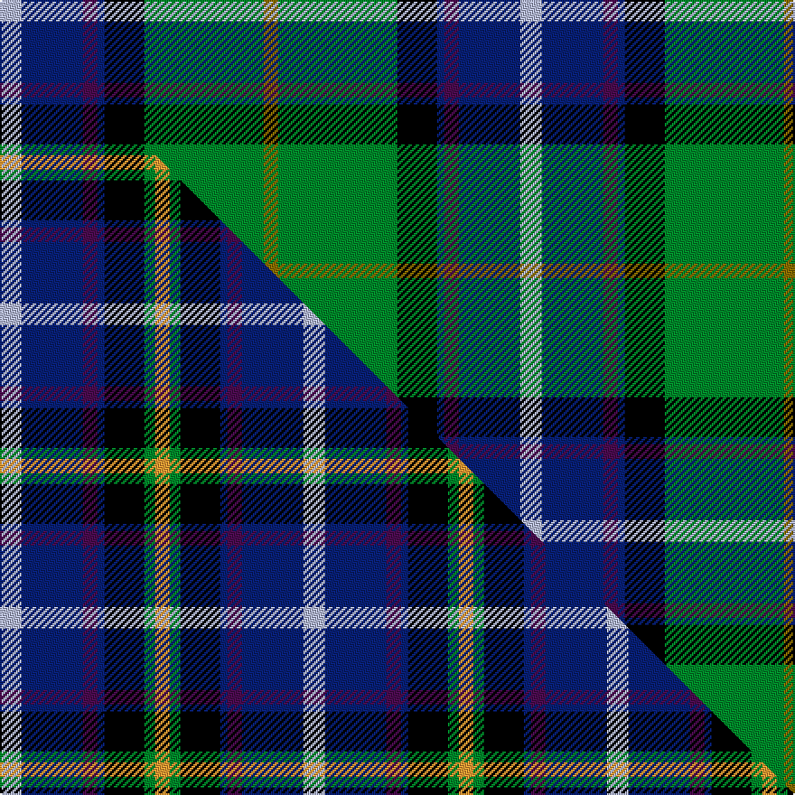

This page is one **sett** — a single exact thread-count. It belongs to the [tartan](/setts/lb6db17dp4db2k11g33y4/)
(the same proportion at any scale), whose colour order is pattern [GGKBBBW](/stripes/ggkbbbw/).

Part of the [East Lothian](/tartans/east-lothian/) tartan — the named design grouping this sett with its other cloths.

Sourced from weddslist.  It is a [7 stripe tartan](/stripes/stripes7/).

Original link http://www.weddslist.com/cgi-bin/tartans/pg.pl?source=sts

## Thread count
LB/12 DB34 DP8 DB4 K22 G66 Y/8

One full sett is **288 threads**.

## Palette
<table><thead><tr><th>Colour</th><th>Shade</th><th>OKLCh</th></tr></thead><tbody><tr><td>DB</td><td><code style="background-color:#082077;">#082077</code> <small style="color:#888">#082077</small></td><td><small style="color:#888">oklch(30.0% 0.149 265.1)</small></td></tr><tr><td>LB</td><td><code style="background-color:#B5BBDE;">#B5BBDE</code> <small style="color:#888">#B5BBDE</small></td><td><small style="color:#888">oklch(79.9% 0.050 277.6)</small></td></tr><tr><td>G</td><td><code style="background-color:#008B2A;">#008B2A</code> <small style="color:#888">#008B2A</small></td><td><small style="color:#888">oklch(55.4% 0.170 145.9)</small></td></tr><tr><td>K</td><td><code style="background-color:#000000;">#000000</code> <small style="color:#888">#000000</small></td><td><small style="color:#888">oklch(0.0% 0.000 0.0)</small></td></tr><tr><td>DP</td><td><code style="background-color:#4B0B4F;">#4B0B4F</code> <small style="color:#888">#4B0B4F</small></td><td><small style="color:#888">oklch(30.1% 0.125 325.4)</small></td></tr><tr><td>Y</td><td><code style="background-color:#8B6E00;">#8B6E00</code> <small style="color:#888">#8B6E00</small></td><td><small style="color:#888">oklch(55.1% 0.113 90.4)</small></td></tr></tbody></table>

# Sample pattern

## Compared to the master

This cloth is one sett of its design; the master sett (the exemplar the design is anchored on) is below for comparison.

Its **ΔTartan distance** from the master is **0.88** — the same measure the nearest-tartans table ranks by (0 is identical; a re-scale of the same cloth is near 0, a recolour or a different proportion further).

<figure class="master-compare" style="margin:0">

this sett
master sett ★

<figcaption style="color:#888;font-size:smaller">One weave of this sett against the <a href="/setts/lb6db17dp4db2k11g3lo4/">master sett ★</a>, split on the diagonal: a shared proportion runs seamlessly across it with only the shades shifting; a different proportion breaks on it.</figcaption>
</figure>

## Nearest tartan variants

The nearest existing variants by ΔTartan distance, with this cloth at the top so the swatches line up against it.

ΔTartan

Threads

Variant

Sett

—

288

<a href="/variants/s7/lb6db17dp4db2k11g33y4~x2/">East Lothian</a>

<a href="/ttd/edit/#slug=dp4db2lb8db25k8g13y4~x2&amp;base=lb6db17dp4db2k11g33y4~x2" title="compare in the TTD">1.58</a>

240

<a href="/variants/s7/dp4db2lb8db25k8g13y4~x2/">Renfrewshire Tartan</a>

<a href="/ttd/edit/#slug=r4lb38k4lb6k41g62ly4&amp;base=lb6db17dp4db2k11g33y4~x2" title="compare in the TTD">1.81</a>

310

<a href="/variants/s7/r4lb38k4lb6k41g62ly4/">Bennett, John Paul (Personal)</a>

<a href="/ttd/edit/#slug=r3w2dgi10dg37k12db21w2~x2~dgi1703114-dg1304144&amp;base=lb6db17dp4db2k11g33y4~x2" title="compare in the TTD">2.01</a>

338

<a href="/variants/s7/r3w2dy10dg37k12db21w2~x2~dy1703114-dg1304144/">Jones, The</a>

<a href="/ttd/edit/#slug=r2k9g12db8r1db1w1~x4&amp;base=lb6db17dp4db2k11g33y4~x2" title="compare in the TTD">2.07</a>

260

<a href="/variants/s7/r2k9g12db8r1db1w1~x4/">Genet, Citizen (Commem)</a>

<a href="/ttd/edit/#slug=g22y2g4dp3g4k20db20k1w3~x2&amp;base=lb6db17dp4db2k11g33y4~x2" title="compare in the TTD">2.10</a>

266

<a href="/variants/s9/g22y2g4dp3g4k20db20k1w3~x2/">National Wedding</a>

<a href="/ttd/edit/#slug=r4lb1g6dg25k8db15lb2~x2~g1903114-dg1806142&amp;base=lb6db17dp4db2k11g33y4~x2" title="compare in the TTD">2.13</a>

232

<a href="/variants/s7/r4lb1g6dg25k8db15lb2~x2~g1903114-dg1806142/">Jones (Name)</a>

<a href="/ttd/edit/#slug=r4lb1g6dg25k8db15lb2~x2~g1903114-dg1806142-db1406275&amp;base=lb6db17dp4db2k11g33y4~x2" title="compare in the TTD">2.13</a>

232

<a href="/variants/s7/r4lb1g6dg25k8db15lb2~x2~g1903114-dg1806142-db1406275/">Jones</a>

<a href="/ttd/edit/#slug=g30dp5db32k32g36lg2y5~g2208144-lg3105139&amp;base=lb6db17dp4db2k11g33y4~x2" title="compare in the TTD">2.17</a>

249

<a href="/variants/s7/g30dp5db32k32g36lg2y5~g2208144-lg3105139/">Camelot (Corporate)</a>

<a href="/ttd/edit/#slug=g9w9k2w2k2y2dg28g2db12g4~x2&amp;base=lb6db17dp4db2k11g33y4~x2" title="compare in the TTD">2.21</a>

262

<a href="/variants/s10/g9w9k2w2k2y2dg28g2db12g4~x2/">Order of Saint Lazarus</a>

<a href="/ttd/edit/#slug=k2db2g16dt2y1dt13w2~x2~db1406275-dt1204274&amp;base=lb6db17dp4db2k11g33y4~x2" title="compare in the TTD">2.25</a>

144

<a href="/variants/s7/k2dbi2g16db2y1db13w2~x2~dbi1406275-db1204274/">Wishart Hunting Family Tartan</a>

## Neighbour map

Every grey dot is one of 13620 variants placed by the first two principal components of the ΔTartan feature space (42% of its variance). Red is this tartan; blue dots are its nearest — click one to open its page.

<svg viewBox="0 0 640 380" role="img" style="max-width:100%;height:auto;border:1px solid #e0e0e0;border-radius:4px;display:block" xmlns="http://www.w3.org/2000/svg"><image href="/nn/cloud.v1.png" width="640" height="380"/><a href="/variants/s7/dp4db2lb8db25k8g13y4~x2/"><circle cx="137.1" cy="160.4" r="4" fill="#3465a4"><title>Renfrewshire Tartan</title></circle></a><a href="/variants/s7/r4lb38k4lb6k41g62ly4/"><circle cx="155.3" cy="147.5" r="4" fill="#3465a4"><title>Bennett, John Paul (Personal)</title></circle></a><a href="/variants/s7/r3w2dy10dg37k12db21w2~x2~dy1703114-dg1304144/"><circle cx="191.5" cy="141.9" r="4" fill="#3465a4"><title>Jones, The</title></circle></a><a href="/variants/s7/r2k9g12db8r1db1w1~x4/"><circle cx="128.0" cy="163.8" r="4" fill="#3465a4"><title>Genet, Citizen (Commem)</title></circle></a><a href="/variants/s9/g22y2g4dp3g4k20db20k1w3~x2/"><circle cx="142.3" cy="115.6" r="4" fill="#3465a4"><title>National Wedding</title></circle></a><a href="/variants/s7/r4lb1g6dg25k8db15lb2~x2~g1903114-dg1806142/"><circle cx="180.5" cy="133.1" r="4" fill="#3465a4"><title>Jones (Name)</title></circle></a><a href="/variants/s7/r4lb1g6dg25k8db15lb2~x2~g1903114-dg1806142-db1406275/"><circle cx="184.3" cy="133.7" r="4" fill="#3465a4"><title>Jones</title></circle></a><a href="/variants/s7/g30dp5db32k32g36lg2y5~g2208144-lg3105139/"><circle cx="168.1" cy="157.6" r="4" fill="#3465a4"><title>Camelot (Corporate)</title></circle></a><a href="/variants/s10/g9w9k2w2k2y2dg28g2db12g4~x2/"><circle cx="125.8" cy="121.7" r="4" fill="#3465a4"><title>Order of Saint Lazarus</title></circle></a><a href="/variants/s7/k2dbi2g16db2y1db13w2~x2~dbi1406275-db1204274/"><circle cx="199.3" cy="137.9" r="4" fill="#3465a4"><title>Wishart Hunting Family Tartan</title></circle></a><circle cx="158.7" cy="142.1" r="5" fill="#c00000"/><text x="320" y="376" text-anchor="middle" font-size="11" fill="#999">ground</text><text x="11" y="190" text-anchor="middle" font-size="11" fill="#999" transform="rotate(-90 11 190)">complexity</text></svg>

ID: /variants/s7/lb6db17dp4db2k11g33y4~x2/
