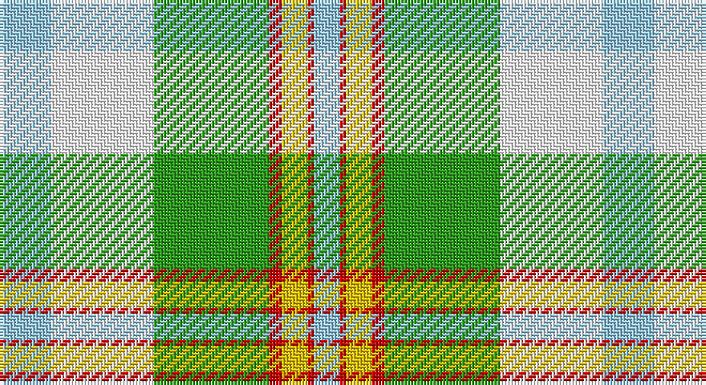

This page is one **sett** — a single exact thread-count. It belongs to the [tartan](/setts/lb8w16g18r2ly4r1lb4/)
(the same proportion at any scale), whose colour order is pattern [WRYRGWW](/stripes/wryrgww/).

Sourced from register-of-tartans.  It is a [7 stripe tartan](/stripes/stripes7/).

Original link https://www.tartanregister.gov.uk/tartanDetails.aspx?ref=2030

## Also known as

This cloth is also recorded under:

- Ainslie, Lake
- Cooper/Couper Dress

3 attestations — the source records this cloth was collapsed from (oldest owns this page)

<ul>
<li>01/01/1985 — Lake Ainslie Heritage (register-of-tartans, <a href="https://www.tartanregister.gov.uk/tartanDetails.aspx?ref=2030">record</a>)</li>
<li>1985 — Ainslie, Lake (District) (tartans-authority, <a href="http://www.tartansauthority.com/tartan-ferret/display/586/">record</a>)</li>
<li>01/01/2002 — Cooper/Couper Dress (Dalgleish #2) (register-of-tartans, <a href="https://www.tartanregister.gov.uk/tartanDetails.aspx?ref=755">record</a>)</li>
</ul>

## Register references

External register numbers recorded for this tartan.

- Scottish Register of Tartans: [2030](https://www.tartanregister.gov.uk/tartanDetails.aspx?ref=2030)
- Scottish Tartans Authority (ITI): 586
- Scottish Tartans World Register: 574

## Thread count
LB/16 W32 G36 R4 Y8 R2 LB/8

One full sett is **188 threads**.

## Palette

Palette: <strong>Tartan Register</strong>
<table><thead><tr><th>Colour</th><th>Threads</th><th>Shade</th><th>Base</th><th>OKLCh</th></tr></thead><tbody><tr><td>LB/</td><td style="text-align:right;font-variant-numeric:tabular-nums">16</td><td><code style="background-color:#98C8E8;">#98C8E8</code> <small style="color:#888">#98C8E8</small></td><td>W <code style="background-color:#F7F7F7;">#F7F7F7</code></td><td><small style="color:#888">oklch(81.0% 0.068 237.9)</small></td></tr><tr><td>W</td><td style="text-align:right;font-variant-numeric:tabular-nums">32</td><td><code style="background-color:#FCFCFC;">#FCFCFC</code> <small style="color:#888">#FCFCFC</small></td><td>W <code style="background-color:#F7F7F7;">#F7F7F7</code></td><td><small style="color:#888">oklch(99.1% 0.000 89.9)</small></td></tr><tr><td>G</td><td style="text-align:right;font-variant-numeric:tabular-nums">36</td><td><code style="background-color:#289C18;">#289C18</code> <small style="color:#888">#289C18</small></td><td>G <code style="background-color:#006100;">#006100</code></td><td><small style="color:#888">oklch(60.6% 0.191 141.6)</small></td></tr><tr><td>R</td><td style="text-align:right;font-variant-numeric:tabular-nums">4</td><td><code style="background-color:#C80000;">#C80000</code> <small style="color:#888">#C80000</small></td><td>R <code style="background-color:#CC0000;">#CC0000</code></td><td><small style="color:#888">oklch(52.3% 0.215 29.2)</small></td></tr><tr><td>Y</td><td style="text-align:right;font-variant-numeric:tabular-nums">8</td><td><code style="background-color:#E8C000;">#E8C000</code> <small style="color:#888">#E8C000</small></td><td>Y <code style="background-color:#F2BF00;">#F2BF00</code></td><td><small style="color:#888">oklch(81.9% 0.168 93.7)</small></td></tr><tr><td>R</td><td style="text-align:right;font-variant-numeric:tabular-nums">2</td><td><code style="background-color:#C80000;">#C80000</code> <small style="color:#888">#C80000</small></td><td>R <code style="background-color:#CC0000;">#CC0000</code></td><td><small style="color:#888">oklch(52.3% 0.215 29.2)</small></td></tr><tr><td>LB/</td><td style="text-align:right;font-variant-numeric:tabular-nums">8</td><td><code style="background-color:#98C8E8;">#98C8E8</code> <small style="color:#888">#98C8E8</small></td><td>W <code style="background-color:#F7F7F7;">#F7F7F7</code></td><td><small style="color:#888">oklch(81.0% 0.068 237.9)</small></td></tr></tbody></table>

# Sample pattern

## Nearest tartans

The nearest existing variants by ΔTartan distance, with this tartan at the top so the swatches line up against it.

ΔTartan

Tartan

Sett

—

<a href="/ttd/edit/#slug=lb8w16g18r2ly4r1lb4~x2">Lake Ainslie Heritage</a> <a class="nn-out" href="/variants/s7/lb8w16g18r2ly4r1lb4~x2/" title="open its dictionary page">↗</a>

1.35

<a href="/ttd/edit/#slug=g2o10g11ly4o1w18g2o1~x2&amp;base=lb8w16g18r2ly4r1lb4~x2">Aviemore, Check</a> <a class="nn-out" href="/variants/s8/g2o10g11ly4o1w18g2o1~x2/" title="open its dictionary page">↗</a>

1.46

<a href="/ttd/edit/#slug=n2ly4b22ly20g19ly2~x2&amp;base=lb8w16g18r2ly4r1lb4~x2">Barbie's Plaid</a> <a class="nn-out" href="/variants/s6/n2ly4b22ly20g19ly2~x2/" title="open its dictionary page">↗</a>

1.57

<a href="/ttd/edit/#slug=w3b19w1lb17ly11g10w1b3w1~x2&amp;base=lb8w16g18r2ly4r1lb4~x2">Bird Family (Australia) (Name)</a> <a class="nn-out" href="/variants/s9/w3b19w1lb17ly11g10w1b3w1~x2/" title="open its dictionary page">↗</a>

1.65

<a href="/variants/s8/wi30db1w4y10ly18~x2/">Alloway Primary School (Ayr)</a>

1.77

<a href="/ttd/edit/#slug=lo2lb14k1g11k2r2gi2k1~x4&amp;base=lb8w16g18r2ly4r1lb4~x2">Mission (District)</a> <a class="nn-out" href="/variants/s8/lo2lb14k1g11k2r2gi2k1~x4/" title="open its dictionary page">↗</a>

1.78

<a href="/ttd/edit/#slug=t16r1g16w1dy1w8m3~x2&amp;base=lb8w16g18r2ly4r1lb4~x2">Chambers, Christopher J (Personal)</a> <a class="nn-out" href="/variants/s7/t16r1g16w1dy1w8m3~x2/" title="open its dictionary page">↗</a>

1.78

<a href="/ttd/edit/#slug=t13r1g13w1k1w7k3~x2&amp;base=lb8w16g18r2ly4r1lb4~x2">Chambers, Christopher J (Personal)</a> <a class="nn-out" href="/variants/s7/t13r1g13w1k1w7k3~x2/" title="open its dictionary page">↗</a>

1.79

<a href="/ttd/edit/#slug=w36lt12w1r12g16ly2~x2&amp;base=lb8w16g18r2ly4r1lb4~x2">MacNappy</a> <a class="nn-out" href="/variants/s6/w36lt12w1r12g16ly2~x2/" title="open its dictionary page">↗</a>

1.79

<a href="/ttd/edit/#slug=g2dy10g11ly4dy1w18g2dy1~x2&amp;base=lb8w16g18r2ly4r1lb4~x2">Aviemore Check</a> <a class="nn-out" href="/variants/s8/g2dy10g11ly4dy1w18g2dy1~x2/" title="open its dictionary page">↗</a>

1.80

<a href="/ttd/edit/#slug=ly6w1ly5w12ly1db1t1db1t4~x4&amp;base=lb8w16g18r2ly4r1lb4~x2">MacGrath (Personal)</a> <a class="nn-out" href="/variants/s9/ly6w1ly5w12ly1db1t1db1t4~x4/" title="open its dictionary page">↗</a>

## Neighbour map

Every grey dot is one of 14360 variants placed by the first two principal components of the ΔTartan feature space (44% of its variance). Red is this tartan; blue dots are its nearest — click one to open its page.

<svg viewBox="0 0 640 380" role="img" style="max-width:100%;height:auto;border:1px solid #e0e0e0;border-radius:4px;display:block" xmlns="http://www.w3.org/2000/svg"><image href="/nn/cloud.v1.png" width="640" height="380"/><a href="/variants/s8/g2o10g11ly4o1w18g2o1~x2/"><circle cx="200.9" cy="152.8" r="4" fill="#3465a4"><title>Aviemore, Check</title></circle></a><a href="/variants/s6/n2ly4b22ly20g19ly2~x2/"><circle cx="185.0" cy="195.5" r="4" fill="#3465a4"><title>Barbie's Plaid</title></circle></a><a href="/variants/s9/w3b19w1lb17ly11g10w1b3w1~x2/"><circle cx="142.6" cy="133.7" r="4" fill="#3465a4"><title>Bird Family (Australia) (Name)</title></circle></a><a href="/variants/s8/wi30db1w4y10ly18~x2/"><circle cx="225.1" cy="124.8" r="4" fill="#3465a4"><title>Alloway Primary School (Ayr)</title></circle></a><a href="/variants/s8/lo2lb14k1g11k2r2gi2k1~x4/"><circle cx="163.1" cy="123.5" r="4" fill="#3465a4"><title>Mission (District)</title></circle></a><a href="/variants/s7/t16r1g16w1dy1w8m3~x2/"><circle cx="170.4" cy="138.1" r="4" fill="#3465a4"><title>Chambers, Christopher J (Personal)</title></circle></a><a href="/variants/s7/t13r1g13w1k1w7k3~x2/"><circle cx="138.5" cy="156.9" r="4" fill="#3465a4"><title>Chambers, Christopher J (Personal)</title></circle></a><a href="/variants/s6/w36lt12w1r12g16ly2~x2/"><circle cx="250.2" cy="126.5" r="4" fill="#3465a4"><title>MacNappy</title></circle></a><a href="/variants/s8/g2dy10g11ly4dy1w18g2dy1~x2/"><circle cx="187.2" cy="147.3" r="4" fill="#3465a4"><title>Aviemore Check</title></circle></a><a href="/variants/s9/ly6w1ly5w12ly1db1t1db1t4~x4/"><circle cx="204.3" cy="146.0" r="4" fill="#3465a4"><title>MacGrath (Personal)</title></circle></a><circle cx="155.0" cy="149.0" r="5" fill="#c00000"/></svg>

ID: /variants/s7/lb8w16g18r2ly4r1lb4~x2/
