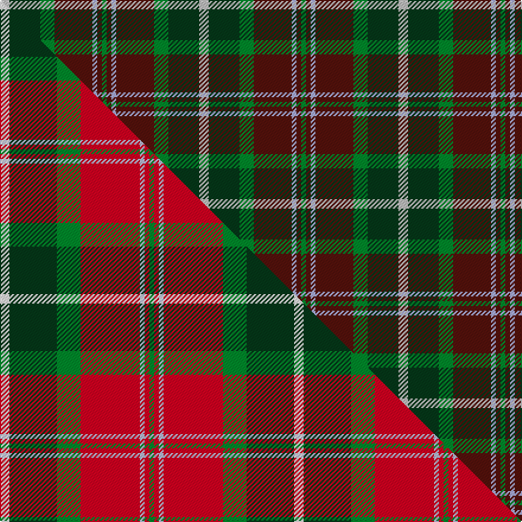

This is one **variant** — a specific cloth: this exact thread count and colourway, with its own
provenance below. It is one weaving of the [sett](/tartans/c/ca/caledonian-brewery-2/) (the scale-free proportion — the
same cloth at any scale or shade), whose colour order is pattern [GBWBGGW](/stripes/gbwbggw/).

Part of the [Caledonian Brewery](/tartans/c/ca/caledonian-brewery-2/) tartan — the named design grouping this sett with its other cloths.

Sourced from tartans-authority.  It is a [7 stripe tartan](/stripes/stripes7/).

Original link <code>http://www.tartansauthority.com/tartan-ferret/display/2315/</code> — retired · [Internet Archive copy](https://web.archive.org/web/*/http://www.tartansauthority.com/tartan-ferret/display/2315/*)

Dataset <small>— provenance for this record, inherited from the source manifest</small>

<dl class="dataset-prov">
<dt>source</dt><dd><a href="/sources/tartans-authority/">Scottish Tartans Authority</a></dd>
<dt>data captured from</dt><dd><a href="https://github.com/thetartan/tartan-database/blob/master/data/tartans-authority/data.csv">https://github.com/thetartan/tartan-database/blob/master/data/tartans-authority/data.csv</a></dd>
<dt>data date</dt><dd>pre 1997 <small>(this record)</small></dd>
<dt>licence</dt><dd><a href="https://creativecommons.org/licenses/by-nc-nd/4.0/">CC BY-NC-ND 4.0</a></dd>
</dl>

Capture chain <small>— the hands this data passed through, oldest first; each capture carries its own licence</small>

<ol class="capture-chain">
<li><a href="https://www.tartansauthority.com/">Scottish Tartans Authority</a> <small>the heritage body’s archive — its tartan-ferret record browser is retired; dead record links are shown unlinked, with an Internet Archive copy (ITI numbers are not SRT references)</small></li>
<li><a href="https://github.com/thetartan/tartan-database">thetartan/tartan-database</a> <small>2016-2017</small> · <a href="https://creativecommons.org/licenses/by-nc-nd/4.0/">CC BY-NC-ND 4.0</a> <small>Levko Kravets's frozen compilation — the capture we vendored, and where its CC licence text came from</small></li>
<li>this dictionary <small>captured 2026-06-10 · commit 5bf86c7566</small> <small>each re-capture is a git commit to data/sources</small></li>
</ol>

## Register references

External register numbers recorded for this tartan.

- Scottish Tartans Authority (ITI): 2315

## Thread count
LBi/8 DG26 G12 DR32 LB4 DR4 G/4

One full sett is **168 threads**.

## Palette
<table><thead><tr><th>Colour</th><th>Shade</th><th>OKLCh</th></tr></thead><tbody><tr><td>DG</td><td><code style="background-color:#053819;">#053819</code> <small style="color:#888">#053819</small></td><td><small style="color:#888">oklch(30.0% 0.075 151.3)</small></td></tr><tr><td>DR</td><td><code style="background-color:#55120C;">#55120C</code> <small style="color:#888">#55120C</small></td><td><small style="color:#888">oklch(30.0% 0.099 29.3)</small></td></tr><tr><td>G</td><td><code style="background-color:#008B2A;">#008B2A</code> <small style="color:#888">#008B2A</small></td><td><small style="color:#888">oklch(55.4% 0.170 145.9)</small></td></tr><tr><td>LB</td><td><code style="background-color:#A8ACE8;">#A8ACE8</code> <small style="color:#888">#A8ACE8</small></td><td><small style="color:#888">oklch(76.3% 0.086 281.2)</small></td></tr><tr><td>LB</td><td><code style="background-color:#C0C0C0;">#C0C0C0</code> <small style="color:#888">#C0C0C0</small></td><td><small style="color:#888">oklch(80.8% 0.000 89.9)</small></td></tr></tbody></table>

# Sample pattern

## Compared to the master

This cloth is one sett of its design; the master sett (the exemplar the design is anchored on) is below for comparison.

Its **ΔTartan distance** from the master is **0.49** — the same measure the nearest-tartans table ranks by (0 is identical; a re-scale of the same cloth is near 0, a recolour or a different proportion further).

<figure class="master-compare" style="margin:0">

this sett
master sett ★

<figcaption style="color:#888;font-size:smaller">One weave of this sett against the <a href="/setts/w4dg20g10r25lb2r2g2/">master sett ★</a>, split on the diagonal: a shared proportion runs seamlessly across it with only the shades shifting; a different proportion breaks on it.</figcaption>
</figure>

## Nearest tartan variants

The nearest existing variants by ΔTartan distance, with this cloth at the top so the swatches line up against it.

ΔTartan

Threads

Variant

Sett

—

168

<a href="/variants/s7/lbi4dg13g6dr16lb2dr2g2~x2~lbi3200000-lb3103284/">Caledonian Brewery (Corporate)</a>

<a href="/ttd/edit/#slug=g3dy32g4lb3g18dp18lo3~x2&amp;base=lbi4dg13g6dr16lb2dr2g2~x2~lbi3200000-lb3103284" title="compare in the TTD">1.26</a>

312

<a href="/variants/s7/g3dy32g4lb3g18dp18lo3~x2/">Wcwm 9275-1410</a>

<a href="/ttd/edit/#slug=do6ly4do3db2do5db2do3db2g14dr3db2~x2&amp;base=lbi4dg13g6dr16lb2dr2g2~x2~lbi3200000-lb3103284" title="compare in the TTD">2.36</a>

168

<a href="/variants/s11/do6ly4do3db2do5db2do3db2g14dr3db2~x2/">Limerick, County</a>

<a href="/ttd/edit/#slug=db23ly2dr3dbi7dr3ly2g15dr21ly5~x2~db1404245-dbi1406275&amp;base=lbi4dg13g6dr16lb2dr2g2~x2~lbi3200000-lb3103284" title="compare in the TTD">2.49</a>

268

<a href="/variants/s9/db23ly2dr3dbi7dr3ly2g15dr21ly5~x2~db1404245-dbi1406275/">Land's End Maroon</a>

<a href="/ttd/edit/#slug=dp11dy2dp2dy2dp2dy11g14w2~x2&amp;base=lbi4dg13g6dr16lb2dr2g2~x2~lbi3200000-lb3103284" title="compare in the TTD">2.53</a>

158

<a href="/variants/s8/dp11dy2dp2dy2dp2dy11g14w2~x2/">Lamont #2</a>

<a href="/ttd/edit/#slug=dr2do22g22do3db12y2~x2&amp;base=lbi4dg13g6dr16lb2dr2g2~x2~lbi3200000-lb3103284" title="compare in the TTD">2.65</a>

244

<a href="/variants/s6/dr2do22g22do3db12y2~x2/">Lisbon</a>

<a href="/ttd/edit/#slug=y4dg30g15db5lb10y4~x2&amp;base=lbi4dg13g6dr16lb2dr2g2~x2~lbi3200000-lb3103284" title="compare in the TTD">2.66</a>

256

<a href="/variants/s6/y4dg30g15db5lb10y4~x2/">MPS Emerald Society NCLEES 2012</a>

<a href="/ttd/edit/#slug=dg7dp3w1g2dg1lp2dp1~x8&amp;base=lbi4dg13g6dr16lb2dr2g2~x2~lbi3200000-lb3103284" title="compare in the TTD">2.78</a>

208

<a href="/variants/s7/dg7dp3w1g2dg1lp2dp1~x8/">Lindley-Highfield (Name)</a>

<a href="/ttd/edit/#slug=dg11dgi3dr4y2w2~x10~dgi1803189&amp;base=lbi4dg13g6dr16lb2dr2g2~x2~lbi3200000-lb3103284" title="compare in the TTD">2.94</a>

310

<a href="/variants/s5/dg11dgi3dr4y2w2~x10~dgi1803189/">Phinn (Personal)</a>

<a href="/ttd/edit/#slug=dr11dg1dr3ly7dg7dy5y3~x4&amp;base=lbi4dg13g6dr16lb2dr2g2~x2~lbi3200000-lb3103284" title="compare in the TTD">2.95</a>

240

<a href="/variants/s7/dr11dg1dr3ly7dg7dy5y3~x4/">Caledonian Maple</a>

<a href="/ttd/edit/#slug=dy2n2dg19n6dg2n6lo14dr4w2~x2&amp;base=lbi4dg13g6dr16lb2dr2g2~x2~lbi3200000-lb3103284" title="compare in the TTD">2.99</a>

220

<a href="/variants/s9/dy2n2dg19n6dg2n6lo14dr4w2~x2/">Royal Pharmaceutical Society (Corp)</a>

## Neighbour map

Every grey dot is one of 13656 variants placed by the first two principal components of the ΔTartan feature space (42% of its variance). Red is this tartan; blue dots are its nearest — click one to open its page. The map is a flat projection of a many-dimensional space — [how to read it](/posts/neighbourhood-maps/).

<svg viewBox="0 0 640 380" role="img" style="max-width:100%;height:auto;border:1px solid #e0e0e0;border-radius:4px;display:block" xmlns="http://www.w3.org/2000/svg"><image href="/nn/cloud.v1.png" width="640" height="380"/><a href="/variants/s7/g3dy32g4lb3g18dp18lo3~x2/"><circle cx="246.6" cy="210.3" r="4" fill="#3465a4"><title>Wcwm 9275-1410</title></circle></a><a href="/variants/s11/do6ly4do3db2do5db2do3db2g14dr3db2~x2/"><circle cx="193.3" cy="220.2" r="4" fill="#3465a4"><title>Limerick, County</title></circle></a><a href="/variants/s9/db23ly2dr3dbi7dr3ly2g15dr21ly5~x2~db1404245-dbi1406275/"><circle cx="204.0" cy="203.3" r="4" fill="#3465a4"><title>Land's End Maroon</title></circle></a><a href="/variants/s8/dp11dy2dp2dy2dp2dy11g14w2~x2/"><circle cx="216.7" cy="237.0" r="4" fill="#3465a4"><title>Lamont #2</title></circle></a><a href="/variants/s6/dr2do22g22do3db12y2~x2/"><circle cx="276.5" cy="233.2" r="4" fill="#3465a4"><title>Lisbon</title></circle></a><a href="/variants/s6/y4dg30g15db5lb10y4~x2/"><circle cx="228.1" cy="238.0" r="4" fill="#3465a4"><title>MPS Emerald Society NCLEES 2012</title></circle></a><a href="/variants/s7/dg7dp3w1g2dg1lp2dp1~x8/"><circle cx="219.5" cy="221.1" r="4" fill="#3465a4"><title>Lindley-Highfield (Name)</title></circle></a><a href="/variants/s5/dg11dgi3dr4y2w2~x10~dgi1803189/"><circle cx="254.3" cy="257.1" r="4" fill="#3465a4"><title>Phinn (Personal)</title></circle></a><a href="/variants/s7/dr11dg1dr3ly7dg7dy5y3~x4/"><circle cx="195.7" cy="235.8" r="4" fill="#3465a4"><title>Caledonian Maple</title></circle></a><a href="/variants/s9/dy2n2dg19n6dg2n6lo14dr4w2~x2/"><circle cx="178.7" cy="185.1" r="4" fill="#3465a4"><title>Royal Pharmaceutical Society (Corp)</title></circle></a><circle cx="223.5" cy="225.5" r="5" fill="#c00000"/><text x="320" y="376" text-anchor="middle" font-size="11" fill="#999">ground</text><text x="11" y="190" text-anchor="middle" font-size="11" fill="#999" transform="rotate(-90 11 190)">complexity</text></svg>

ID: /variants/s7/lbi4dg13g6dr16lb2dr2g2~x2~lbi3200000-lb3103284/
