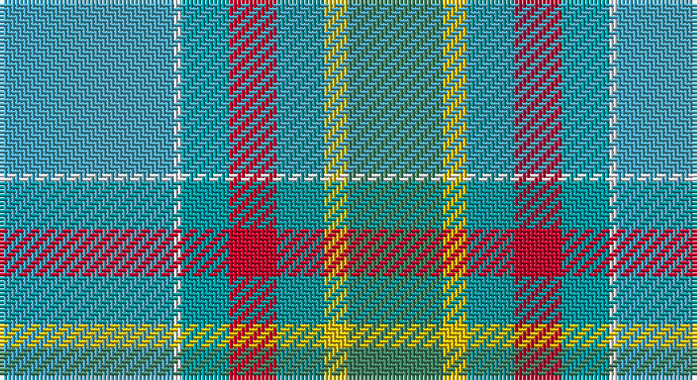

This page is one **sett** — a single exact thread-count. It belongs to the [tartan](/setts/lg22w1gi6r6gi6ly3g12/)
(the same proportion at any scale), whose colour order is pattern [GYGRGWY](/stripes/gygrgwy/).

Part of the [Dalveen](/tartans/dalveen/) tartan — the named design grouping this sett with its other cloths.

Sourced from register-of-tartans.  It is a [7 stripe tartan](/stripes/stripes7/).

Original link https://www.tartanregister.gov.uk/tartanDetails.aspx?ref=883

2 attestations — the source records this cloth was collapsed from (oldest owns this page)

<ul>
<li>01/01/2004 — Dalveen (2004) (register-of-tartans, <a href="https://www.tartanregister.gov.uk/tartanDetails.aspx?ref=883">record</a>)</li>
<li>2004 — Dalveen (District) (tartans-authority, <a href="http://www.tartansauthority.com/tartan-ferret/display/6657/">record</a>)</li>
</ul>

## Register references

External register numbers recorded for this tartan.

- Scottish Register of Tartans: [883](https://www.tartanregister.gov.uk/tartanDetails.aspx?ref=883)
- Scottish Tartans Authority (ITI): 6657

## Thread count
Ba/44 W2 B12 R12 B12 Y6 G/24

One full sett is **156 threads**.

## Palette

Palette: <strong>Tartan Register</strong> <small style="color:#888">(5 of 6 colours)</small>
<table><thead><tr><th>Colour</th><th>Threads</th><th>Shade</th><th>Base</th><th>OKLCh</th></tr></thead><tbody><tr><td>Ba/</td><td style="text-align:right;font-variant-numeric:tabular-nums">44</td><td><code style="background-color:#48A4C0;">#48A4C0</code> <small style="color:#888">#48A4C0</small></td><td>Y <code style="background-color:#F2BF00;">#F2BF00</code></td><td><small style="color:#888">oklch(67.5% 0.096 221.0)</small></td></tr><tr><td>W</td><td style="text-align:right;font-variant-numeric:tabular-nums">2</td><td><code style="background-color:#F8F8F8;">#F8F8F8</code> <small style="color:#888">#F8F8F8</small></td><td>W <code style="background-color:#F7F7F7;">#F7F7F7</code></td><td><small style="color:#888">oklch(97.9% 0.000 89.9)</small></td></tr><tr><td>B</td><td style="text-align:right;font-variant-numeric:tabular-nums">12</td><td><code style="background-color:#0098A0;">#0098A0</code> <small style="color:#888">#0098A0</small></td><td>G <code style="background-color:#006100;">#006100</code></td><td><small style="color:#888">oklch(61.8% 0.105 201.4)</small></td></tr><tr><td>R</td><td style="text-align:right;font-variant-numeric:tabular-nums">12</td><td><code style="background-color:#C8002C;">#C8002C</code> <small style="color:#888">#C8002C</small></td><td>R <code style="background-color:#CC0000;">#CC0000</code></td><td><small style="color:#888">oklch(52.6% 0.212 22.0)</small></td></tr><tr><td>B</td><td style="text-align:right;font-variant-numeric:tabular-nums">12</td><td><code style="background-color:#0098A0;">#0098A0</code> <small style="color:#888">#0098A0</small></td><td>G <code style="background-color:#006100;">#006100</code></td><td><small style="color:#888">oklch(61.8% 0.105 201.4)</small></td></tr><tr><td>Y</td><td style="text-align:right;font-variant-numeric:tabular-nums">6</td><td><code style="background-color:#E8C000;">#E8C000</code> <small style="color:#888">#E8C000</small></td><td>Y <code style="background-color:#F2BF00;">#F2BF00</code></td><td><small style="color:#888">oklch(81.9% 0.168 93.7)</small></td></tr><tr><td>G/</td><td style="text-align:right;font-variant-numeric:tabular-nums">24</td><td><code style="background-color:#408060;">#408060</code> <small style="color:#888">#408060</small></td><td>G <code style="background-color:#006100;">#006100</code></td><td><small style="color:#888">oklch(54.8% 0.084 160.1)</small></td></tr></tbody></table>

# Sample pattern

## Compared to the master

This cloth is one sett of its design; the master sett (the exemplar the design is anchored on) is below for comparison.

<figure style="margin:0"><figcaption style="color:#888;font-size:smaller">this sett</figcaption></figure>
<figure style="margin:0"><figcaption style="color:#888;font-size:smaller"><a href="/setts/k3g2k10w11g1dy10g2dy3/">master sett →</a></figcaption></figure>

## Nearest tartans

The nearest existing variants by ΔTartan distance, with this tartan at the top so the swatches line up against it.

ΔTartan

Tartan

Sett

—

<a href="/ttd/edit/#slug=lg22w1gi6r6gi6ly3g12~x2">Dalveen (2004)</a> <a class="nn-out" href="/variants/s7/lg22w1gi6r6gi6ly3g12~x2/" title="open its dictionary page">↗</a>

1.55

<a href="/ttd/edit/#slug=b20o2w1o5g8ly1g2r1g8o8~x4&amp;base=lg22w1gi6r6gi6ly3g12~x2">Connecticut, State of</a> <a class="nn-out" href="/variants/s10/b20o2w1o5g8ly1g2r1g8o8~x4/" title="open its dictionary page">↗</a>

1.66

<a href="/ttd/edit/#slug=b5w1m9b5r4b5g20ly1g1ly1~x4&amp;base=lg22w1gi6r6gi6ly3g12~x2">Hobkirk (School)</a> <a class="nn-out" href="/variants/s10/b5w1m9b5r4b5g20ly1g1ly1~x4/" title="open its dictionary page">↗</a>

1.68

<a href="/ttd/edit/#slug=n50t50ly1b27g18o9ly4~x2&amp;base=lg22w1gi6r6gi6ly3g12~x2">Lachance (Canada) (Personal)</a> <a class="nn-out" href="/variants/s7/n50t50ly1b27g18o9ly4~x2/" title="open its dictionary page">↗</a>

1.70

<a href="/ttd/edit/#slug=t30b1t1b16g5r5ly2b2dy15b1~x2&amp;base=lg22w1gi6r6gi6ly3g12~x2">Lyon, Jeffrey M (Hunting) (Personal)</a> <a class="nn-out" href="/variants/s10/t30b1t1b16g5r5ly2b2dy15b1~x2/" title="open its dictionary page">↗</a>

1.81

<a href="/ttd/edit/#slug=w3n19w1yii17y11yi10w1n3w1~x2&amp;base=lg22w1gi6r6gi6ly3g12~x2">Bird Family (Australia) (Personal)</a> <a class="nn-out" href="/variants/s9/w3n19w1yii17y11yi10w1n3w1~x2/" title="open its dictionary page">↗</a>

1.84

<a href="/variants/s8/lb30db1w4o10ly18~x2/">Alloway Primary (Corporate)</a>

1.90

<a href="/ttd/edit/#slug=y25p3y8p13lyi8lr2ly11y2p3~x2&amp;base=lg22w1gi6r6gi6ly3g12~x2">Organic</a> <a class="nn-out" href="/variants/s9/y25p3y8p13lyi8lr2ly11y2p3~x2/" title="open its dictionary page">↗</a>

1.92

<a href="/ttd/edit/#slug=k3lr15t3lr4t3lr4t10y30w3~x2&amp;base=lg22w1gi6r6gi6ly3g12~x2">Highland Road (Fashion)</a> <a class="nn-out" href="/variants/s9/k3lr15t3lr4t3lr4t10y30w3~x2/" title="open its dictionary page">↗</a>

1.92

<a href="/ttd/edit/#slug=b5lg2b2lg9k3b9g3b3g25lr2~x2&amp;base=lg22w1gi6r6gi6ly3g12~x2">Un-named (D C Dalgliesh) #2</a> <a class="nn-out" href="/variants/s10/b5lg2b2lg9k3b9g3b3g25lr2~x2/" title="open its dictionary page">↗</a>

1.93

<a href="/ttd/edit/#slug=o22b12g12ly2b4ly2g12b12o12k1r6k2g10b10~x2&amp;base=lg22w1gi6r6gi6ly3g12~x2">Penman</a> <a class="nn-out" href="/variants/s14/o22b12g12ly2b4ly2g12b12o12k1r6k2g10b10~x2/" title="open its dictionary page">↗</a>

## Neighbour map

Every grey dot is one of 14360 variants placed by the first two principal components of the ΔTartan feature space (44% of its variance). Red is this tartan; blue dots are its nearest — click one to open its page.

<svg viewBox="0 0 640 380" role="img" style="max-width:100%;height:auto;border:1px solid #e0e0e0;border-radius:4px;display:block" xmlns="http://www.w3.org/2000/svg"><image href="/nn/cloud.v1.png" width="640" height="380"/><a href="/variants/s10/b20o2w1o5g8ly1g2r1g8o8~x4/"><circle cx="229.0" cy="150.4" r="4" fill="#3465a4"><title>Connecticut, State of</title></circle></a><a href="/variants/s10/b5w1m9b5r4b5g20ly1g1ly1~x4/"><circle cx="240.3" cy="137.0" r="4" fill="#3465a4"><title>Hobkirk (School)</title></circle></a><a href="/variants/s7/n50t50ly1b27g18o9ly4~x2/"><circle cx="227.9" cy="141.7" r="4" fill="#3465a4"><title>Lachance (Canada) (Personal)</title></circle></a><a href="/variants/s10/t30b1t1b16g5r5ly2b2dy15b1~x2/"><circle cx="266.9" cy="125.2" r="4" fill="#3465a4"><title>Lyon, Jeffrey M (Hunting) (Personal)</title></circle></a><a href="/variants/s9/w3n19w1yii17y11yi10w1n3w1~x2/"><circle cx="198.1" cy="165.1" r="4" fill="#3465a4"><title>Bird Family (Australia) (Personal)</title></circle></a><a href="/variants/s8/lb30db1w4o10ly18~x2/"><circle cx="258.0" cy="145.7" r="4" fill="#3465a4"><title>Alloway Primary (Corporate)</title></circle></a><a href="/variants/s9/y25p3y8p13lyi8lr2ly11y2p3~x2/"><circle cx="269.3" cy="190.9" r="4" fill="#3465a4"><title>Organic</title></circle></a><a href="/variants/s9/k3lr15t3lr4t3lr4t10y30w3~x2/"><circle cx="268.2" cy="202.1" r="4" fill="#3465a4"><title>Highland Road (Fashion)</title></circle></a><a href="/variants/s10/b5lg2b2lg9k3b9g3b3g25lr2~x2/"><circle cx="286.6" cy="189.9" r="4" fill="#3465a4"><title>Un-named (D C Dalgliesh) #2</title></circle></a><a href="/variants/s14/o22b12g12ly2b4ly2g12b12o12k1r6k2g10b10~x2/"><circle cx="181.5" cy="161.6" r="4" fill="#3465a4"><title>Penman</title></circle></a><circle cx="232.5" cy="177.9" r="5" fill="#c00000"/></svg>

ID: /variants/s7/lg22w1gi6r6gi6ly3g12~x2/
