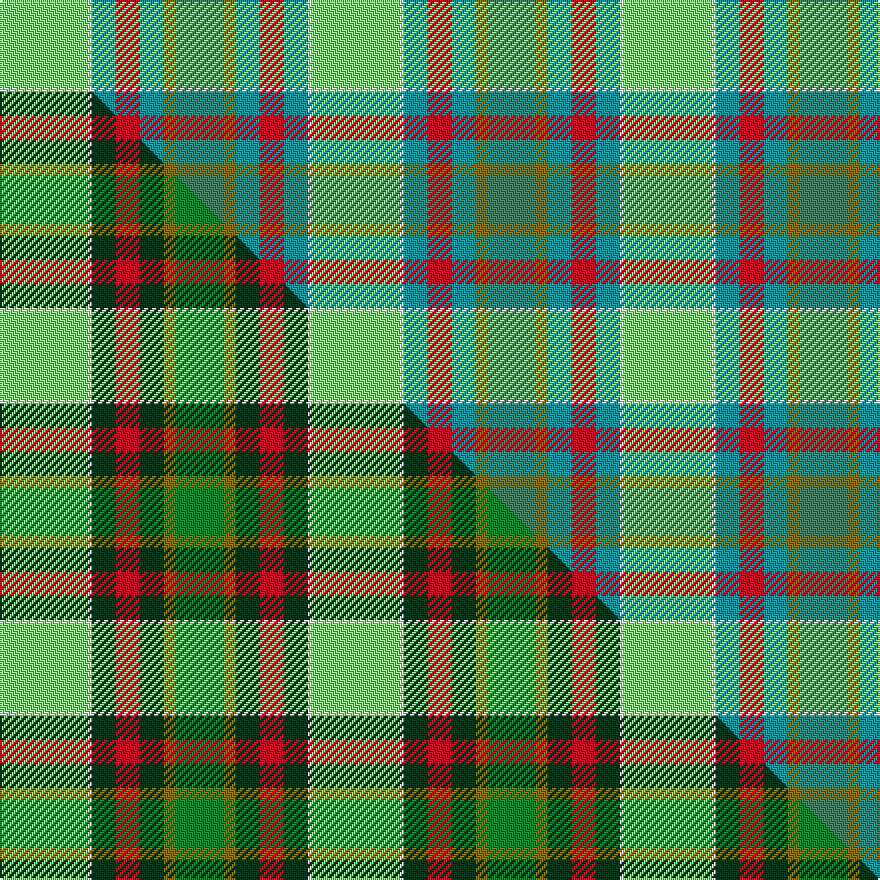

This is one **variant** — a specific cloth: this exact thread count and colourway, with its own
provenance below. It is one weaving of the [sett](/setts/lg22w1gi6r6gi6y3g12/) (the scale-free proportion — the
same cloth at any scale or shade), whose colour order is pattern [GGGRGWY](/stripes/gggrgwy/).

Part of the [Dalveen](/tartans/d/da/dalveen/) tartan — the named design grouping this sett with its other cloths.

Sourced from tartans-authority.  It is a [7 stripe tartan](/stripes/stripes7/).

Original link [https://www.tartanregister.gov.uk/tartanDetails.aspx?ref=6657](https://www.tartanregister.gov.uk/tartanDetails.aspx?ref=6657)

Dataset <small>— provenance for this record, inherited from the source manifest</small>

<dl class="dataset-prov">
<dt>source</dt><dd><a href="/sources/tartans-authority/">Scottish Tartans Authority</a></dd>
<dt>data captured from</dt><dd><a href="https://github.com/thetartan/tartan-database/blob/master/data/tartans-authority/data.csv">https://github.com/thetartan/tartan-database/blob/master/data/tartans-authority/data.csv</a></dd>
<dt>data date</dt><dd>2004 <small>(this record)</small></dd>
<dt>licence</dt><dd><a href="https://creativecommons.org/licenses/by-nc-nd/4.0/">CC BY-NC-ND 4.0</a></dd>
</dl>

Capture chain <small>— the hands this data passed through, oldest first; each capture carries its own licence</small>

<ol class="capture-chain">
<li><a href="https://www.tartansauthority.com/">Scottish Tartans Authority</a> <small>the heritage body's archive — its tartan-ferret record browser is retired (links repaired to the SRT, above)</small></li>
<li><a href="https://github.com/thetartan/tartan-database">thetartan/tartan-database</a> <small>2016-2017</small> · <a href="https://creativecommons.org/licenses/by-nc-nd/4.0/">CC BY-NC-ND 4.0</a> <small>Levko Kravets's frozen compilation — the capture we vendored, and where its CC licence text came from</small></li>
<li>this dictionary <small>captured 2026-06-10 · commit 5bf86c7566</small> <small>each re-capture is a git commit to data/sources</small></li>
</ol>

## Register references

External register numbers recorded for this tartan.

- Scottish Tartans Authority (ITI): 6657

## Thread count
LG/44 W2 Gi12 R12 Gi12 Y6 G/24

One full sett is **156 threads**.

## Palette
<table><thead><tr><th>Colour</th><th>Shade</th><th>OKLCh</th></tr></thead><tbody><tr><td>G</td><td><code style="background-color:#0098A0;">#0098A0</code> <small style="color:#888">#0098A0</small></td><td><small style="color:#888">oklch(61.8% 0.105 201.4)</small></td></tr><tr><td>LG</td><td><code style="background-color:#82D67A;">#82D67A</code> <small style="color:#888">#82D67A</small></td><td><small style="color:#888">oklch(80.1% 0.150 142.2)</small></td></tr><tr><td>G</td><td><code style="background-color:#408060;">#408060</code> <small style="color:#888">#408060</small></td><td><small style="color:#888">oklch(54.8% 0.084 160.1)</small></td></tr><tr><td>R</td><td><code style="background-color:#D60020;">#D60020</code> <small style="color:#888">#D60020</small></td><td><small style="color:#888">oklch(55.2% 0.224 25.5)</small></td></tr><tr><td>W</td><td><code style="background-color:#F7F7F7;">#F7F7F7</code> <small style="color:#888">#F7F7F7</small></td><td><small style="color:#888">oklch(97.6% 0.000 89.9)</small></td></tr><tr><td>Y</td><td><code style="background-color:#8B6E00;">#8B6E00</code> <small style="color:#888">#8B6E00</small></td><td><small style="color:#888">oklch(55.1% 0.113 90.4)</small></td></tr></tbody></table>

# Sample pattern

## Compared to the master

This cloth is one sett of its design; the master sett (the exemplar the design is anchored on) is below for comparison.

Its **ΔTartan distance** from the master is **4.19** — the same measure the nearest-tartans table ranks by (0 is identical; a re-scale of the same cloth is near 0, a recolour or a different proportion further).

<figure class="master-compare" style="margin:0">

this sett
master sett ★

<figcaption style="color:#888;font-size:smaller">One weave of this sett against the <a href="/setts/lg22w1dg6r6dg6y3g12/">master sett ★</a>, split on the diagonal: a shared proportion runs seamlessly across it with only the shades shifting; a different proportion breaks on it.</figcaption>
</figure>

## Nearest tartan variants

The nearest existing variants by ΔTartan distance, with this cloth at the top so the swatches line up against it.

ΔTartan

Threads

Variant

Sett

—

156

<a href="/variants/s7/lg22w1gi6r6gi6y3g12~x2~gi2504202-g2203152/">Dalveen (District)</a>

<a href="/ttd/edit/#slug=g36dg24t18ly4t18k2w5~x2&amp;base=lg22w1gi6r6gi6y3g12~x2~gi2504202-g2203152" title="compare in the TTD">1.45</a>

346

<a href="/variants/s7/g36dg24t18ly4t18k2w5~x2/">Hughes (Inverbervie) (Personal)</a>

<a href="/ttd/edit/#slug=r2lb1r1lb11g16dg1w1~x2&amp;base=lg22w1gi6r6gi6y3g12~x2~gi2504202-g2203152" title="compare in the TTD">1.58</a>

126

<a href="/variants/s7/r2lb1r1lb11g16dg1w1~x2/">Gift of Life Michigan</a>

<a href="/ttd/edit/#slug=ly9g18t9r1w1db1~x4&amp;base=lg22w1gi6r6gi6y3g12~x2~gi2504202-g2203152" title="compare in the TTD">2.81</a>

272

<a href="/variants/s6/ly9g18t9r1w1db1~x4/">T.H.E. C.O.G. USA (Corporate)</a>

<a href="/ttd/edit/#slug=y9g18b9r1w1db1~x4&amp;base=lg22w1gi6r6gi6y3g12~x2~gi2504202-g2203152" title="compare in the TTD">3.03</a>

272

<a href="/variants/s6/y9g18b9r1w1db1~x4/">COG USA, THE</a>

<a href="/ttd/edit/#slug=g3r1g12w4lb15ly1lb3~x4&amp;base=lg22w1gi6r6gi6y3g12~x2~gi2504202-g2203152" title="compare in the TTD">3.20</a>

288

<a href="/variants/s7/g3r1g12w4lb15ly1lb3~x4/">Postcode Lottery</a>

<a href="/ttd/edit/#slug=lb8w16g18r2y4r1lb4~x2&amp;base=lg22w1gi6r6gi6y3g12~x2~gi2504202-g2203152" title="compare in the TTD">3.34</a>

188

<a href="/variants/s7/lb8w16g18r2y4r1lb4~x2/">Lake Ainslie Heritage</a>

<a href="/ttd/edit/#slug=g48n26w5dy7lb10g3t7n10r3~x2&amp;base=lg22w1gi6r6gi6y3g12~x2~gi2504202-g2203152" title="compare in the TTD">3.42</a>

374

<a href="/variants/s9/g48n26w5dy7lb10g3t7n10r3~x2/">State Seal of Mississippi (Fashion)</a>

<a href="/ttd/edit/#slug=g20dg11n6dr2dp3n1~x2&amp;base=lg22w1gi6r6gi6y3g12~x2~gi2504202-g2203152" title="compare in the TTD">3.45</a>

130

<a href="/variants/s6/g20dg11n6dr2dp3n1~x2/">Chiti, Cristiano (Personal)</a>

<a href="/ttd/edit/#slug=t36r2t4w1dy14g4y2g18~x2&amp;base=lg22w1gi6r6gi6y3g12~x2~gi2504202-g2203152" title="compare in the TTD">3.51</a>

216

<a href="/variants/s8/t36r2t4w1dy14g4y2g18~x2/">Yorkland (Personal)</a>

<a href="/ttd/edit/#slug=dg2lo1dg12lb6g12dr1~x4~dg1806142-g2203152&amp;base=lg22w1gi6r6gi6y3g12~x2~gi2504202-g2203152" title="compare in the TTD">3.67</a>

260

<a href="/variants/s6/dg2lo1dg12lb6g12dr1~x4~dg1806142-g2203152/">City of Vancouver (Commemorative)</a>

## Neighbour map

Every grey dot is one of 13621 variants placed by the first two principal components of the ΔTartan feature space (42% of its variance). Red is this tartan; blue dots are its nearest — click one to open its page.

<svg viewBox="0 0 640 380" role="img" style="max-width:100%;height:auto;border:1px solid #e0e0e0;border-radius:4px;display:block" xmlns="http://www.w3.org/2000/svg"><image href="/nn/cloud.v1.png" width="640" height="380"/><a href="/variants/s7/g36dg24t18ly4t18k2w5~x2/"><circle cx="172.8" cy="179.6" r="4" fill="#3465a4"><title>Hughes (Inverbervie) (Personal)</title></circle></a><a href="/variants/s7/r2lb1r1lb11g16dg1w1~x2/"><circle cx="310.0" cy="169.5" r="4" fill="#3465a4"><title>Gift of Life Michigan</title></circle></a><a href="/variants/s6/ly9g18t9r1w1db1~x4/"><circle cx="282.4" cy="184.4" r="4" fill="#3465a4"><title>T.H.E. C.O.G. USA (Corporate)</title></circle></a><a href="/variants/s6/y9g18b9r1w1db1~x4/"><circle cx="301.8" cy="188.4" r="4" fill="#3465a4"><title>COG USA, THE</title></circle></a><a href="/variants/s7/g3r1g12w4lb15ly1lb3~x4/"><circle cx="286.8" cy="190.8" r="4" fill="#3465a4"><title>Postcode Lottery</title></circle></a><a href="/variants/s7/lb8w16g18r2y4r1lb4~x2/"><circle cx="188.0" cy="184.6" r="4" fill="#3465a4"><title>Lake Ainslie Heritage</title></circle></a><a href="/variants/s9/g48n26w5dy7lb10g3t7n10r3~x2/"><circle cx="247.0" cy="153.3" r="4" fill="#3465a4"><title>State Seal of Mississippi (Fashion)</title></circle></a><a href="/variants/s6/g20dg11n6dr2dp3n1~x2/"><circle cx="341.3" cy="214.1" r="4" fill="#3465a4"><title>Chiti, Cristiano (Personal)</title></circle></a><a href="/variants/s8/t36r2t4w1dy14g4y2g18~x2/"><circle cx="350.6" cy="142.8" r="4" fill="#3465a4"><title>Yorkland (Personal)</title></circle></a><a href="/variants/s6/dg2lo1dg12lb6g12dr1~x4~dg1806142-g2203152/"><circle cx="310.4" cy="243.9" r="4" fill="#3465a4"><title>City of Vancouver (Commemorative)</title></circle></a><circle cx="242.1" cy="185.2" r="5" fill="#c00000"/><text x="320" y="376" text-anchor="middle" font-size="11" fill="#999">ground</text><text x="11" y="190" text-anchor="middle" font-size="11" fill="#999" transform="rotate(-90 11 190)">complexity</text></svg>

ID: /variants/s7/lg22w1gi6r6gi6y3g12~x2~gi2504202-g2203152/
