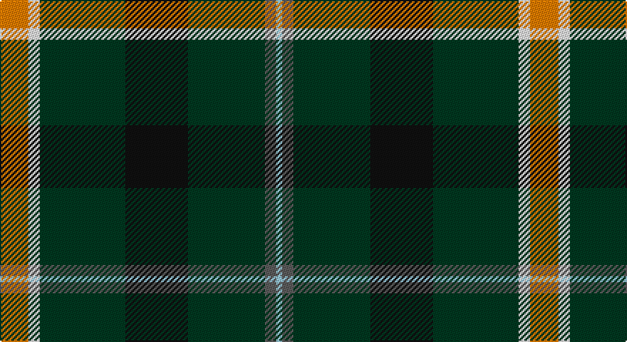

This page is one **sett** — a single exact thread-count. It belongs to the [tartan](/setts/lo10w4dg30k22dg27n4lb2/)
(the same proportion at any scale), whose colour order is pattern [WBGKGWY](/stripes/wbgkgwy/).

Sourced from tartans-authority.  It is a [7 stripe tartan](/stripes/stripes7/).

Original link http://www.tartansauthority.com/tartan-ferret/display/7941/

## Register references

External register numbers recorded for this tartan.

- Scottish Register of Tartans: [7941](https://www.tartanregister.gov.uk/tartanDetails?ref=7941)
- Scottish Tartans Authority (ITI): 7941

## Thread count
O/20 W8 DG60 K44 DG54 N8 LB/4

One full sett is **372 threads**.

## Palette

Palette: <strong>Tartan Register</strong> <small style="color:#888">(4 of 6 colours)</small>
<table><thead><tr><th>Colour</th><th>Threads</th><th>Shade</th><th>Base</th><th>OKLCh</th></tr></thead><tbody><tr><td>O/</td><td style="text-align:right;font-variant-numeric:tabular-nums">20</td><td><code style="background-color:#FC7C00;">#FC7C00</code> <small style="color:#888">#FC7C00</small></td><td>Y <code style="background-color:#F2BF00;">#F2BF00</code></td><td><small style="color:#888">oklch(72.2% 0.186 52.0)</small></td></tr><tr><td>W</td><td style="text-align:right;font-variant-numeric:tabular-nums">8</td><td><code style="background-color:#F8F8F8;">#F8F8F8</code> <small style="color:#888">#F8F8F8</small></td><td>W <code style="background-color:#F7F7F7;">#F7F7F7</code></td><td><small style="color:#888">oklch(97.9% 0.000 89.9)</small></td></tr><tr><td>DG</td><td style="text-align:right;font-variant-numeric:tabular-nums">60</td><td><code style="background-color:#003820;">#003820</code> <small style="color:#888">#003820</small></td><td>G <code style="background-color:#006100;">#006100</code></td><td><small style="color:#888">oklch(30.0% 0.070 158.3)</small></td></tr><tr><td>K</td><td style="text-align:right;font-variant-numeric:tabular-nums">44</td><td><code style="background-color:#101010;">#101010</code> <small style="color:#888">#101010</small></td><td>K <code style="background-color:#000000;">#000000</code></td><td><small style="color:#888">oklch(17.3% 0.000 89.9)</small></td></tr><tr><td>DG</td><td style="text-align:right;font-variant-numeric:tabular-nums">54</td><td><code style="background-color:#003820;">#003820</code> <small style="color:#888">#003820</small></td><td>G <code style="background-color:#006100;">#006100</code></td><td><small style="color:#888">oklch(30.0% 0.070 158.3)</small></td></tr><tr><td>N</td><td style="text-align:right;font-variant-numeric:tabular-nums">8</td><td><code style="background-color:#5C5C5C;">#5C5C5C</code> <small style="color:#888">#5C5C5C</small></td><td>B <code style="background-color:#2A418A;">#2A418A</code></td><td><small style="color:#888">oklch(47.5% 0.000 89.9)</small></td></tr><tr><td>LB/</td><td style="text-align:right;font-variant-numeric:tabular-nums">4</td><td><code style="background-color:#98C8E8;">#98C8E8</code> <small style="color:#888">#98C8E8</small></td><td>W <code style="background-color:#F7F7F7;">#F7F7F7</code></td><td><small style="color:#888">oklch(81.0% 0.068 237.9)</small></td></tr></tbody></table>

# Sample pattern

## Nearest tartans

The nearest existing variants by ΔTartan distance, with this tartan at the top so the swatches line up against it.

ΔTartan

Tartan

Sett

—

<a href="/ttd/edit/#slug=lo10w4dg30k22dg27n4lb2~x2">Aggreko Shepherd (Personal)</a> <a class="nn-out" href="/variants/s7/lo10w4dg30k22dg27n4lb2~x2/" title="open its dictionary page">↗</a>

1.09

<a href="/ttd/edit/#slug=dg4r1dg12k1ly4k1dg3b5w2~x2&amp;base=lo10w4dg30k22dg27n4lb2~x2">Lees-McRae College</a> <a class="nn-out" href="/variants/s9/dg4r1dg12k1ly4k1dg3b5w2~x2/" title="open its dictionary page">↗</a>

1.15

<a href="/ttd/edit/#slug=dg3w1dg12r6dg3k3g2~x4&amp;base=lo10w4dg30k22dg27n4lb2~x2">Arkansas</a> <a class="nn-out" href="/variants/s7/dg3w1dg12r6dg3k3g2~x4/" title="open its dictionary page">↗</a>

1.18

<a href="/ttd/edit/#slug=k4lo8k26o6g15o6k26w2~x2&amp;base=lo10w4dg30k22dg27n4lb2~x2">Holestone (Corporate)</a> <a class="nn-out" href="/variants/s8/k4lo8k26o6g15o6k26w2~x2/" title="open its dictionary page">↗</a>

1.20

<a href="/ttd/edit/#slug=g26db3g12k10dp15w2~x2&amp;base=lo10w4dg30k22dg27n4lb2~x2">Lossiemouth/Hersbruck</a> <a class="nn-out" href="/variants/s6/g26db3g12k10dp15w2~x2/" title="open its dictionary page">↗</a>

1.27

<a href="/ttd/edit/#slug=k17dg48ly4r10lb12dg4&amp;base=lo10w4dg30k22dg27n4lb2~x2">Asheville Firefighters, The</a> <a class="nn-out" href="/variants/s6/k17dg48ly4r10lb12dg4/" title="open its dictionary page">↗</a>

1.33

<a href="/ttd/edit/#slug=dg49k8loi20lo3dg23r6k5t3dg10loi10~x2&amp;base=lo10w4dg30k22dg27n4lb2~x2">State Seal of Maine (Fashion)</a> <a class="nn-out" href="/variants/s10/dg49k8loi20lo3dg23r6k5t3dg10loi10~x2/" title="open its dictionary page">↗</a>

1.35

<a href="/ttd/edit/#slug=db25k84w5g32ly5dp8~x2&amp;base=lo10w4dg30k22dg27n4lb2~x2">Woodward, R Glenn</a> <a class="nn-out" href="/variants/s6/db25k84w5g32ly5dp8~x2/" title="open its dictionary page">↗</a>

1.36

<a href="/ttd/edit/#slug=dg2k1dg12r4dg3db9lb2~x4&amp;base=lo10w4dg30k22dg27n4lb2~x2">Lee (Personal)</a> <a class="nn-out" href="/variants/s7/dg2k1dg12r4dg3db9lb2~x4/" title="open its dictionary page">↗</a>

1.44

<a href="/variants/s7/ly3dg24ki11dg3k10dg3w2~x2/">Cornish Brewery, Green</a>

1.45

<a href="/ttd/edit/#slug=k17g48ly4r10db12g4&amp;base=lo10w4dg30k22dg27n4lb2~x2">Asheville Firefighters, The</a> <a class="nn-out" href="/variants/s6/k17g48ly4r10db12g4/" title="open its dictionary page">↗</a>

## Neighbour map

Every grey dot is one of 14360 variants placed by the first two principal components of the ΔTartan feature space (44% of its variance). Red is this tartan; blue dots are its nearest — click one to open its page.

<svg viewBox="0 0 640 380" role="img" style="max-width:100%;height:auto;border:1px solid #e0e0e0;border-radius:4px;display:block" xmlns="http://www.w3.org/2000/svg"><image href="/nn/cloud.v1.png" width="640" height="380"/><a href="/variants/s9/dg4r1dg12k1ly4k1dg3b5w2~x2/"><circle cx="237.8" cy="150.7" r="4" fill="#3465a4"><title>Lees-McRae College</title></circle></a><a href="/variants/s7/dg3w1dg12r6dg3k3g2~x4/"><circle cx="294.3" cy="191.2" r="4" fill="#3465a4"><title>Arkansas</title></circle></a><a href="/variants/s8/k4lo8k26o6g15o6k26w2~x2/"><circle cx="287.0" cy="181.7" r="4" fill="#3465a4"><title>Holestone (Corporate)</title></circle></a><a href="/variants/s6/g26db3g12k10dp15w2~x2/"><circle cx="275.1" cy="208.3" r="4" fill="#3465a4"><title>Lossiemouth/Hersbruck</title></circle></a><a href="/variants/s6/k17dg48ly4r10lb12dg4/"><circle cx="261.5" cy="178.8" r="4" fill="#3465a4"><title>Asheville Firefighters, The</title></circle></a><a href="/variants/s10/dg49k8loi20lo3dg23r6k5t3dg10loi10~x2/"><circle cx="313.0" cy="147.5" r="4" fill="#3465a4"><title>State Seal of Maine (Fashion)</title></circle></a><a href="/variants/s6/db25k84w5g32ly5dp8~x2/"><circle cx="265.3" cy="155.9" r="4" fill="#3465a4"><title>Woodward, R Glenn</title></circle></a><a href="/variants/s7/dg2k1dg12r4dg3db9lb2~x4/"><circle cx="248.2" cy="195.6" r="4" fill="#3465a4"><title>Lee (Personal)</title></circle></a><a href="/variants/s7/ly3dg24ki11dg3k10dg3w2~x2/"><circle cx="254.9" cy="187.7" r="4" fill="#3465a4"><title>Cornish Brewery, Green</title></circle></a><a href="/variants/s6/k17g48ly4r10db12g4/"><circle cx="278.3" cy="190.3" r="4" fill="#3465a4"><title>Asheville Firefighters, The</title></circle></a><circle cx="263.6" cy="171.2" r="5" fill="#c00000"/></svg>

ID: /variants/s7/lo10w4dg30k22dg27n4lb2~x2/
