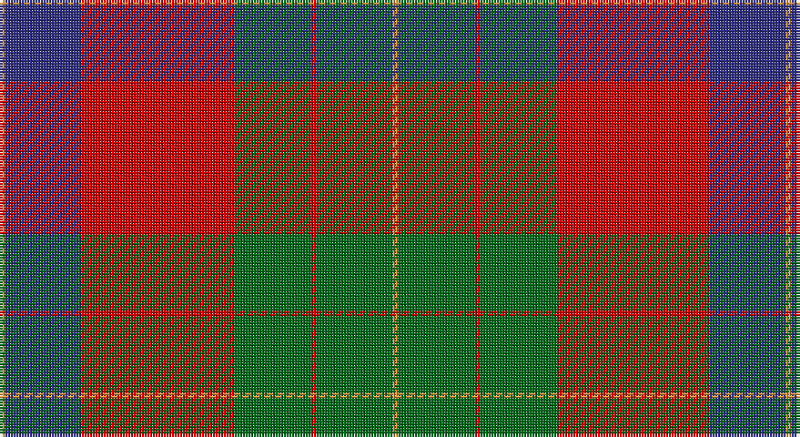

This page is one **sett** — a single exact thread-count. It belongs to the [tartan](/setts/lo1db14r28g14r1g14lo1/)
(the same proportion at any scale), whose colour order is pattern [YBRGRGY](/stripes/ybrgrgy/).

Sourced from tartans-authority.  It is a [7 stripe tartan](/stripes/stripes7/).

Original link http://www.tartansauthority.com/tartan-ferret/display/10333/

## Register references

External register numbers recorded for this tartan.

- Scottish Register of Tartans: [10333](https://www.tartanregister.gov.uk/tartanDetails?ref=10333)
- Scottish Tartans Authority (ITI): 10333

## Thread count
O/2 DB28 R56 G28 R2 G28 O/2

One full sett is **288 threads**.

## Palette

Palette: <strong>Tartan Register</strong>
<table><thead><tr><th>Colour</th><th>Threads</th><th>Shade</th><th>Base</th><th>OKLCh</th></tr></thead><tbody><tr><td>O/</td><td style="text-align:right;font-variant-numeric:tabular-nums">2</td><td><code style="background-color:#DC943C;">#DC943C</code> <small style="color:#888">#DC943C</small></td><td>Y <code style="background-color:#F2BF00;">#F2BF00</code></td><td><small style="color:#888">oklch(72.3% 0.133 67.9)</small></td></tr><tr><td>DB</td><td style="text-align:right;font-variant-numeric:tabular-nums">28</td><td><code style="background-color:#2C2C80;">#2C2C80</code> <small style="color:#888">#2C2C80</small></td><td>B <code style="background-color:#2A418A;">#2A418A</code></td><td><small style="color:#888">oklch(35.0% 0.138 276.6)</small></td></tr><tr><td>R</td><td style="text-align:right;font-variant-numeric:tabular-nums">56</td><td><code style="background-color:#C80000;">#C80000</code> <small style="color:#888">#C80000</small></td><td>R <code style="background-color:#CC0000;">#CC0000</code></td><td><small style="color:#888">oklch(52.3% 0.215 29.2)</small></td></tr><tr><td>G</td><td style="text-align:right;font-variant-numeric:tabular-nums">28</td><td><code style="background-color:#006818;">#006818</code> <small style="color:#888">#006818</small></td><td>G <code style="background-color:#006100;">#006100</code></td><td><small style="color:#888">oklch(45.0% 0.142 145.0)</small></td></tr><tr><td>R</td><td style="text-align:right;font-variant-numeric:tabular-nums">2</td><td><code style="background-color:#C80000;">#C80000</code> <small style="color:#888">#C80000</small></td><td>R <code style="background-color:#CC0000;">#CC0000</code></td><td><small style="color:#888">oklch(52.3% 0.215 29.2)</small></td></tr><tr><td>G</td><td style="text-align:right;font-variant-numeric:tabular-nums">28</td><td><code style="background-color:#006818;">#006818</code> <small style="color:#888">#006818</small></td><td>G <code style="background-color:#006100;">#006100</code></td><td><small style="color:#888">oklch(45.0% 0.142 145.0)</small></td></tr><tr><td>O/</td><td style="text-align:right;font-variant-numeric:tabular-nums">2</td><td><code style="background-color:#DC943C;">#DC943C</code> <small style="color:#888">#DC943C</small></td><td>Y <code style="background-color:#F2BF00;">#F2BF00</code></td><td><small style="color:#888">oklch(72.3% 0.133 67.9)</small></td></tr></tbody></table>

# Sample pattern

## Nearest tartans

The nearest existing variants by ΔTartan distance, with this tartan at the top so the swatches line up against it.

ΔTartan

Tartan

Sett

—

<a href="/ttd/edit/#slug=lo1db14r28g14r1g14lo1~x2">Abernethy (Colerain USA) (Personal)</a> <a class="nn-out" href="/variants/s7/lo1db14r28g14r1g14lo1~x2/" title="open its dictionary page">↗</a>

0.81

<a href="/ttd/edit/#slug=db1r5dg18r4db9r10w1~x4&amp;base=lo1db14r28g14r1g14lo1~x2">MacKintosh Geddes</a> <a class="nn-out" href="/variants/s7/db1r5dg18r4db9r10w1~x4/" title="open its dictionary page">↗</a>

0.82

<a href="/ttd/edit/#slug=w3g15db18r30g1r2~x2&amp;base=lo1db14r28g14r1g14lo1~x2">Ruthven</a> <a class="nn-out" href="/variants/s6/w3g15db18r30g1r2~x2/" title="open its dictionary page">↗</a>

0.85

<a href="/ttd/edit/#slug=db1r5g18r4db9r10w1~x4&amp;base=lo1db14r28g14r1g14lo1~x2">MacKintosh, Geddes</a> <a class="nn-out" href="/variants/s7/db1r5g18r4db9r10w1~x4/" title="open its dictionary page">↗</a>

1.06

<a href="/ttd/edit/#slug=k6r2dg17r16k1t2~x2&amp;base=lo1db14r28g14r1g14lo1~x2">Unidentified #15</a> <a class="nn-out" href="/variants/s6/k6r2dg17r16k1t2~x2/" title="open its dictionary page">↗</a>

1.09

<a href="/ttd/edit/#slug=y36k2y2k2y3k12t10r20~x2&amp;base=lo1db14r28g14r1g14lo1~x2">Georgia, State of (District)</a> <a class="nn-out" href="/variants/s8/y36k2y2k2y3k12t10r20~x2/" title="open its dictionary page">↗</a>

1.10

<a href="/ttd/edit/#slug=dg12g6dg6r15k1r1k2~x2&amp;base=lo1db14r28g14r1g14lo1~x2">Cook (Name)</a> <a class="nn-out" href="/variants/s7/dg12g6dg6r15k1r1k2~x2/" title="open its dictionary page">↗</a>

1.10

<a href="/ttd/edit/#slug=g12t6g6r15k1r1k2~x4&amp;base=lo1db14r28g14r1g14lo1~x2">McCook/Cook (Name)</a> <a class="nn-out" href="/variants/s7/g12t6g6r15k1r1k2~x4/" title="open its dictionary page">↗</a>

1.11

<a href="/ttd/edit/#slug=r30k8dg30b4r3b2~x2&amp;base=lo1db14r28g14r1g14lo1~x2">Plummer Family Personal Tartan</a> <a class="nn-out" href="/variants/s6/r30k8dg30b4r3b2~x2/" title="open its dictionary page">↗</a>

1.13

<a href="/ttd/edit/#slug=dp8r3ly1r3g14r3ly1~x4&amp;base=lo1db14r28g14r1g14lo1~x2">Logan with Yellow</a> <a class="nn-out" href="/variants/s7/dp8r3ly1r3g14r3ly1~x4/" title="open its dictionary page">↗</a>

1.17

<a href="/ttd/edit/#slug=r15db2r1db2r3db7g13gi3~x2&amp;base=lo1db14r28g14r1g14lo1~x2">Cranston Dress</a> <a class="nn-out" href="/variants/s8/r15db2r1db2r3db7g13gi3~x2/" title="open its dictionary page">↗</a>

## Neighbour map

Every grey dot is one of 14360 variants placed by the first two principal components of the ΔTartan feature space (44% of its variance). Red is this tartan; blue dots are its nearest — click one to open its page.

<svg viewBox="0 0 640 380" role="img" style="max-width:100%;height:auto;border:1px solid #e0e0e0;border-radius:4px;display:block" xmlns="http://www.w3.org/2000/svg"><image href="/nn/cloud.v1.png" width="640" height="380"/><a href="/variants/s7/db1r5dg18r4db9r10w1~x4/"><circle cx="249.2" cy="180.7" r="4" fill="#3465a4"><title>MacKintosh Geddes</title></circle></a><a href="/variants/s6/w3g15db18r30g1r2~x2/"><circle cx="298.5" cy="157.0" r="4" fill="#3465a4"><title>Ruthven</title></circle></a><a href="/variants/s7/db1r5g18r4db9r10w1~x4/"><circle cx="248.6" cy="182.9" r="4" fill="#3465a4"><title>MacKintosh, Geddes</title></circle></a><a href="/variants/s6/k6r2dg17r16k1t2~x2/"><circle cx="258.0" cy="179.2" r="4" fill="#3465a4"><title>Unidentified #15</title></circle></a><a href="/variants/s8/y36k2y2k2y3k12t10r20~x2/"><circle cx="289.7" cy="167.3" r="4" fill="#3465a4"><title>Georgia, State of (District)</title></circle></a><a href="/variants/s7/dg12g6dg6r15k1r1k2~x2/"><circle cx="252.7" cy="191.8" r="4" fill="#3465a4"><title>Cook (Name)</title></circle></a><a href="/variants/s7/g12t6g6r15k1r1k2~x4/"><circle cx="248.7" cy="189.5" r="4" fill="#3465a4"><title>McCook/Cook (Name)</title></circle></a><a href="/variants/s6/r30k8dg30b4r3b2~x2/"><circle cx="280.0" cy="188.3" r="4" fill="#3465a4"><title>Plummer Family Personal Tartan</title></circle></a><a href="/variants/s7/dp8r3ly1r3g14r3ly1~x4/"><circle cx="246.7" cy="178.7" r="4" fill="#3465a4"><title>Logan with Yellow</title></circle></a><a href="/variants/s8/r15db2r1db2r3db7g13gi3~x2/"><circle cx="228.6" cy="170.0" r="4" fill="#3465a4"><title>Cranston Dress</title></circle></a><circle cx="278.2" cy="162.4" r="5" fill="#c00000"/></svg>

ID: /variants/s7/lo1db14r28g14r1g14lo1~x2/
