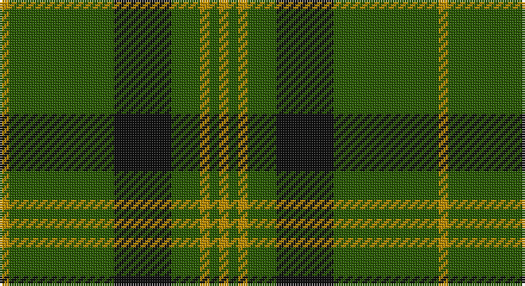

This page is one **sett** — a single exact thread-count. It belongs to the [tartan](/setts/lo1dg11k6dg3lo1dg1lo1/)
(the same proportion at any scale), whose colour order is pattern [YGKGYGY](/stripes/ygkgygy/).

Part of the [Angle](/tartans/angle/) tartan — the named design grouping this sett with its other cloths.

Sourced from tartans-authority.  It is a [7 stripe tartan](/stripes/stripes7/).

Original link http://www.tartansauthority.com/tartan-ferret/display/3514/

## Also known as

This cloth is also recorded under:

- Angle Blue
- Angle Green
- Angle, Blue
- Angle, Green

2 attestations — the source records this cloth was collapsed from (oldest owns this page)

<ul>
<li>1986 — Angle, Green (Fashion) (tartans-authority, <a href="http://www.tartansauthority.com/tartan-ferret/display/3514/">record</a>)</li>
<li>undated — Angle Green (register-of-tartans, <a href="https://www.tartanregister.gov.uk/tartanDetails.aspx?ref=5264">record</a>)</li>
</ul>

## Register references

External register numbers recorded for this tartan.

- Scottish Register of Tartans: [5264](https://www.tartanregister.gov.uk/tartanDetails.aspx?ref=5264)
- Scottish Tartans Authority (ITI): 3514

## Thread count
DY/4 G44 K24 G12 DY4 G4 DY/4

One full sett is **184 threads**.

## Palette

Palette: <strong>Tartan Register</strong>
<table><thead><tr><th>Colour</th><th>Threads</th><th>Shade</th><th>Base</th><th>OKLCh</th></tr></thead><tbody><tr><td>DY/</td><td style="text-align:right;font-variant-numeric:tabular-nums">4</td><td><code style="background-color:#BC8C00;">#BC8C00</code> <small style="color:#888">#BC8C00</small></td><td>Y <code style="background-color:#F2BF00;">#F2BF00</code></td><td><small style="color:#888">oklch(66.8% 0.137 84.1)</small></td></tr><tr><td>G</td><td style="text-align:right;font-variant-numeric:tabular-nums">44</td><td><code style="background-color:#285800;">#285800</code> <small style="color:#888">#285800</small></td><td>G <code style="background-color:#006100;">#006100</code></td><td><small style="color:#888">oklch(41.0% 0.122 135.8)</small></td></tr><tr><td>K</td><td style="text-align:right;font-variant-numeric:tabular-nums">24</td><td><code style="background-color:#101010;">#101010</code> <small style="color:#888">#101010</small></td><td>K <code style="background-color:#000000;">#000000</code></td><td><small style="color:#888">oklch(17.3% 0.000 89.9)</small></td></tr><tr><td>G</td><td style="text-align:right;font-variant-numeric:tabular-nums">12</td><td><code style="background-color:#285800;">#285800</code> <small style="color:#888">#285800</small></td><td>G <code style="background-color:#006100;">#006100</code></td><td><small style="color:#888">oklch(41.0% 0.122 135.8)</small></td></tr><tr><td>DY</td><td style="text-align:right;font-variant-numeric:tabular-nums">4</td><td><code style="background-color:#BC8C00;">#BC8C00</code> <small style="color:#888">#BC8C00</small></td><td>Y <code style="background-color:#F2BF00;">#F2BF00</code></td><td><small style="color:#888">oklch(66.8% 0.137 84.1)</small></td></tr><tr><td>G</td><td style="text-align:right;font-variant-numeric:tabular-nums">4</td><td><code style="background-color:#285800;">#285800</code> <small style="color:#888">#285800</small></td><td>G <code style="background-color:#006100;">#006100</code></td><td><small style="color:#888">oklch(41.0% 0.122 135.8)</small></td></tr><tr><td>DY/</td><td style="text-align:right;font-variant-numeric:tabular-nums">4</td><td><code style="background-color:#BC8C00;">#BC8C00</code> <small style="color:#888">#BC8C00</small></td><td>Y <code style="background-color:#F2BF00;">#F2BF00</code></td><td><small style="color:#888">oklch(66.8% 0.137 84.1)</small></td></tr></tbody></table>

# Sample pattern

## Compared to the master

This cloth is one sett of its design; the master sett (the exemplar the design is anchored on) is below for comparison.

<figure style="margin:0"><figcaption style="color:#888;font-size:smaller">this sett</figcaption></figure>
<figure style="margin:0"><figcaption style="color:#888;font-size:smaller"><a href="/setts/lb1lg11k6lg3lb1lg1lb1/">master sett →</a></figcaption></figure>

## Nearest tartans

The nearest existing variants by ΔTartan distance, with this tartan at the top so the swatches line up against it.

ΔTartan

Tartan

Sett

—

<a href="/ttd/edit/#slug=lo1dg11k6dg3lo1dg1lo1~x4">Angle, Green (Fashion)</a> <a class="nn-out" href="/variants/s7/lo1dg11k6dg3lo1dg1lo1~x4/" title="open its dictionary page">↗</a>

0.88

<a href="/ttd/edit/#slug=g3r16g4k6g28r2g3~x2&amp;base=lo1dg11k6dg3lo1dg1lo1~x4">Maxwell Htg (Clan)</a> <a class="nn-out" href="/variants/s7/g3r16g4k6g28r2g3~x2/" title="open its dictionary page">↗</a>

0.94

<a href="/ttd/edit/#slug=g24r4g3k14g5r2g10~x2&amp;base=lo1dg11k6dg3lo1dg1lo1~x4">Northcroft (Personal)</a> <a class="nn-out" href="/variants/s7/g24r4g3k14g5r2g10~x2/" title="open its dictionary page">↗</a>

1.00

<a href="/ttd/edit/#slug=g3k6r2k6g3k2g16k1~x4&amp;base=lo1dg11k6dg3lo1dg1lo1~x4">Glenbarr</a> <a class="nn-out" href="/variants/s8/g3k6r2k6g3k2g16k1~x4/" title="open its dictionary page">↗</a>

1.05

<a href="/ttd/edit/#slug=r3g20k20g20lo2g2lo2~x2&amp;base=lo1dg11k6dg3lo1dg1lo1~x4">Paton (Personal)</a> <a class="nn-out" href="/variants/s7/r3g20k20g20lo2g2lo2~x2/" title="open its dictionary page">↗</a>

1.22

<a href="/ttd/edit/#slug=r2g2r1g12r3k1~x4&amp;base=lo1dg11k6dg3lo1dg1lo1~x4">Connell (Personal?)</a> <a class="nn-out" href="/variants/s6/r2g2r1g12r3k1~x4/" title="open its dictionary page">↗</a>

1.23

<a href="/ttd/edit/#slug=dg37o9dg3r9o3~x2&amp;base=lo1dg11k6dg3lo1dg1lo1~x4">Glen Trool</a> <a class="nn-out" href="/variants/s5/dg37o9dg3r9o3~x2/" title="open its dictionary page">↗</a>

1.30

<a href="/ttd/edit/#slug=g22dt5r4dt5r3~x2&amp;base=lo1dg11k6dg3lo1dg1lo1~x4">Romsdal</a> <a class="nn-out" href="/variants/s5/g22dt5r4dt5r3~x2/" title="open its dictionary page">↗</a>

1.30

<a href="/ttd/edit/#slug=dg10o1dg1o1lr2dg1o1~x4&amp;base=lo1dg11k6dg3lo1dg1lo1~x4">Green Watch</a> <a class="nn-out" href="/variants/s7/dg10o1dg1o1lr2dg1o1~x4/" title="open its dictionary page">↗</a>

1.31

<a href="/ttd/edit/#slug=k22g5k2g5k11g33k2r4~x2&amp;base=lo1dg11k6dg3lo1dg1lo1~x4">MacArthur-Fox 1993 (Personal)</a> <a class="nn-out" href="/variants/s8/k22g5k2g5k11g33k2r4~x2/" title="open its dictionary page">↗</a>

1.31

<a href="/ttd/edit/#slug=g18ly2g18k4g2k15~x2&amp;base=lo1dg11k6dg3lo1dg1lo1~x4">MacArthur (Highland Society)</a> <a class="nn-out" href="/variants/s6/g18ly2g18k4g2k15~x2/" title="open its dictionary page">↗</a>

## Neighbour map

Every grey dot is one of 14360 variants placed by the first two principal components of the ΔTartan feature space (44% of its variance). Red is this tartan; blue dots are its nearest — click one to open its page.

<svg viewBox="0 0 640 380" role="img" style="max-width:100%;height:auto;border:1px solid #e0e0e0;border-radius:4px;display:block" xmlns="http://www.w3.org/2000/svg"><image href="/nn/cloud.v1.png" width="640" height="380"/><a href="/variants/s7/g3r16g4k6g28r2g3~x2/"><circle cx="419.5" cy="223.7" r="4" fill="#3465a4"><title>Maxwell Htg (Clan)</title></circle></a><a href="/variants/s7/g24r4g3k14g5r2g10~x2/"><circle cx="417.4" cy="240.0" r="4" fill="#3465a4"><title>Northcroft (Personal)</title></circle></a><a href="/variants/s8/g3k6r2k6g3k2g16k1~x4/"><circle cx="376.4" cy="215.7" r="4" fill="#3465a4"><title>Glenbarr</title></circle></a><a href="/variants/s7/r3g20k20g20lo2g2lo2~x2/"><circle cx="347.3" cy="222.0" r="4" fill="#3465a4"><title>Paton (Personal)</title></circle></a><a href="/variants/s6/r2g2r1g12r3k1~x4/"><circle cx="444.9" cy="218.2" r="4" fill="#3465a4"><title>Connell (Personal?)</title></circle></a><a href="/variants/s5/dg37o9dg3r9o3~x2/"><circle cx="441.0" cy="239.0" r="4" fill="#3465a4"><title>Glen Trool</title></circle></a><a href="/variants/s5/g22dt5r4dt5r3~x2/"><circle cx="341.5" cy="257.4" r="4" fill="#3465a4"><title>Romsdal</title></circle></a><a href="/variants/s7/dg10o1dg1o1lr2dg1o1~x4/"><circle cx="458.6" cy="214.8" r="4" fill="#3465a4"><title>Green Watch</title></circle></a><a href="/variants/s8/k22g5k2g5k11g33k2r4~x2/"><circle cx="362.4" cy="209.2" r="4" fill="#3465a4"><title>MacArthur-Fox 1993 (Personal)</title></circle></a><a href="/variants/s6/g18ly2g18k4g2k15~x2/"><circle cx="386.0" cy="265.9" r="4" fill="#3465a4"><title>MacArthur (Highland Society)</title></circle></a><circle cx="396.3" cy="226.6" r="5" fill="#c00000"/></svg>

ID: /variants/s7/lo1dg11k6dg3lo1dg1lo1~x4/
