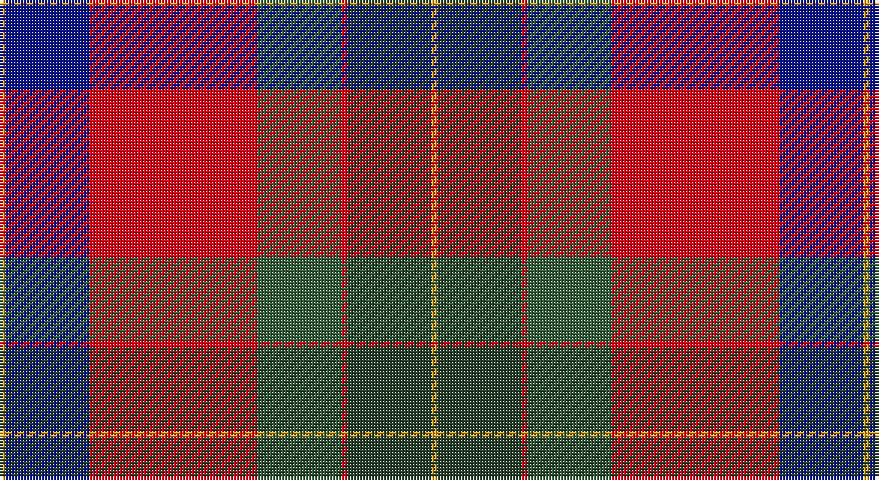

This page is one **sett** — a single exact thread-count. It belongs to the [tartan](/setts/lo1dg14r1y14r28db14lo1/)
(the same proportion at any scale), whose colour order is pattern [YBRGRGY](/stripes/ybrgrgy/).

Sourced from register-of-tartans.  It is a [7 stripe tartan](/stripes/stripes7/).

Original link https://www.tartanregister.gov.uk/tartanDetails.aspx?ref=10333

## Register references

External register numbers recorded for this tartan.

- Scottish Register of Tartans: [10333](https://www.tartanregister.gov.uk/tartanDetails.aspx?ref=10333)

## Thread count
Y/2 DB28 R56 N28 R2 DN28 Y/2

One full sett is **288 threads**.

## Palette

Palette: <strong>Tartan Register</strong> <small style="color:#888">(1 of 5 colours)</small>
<table><thead><tr><th>Colour</th><th>Threads</th><th>Shade</th><th>Base</th><th>OKLCh</th></tr></thead><tbody><tr><td>Y/</td><td style="text-align:right;font-variant-numeric:tabular-nums">2</td><td><code style="background-color:#E0A126;">#E0A126</code> <small style="color:#888">#E0A126</small></td><td>Y <code style="background-color:#F2BF00;">#F2BF00</code></td><td><small style="color:#888">oklch(75.1% 0.146 78.3)</small></td></tr><tr><td>DB</td><td style="text-align:right;font-variant-numeric:tabular-nums">28</td><td><code style="background-color:#0B148E;">#0B148E</code> <small style="color:#888">#0B148E</small></td><td>B <code style="background-color:#2A418A;">#2A418A</code></td><td><small style="color:#888">oklch(31.2% 0.189 266.5)</small></td></tr><tr><td>R</td><td style="text-align:right;font-variant-numeric:tabular-nums">56</td><td><code style="background-color:#EC0416;">#EC0416</code> <small style="color:#888">#EC0416</small></td><td>R <code style="background-color:#CC0000;">#CC0000</code></td><td><small style="color:#888">oklch(59.4% 0.241 27.7)</small></td></tr><tr><td>N</td><td style="text-align:right;font-variant-numeric:tabular-nums">28</td><td><code style="background-color:#355F3B;">#355F3B</code> <small style="color:#888">#355F3B</small></td><td>G <code style="background-color:#006100;">#006100</code></td><td><small style="color:#888">oklch(44.4% 0.075 147.5)</small></td></tr><tr><td>R</td><td style="text-align:right;font-variant-numeric:tabular-nums">2</td><td><code style="background-color:#EC0416;">#EC0416</code> <small style="color:#888">#EC0416</small></td><td>R <code style="background-color:#CC0000;">#CC0000</code></td><td><small style="color:#888">oklch(59.4% 0.241 27.7)</small></td></tr><tr><td>DN</td><td style="text-align:right;font-variant-numeric:tabular-nums">28</td><td><code style="background-color:#273F2A;">#273F2A</code> <small style="color:#888">#273F2A</small></td><td>G <code style="background-color:#006100;">#006100</code></td><td><small style="color:#888">oklch(34.1% 0.047 147.6)</small></td></tr><tr><td>Y/</td><td style="text-align:right;font-variant-numeric:tabular-nums">2</td><td><code style="background-color:#E0A126;">#E0A126</code> <small style="color:#888">#E0A126</small></td><td>Y <code style="background-color:#F2BF00;">#F2BF00</code></td><td><small style="color:#888">oklch(75.1% 0.146 78.3)</small></td></tr></tbody></table>

# Sample pattern

## Nearest tartans

The nearest existing variants by ΔTartan distance, with this tartan at the top so the swatches line up against it.

ΔTartan

Tartan

Sett

—

<a href="/ttd/edit/#slug=lo1dg14r1y14r28db14lo1~x2">Abernethy (Colerain, USA)</a> <a class="nn-out" href="/variants/s7/lo1dg14r1y14r28db14lo1~x2/" title="open its dictionary page">↗</a>

0.60

<a href="/ttd/edit/#slug=r64k30g30db18w4db2w3&amp;base=lo1dg14r1y14r28db14lo1~x2">Clyde Family (Hurleford) (Personal)</a> <a class="nn-out" href="/variants/s7/r64k30g30db18w4db2w3/" title="open its dictionary page">↗</a>

0.63

<a href="/ttd/edit/#slug=r64k30g30b18w4b2w3&amp;base=lo1dg14r1y14r28db14lo1~x2">Clyde (Personal)</a> <a class="nn-out" href="/variants/s7/r64k30g30b18w4b2w3/" title="open its dictionary page">↗</a>

0.92

<a href="/ttd/edit/#slug=db26dg11r8k2r2w2r4w1r15~x2&amp;base=lo1dg14r1y14r28db14lo1~x2">Royal Scottish Assurance</a> <a class="nn-out" href="/variants/s9/db26dg11r8k2r2w2r4w1r15~x2/" title="open its dictionary page">↗</a>

0.93

<a href="/ttd/edit/#slug=db26g11r8k2r2w2r4w1r15~x2&amp;base=lo1dg14r1y14r28db14lo1~x2">Royal Scottish Assurance (Corporate)</a> <a class="nn-out" href="/variants/s9/db26g11r8k2r2w2r4w1r15~x2/" title="open its dictionary page">↗</a>

0.95

<a href="/ttd/edit/#slug=dbi4ly1r28db25k10dbi5k3~x2&amp;base=lo1dg14r1y14r28db14lo1~x2">McKnight (Personal)</a> <a class="nn-out" href="/variants/s7/dbi4ly1r28db25k10dbi5k3~x2/" title="open its dictionary page">↗</a>

1.05

<a href="/ttd/edit/#slug=lb5k1r30dp15r8dg30r8dp2&amp;base=lo1dg14r1y14r28db14lo1~x2">Shaw</a> <a class="nn-out" href="/variants/s8/lb5k1r30dp15r8dg30r8dp2/" title="open its dictionary page">↗</a>

1.06

<a href="/ttd/edit/#slug=t4ly1r28db24k5t5k3~x4&amp;base=lo1dg14r1y14r28db14lo1~x2">McKnight #2 (Personal)</a> <a class="nn-out" href="/variants/s7/t4ly1r28db24k5t5k3~x4/" title="open its dictionary page">↗</a>

1.08

<a href="/ttd/edit/#slug=dg1r24dg8k8dg8r1k4db16w1~x2&amp;base=lo1dg14r1y14r28db14lo1~x2">Manson</a> <a class="nn-out" href="/variants/s9/dg1r24dg8k8dg8r1k4db16w1~x2/" title="open its dictionary page">↗</a>

1.12

<a href="/ttd/edit/#slug=o4dt36r35g2r2g8w4~x2&amp;base=lo1dg14r1y14r28db14lo1~x2">Cherry, John S. (Personal)</a> <a class="nn-out" href="/variants/s7/o4dt36r35g2r2g8w4~x2/" title="open its dictionary page">↗</a>

1.13

<a href="/ttd/edit/#slug=w3dt4w1dt15r24dg15ly1dg4ly3~x4&amp;base=lo1dg14r1y14r28db14lo1~x2">Forrester (Clan)</a> <a class="nn-out" href="/variants/s9/w3dt4w1dt15r24dg15ly1dg4ly3~x4/" title="open its dictionary page">↗</a>

## Neighbour map

Every grey dot is one of 14360 variants placed by the first two principal components of the ΔTartan feature space (44% of its variance). Red is this tartan; blue dots are its nearest — click one to open its page.

<svg viewBox="0 0 640 380" role="img" style="max-width:100%;height:auto;border:1px solid #e0e0e0;border-radius:4px;display:block" xmlns="http://www.w3.org/2000/svg"><image href="/nn/cloud.v1.png" width="640" height="380"/><a href="/variants/s7/r64k30g30db18w4db2w3/"><circle cx="229.9" cy="118.0" r="4" fill="#3465a4"><title>Clyde Family (Hurleford) (Personal)</title></circle></a><a href="/variants/s7/r64k30g30b18w4b2w3/"><circle cx="229.1" cy="120.1" r="4" fill="#3465a4"><title>Clyde (Personal)</title></circle></a><a href="/variants/s9/db26dg11r8k2r2w2r4w1r15~x2/"><circle cx="251.6" cy="126.3" r="4" fill="#3465a4"><title>Royal Scottish Assurance</title></circle></a><a href="/variants/s9/db26g11r8k2r2w2r4w1r15~x2/"><circle cx="242.2" cy="120.3" r="4" fill="#3465a4"><title>Royal Scottish Assurance (Corporate)</title></circle></a><a href="/variants/s7/dbi4ly1r28db25k10dbi5k3~x2/"><circle cx="225.0" cy="136.1" r="4" fill="#3465a4"><title>McKnight (Personal)</title></circle></a><a href="/variants/s8/lb5k1r30dp15r8dg30r8dp2/"><circle cx="274.6" cy="130.4" r="4" fill="#3465a4"><title>Shaw</title></circle></a><a href="/variants/s7/t4ly1r28db24k5t5k3~x4/"><circle cx="248.7" cy="129.3" r="4" fill="#3465a4"><title>McKnight #2 (Personal)</title></circle></a><a href="/variants/s9/dg1r24dg8k8dg8r1k4db16w1~x2/"><circle cx="202.6" cy="136.5" r="4" fill="#3465a4"><title>Manson</title></circle></a><a href="/variants/s7/o4dt36r35g2r2g8w4~x2/"><circle cx="246.2" cy="138.1" r="4" fill="#3465a4"><title>Cherry, John S. (Personal)</title></circle></a><a href="/variants/s9/w3dt4w1dt15r24dg15ly1dg4ly3~x4/"><circle cx="199.4" cy="124.8" r="4" fill="#3465a4"><title>Forrester (Clan)</title></circle></a><circle cx="220.6" cy="134.2" r="5" fill="#c00000"/></svg>

ID: /variants/s7/lo1dg14r1y14r28db14lo1~x2/
