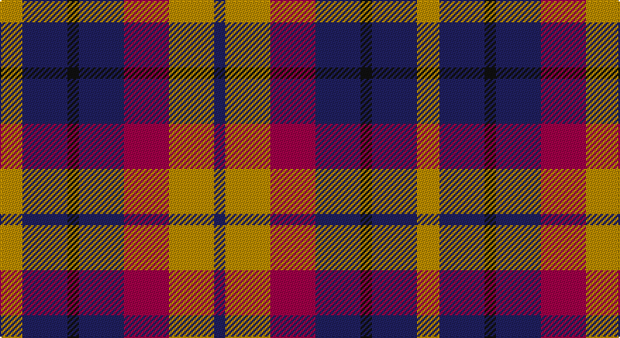

This page is one **sett** — a single exact thread-count. It belongs to the [tartan](/setts/lo2db4k1db4m4lo4db1/)
(the same proportion at any scale), whose colour order is pattern [BYRBKBY](/stripes/byrbkby/).

Part of the [Isle of Gigha](/tartans/isle-of-gigha/) tartan — the named design grouping this sett with its other cloths.

Sourced from tartans-authority.  It is a [7 stripe tartan](/stripes/stripes7/).

Original link http://www.tartansauthority.com/tartan-ferret/display/3085/

## Register references

External register numbers recorded for this tartan.

- Scottish Tartans Authority (ITI): 3085

## Thread count
DY/16 DBa32 K8 DBa32 R32 DY32 DB/8

One full sett is **296 threads**.

## Palette

Palette: <strong>Tartan Register</strong>
<table><thead><tr><th>Colour</th><th>Threads</th><th>Shade</th><th>Base</th><th>OKLCh</th></tr></thead><tbody><tr><td>DY/</td><td style="text-align:right;font-variant-numeric:tabular-nums">16</td><td><code style="background-color:#BC8C00;">#BC8C00</code> <small style="color:#888">#BC8C00</small></td><td>Y <code style="background-color:#F2BF00;">#F2BF00</code></td><td><small style="color:#888">oklch(66.8% 0.137 84.1)</small></td></tr><tr><td>DBa</td><td style="text-align:right;font-variant-numeric:tabular-nums">32</td><td><code style="background-color:#202060;">#202060</code> <small style="color:#888">#202060</small></td><td>B <code style="background-color:#2A418A;">#2A418A</code></td><td><small style="color:#888">oklch(28.9% 0.111 276.9)</small></td></tr><tr><td>K</td><td style="text-align:right;font-variant-numeric:tabular-nums">8</td><td><code style="background-color:#101010;">#101010</code> <small style="color:#888">#101010</small></td><td>K <code style="background-color:#000000;">#000000</code></td><td><small style="color:#888">oklch(17.3% 0.000 89.9)</small></td></tr><tr><td>DBa</td><td style="text-align:right;font-variant-numeric:tabular-nums">32</td><td><code style="background-color:#202060;">#202060</code> <small style="color:#888">#202060</small></td><td>B <code style="background-color:#2A418A;">#2A418A</code></td><td><small style="color:#888">oklch(28.9% 0.111 276.9)</small></td></tr><tr><td>R</td><td style="text-align:right;font-variant-numeric:tabular-nums">32</td><td><code style="background-color:#A00048;">#A00048</code> <small style="color:#888">#A00048</small></td><td>R <code style="background-color:#CC0000;">#CC0000</code></td><td><small style="color:#888">oklch(45.4% 0.182 5.3)</small></td></tr><tr><td>DY</td><td style="text-align:right;font-variant-numeric:tabular-nums">32</td><td><code style="background-color:#BC8C00;">#BC8C00</code> <small style="color:#888">#BC8C00</small></td><td>Y <code style="background-color:#F2BF00;">#F2BF00</code></td><td><small style="color:#888">oklch(66.8% 0.137 84.1)</small></td></tr><tr><td>DB/</td><td style="text-align:right;font-variant-numeric:tabular-nums">8</td><td><code style="background-color:#202060;">#202060</code> <small style="color:#888">#202060</small></td><td>B <code style="background-color:#2A418A;">#2A418A</code></td><td><small style="color:#888">oklch(28.9% 0.111 276.9)</small></td></tr></tbody></table>

# Sample pattern

## Compared to the master

This cloth is one sett of its design; the master sett (the exemplar the design is anchored on) is below for comparison.

<figure style="margin:0"><figcaption style="color:#888;font-size:smaller">this sett</figcaption></figure>
<figure style="margin:0"><figcaption style="color:#888;font-size:smaller"><a href="/setts/dg4m1dg4k4db4lo1db4k4dg4m1dg4db2/">master sett →</a></figcaption></figure>

## Nearest tartans

The nearest existing variants by ΔTartan distance, with this tartan at the top so the swatches line up against it.

ΔTartan

Tartan

Sett

—

<a href="/ttd/edit/#slug=lo2db4k1db4m4lo4db1~x8">Isle of Gigha (District)</a> <a class="nn-out" href="/variants/s7/lo2db4k1db4m4lo4db1~x8/" title="open its dictionary page">↗</a>

0.92

<a href="/ttd/edit/#slug=r3t4k11r11g11do3r3~x4&amp;base=lo2db4k1db4m4lo4db1~x8">Stewart /Stuart- Fragment Cf 1452 &amp; 1445</a> <a class="nn-out" href="/variants/s7/r3t4k11r11g11do3r3~x4/" title="open its dictionary page">↗</a>

0.96

<a href="/ttd/edit/#slug=r14w5dt20k10t10dt10~x2&amp;base=lo2db4k1db4m4lo4db1~x8">Gandy of Myrton (Name)</a> <a class="nn-out" href="/variants/s6/r14w5dt20k10t10dt10~x2/" title="open its dictionary page">↗</a>

1.16

<a href="/ttd/edit/#slug=m5db1m3db1m5db4g3k3g3lo2~x4&amp;base=lo2db4k1db4m4lo4db1~x8">MacGaugh (Name)</a> <a class="nn-out" href="/variants/s10/m5db1m3db1m5db4g3k3g3lo2~x4/" title="open its dictionary page">↗</a>

1.17

<a href="/ttd/edit/#slug=db16r14g16ly3g16r14db16w3~x2&amp;base=lo2db4k1db4m4lo4db1~x8">Forrester (James) (Personal)</a> <a class="nn-out" href="/variants/s8/db16r14g16ly3g16r14db16w3~x2/" title="open its dictionary page">↗</a>

1.23

<a href="/ttd/edit/#slug=ly2g2db8ri4db8r9lb2~x4&amp;base=lo2db4k1db4m4lo4db1~x8">Feis An Eilein (Corporate)</a> <a class="nn-out" href="/variants/s7/ly2g2db8ri4db8r9lb2~x4/" title="open its dictionary page">↗</a>

1.24

<a href="/ttd/edit/#slug=dt6lo2r6lb3k2lo6dt10r2dt3r2~x4&amp;base=lo2db4k1db4m4lo4db1~x8">Commonwealth</a> <a class="nn-out" href="/variants/s10/dt6lo2r6lb3k2lo6dt10r2dt3r2~x4/" title="open its dictionary page">↗</a>

1.24

<a href="/ttd/edit/#slug=db12w4r12w5k4o12db20r4db5r4~x2&amp;base=lo2db4k1db4m4lo4db1~x8">Commonwealth</a> <a class="nn-out" href="/variants/s10/db12w4r12w5k4o12db20r4db5r4~x2/" title="open its dictionary page">↗</a>

1.26

<a href="/ttd/edit/#slug=r2k4r2k4db1lb1db4r1~x4&amp;base=lo2db4k1db4m4lo4db1~x8">MacKean Red (Personal)</a> <a class="nn-out" href="/variants/s8/r2k4r2k4db1lb1db4r1~x4/" title="open its dictionary page">↗</a>

1.28

<a href="/ttd/edit/#slug=k4n4lo1n4r4db4w1~x8&amp;base=lo2db4k1db4m4lo4db1~x8">Blackdown Hills Corporate Tartan</a> <a class="nn-out" href="/variants/s7/k4n4lo1n4r4db4w1~x8/" title="open its dictionary page">↗</a>

1.30

<a href="/ttd/edit/#slug=db9r12dg9db5w2~x4&amp;base=lo2db4k1db4m4lo4db1~x8">Battle of Prestonpans (1745) Herit</a> <a class="nn-out" href="/variants/s5/db9r12dg9db5w2~x4/" title="open its dictionary page">↗</a>

## Neighbour map

Every grey dot is one of 14360 variants placed by the first two principal components of the ΔTartan feature space (44% of its variance). Red is this tartan; blue dots are its nearest — click one to open its page.

<svg viewBox="0 0 640 380" role="img" style="max-width:100%;height:auto;border:1px solid #e0e0e0;border-radius:4px;display:block" xmlns="http://www.w3.org/2000/svg"><image href="/nn/cloud.v1.png" width="640" height="380"/><a href="/variants/s7/r3t4k11r11g11do3r3~x4/"><circle cx="97.2" cy="234.7" r="4" fill="#3465a4"><title>Stewart /Stuart- Fragment Cf 1452 &amp; 1445</title></circle></a><a href="/variants/s6/r14w5dt20k10t10dt10~x2/"><circle cx="103.8" cy="268.6" r="4" fill="#3465a4"><title>Gandy of Myrton (Name)</title></circle></a><a href="/variants/s10/m5db1m3db1m5db4g3k3g3lo2~x4/"><circle cx="137.8" cy="243.2" r="4" fill="#3465a4"><title>MacGaugh (Name)</title></circle></a><a href="/variants/s8/db16r14g16ly3g16r14db16w3~x2/"><circle cx="92.7" cy="241.0" r="4" fill="#3465a4"><title>Forrester (James) (Personal)</title></circle></a><a href="/variants/s7/ly2g2db8ri4db8r9lb2~x4/"><circle cx="137.1" cy="214.0" r="4" fill="#3465a4"><title>Feis An Eilein (Corporate)</title></circle></a><a href="/variants/s10/dt6lo2r6lb3k2lo6dt10r2dt3r2~x4/"><circle cx="149.2" cy="210.9" r="4" fill="#3465a4"><title>Commonwealth</title></circle></a><a href="/variants/s10/db12w4r12w5k4o12db20r4db5r4~x2/"><circle cx="146.5" cy="204.0" r="4" fill="#3465a4"><title>Commonwealth</title></circle></a><a href="/variants/s8/r2k4r2k4db1lb1db4r1~x4/"><circle cx="156.4" cy="254.9" r="4" fill="#3465a4"><title>MacKean Red (Personal)</title></circle></a><a href="/variants/s7/k4n4lo1n4r4db4w1~x8/"><circle cx="59.0" cy="246.4" r="4" fill="#3465a4"><title>Blackdown Hills Corporate Tartan</title></circle></a><a href="/variants/s5/db9r12dg9db5w2~x4/"><circle cx="150.2" cy="264.3" r="4" fill="#3465a4"><title>Battle of Prestonpans (1745) Herit</title></circle></a><circle cx="115.1" cy="251.2" r="5" fill="#c00000"/></svg>

ID: /variants/s7/lo2db4k1db4m4lo4db1~x8/
