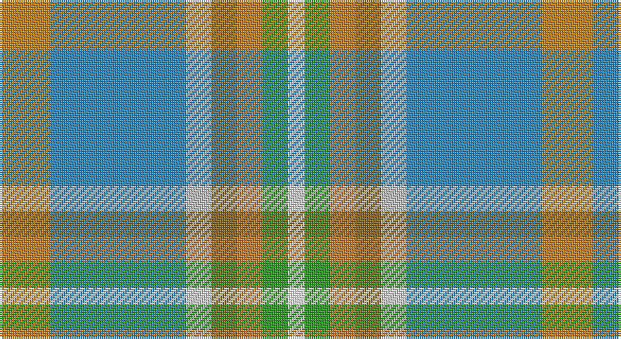

This page is one **sett** — a single exact thread-count. It belongs to the [tartan](/setts/lo6t16lb3y3o3g3w2/)
(the same proportion at any scale), whose colour order is pattern [WGRGWBY](/stripes/wgrgwby/).

Part of the [Atikokan](/tartans/atikokan/) tartan — the named design grouping this sett with its other cloths.

Sourced from tartans-authority.  It is a [7 stripe tartan](/stripes/stripes7/).

Original link http://www.tartansauthority.com/tartan-ferret/display/2596/

## Register references

External register numbers recorded for this tartan.

- Scottish Tartans Authority (ITI): 2596

## Thread count
DY/24 B64 N12 T12 DO12 G12 W/8

One full sett is **256 threads**.

## Palette

Palette: <strong>Tartan Register</strong> <small style="color:#888">(4 of 7 colours)</small>
<table><thead><tr><th>Colour</th><th>Threads</th><th>Shade</th><th>Base</th><th>OKLCh</th></tr></thead><tbody><tr><td>DY/</td><td style="text-align:right;font-variant-numeric:tabular-nums">24</td><td><code style="background-color:#C48008;">#C48008</code> <small style="color:#888">#C48008</small></td><td>Y <code style="background-color:#F2BF00;">#F2BF00</code></td><td><small style="color:#888">oklch(65.5% 0.139 71.7)</small></td></tr><tr><td>B</td><td style="text-align:right;font-variant-numeric:tabular-nums">64</td><td><code style="background-color:#2888C4;">#2888C4</code> <small style="color:#888">#2888C4</small></td><td>B <code style="background-color:#2A418A;">#2A418A</code></td><td><small style="color:#888">oklch(60.1% 0.125 241.5)</small></td></tr><tr><td>N</td><td style="text-align:right;font-variant-numeric:tabular-nums">12</td><td><code style="background-color:#C0C0C0;">#C0C0C0</code> <small style="color:#888">#C0C0C0</small></td><td>W <code style="background-color:#F7F7F7;">#F7F7F7</code></td><td><small style="color:#888">oklch(80.8% 0.000 89.9)</small></td></tr><tr><td>T</td><td style="text-align:right;font-variant-numeric:tabular-nums">12</td><td><code style="background-color:#886414;">#886414</code> <small style="color:#888">#886414</small></td><td>G <code style="background-color:#006100;">#006100</code></td><td><small style="color:#888">oklch(52.7% 0.101 81.8)</small></td></tr><tr><td>DO</td><td style="text-align:right;font-variant-numeric:tabular-nums">12</td><td><code style="background-color:#C47C2C;">#C47C2C</code> <small style="color:#888">#C47C2C</small></td><td>R <code style="background-color:#CC0000;">#CC0000</code></td><td><small style="color:#888">oklch(64.9% 0.128 64.2)</small></td></tr><tr><td>G</td><td style="text-align:right;font-variant-numeric:tabular-nums">12</td><td><code style="background-color:#289C18;">#289C18</code> <small style="color:#888">#289C18</small></td><td>G <code style="background-color:#006100;">#006100</code></td><td><small style="color:#888">oklch(60.6% 0.191 141.6)</small></td></tr><tr><td>W/</td><td style="text-align:right;font-variant-numeric:tabular-nums">8</td><td><code style="background-color:#FCFCFC;">#FCFCFC</code> <small style="color:#888">#FCFCFC</small></td><td>W <code style="background-color:#F7F7F7;">#F7F7F7</code></td><td><small style="color:#888">oklch(99.1% 0.000 89.9)</small></td></tr></tbody></table>

# Sample pattern

## Compared to the master

This cloth is one sett of its design; the master sett (the exemplar the design is anchored on) is below for comparison.

<figure style="margin:0"><figcaption style="color:#888;font-size:smaller">this sett</figcaption></figure>
<figure style="margin:0"><figcaption style="color:#888;font-size:smaller"><a href="/setts/ly6b16lb3r3o3g3w2/">master sett →</a></figcaption></figure>

## Nearest tartans

The nearest existing variants by ΔTartan distance, with this tartan at the top so the swatches line up against it.

ΔTartan

Tartan

Sett

—

<a href="/ttd/edit/#slug=lo6t16lb3y3o3g3w2~x4">Atikokan (District)</a> <a class="nn-out" href="/variants/s7/lo6t16lb3y3o3g3w2~x4/" title="open its dictionary page">↗</a>

1.13

<a href="/ttd/edit/#slug=ly6b16lb3r3o3g3w2~x4&amp;base=lo6t16lb3y3o3g3w2~x4">Atikokan</a> <a class="nn-out" href="/variants/s7/ly6b16lb3r3o3g3w2~x4/" title="open its dictionary page">↗</a>

1.29

<a href="/ttd/edit/#slug=w1y1p2y7g1gi5ly1~x4&amp;base=lo6t16lb3y3o3g3w2~x4">Deeside</a> <a class="nn-out" href="/variants/s7/w1y1p2y7g1gi5ly1~x4/" title="open its dictionary page">↗</a>

1.38

<a href="/ttd/edit/#slug=r1g1ly1t9ly3w3lr9t1~x4&amp;base=lo6t16lb3y3o3g3w2~x4">Curd (2013)</a> <a class="nn-out" href="/variants/s8/r1g1ly1t9ly3w3lr9t1~x4/" title="open its dictionary page">↗</a>

1.40

<a href="/ttd/edit/#slug=lo5o39r16o5g6o5b32lb5~x2&amp;base=lo6t16lb3y3o3g3w2~x4">Washington DC (Fashion)</a> <a class="nn-out" href="/variants/s8/lo5o39r16o5g6o5b32lb5~x2/" title="open its dictionary page">↗</a>

1.41

<a href="/ttd/edit/#slug=k2lg3w2lg3n4lg19o6n23r3ly2~x2&amp;base=lo6t16lb3y3o3g3w2~x4">MacLeroy &amp; Troine</a> <a class="nn-out" href="/variants/s10/k2lg3w2lg3n4lg19o6n23r3ly2~x2/" title="open its dictionary page">↗</a>

1.51

<a href="/ttd/edit/#slug=g25r9t3ly7w3n11~x3&amp;base=lo6t16lb3y3o3g3w2~x4">Montessori School of Denver (School)</a> <a class="nn-out" href="/variants/s6/g25r9t3ly7w3n11~x3/" title="open its dictionary page">↗</a>

1.60

<a href="/ttd/edit/#slug=lr4oi2n2w2o16n5k2lr18g2lr4~x2&amp;base=lo6t16lb3y3o3g3w2~x4">Australian Heavy Horse (Corporate)</a> <a class="nn-out" href="/variants/s10/lr4oi2n2w2o16n5k2lr18g2lr4~x2/" title="open its dictionary page">↗</a>

1.61

<a href="/ttd/edit/#slug=b5dg9o2ly2db6t14w3~x4&amp;base=lo6t16lb3y3o3g3w2~x4">Manx National</a> <a class="nn-out" href="/variants/s7/b5dg9o2ly2db6t14w3~x4/" title="open its dictionary page">↗</a>

1.62

<a href="/ttd/edit/#slug=w3lb2p4lb14n2t14lo2~x4&amp;base=lo6t16lb3y3o3g3w2~x4">Seaside (Fashion)</a> <a class="nn-out" href="/variants/s7/w3lb2p4lb14n2t14lo2~x4/" title="open its dictionary page">↗</a>

1.66

<a href="/ttd/edit/#slug=lo29ly3b19lb3b3r3g17b3g4lb3~x2&amp;base=lo6t16lb3y3o3g3w2~x4">State Seal of California (Fashion)</a> <a class="nn-out" href="/variants/s10/lo29ly3b19lb3b3r3g17b3g4lb3~x2/" title="open its dictionary page">↗</a>

## Neighbour map

Every grey dot is one of 14360 variants placed by the first two principal components of the ΔTartan feature space (44% of its variance). Red is this tartan; blue dots are its nearest — click one to open its page.

<svg viewBox="0 0 640 380" role="img" style="max-width:100%;height:auto;border:1px solid #e0e0e0;border-radius:4px;display:block" xmlns="http://www.w3.org/2000/svg"><image href="/nn/cloud.v1.png" width="640" height="380"/><a href="/variants/s7/ly6b16lb3r3o3g3w2~x4/"><circle cx="139.3" cy="150.6" r="4" fill="#3465a4"><title>Atikokan</title></circle></a><a href="/variants/s7/w1y1p2y7g1gi5ly1~x4/"><circle cx="189.6" cy="188.6" r="4" fill="#3465a4"><title>Deeside</title></circle></a><a href="/variants/s8/r1g1ly1t9ly3w3lr9t1~x4/"><circle cx="164.3" cy="163.1" r="4" fill="#3465a4"><title>Curd (2013)</title></circle></a><a href="/variants/s8/lo5o39r16o5g6o5b32lb5~x2/"><circle cx="215.6" cy="188.1" r="4" fill="#3465a4"><title>Washington DC (Fashion)</title></circle></a><a href="/variants/s10/k2lg3w2lg3n4lg19o6n23r3ly2~x2/"><circle cx="204.0" cy="134.6" r="4" fill="#3465a4"><title>MacLeroy &amp; Troine</title></circle></a><a href="/variants/s6/g25r9t3ly7w3n11~x3/"><circle cx="182.3" cy="200.9" r="4" fill="#3465a4"><title>Montessori School of Denver (School)</title></circle></a><a href="/variants/s10/lr4oi2n2w2o16n5k2lr18g2lr4~x2/"><circle cx="190.7" cy="129.8" r="4" fill="#3465a4"><title>Australian Heavy Horse (Corporate)</title></circle></a><a href="/variants/s7/b5dg9o2ly2db6t14w3~x4/"><circle cx="80.1" cy="184.9" r="4" fill="#3465a4"><title>Manx National</title></circle></a><a href="/variants/s7/w3lb2p4lb14n2t14lo2~x4/"><circle cx="166.2" cy="181.8" r="4" fill="#3465a4"><title>Seaside (Fashion)</title></circle></a><a href="/variants/s10/lo29ly3b19lb3b3r3g17b3g4lb3~x2/"><circle cx="159.6" cy="154.1" r="4" fill="#3465a4"><title>State Seal of California (Fashion)</title></circle></a><circle cx="167.6" cy="168.1" r="5" fill="#c00000"/></svg>

ID: /variants/s7/lo6t16lb3y3o3g3w2~x4/
