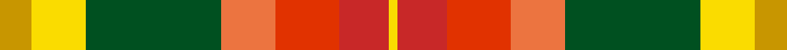
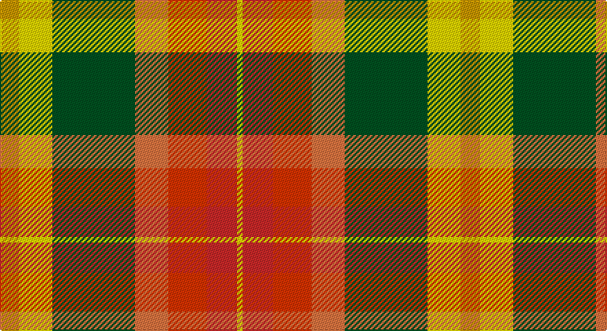

This page is one **sett** — a single exact thread-count. It belongs to the [tartan](/setts/lo7ly12dg30o12ri14r11ly2/)
(the same proportion at any scale), whose colour order is pattern [YRRRGYY](/stripes/yrrrgyy/).

Part of the [Unidentified Silk](/tartans/unidentified-silk/) tartan — the named design grouping this sett with its other cloths.

Sourced from register-of-tartans.  It is a [7 stripe tartan](/stripes/stripes7/).

Original link https://www.tartanregister.gov.uk/tartanDetails.aspx?ref=4384

## Also known as

This cloth is also recorded under:

- Unidentified Silk Plaid
- Unidentified Silk Plaid #2
- Unidentified, Silk Plaid

## Register references

External register numbers recorded for this tartan.

- Scottish Register of Tartans: [4384](https://www.tartanregister.gov.uk/tartanDetails.aspx?ref=4384)
- Scottish Tartans World Register: 1891

## Thread count
DY/14 Y24 G60 O24 Ra28 R22 Y/4

One full sett is **334 threads**.

## Palette

Palette: <strong>Tartan Register</strong> <small style="color:#888">(2 of 6 colours)</small>
<table><thead><tr><th>Colour</th><th>Threads</th><th>Shade</th><th>Base</th><th>OKLCh</th></tr></thead><tbody><tr><td>DY/</td><td style="text-align:right;font-variant-numeric:tabular-nums">14</td><td><code style="background-color:#C89600;">#C89600</code> <small style="color:#888">#C89600</small></td><td>Y <code style="background-color:#F2BF00;">#F2BF00</code></td><td><small style="color:#888">oklch(70.2% 0.144 84.7)</small></td></tr><tr><td>Y</td><td style="text-align:right;font-variant-numeric:tabular-nums">24</td><td><code style="background-color:#FADC00;">#FADC00</code> <small style="color:#888">#FADC00</small></td><td>Y <code style="background-color:#F2BF00;">#F2BF00</code></td><td><small style="color:#888">oklch(89.2% 0.185 99.2)</small></td></tr><tr><td>G</td><td style="text-align:right;font-variant-numeric:tabular-nums">60</td><td><code style="background-color:#005020;">#005020</code> <small style="color:#888">#005020</small></td><td>G <code style="background-color:#006100;">#006100</code></td><td><small style="color:#888">oklch(37.7% 0.105 149.6)</small></td></tr><tr><td>O</td><td style="text-align:right;font-variant-numeric:tabular-nums">24</td><td><code style="background-color:#EC7440;">#EC7440</code> <small style="color:#888">#EC7440</small></td><td>R <code style="background-color:#CC0000;">#CC0000</code></td><td><small style="color:#888">oklch(69.1% 0.162 42.6)</small></td></tr><tr><td>Ra</td><td style="text-align:right;font-variant-numeric:tabular-nums">28</td><td><code style="background-color:#E13200;">#E13200</code> <small style="color:#888">#E13200</small></td><td>R <code style="background-color:#CC0000;">#CC0000</code></td><td><small style="color:#888">oklch(59.2% 0.215 33.6)</small></td></tr><tr><td>R</td><td style="text-align:right;font-variant-numeric:tabular-nums">22</td><td><code style="background-color:#C82828;">#C82828</code> <small style="color:#888">#C82828</small></td><td>R <code style="background-color:#CC0000;">#CC0000</code></td><td><small style="color:#888">oklch(54.2% 0.196 26.8)</small></td></tr><tr><td>Y/</td><td style="text-align:right;font-variant-numeric:tabular-nums">4</td><td><code style="background-color:#FADC00;">#FADC00</code> <small style="color:#888">#FADC00</small></td><td>Y <code style="background-color:#F2BF00;">#F2BF00</code></td><td><small style="color:#888">oklch(89.2% 0.185 99.2)</small></td></tr></tbody></table>

# Sample pattern

## Compared to the master

This cloth is one sett of its design; the master sett (the exemplar the design is anchored on) is below for comparison.

<figure style="margin:0"><figcaption style="color:#888;font-size:smaller">this sett</figcaption></figure>
<figure style="margin:0"><figcaption style="color:#888;font-size:smaller"><a href="/setts/db7o8dg15ly6lo3/">master sett →</a></figcaption></figure>

## Nearest tartans

The nearest existing variants by ΔTartan distance, with this tartan at the top so the swatches line up against it.

ΔTartan

Tartan

Sett

—

<a href="/ttd/edit/#slug=lo7ly12dg30o12ri14r11ly2~x2">Unidentified Silk Plaid #2</a> <a class="nn-out" href="/variants/s7/lo7ly12dg30o12ri14r11ly2~x2/" title="open its dictionary page">↗</a>

1.16

<a href="/ttd/edit/#slug=y7ly12g30oi12o14r11ly2~x2&amp;base=lo7ly12dg30o12ri14r11ly2~x2">Unidentified, Silk Plaid</a> <a class="nn-out" href="/variants/s7/y7ly12g30oi12o14r11ly2~x2/" title="open its dictionary page">↗</a>

1.25

<a href="/ttd/edit/#slug=db2lo10lb1o8g7dr10lb2~x2&amp;base=lo7ly12dg30o12ri14r11ly2~x2">Kipp (Personal)</a> <a class="nn-out" href="/variants/s7/db2lo10lb1o8g7dr10lb2~x2/" title="open its dictionary page">↗</a>

1.30

<a href="/ttd/edit/#slug=w3g24r13gi4lo11r8db2~x2&amp;base=lo7ly12dg30o12ri14r11ly2~x2">Elystan Glodrydd (Name)</a> <a class="nn-out" href="/variants/s7/w3g24r13gi4lo11r8db2~x2/" title="open its dictionary page">↗</a>

1.31

<a href="/ttd/edit/#slug=ly4r2ly21dt11w2o21lyi4~x2&amp;base=lo7ly12dg30o12ri14r11ly2~x2">Barbour - Muted</a> <a class="nn-out" href="/variants/s7/ly4r2ly21dt11w2o21lyi4~x2/" title="open its dictionary page">↗</a>

1.32

<a href="/ttd/edit/#slug=w2ri8o5ly6w5g21w6ri8r4w2&amp;base=lo7ly12dg30o12ri14r11ly2~x2">Jacobite, Silk sash</a> <a class="nn-out" href="/variants/s10/w2ri8o5ly6w5g21w6ri8r4w2/" title="open its dictionary page">↗</a>

1.39

<a href="/ttd/edit/#slug=w2r8dy5ly6w5dg21w6r8ri4w2&amp;base=lo7ly12dg30o12ri14r11ly2~x2">Jacobite Silk sash</a> <a class="nn-out" href="/variants/s10/w2r8dy5ly6w5dg21w6r8ri4w2/" title="open its dictionary page">↗</a>

1.39

<a href="/ttd/edit/#slug=ly4g18b4ri8b8r21w1~x2&amp;base=lo7ly12dg30o12ri14r11ly2~x2">Bathija (Name)</a> <a class="nn-out" href="/variants/s7/ly4g18b4ri8b8r21w1~x2/" title="open its dictionary page">↗</a>

1.46

<a href="/ttd/edit/#slug=r10n3db1lb8db1lo2g5~x4&amp;base=lo7ly12dg30o12ri14r11ly2~x2">Porcupine City of</a> <a class="nn-out" href="/variants/s7/r10n3db1lb8db1lo2g5~x4/" title="open its dictionary page">↗</a>

1.56

<a href="/ttd/edit/#slug=loi22ly22dr2lb6dr2lo2dr16lg5loi8lb2~x2&amp;base=lo7ly12dg30o12ri14r11ly2~x2">Bruce of Kinnaird (Fashion)</a> <a class="nn-out" href="/variants/s10/loi22ly22dr2lb6dr2lo2dr16lg5loi8lb2~x2/" title="open its dictionary page">↗</a>

1.57

<a href="/ttd/edit/#slug=ly30k2ly15r15w2r15db15dg15db4dg15db15~x2&amp;base=lo7ly12dg30o12ri14r11ly2~x2">Buchanan #6</a> <a class="nn-out" href="/variants/s11/ly30k2ly15r15w2r15db15dg15db4dg15db15~x2/" title="open its dictionary page">↗</a>

## Neighbour map

Every grey dot is one of 14360 variants placed by the first two principal components of the ΔTartan feature space (44% of its variance). Red is this tartan; blue dots are its nearest — click one to open its page.

<svg viewBox="0 0 640 380" role="img" style="max-width:100%;height:auto;border:1px solid #e0e0e0;border-radius:4px;display:block" xmlns="http://www.w3.org/2000/svg"><image href="/nn/cloud.v1.png" width="640" height="380"/><a href="/variants/s7/y7ly12g30oi12o14r11ly2~x2/"><circle cx="123.8" cy="165.8" r="4" fill="#3465a4"><title>Unidentified, Silk Plaid</title></circle></a><a href="/variants/s7/db2lo10lb1o8g7dr10lb2~x2/"><circle cx="63.7" cy="174.4" r="4" fill="#3465a4"><title>Kipp (Personal)</title></circle></a><a href="/variants/s7/w3g24r13gi4lo11r8db2~x2/"><circle cx="162.0" cy="166.9" r="4" fill="#3465a4"><title>Elystan Glodrydd (Name)</title></circle></a><a href="/variants/s7/ly4r2ly21dt11w2o21lyi4~x2/"><circle cx="147.8" cy="145.2" r="4" fill="#3465a4"><title>Barbour - Muted</title></circle></a><a href="/variants/s10/w2ri8o5ly6w5g21w6ri8r4w2/"><circle cx="88.7" cy="138.8" r="4" fill="#3465a4"><title>Jacobite, Silk sash</title></circle></a><a href="/variants/s10/w2r8dy5ly6w5dg21w6r8ri4w2/"><circle cx="80.4" cy="133.8" r="4" fill="#3465a4"><title>Jacobite Silk sash</title></circle></a><a href="/variants/s7/ly4g18b4ri8b8r21w1~x2/"><circle cx="154.2" cy="142.9" r="4" fill="#3465a4"><title>Bathija (Name)</title></circle></a><a href="/variants/s7/r10n3db1lb8db1lo2g5~x4/"><circle cx="115.9" cy="164.2" r="4" fill="#3465a4"><title>Porcupine City of</title></circle></a><a href="/variants/s10/loi22ly22dr2lb6dr2lo2dr16lg5loi8lb2~x2/"><circle cx="131.9" cy="134.8" r="4" fill="#3465a4"><title>Bruce of Kinnaird (Fashion)</title></circle></a><a href="/variants/s11/ly30k2ly15r15w2r15db15dg15db4dg15db15~x2/"><circle cx="78.9" cy="138.4" r="4" fill="#3465a4"><title>Buchanan #6</title></circle></a><circle cx="106.7" cy="154.6" r="5" fill="#c00000"/></svg>

ID: /variants/s7/lo7ly12dg30o12ri14r11ly2~x2/
