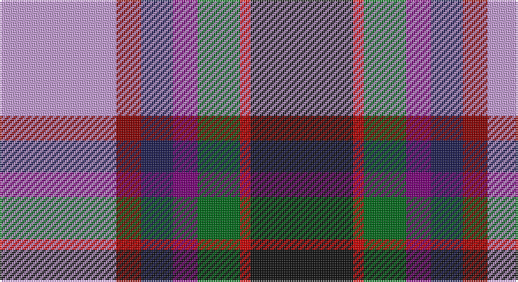

This page is one **sett** — a single exact thread-count. It belongs to the [tartan](/setts/lp33ri7db9dp7g12r3k29/)
(the same proportion at any scale), whose colour order is pattern [KRGBBRW](/stripes/krgbbrw/).

Part of the [Hatcher](/tartans/hatcher/) tartan — the named design grouping this sett with its other cloths.

Sourced from tartans-authority.  It is a [7 stripe tartan](/stripes/stripes7/).

Original link http://www.tartansauthority.com/tartan-ferret/display/10121/

## Register references

External register numbers recorded for this tartan.

- Scottish Register of Tartans: [10121](https://www.tartanregister.gov.uk/tartanDetails?ref=10121)
- Scottish Tartans Authority (ITI): 10121

## Thread count
LP/66 DR14 DB18 P14 G24 R6 K/58

One full sett is **276 threads**.

## Palette

Palette: <strong>Tartan Register</strong>
<table><thead><tr><th>Colour</th><th>Threads</th><th>Shade</th><th>Base</th><th>OKLCh</th></tr></thead><tbody><tr><td>LP/</td><td style="text-align:right;font-variant-numeric:tabular-nums">66</td><td><code style="background-color:#C49CD8;">#C49CD8</code> <small style="color:#888">#C49CD8</small></td><td>W <code style="background-color:#F7F7F7;">#F7F7F7</code></td><td><small style="color:#888">oklch(75.0% 0.095 314.2)</small></td></tr><tr><td>DR</td><td style="text-align:right;font-variant-numeric:tabular-nums">14</td><td><code style="background-color:#880000;">#880000</code> <small style="color:#888">#880000</small></td><td>R <code style="background-color:#CC0000;">#CC0000</code></td><td><small style="color:#888">oklch(39.4% 0.162 29.2)</small></td></tr><tr><td>DB</td><td style="text-align:right;font-variant-numeric:tabular-nums">18</td><td><code style="background-color:#1C1C50;">#1C1C50</code> <small style="color:#888">#1C1C50</small></td><td>B <code style="background-color:#2A418A;">#2A418A</code></td><td><small style="color:#888">oklch(26.2% 0.093 277.9)</small></td></tr><tr><td>P</td><td style="text-align:right;font-variant-numeric:tabular-nums">14</td><td><code style="background-color:#780078;">#780078</code> <small style="color:#888">#780078</small></td><td>B <code style="background-color:#2A418A;">#2A418A</code></td><td><small style="color:#888">oklch(40.2% 0.185 328.4)</small></td></tr><tr><td>G</td><td style="text-align:right;font-variant-numeric:tabular-nums">24</td><td><code style="background-color:#006818;">#006818</code> <small style="color:#888">#006818</small></td><td>G <code style="background-color:#006100;">#006100</code></td><td><small style="color:#888">oklch(45.0% 0.142 145.0)</small></td></tr><tr><td>R</td><td style="text-align:right;font-variant-numeric:tabular-nums">6</td><td><code style="background-color:#C80000;">#C80000</code> <small style="color:#888">#C80000</small></td><td>R <code style="background-color:#CC0000;">#CC0000</code></td><td><small style="color:#888">oklch(52.3% 0.215 29.2)</small></td></tr><tr><td>K/</td><td style="text-align:right;font-variant-numeric:tabular-nums">58</td><td><code style="background-color:#101010;">#101010</code> <small style="color:#888">#101010</small></td><td>K <code style="background-color:#000000;">#000000</code></td><td><small style="color:#888">oklch(17.3% 0.000 89.9)</small></td></tr></tbody></table>

# Sample pattern

## Compared to the master

This cloth is one sett of its design; the master sett (the exemplar the design is anchored on) is below for comparison.

<figure style="margin:0"><figcaption style="color:#888;font-size:smaller">this sett</figcaption></figure>
<figure style="margin:0"><figcaption style="color:#888;font-size:smaller"><a href="/setts/lp33r7dt9b7lg12ri3k29/">master sett →</a></figcaption></figure>

## Nearest tartans

The nearest existing variants by ΔTartan distance, with this tartan at the top so the swatches line up against it.

ΔTartan

Tartan

Sett

—

<a href="/ttd/edit/#slug=lp33ri7db9dp7g12r3k29~x2">Hatcher (Personal)</a> <a class="nn-out" href="/variants/s7/lp33ri7db9dp7g12r3k29~x2/" title="open its dictionary page">↗</a>

0.77

<a href="/ttd/edit/#slug=dt8t1db1t1m12ly6k12w2~x4&amp;base=lp33ri7db9dp7g12r3k29~x2">Maryland</a> <a class="nn-out" href="/variants/s8/dt8t1db1t1m12ly6k12w2~x4/" title="open its dictionary page">↗</a>

0.81

<a href="/ttd/edit/#slug=lp33r7dt9b7lg12ri3k29~x2&amp;base=lp33ri7db9dp7g12r3k29~x2">Hatcher (Texas) (Personal)</a> <a class="nn-out" href="/variants/s7/lp33r7dt9b7lg12ri3k29~x2/" title="open its dictionary page">↗</a>

1.16

<a href="/ttd/edit/#slug=k20r6ly3db24g3r8w4~x2&amp;base=lp33ri7db9dp7g12r3k29~x2">Eichelberger (Perrsonal)</a> <a class="nn-out" href="/variants/s7/k20r6ly3db24g3r8w4~x2/" title="open its dictionary page">↗</a>

1.19

<a href="/ttd/edit/#slug=w6gi10r22db16g2k4k5~x2&amp;base=lp33ri7db9dp7g12r3k29~x2">Nicolson of Taransay (Personal)</a> <a class="nn-out" href="/variants/s7/w6gi10r22db16g2k4k5~x2/" title="open its dictionary page">↗</a>

1.24

<a href="/ttd/edit/#slug=db18o4ri4g12lb3r2w2dp10~x2&amp;base=lp33ri7db9dp7g12r3k29~x2">Serco Caledonian Sleeper</a> <a class="nn-out" href="/variants/s8/db18o4ri4g12lb3r2w2dp10~x2/" title="open its dictionary page">↗</a>

1.25

<a href="/ttd/edit/#slug=r4ly3w12k16g5db20k4w2~x2&amp;base=lp33ri7db9dp7g12r3k29~x2">Iowa Dress (District)</a> <a class="nn-out" href="/variants/s8/r4ly3w12k16g5db20k4w2~x2/" title="open its dictionary page">↗</a>

1.25

<a href="/ttd/edit/#slug=r17k5w4k6ly5db31k5g6w3~x2&amp;base=lp33ri7db9dp7g12r3k29~x2">Dean/Dundas (Personal)</a> <a class="nn-out" href="/variants/s9/r17k5w4k6ly5db31k5g6w3~x2/" title="open its dictionary page">↗</a>

1.28

<a href="/ttd/edit/#slug=r6db3p24w2k23y23k2y6~x2&amp;base=lp33ri7db9dp7g12r3k29~x2">Culloden, Grey</a> <a class="nn-out" href="/variants/s8/r6db3p24w2k23y23k2y6~x2/" title="open its dictionary page">↗</a>

1.28

<a href="/ttd/edit/#slug=r6db3dp24w2k23y23k2y6~x2&amp;base=lp33ri7db9dp7g12r3k29~x2">Culloden Grey</a> <a class="nn-out" href="/variants/s8/r6db3dp24w2k23y23k2y6~x2/" title="open its dictionary page">↗</a>

1.28

<a href="/ttd/edit/#slug=k40n15o10ly3t5w5db10t20&amp;base=lp33ri7db9dp7g12r3k29~x2">Julien Pigeut Tartan</a> <a class="nn-out" href="/variants/s8/k40n15o10ly3t5w5db10t20/" title="open its dictionary page">↗</a>

## Neighbour map

Every grey dot is one of 14360 variants placed by the first two principal components of the ΔTartan feature space (44% of its variance). Red is this tartan; blue dots are its nearest — click one to open its page.

<svg viewBox="0 0 640 380" role="img" style="max-width:100%;height:auto;border:1px solid #e0e0e0;border-radius:4px;display:block" xmlns="http://www.w3.org/2000/svg"><image href="/nn/cloud.v1.png" width="640" height="380"/><a href="/variants/s8/dt8t1db1t1m12ly6k12w2~x4/"><circle cx="68.2" cy="126.4" r="4" fill="#3465a4"><title>Maryland</title></circle></a><a href="/variants/s7/lp33r7dt9b7lg12ri3k29~x2/"><circle cx="57.9" cy="129.0" r="4" fill="#3465a4"><title>Hatcher (Texas) (Personal)</title></circle></a><a href="/variants/s7/k20r6ly3db24g3r8w4~x2/"><circle cx="117.4" cy="169.7" r="4" fill="#3465a4"><title>Eichelberger (Perrsonal)</title></circle></a><a href="/variants/s7/w6gi10r22db16g2k4k5~x2/"><circle cx="104.3" cy="161.2" r="4" fill="#3465a4"><title>Nicolson of Taransay (Personal)</title></circle></a><a href="/variants/s8/db18o4ri4g12lb3r2w2dp10~x2/"><circle cx="55.1" cy="131.7" r="4" fill="#3465a4"><title>Serco Caledonian Sleeper</title></circle></a><a href="/variants/s8/r4ly3w12k16g5db20k4w2~x2/"><circle cx="68.3" cy="150.0" r="4" fill="#3465a4"><title>Iowa Dress (District)</title></circle></a><a href="/variants/s9/r17k5w4k6ly5db31k5g6w3~x2/"><circle cx="122.0" cy="132.9" r="4" fill="#3465a4"><title>Dean/Dundas (Personal)</title></circle></a><a href="/variants/s8/r6db3p24w2k23y23k2y6~x2/"><circle cx="119.4" cy="142.0" r="4" fill="#3465a4"><title>Culloden, Grey</title></circle></a><a href="/variants/s8/r6db3dp24w2k23y23k2y6~x2/"><circle cx="138.1" cy="152.9" r="4" fill="#3465a4"><title>Culloden Grey</title></circle></a><a href="/variants/s8/k40n15o10ly3t5w5db10t20/"><circle cx="108.2" cy="136.6" r="4" fill="#3465a4"><title>Julien Pigeut Tartan</title></circle></a><circle cx="80.0" cy="142.7" r="5" fill="#c00000"/></svg>

ID: /variants/s7/lp33ri7db9dp7g12r3k29~x2/
