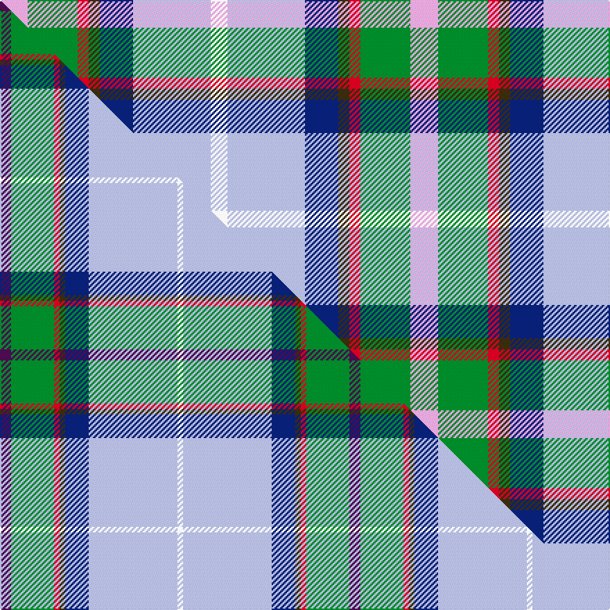

This page is one **sett** — a single exact thread-count. It belongs to the [tartan](/setts/lp5g9r2dy2db6lb14w3/)
(the same proportion at any scale), whose colour order is pattern [WGRGBWW](/stripes/wgrgbww/).

Part of the [Manx National](/tartans/manx-national/) tartan — the named design grouping this sett with its other cloths.

Sourced from tartans-authority.  It is a [7 stripe tartan](/stripes/stripes7/).

Original link http://www.tartansauthority.com/tartan-ferret/display/185/

## Register references

External register numbers recorded for this tartan.

- Scottish Tartans Authority (ITI): 185

## Thread count
LP/20 G36 R8 DY8 DB24 LB56 W/12

One full sett is **296 threads**.

## Palette
<table><thead><tr><th>Colour</th><th>Shade</th><th>OKLCh</th></tr></thead><tbody><tr><td>LB</td><td><code style="background-color:#B5BBDE;">#B5BBDE</code> <small style="color:#888">#B5BBDE</small></td><td><small style="color:#888">oklch(79.9% 0.050 277.6)</small></td></tr><tr><td>DB</td><td><code style="background-color:#082077;">#082077</code> <small style="color:#888">#082077</small></td><td><small style="color:#888">oklch(30.0% 0.149 265.1)</small></td></tr><tr><td>G</td><td><code style="background-color:#008B2A;">#008B2A</code> <small style="color:#888">#008B2A</small></td><td><small style="color:#888">oklch(55.4% 0.170 145.9)</small></td></tr><tr><td>W</td><td><code style="background-color:#F7F7F7;">#F7F7F7</code> <small style="color:#888">#F7F7F7</small></td><td><small style="color:#888">oklch(97.6% 0.000 89.9)</small></td></tr><tr><td>LP</td><td><code style="background-color:#E4A6DB;">#E4A6DB</code> <small style="color:#888">#E4A6DB</small></td><td><small style="color:#888">oklch(80.0% 0.100 331.6)</small></td></tr><tr><td>R</td><td><code style="background-color:#D60020;">#D60020</code> <small style="color:#888">#D60020</small></td><td><small style="color:#888">oklch(55.2% 0.224 25.5)</small></td></tr><tr><td>DY</td><td><code style="background-color:#3A2B0D;">#3A2B0D</code> <small style="color:#888">#3A2B0D</small></td><td><small style="color:#888">oklch(30.0% 0.049 82.0)</small></td></tr></tbody></table>

# Sample pattern

## Compared to the master

This cloth is one sett of its design; the master sett (the exemplar the design is anchored on) is below for comparison.

Its **ΔTartan distance** from the master is **2.34** — the same measure the nearest-tartans table ranks by (0 is identical; a re-scale of the same cloth is near 0, a recolour or a different proportion further).

<figure class="master-compare" style="margin:0">

this sett
master sett ★

<figcaption style="color:#888;font-size:smaller">One weave of this sett against the <a href="/setts/dp8g31r4dy4db17lb64w4/">master sett ★</a>, split on the diagonal: a shared proportion runs seamlessly across it with only the shades shifting; a different proportion breaks on it.</figcaption>
</figure>

## Nearest tartan variants

The nearest existing variants by ΔTartan distance, with this cloth at the top so the swatches line up against it.

ΔTartan

Threads

Variant

Sett

—

296

<a href="/variants/s7/lp5g9r2dy2db6lb14w3~x4/">Manx National (District)</a>

<a href="/ttd/edit/#slug=p5g9r2dy2db6lb14w3~x4&amp;base=lp5g9r2dy2db6lb14w3~x4" title="compare in the TTD">0.00</a>

296

<a href="/variants/s7/p5g9r2dy2db6lb14w3~x4/">Manx National</a>

<a href="/ttd/edit/#slug=dp2g6r1dy1db3lb10w1~x2&amp;base=lp5g9r2dy2db6lb14w3~x4" title="compare in the TTD">0.31</a>

90

<a href="/variants/s7/dp2g6r1dy1db3lb10w1~x2/">Manx National District Tartan</a>

<a href="/ttd/edit/#slug=dp2g6r1y1db3b10w1~x2&amp;base=lp5g9r2dy2db6lb14w3~x4" title="compare in the TTD">0.31</a>

90

<a href="/variants/s7/dp2g6r1y1db3b10w1~x2/">Manx National</a>

<a href="/ttd/edit/#slug=dp2g8r1dy1db6lb15w1~x4&amp;base=lp5g9r2dy2db6lb14w3~x4" title="compare in the TTD">0.54</a>

260

<a href="/variants/s7/dp2g8r1dy1db6lb15w1~x4/">Manx National District Tartan</a>

<a href="/ttd/edit/#slug=db13y2r4g2lb8w2~x6&amp;base=lp5g9r2dy2db6lb14w3~x4" title="compare in the TTD">1.82</a>

282

<a href="/variants/s6/db13y2r4g2lb8w2~x6/">Meh Dundee</a>

<a href="/ttd/edit/#slug=w18lb22db15y6g10dp5g6r5~x2&amp;base=lp5g9r2dy2db6lb14w3~x4" title="compare in the TTD">2.14</a>

302

<a href="/variants/s8/w18lb22db15y6g10dp5g6r5~x2/">Queensland</a>

<a href="/ttd/edit/#slug=w3lb4db3y1g2lp1g1r1~x12&amp;base=lp5g9r2dy2db6lb14w3~x4" title="compare in the TTD">2.17</a>

336

<a href="/variants/s8/w3lb4db3y1g2lp1g1r1~x12/">Queensland (District)</a>

<a href="/ttd/edit/#slug=r3dt20db20g2lr4lri17w3~x2~lr3001120-lri3001240&amp;base=lp5g9r2dy2db6lb14w3~x4" title="compare in the TTD">2.24</a>

264

<a href="/variants/s7/r3dt20db20g2lr4lri17w3~x2~lr3001120-lri3001240/">Silversea</a>

<a href="/ttd/edit/#slug=dp2w12t11lb12k1g2~x4&amp;base=lp5g9r2dy2db6lb14w3~x4" title="compare in the TTD">2.51</a>

304

<a href="/variants/s6/dp2w12t11lb12k1g2~x4/">Isle of Barra (District)</a>

<a href="/ttd/edit/#slug=ly3r3lb4w2db11dg13k2~x2~r2109032-db1406275-dg1806142&amp;base=lp5g9r2dy2db6lb14w3~x4" title="compare in the TTD">2.73</a>

142

<a href="/variants/s7/ly3r3lb4w2db11dg13k2~x2~r2109032-db1406275-dg1806142/">Kentucky State American District Tartan</a>

## Neighbour map

Every grey dot is one of 13620 variants placed by the first two principal components of the ΔTartan feature space (42% of its variance). Red is this tartan; blue dots are its nearest — click one to open its page.

<svg viewBox="0 0 640 380" role="img" style="max-width:100%;height:auto;border:1px solid #e0e0e0;border-radius:4px;display:block" xmlns="http://www.w3.org/2000/svg"><image href="/nn/cloud.v1.png" width="640" height="380"/><a href="/variants/s7/p5g9r2dy2db6lb14w3~x4/"><circle cx="82.7" cy="195.4" r="4" fill="#3465a4"><title>Manx National</title></circle></a><a href="/variants/s7/dp2g6r1dy1db3lb10w1~x2/"><circle cx="148.6" cy="161.5" r="4" fill="#3465a4"><title>Manx National District Tartan</title></circle></a><a href="/variants/s7/dp2g6r1y1db3b10w1~x2/"><circle cx="180.6" cy="172.7" r="4" fill="#3465a4"><title>Manx National</title></circle></a><a href="/variants/s7/dp2g8r1dy1db6lb15w1~x4/"><circle cx="180.8" cy="139.9" r="4" fill="#3465a4"><title>Manx National District Tartan</title></circle></a><a href="/variants/s6/db13y2r4g2lb8w2~x6/"><circle cx="143.5" cy="200.7" r="4" fill="#3465a4"><title>Meh Dundee</title></circle></a><a href="/variants/s8/w18lb22db15y6g10dp5g6r5~x2/"><circle cx="14.0" cy="220.4" r="4" fill="#3465a4"><title>Queensland</title></circle></a><a href="/variants/s8/w3lb4db3y1g2lp1g1r1~x12/"><circle cx="14.0" cy="228.1" r="4" fill="#3465a4"><title>Queensland (District)</title></circle></a><a href="/variants/s7/r3dt20db20g2lr4lri17w3~x2~lr3001120-lri3001240/"><circle cx="101.0" cy="176.0" r="4" fill="#3465a4"><title>Silversea</title></circle></a><a href="/variants/s6/dp2w12t11lb12k1g2~x4/"><circle cx="116.0" cy="183.8" r="4" fill="#3465a4"><title>Isle of Barra (District)</title></circle></a><a href="/variants/s7/ly3r3lb4w2db11dg13k2~x2~r2109032-db1406275-dg1806142/"><circle cx="66.0" cy="174.8" r="4" fill="#3465a4"><title>Kentucky State American District Tartan</title></circle></a><circle cx="85.7" cy="198.3" r="5" fill="#c00000"/><text x="320" y="376" text-anchor="middle" font-size="11" fill="#999">ground</text><text x="11" y="190" text-anchor="middle" font-size="11" fill="#999" transform="rotate(-90 11 190)">complexity</text></svg>

ID: /variants/s7/lp5g9r2dy2db6lb14w3~x4/
