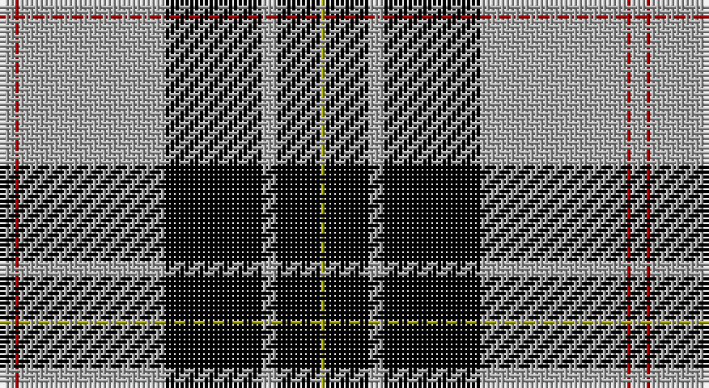

This page is one **sett** — a single exact thread-count. It belongs to the [tartan](/setts/lr3r1lr30k20lr3k9ly1/)
(the same proportion at any scale), whose colour order is pattern [YKYKYRY](/stripes/ykykyry/).

Part of the [MacPherson Dress](/tartans/macpherson-dress/) tartan — the named design grouping this sett with its other cloths.

Sourced from weddslist.  It is a [7 stripe tartan](/stripes/stripes7/).

Original link http://www.weddslist.com/cgi-bin/tartans/pg.pl?source=x

## Also known as

This cloth is also recorded under:

- MacPherson Dress Blue
- MacPherson Dress Blue #2
- MacPherson Dress Green
- MacPherson Dress Purple
- MacPherson Dress Red
- MacPherson Dress, Blue
- MacPherson Dress, Green
- MacPherson Dress, Purple
- MacPherson Dress, Red
- MacPherson Dress, Royal Blue
- MacPherson Red Dress
- MacPherson, Red
- MacPherson, dress
- MacPherson, dress green
- MacPherson, dress red

## Thread count
N/3 DR1 N30 K20 N3 K9 LG/1

One full sett is **130 threads**.

## Palette

Palette: <strong>Ingles Buchan</strong> <small style="color:#888">(1 of 4 colours)</small>
<table><thead><tr><th>Colour</th><th>Threads</th><th>Shade</th><th>Base</th><th>OKLCh</th></tr></thead><tbody><tr><td>N/</td><td style="text-align:right;font-variant-numeric:tabular-nums">3</td><td><code style="background-color:#AAAAAA;">#AAAAAA</code> <small style="color:#888">#AAAAAA</small></td><td>Y <code style="background-color:#F2BF00;">#F2BF00</code></td><td><small style="color:#888">oklch(73.8% 0.000 89.9)</small></td></tr><tr><td>DR</td><td style="text-align:right;font-variant-numeric:tabular-nums">1</td><td><code style="background-color:#AA0000;">#AA0000</code> <small style="color:#888">#AA0000</small></td><td>R <code style="background-color:#CC0000;">#CC0000</code></td><td><small style="color:#888">oklch(46.3% 0.190 29.2)</small></td></tr><tr><td>N</td><td style="text-align:right;font-variant-numeric:tabular-nums">30</td><td><code style="background-color:#AAAAAA;">#AAAAAA</code> <small style="color:#888">#AAAAAA</small></td><td>Y <code style="background-color:#F2BF00;">#F2BF00</code></td><td><small style="color:#888">oklch(73.8% 0.000 89.9)</small></td></tr><tr><td>K</td><td style="text-align:right;font-variant-numeric:tabular-nums">20</td><td><code style="background-color:#000000;">#000000</code> <small style="color:#888">#000000</small></td><td>K <code style="background-color:#000000;">#000000</code></td><td><small style="color:#888">oklch(0.0% 0.000 0.0)</small></td></tr><tr><td>N</td><td style="text-align:right;font-variant-numeric:tabular-nums">3</td><td><code style="background-color:#AAAAAA;">#AAAAAA</code> <small style="color:#888">#AAAAAA</small></td><td>Y <code style="background-color:#F2BF00;">#F2BF00</code></td><td><small style="color:#888">oklch(73.8% 0.000 89.9)</small></td></tr><tr><td>K</td><td style="text-align:right;font-variant-numeric:tabular-nums">9</td><td><code style="background-color:#000000;">#000000</code> <small style="color:#888">#000000</small></td><td>K <code style="background-color:#000000;">#000000</code></td><td><small style="color:#888">oklch(0.0% 0.000 0.0)</small></td></tr><tr><td>LG/</td><td style="text-align:right;font-variant-numeric:tabular-nums">1</td><td><code style="background-color:#AAAA00;">#AAAA00</code> <small style="color:#888">#AAAA00</small></td><td>Y <code style="background-color:#F2BF00;">#F2BF00</code></td><td><small style="color:#888">oklch(71.4% 0.156 109.8)</small></td></tr></tbody></table>

# Sample pattern

## Compared to the master

This cloth is one sett of its design; the master sett (the exemplar the design is anchored on) is below for comparison.

<figure style="margin:0"><figcaption style="color:#888;font-size:smaller">this sett</figcaption></figure>
<figure style="margin:0"><figcaption style="color:#888;font-size:smaller"><a href="/setts/w5dp3w26r20w3r8ly3/">master sett →</a></figcaption></figure>

## Nearest tartans

The nearest existing variants by ΔTartan distance, with this tartan at the top so the swatches line up against it.

ΔTartan

Tartan

Sett

—

<a href="/ttd/edit/#slug=lr3r1lr30k20lr3k9ly1">MacPherson Dress</a> <a class="nn-out" href="/variants/s7/lr3r1lr30k20lr3k9ly1/" title="open its dictionary page">↗</a>

0.00

<a href="/ttd/edit/#slug=lr3r1lr30k20lr3k9ly1~x2&amp;base=lr3r1lr30k20lr3k9ly1">MacPherson Dress</a> <a class="nn-out" href="/variants/s7/lr3r1lr30k20lr3k9ly1~x2/" title="open its dictionary page">↗</a>

0.59

<a href="/ttd/edit/#slug=lb3r1lb30k20lb3k9ly1&amp;base=lr3r1lr30k20lr3k9ly1">MacPherson Dress</a> <a class="nn-out" href="/variants/s7/lb3r1lb30k20lb3k9ly1/" title="open its dictionary page">↗</a>

0.95

<a href="/ttd/edit/#slug=w4k30r1k1r3w12ly3~x2&amp;base=lr3r1lr30k20lr3k9ly1">Richecourt, Baron of (Personal)</a> <a class="nn-out" href="/variants/s7/w4k30r1k1r3w12ly3~x2/" title="open its dictionary page">↗</a>

1.04

<a href="/ttd/edit/#slug=w8k1db2k4ly2k2ly2k24w8k2~x2&amp;base=lr3r1lr30k20lr3k9ly1">Newcastle</a> <a class="nn-out" href="/variants/s10/w8k1db2k4ly2k2ly2k24w8k2~x2/" title="open its dictionary page">↗</a>

1.05

<a href="/ttd/edit/#slug=w3k35o24k1ly3~x2&amp;base=lr3r1lr30k20lr3k9ly1">George Heriots</a> <a class="nn-out" href="/variants/s5/w3k35o24k1ly3~x2/" title="open its dictionary page">↗</a>

1.13

<a href="/ttd/edit/#slug=k62w10ly10k4w18k4lo3w4&amp;base=lr3r1lr30k20lr3k9ly1">Colbert Check (Fashion)</a> <a class="nn-out" href="/variants/s8/k62w10ly10k4w18k4lo3w4/" title="open its dictionary page">↗</a>

1.19

<a href="/ttd/edit/#slug=k4y4w35y1k36y4k2~x2&amp;base=lr3r1lr30k20lr3k9ly1">Gleneagles, Hotel</a> <a class="nn-out" href="/variants/s7/k4y4w35y1k36y4k2~x2/" title="open its dictionary page">↗</a>

1.24

<a href="/variants/s7/w3o10k38wi11o6k2w3~x2/">Phantom</a>

1.26

<a href="/ttd/edit/#slug=k4o4w35o1k36o4k2~x2&amp;base=lr3r1lr30k20lr3k9ly1">Gleneagles</a> <a class="nn-out" href="/variants/s7/k4o4w35o1k36o4k2~x2/" title="open its dictionary page">↗</a>

1.28

<a href="/ttd/edit/#slug=k14lo3w8lo4k6w9k31g1~x2&amp;base=lr3r1lr30k20lr3k9ly1">Entrepreneurial Spark</a> <a class="nn-out" href="/variants/s8/k14lo3w8lo4k6w9k31g1~x2/" title="open its dictionary page">↗</a>

## Neighbour map

Every grey dot is one of 14360 variants placed by the first two principal components of the ΔTartan feature space (44% of its variance). Red is this tartan; blue dots are its nearest — click one to open its page.

<svg viewBox="0 0 640 380" role="img" style="max-width:100%;height:auto;border:1px solid #e0e0e0;border-radius:4px;display:block" xmlns="http://www.w3.org/2000/svg"><image href="/nn/cloud.v1.png" width="640" height="380"/><a href="/variants/s7/lr3r1lr30k20lr3k9ly1~x2/"><circle cx="328.4" cy="132.1" r="4" fill="#3465a4"><title>MacPherson Dress</title></circle></a><a href="/variants/s7/lb3r1lb30k20lb3k9ly1/"><circle cx="321.6" cy="125.9" r="4" fill="#3465a4"><title>MacPherson Dress</title></circle></a><a href="/variants/s7/w4k30r1k1r3w12ly3~x2/"><circle cx="328.7" cy="113.1" r="4" fill="#3465a4"><title>Richecourt, Baron of (Personal)</title></circle></a><a href="/variants/s10/w8k1db2k4ly2k2ly2k24w8k2~x2/"><circle cx="330.6" cy="116.1" r="4" fill="#3465a4"><title>Newcastle</title></circle></a><a href="/variants/s5/w3k35o24k1ly3~x2/"><circle cx="342.3" cy="151.2" r="4" fill="#3465a4"><title>George Heriots</title></circle></a><a href="/variants/s8/k62w10ly10k4w18k4lo3w4/"><circle cx="338.6" cy="124.0" r="4" fill="#3465a4"><title>Colbert Check (Fashion)</title></circle></a><a href="/variants/s7/k4y4w35y1k36y4k2~x2/"><circle cx="314.2" cy="128.9" r="4" fill="#3465a4"><title>Gleneagles, Hotel</title></circle></a><a href="/variants/s7/w3o10k38wi11o6k2w3~x2/"><circle cx="285.9" cy="140.9" r="4" fill="#3465a4"><title>Phantom</title></circle></a><a href="/variants/s7/k4o4w35o1k36o4k2~x2/"><circle cx="311.8" cy="125.5" r="4" fill="#3465a4"><title>Gleneagles</title></circle></a><a href="/variants/s8/k14lo3w8lo4k6w9k31g1~x2/"><circle cx="378.8" cy="139.2" r="4" fill="#3465a4"><title>Entrepreneurial Spark</title></circle></a><circle cx="328.4" cy="132.1" r="5" fill="#c00000"/></svg>

ID: /variants/s7/lr3r1lr30k20lr3k9ly1/
