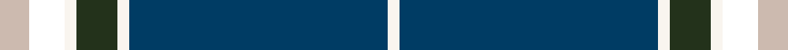
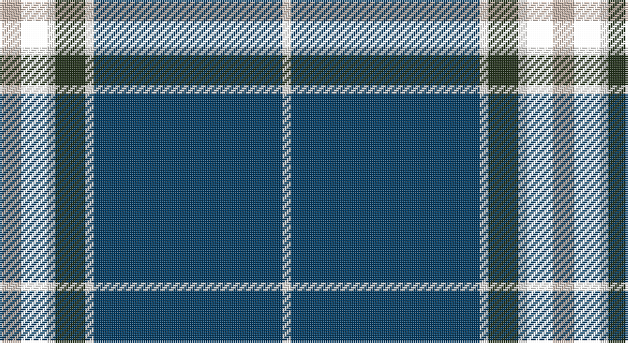

This page is one **sett** — a single exact thread-count. It belongs to the [tartan](/setts/lr5k6w2dg7w2dt44w2/)
(the same proportion at any scale), whose colour order is pattern [WBWGWKY](/stripes/wbwgwky/).

Part of the [Leblant-Macqueron](/tartans/leblant-macqueron/) tartan — the named design grouping this sett with its other cloths.

Sourced from register-of-tartans.  It is a [7 stripe tartan](/stripes/stripes7/).

Original link https://www.tartanregister.gov.uk/tartanDetails.aspx?ref=10609

## Register references

External register numbers recorded for this tartan.

- Scottish Register of Tartans: [10609](https://www.tartanregister.gov.uk/tartanDetails.aspx?ref=10609)

## Thread count
N/10 T12 W4 K14 W4 DB88 W/4

One full sett is **258 threads**.

## Palette

Palette: <strong>Tartan Dictionary</strong> <small style="color:#888">(1 of 4 colours)</small>
<table><thead><tr><th>Colour</th><th>Threads</th><th>Shade</th><th>Base</th><th>OKLCh</th></tr></thead><tbody><tr><td>N/</td><td style="text-align:right;font-variant-numeric:tabular-nums">10</td><td><code style="background-color:#CCBAAF;">#CCBAAF</code> <small style="color:#888">#CCBAAF</small></td><td>Y <code style="background-color:#F2BF00;">#F2BF00</code></td><td><small style="color:#888">oklch(80.1% 0.026 53.6)</small></td></tr><tr><td></td><td style="text-align:right;font-variant-numeric:tabular-nums">12</td><td><code style="background-color:;"></code> <small style="color:#888"></small></td><td> <code style="background-color:;"></code></td><td><small style="color:#888"></small></td></tr><tr><td>W</td><td style="text-align:right;font-variant-numeric:tabular-nums">4</td><td><code style="background-color:#F9F5EF;">#F9F5EF</code> <small style="color:#888">#F9F5EF</small></td><td>W <code style="background-color:#F7F7F7;">#F7F7F7</code></td><td><small style="color:#888">oklch(97.2% 0.009 78.3)</small></td></tr><tr><td>K</td><td style="text-align:right;font-variant-numeric:tabular-nums">14</td><td><code style="background-color:#23321B;">#23321B</code> <small style="color:#888">#23321B</small></td><td>G <code style="background-color:#006100;">#006100</code></td><td><small style="color:#888">oklch(29.7% 0.045 135.3)</small></td></tr><tr><td>W</td><td style="text-align:right;font-variant-numeric:tabular-nums">4</td><td><code style="background-color:#F9F5EF;">#F9F5EF</code> <small style="color:#888">#F9F5EF</small></td><td>W <code style="background-color:#F7F7F7;">#F7F7F7</code></td><td><small style="color:#888">oklch(97.2% 0.009 78.3)</small></td></tr><tr><td>DB</td><td style="text-align:right;font-variant-numeric:tabular-nums">88</td><td><code style="background-color:#003C64;">#003C64</code> <small style="color:#888">#003C64</small></td><td>B <code style="background-color:#2A418A;">#2A418A</code></td><td><small style="color:#888">oklch(34.5% 0.089 246.0)</small></td></tr><tr><td>W/</td><td style="text-align:right;font-variant-numeric:tabular-nums">4</td><td><code style="background-color:#F9F5EF;">#F9F5EF</code> <small style="color:#888">#F9F5EF</small></td><td>W <code style="background-color:#F7F7F7;">#F7F7F7</code></td><td><small style="color:#888">oklch(97.2% 0.009 78.3)</small></td></tr></tbody></table>

# Sample pattern

## Nearest tartans

The nearest existing variants by ΔTartan distance, with this tartan at the top so the swatches line up against it.

ΔTartan

Tartan

Sett

—

<a href="/ttd/edit/#slug=lr5k6w2dg7w2dt44w2~x2">Leblant-Macqueron (Personal)</a> <a class="nn-out" href="/variants/s7/lr5k6w2dg7w2dt44w2~x2/" title="open its dictionary page">↗</a>

0.63

<a href="/ttd/edit/#slug=dt2w2dt43b5db4ly8db2w2~x2&amp;base=lr5k6w2dg7w2dt44w2~x2">Fife Flyers (Corporate)</a> <a class="nn-out" href="/variants/s8/dt2w2dt43b5db4ly8db2w2~x2/" title="open its dictionary page">↗</a>

0.98

<a href="/ttd/edit/#slug=dt2w2dt43b5db4k8db2w2~x2&amp;base=lr5k6w2dg7w2dt44w2~x2">Fife Flyers</a> <a class="nn-out" href="/variants/s8/dt2w2dt43b5db4k8db2w2~x2/" title="open its dictionary page">↗</a>

1.03

<a href="/ttd/edit/#slug=db50ly4db3ly4db8k2dbi12w5~x2&amp;base=lr5k6w2dg7w2dt44w2~x2">Indiana #2</a> <a class="nn-out" href="/variants/s8/db50ly4db3ly4db8k2dbi12w5~x2/" title="open its dictionary page">↗</a>

1.12

<a href="/ttd/edit/#slug=w2db40g22ly3g2r3g2w2~x2&amp;base=lr5k6w2dg7w2dt44w2~x2">Tartan Day SA (Corporate)</a> <a class="nn-out" href="/variants/s8/w2db40g22ly3g2r3g2w2~x2/" title="open its dictionary page">↗</a>

1.12

<a href="/ttd/edit/#slug=db20dy1db1dy1dg8k1w3~x2&amp;base=lr5k6w2dg7w2dt44w2~x2">Chestico</a> <a class="nn-out" href="/variants/s7/db20dy1db1dy1dg8k1w3~x2/" title="open its dictionary page">↗</a>

1.14

<a href="/ttd/edit/#slug=db36k10g3r3g6k1ly2~x2&amp;base=lr5k6w2dg7w2dt44w2~x2">MacLaurin, of Brioch</a> <a class="nn-out" href="/variants/s7/db36k10g3r3g6k1ly2~x2/" title="open its dictionary page">↗</a>

1.17

<a href="/ttd/edit/#slug=db20o1db1o1dg8k1w3~x2&amp;base=lr5k6w2dg7w2dt44w2~x2">Chestico</a> <a class="nn-out" href="/variants/s7/db20o1db1o1dg8k1w3~x2/" title="open its dictionary page">↗</a>

1.23

<a href="/ttd/edit/#slug=db47g14dr5o2r3g7~x2&amp;base=lr5k6w2dg7w2dt44w2~x2">Round Table of Britain and Ireland, RtbI.</a> <a class="nn-out" href="/variants/s6/db47g14dr5o2r3g7~x2/" title="open its dictionary page">↗</a>

1.24

<a href="/ttd/edit/#slug=r5w4lg6db2dg43db2lg4r3~x2&amp;base=lr5k6w2dg7w2dt44w2~x2">Mullikin (2013)</a> <a class="nn-out" href="/variants/s8/r5w4lg6db2dg43db2lg4r3~x2/" title="open its dictionary page">↗</a>

1.33

<a href="/ttd/edit/#slug=lo2dbi2w1db6w1ly2dbi17ly1~x2&amp;base=lr5k6w2dg7w2dt44w2~x2">East Tennessee State University</a> <a class="nn-out" href="/variants/s8/lo2dbi2w1db6w1ly2dbi17ly1~x2/" title="open its dictionary page">↗</a>

## Neighbour map

Every grey dot is one of 14360 variants placed by the first two principal components of the ΔTartan feature space (44% of its variance). Red is this tartan; blue dots are its nearest — click one to open its page.

<svg viewBox="0 0 640 380" role="img" style="max-width:100%;height:auto;border:1px solid #e0e0e0;border-radius:4px;display:block" xmlns="http://www.w3.org/2000/svg"><image href="/nn/cloud.v1.png" width="640" height="380"/><a href="/variants/s8/dt2w2dt43b5db4ly8db2w2~x2/"><circle cx="377.6" cy="114.4" r="4" fill="#3465a4"><title>Fife Flyers (Corporate)</title></circle></a><a href="/variants/s8/dt2w2dt43b5db4k8db2w2~x2/"><circle cx="395.4" cy="129.0" r="4" fill="#3465a4"><title>Fife Flyers</title></circle></a><a href="/variants/s8/db50ly4db3ly4db8k2dbi12w5~x2/"><circle cx="411.8" cy="124.1" r="4" fill="#3465a4"><title>Indiana #2</title></circle></a><a href="/variants/s8/w2db40g22ly3g2r3g2w2~x2/"><circle cx="303.2" cy="125.3" r="4" fill="#3465a4"><title>Tartan Day SA (Corporate)</title></circle></a><a href="/variants/s7/db20dy1db1dy1dg8k1w3~x2/"><circle cx="352.6" cy="145.2" r="4" fill="#3465a4"><title>Chestico</title></circle></a><a href="/variants/s7/db36k10g3r3g6k1ly2~x2/"><circle cx="352.6" cy="116.1" r="4" fill="#3465a4"><title>MacLaurin, of Brioch</title></circle></a><a href="/variants/s7/db20o1db1o1dg8k1w3~x2/"><circle cx="331.4" cy="139.0" r="4" fill="#3465a4"><title>Chestico</title></circle></a><a href="/variants/s6/db47g14dr5o2r3g7~x2/"><circle cx="359.5" cy="155.6" r="4" fill="#3465a4"><title>Round Table of Britain and Ireland, RtbI.</title></circle></a><a href="/variants/s8/r5w4lg6db2dg43db2lg4r3~x2/"><circle cx="353.7" cy="115.7" r="4" fill="#3465a4"><title>Mullikin (2013)</title></circle></a><a href="/variants/s8/lo2dbi2w1db6w1ly2dbi17ly1~x2/"><circle cx="301.2" cy="130.6" r="4" fill="#3465a4"><title>East Tennessee State University</title></circle></a><circle cx="363.8" cy="123.9" r="5" fill="#c00000"/></svg>

ID: /variants/s7/lr5k6w2dg7w2dt44w2~x2/
