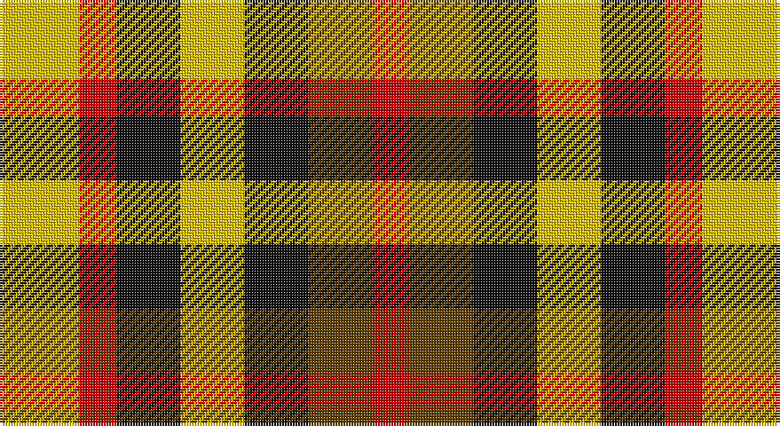

This page is one **sett** — a single exact thread-count. It belongs to the [tartan](/setts/ly15r7k12ly12k12dy12r7/)
(the same proportion at any scale), whose colour order is pattern [RGKYKRY](/stripes/rgkykry/).

Part of the [Duffus Lord...](/tartans/duffus-lord/) tartan — the named design grouping this sett with its other cloths.

Sourced from house-of-tartan.  It is a [7 stripe tartan](/stripes/stripes7/).

Original link http://www.house-of-tartan.scotland.net/house/TartanViewjs.asp?colr=Def&tnam=1661

## Provenance

Earliest known date: 1705 The hose in the portrait of Lord Duffus (1705). Reconstructed and woven by Scottish Tartans Society.

## Also known as

This cloth is also recorded under:

- Duffus Lord... Portrait
- Duffus, Lord

## Thread count
Y/30 R14 K24 Y24 K24 T24 R/14

One full sett is **264 threads**.

## Palette

Palette: <strong>Tartan Register</strong>
<table><thead><tr><th>Colour</th><th>Threads</th><th>Shade</th><th>Base</th><th>OKLCh</th></tr></thead><tbody><tr><td>Y/</td><td style="text-align:right;font-variant-numeric:tabular-nums">30</td><td><code style="background-color:#E8C000;">#E8C000</code> <small style="color:#888">#E8C000</small></td><td>Y <code style="background-color:#F2BF00;">#F2BF00</code></td><td><small style="color:#888">oklch(81.9% 0.168 93.7)</small></td></tr><tr><td>R</td><td style="text-align:right;font-variant-numeric:tabular-nums">14</td><td><code style="background-color:#C80000;">#C80000</code> <small style="color:#888">#C80000</small></td><td>R <code style="background-color:#CC0000;">#CC0000</code></td><td><small style="color:#888">oklch(52.3% 0.215 29.2)</small></td></tr><tr><td>K</td><td style="text-align:right;font-variant-numeric:tabular-nums">24</td><td><code style="background-color:#101010;">#101010</code> <small style="color:#888">#101010</small></td><td>K <code style="background-color:#000000;">#000000</code></td><td><small style="color:#888">oklch(17.3% 0.000 89.9)</small></td></tr><tr><td>Y</td><td style="text-align:right;font-variant-numeric:tabular-nums">24</td><td><code style="background-color:#E8C000;">#E8C000</code> <small style="color:#888">#E8C000</small></td><td>Y <code style="background-color:#F2BF00;">#F2BF00</code></td><td><small style="color:#888">oklch(81.9% 0.168 93.7)</small></td></tr><tr><td>K</td><td style="text-align:right;font-variant-numeric:tabular-nums">24</td><td><code style="background-color:#101010;">#101010</code> <small style="color:#888">#101010</small></td><td>K <code style="background-color:#000000;">#000000</code></td><td><small style="color:#888">oklch(17.3% 0.000 89.9)</small></td></tr><tr><td>T</td><td style="text-align:right;font-variant-numeric:tabular-nums">24</td><td><code style="background-color:#604000;">#604000</code> <small style="color:#888">#604000</small></td><td>G <code style="background-color:#006100;">#006100</code></td><td><small style="color:#888">oklch(39.8% 0.083 76.8)</small></td></tr><tr><td>R/</td><td style="text-align:right;font-variant-numeric:tabular-nums">14</td><td><code style="background-color:#C80000;">#C80000</code> <small style="color:#888">#C80000</small></td><td>R <code style="background-color:#CC0000;">#CC0000</code></td><td><small style="color:#888">oklch(52.3% 0.215 29.2)</small></td></tr></tbody></table>

# Sample pattern

## Nearest tartans

The nearest existing variants by ΔTartan distance, with this tartan at the top so the swatches line up against it.

ΔTartan

Tartan

Sett

—

<a href="/ttd/edit/#slug=ly15r7k12ly12k12dy12r7~x2">Duffus Lord... Portrait Tartan</a> <a class="nn-out" href="/variants/s7/ly15r7k12ly12k12dy12r7~x2/" title="open its dictionary page">↗</a>

0.52

<a href="/ttd/edit/#slug=ly15r7k12ly12k12o12r7~x2&amp;base=ly15r7k12ly12k12dy12r7~x2">Duffus, Lord</a> <a class="nn-out" href="/variants/s7/ly15r7k12ly12k12o12r7~x2/" title="open its dictionary page">↗</a>

1.20

<a href="/ttd/edit/#slug=lo11m6k10lo10k10dy10m4~x2&amp;base=ly15r7k12ly12k12dy12r7~x2">Duffus Hose, Lord</a> <a class="nn-out" href="/variants/s7/lo11m6k10lo10k10dy10m4~x2/" title="open its dictionary page">↗</a>

1.37

<a href="/variants/s8/r2g1w1k1~x20/">Harazeen</a>

1.50

<a href="/ttd/edit/#slug=k13dy28lo13dy28k18w18k13~x2&amp;base=ly15r7k12ly12k12dy12r7~x2">Boxer Beauty</a> <a class="nn-out" href="/variants/s7/k13dy28lo13dy28k18w18k13~x2/" title="open its dictionary page">↗</a>

1.61

<a href="/ttd/edit/#slug=r10db6k8g10r6g3r6~x2&amp;base=ly15r7k12ly12k12dy12r7~x2">MacDuff</a> <a class="nn-out" href="/variants/s7/r10db6k8g10r6g3r6~x2/" title="open its dictionary page">↗</a>

1.64

<a href="/ttd/edit/#slug=r2db2g3ly2~x5&amp;base=ly15r7k12ly12k12dy12r7~x2">Sturch (Corporate)</a> <a class="nn-out" href="/variants/s4/r2db2g3ly2~x5/" title="open its dictionary page">↗</a>

1.87

<a href="/ttd/edit/#slug=dg8k8dg8ly6k3ly6~x2&amp;base=ly15r7k12ly12k12dy12r7~x2">Hage-West (Personal)</a> <a class="nn-out" href="/variants/s6/dg8k8dg8ly6k3ly6~x2/" title="open its dictionary page">↗</a>

2.01

<a href="/ttd/edit/#slug=g6r4g5r13k13w5k13r13ly6~x2&amp;base=ly15r7k12ly12k12dy12r7~x2">Akins Red Dress</a> <a class="nn-out" href="/variants/s9/g6r4g5r13k13w5k13r13ly6~x2/" title="open its dictionary page">↗</a>

2.02

<a href="/ttd/edit/#slug=r10db6k8dg10r6dg3r6~x2&amp;base=ly15r7k12ly12k12dy12r7~x2">MacDuff #3</a> <a class="nn-out" href="/variants/s7/r10db6k8dg10r6dg3r6~x2/" title="open its dictionary page">↗</a>

2.04

<a href="/ttd/edit/#slug=lr12lo8r5k6lr7g5~x4&amp;base=ly15r7k12ly12k12dy12r7~x2">Mitchell, Martin (Personal)</a> <a class="nn-out" href="/variants/s6/lr12lo8r5k6lr7g5~x4/" title="open its dictionary page">↗</a>

## Neighbour map

Every grey dot is one of 14360 variants placed by the first two principal components of the ΔTartan feature space (44% of its variance). Red is this tartan; blue dots are its nearest — click one to open its page.

<svg viewBox="0 0 640 380" role="img" style="max-width:100%;height:auto;border:1px solid #e0e0e0;border-radius:4px;display:block" xmlns="http://www.w3.org/2000/svg"><image href="/nn/cloud.v1.png" width="640" height="380"/><a href="/variants/s7/ly15r7k12ly12k12o12r7~x2/"><circle cx="14.2" cy="299.0" r="4" fill="#3465a4"><title>Duffus, Lord</title></circle></a><a href="/variants/s7/lo11m6k10lo10k10dy10m4~x2/"><circle cx="62.0" cy="304.4" r="4" fill="#3465a4"><title>Duffus Hose, Lord</title></circle></a><a href="/variants/s8/r2g1w1k1~x20/"><circle cx="44.7" cy="271.0" r="4" fill="#3465a4"><title>Harazeen</title></circle></a><a href="/variants/s7/k13dy28lo13dy28k18w18k13~x2/"><circle cx="83.4" cy="299.3" r="4" fill="#3465a4"><title>Boxer Beauty</title></circle></a><a href="/variants/s7/r10db6k8g10r6g3r6~x2/"><circle cx="115.2" cy="284.7" r="4" fill="#3465a4"><title>MacDuff</title></circle></a><a href="/variants/s4/r2db2g3ly2~x5/"><circle cx="14.0" cy="359.3" r="4" fill="#3465a4"><title>Sturch (Corporate)</title></circle></a><a href="/variants/s6/dg8k8dg8ly6k3ly6~x2/"><circle cx="90.4" cy="321.6" r="4" fill="#3465a4"><title>Hage-West (Personal)</title></circle></a><a href="/variants/s9/g6r4g5r13k13w5k13r13ly6~x2/"><circle cx="68.3" cy="232.1" r="4" fill="#3465a4"><title>Akins Red Dress</title></circle></a><a href="/variants/s7/r10db6k8dg10r6dg3r6~x2/"><circle cx="135.7" cy="290.9" r="4" fill="#3465a4"><title>MacDuff #3</title></circle></a><a href="/variants/s6/lr12lo8r5k6lr7g5~x4/"><circle cx="79.6" cy="288.9" r="4" fill="#3465a4"><title>Mitchell, Martin (Personal)</title></circle></a><circle cx="23.6" cy="302.5" r="5" fill="#c00000"/></svg>

ID: /variants/s7/ly15r7k12ly12k12dy12r7~x2/
