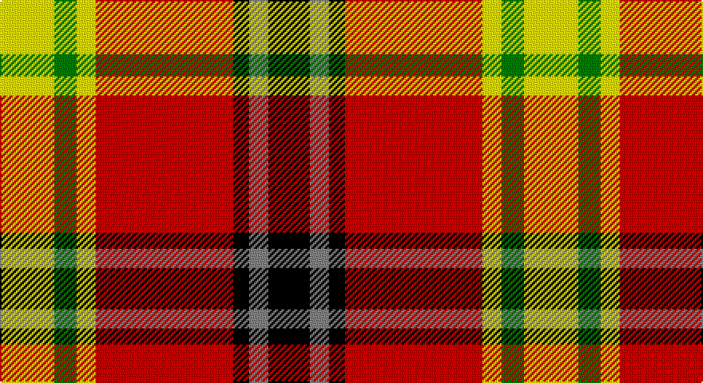

This page is one **sett** — a single exact thread-count. It belongs to the [tartan](/setts/ly17g7ly6r43k5o6k13/)
(the same proportion at any scale), whose colour order is pattern [KRKRYGY](/stripes/krkrygy/).

Sourced from register-of-tartans.  It is a [7 stripe tartan](/stripes/stripes7/).

Original link https://www.tartanregister.gov.uk/tartanDetails.aspx?ref=10061

2 attestations — the source records this cloth was collapsed from (oldest owns this page)

<ul>
<li>10/06/2009 — Keeling (register-of-tartans, <a href="https://www.tartanregister.gov.uk/tartanDetails.aspx?ref=10061">record</a>)</li>
<li>10th June 2009 — Keeling (Corporate) (tartans-authority, <a href="http://www.tartansauthority.com/tartan-ferret/display/10061/">record</a>)</li>
</ul>

## Register references

External register numbers recorded for this tartan.

- Scottish Register of Tartans: [10061](https://www.tartanregister.gov.uk/tartanDetails?ref=10061)
- Scottish Tartans Authority (ITI): 10061

## Thread count
Y/34 G14 Y12 R86 K10 N12 K/26

One full sett is **328 threads**.

## Palette

Palette: <strong>Tartan Register</strong> <small style="color:#888">(2 of 5 colours)</small>
<table><thead><tr><th>Colour</th><th>Threads</th><th>Shade</th><th>Base</th><th>OKLCh</th></tr></thead><tbody><tr><td>Y/</td><td style="text-align:right;font-variant-numeric:tabular-nums">34</td><td><code style="background-color:#FFFF00;">#FFFF00</code> <small style="color:#888">#FFFF00</small></td><td>Y <code style="background-color:#F2BF00;">#F2BF00</code></td><td><small style="color:#888">oklch(96.8% 0.211 109.8)</small></td></tr><tr><td>G</td><td style="text-align:right;font-variant-numeric:tabular-nums">14</td><td><code style="background-color:#008000;">#008000</code> <small style="color:#888">#008000</small></td><td>G <code style="background-color:#006100;">#006100</code></td><td><small style="color:#888">oklch(52.0% 0.177 142.5)</small></td></tr><tr><td>Y</td><td style="text-align:right;font-variant-numeric:tabular-nums">12</td><td><code style="background-color:#FFFF00;">#FFFF00</code> <small style="color:#888">#FFFF00</small></td><td>Y <code style="background-color:#F2BF00;">#F2BF00</code></td><td><small style="color:#888">oklch(96.8% 0.211 109.8)</small></td></tr><tr><td>R</td><td style="text-align:right;font-variant-numeric:tabular-nums">86</td><td><code style="background-color:#CD0000;">#CD0000</code> <small style="color:#888">#CD0000</small></td><td>R <code style="background-color:#CC0000;">#CC0000</code></td><td><small style="color:#888">oklch(53.3% 0.219 29.2)</small></td></tr><tr><td>K</td><td style="text-align:right;font-variant-numeric:tabular-nums">10</td><td><code style="background-color:#000000;">#000000</code> <small style="color:#888">#000000</small></td><td>K <code style="background-color:#000000;">#000000</code></td><td><small style="color:#888">oklch(0.0% 0.000 0.0)</small></td></tr><tr><td>N</td><td style="text-align:right;font-variant-numeric:tabular-nums">12</td><td><code style="background-color:#848484;">#848484</code> <small style="color:#888">#848484</small></td><td>R <code style="background-color:#CC0000;">#CC0000</code></td><td><small style="color:#888">oklch(61.3% 0.000 89.9)</small></td></tr><tr><td>K/</td><td style="text-align:right;font-variant-numeric:tabular-nums">26</td><td><code style="background-color:#000000;">#000000</code> <small style="color:#888">#000000</small></td><td>K <code style="background-color:#000000;">#000000</code></td><td><small style="color:#888">oklch(0.0% 0.000 0.0)</small></td></tr></tbody></table>

# Sample pattern

## Nearest tartans

The nearest existing variants by ΔTartan distance, with this tartan at the top so the swatches line up against it.

ΔTartan

Tartan

Sett

—

<a href="/ttd/edit/#slug=ly17g7ly6r43k5o6k13~x2">Keeling</a> <a class="nn-out" href="/variants/s7/ly17g7ly6r43k5o6k13~x2/" title="open its dictionary page">↗</a>

1.28

<a href="/ttd/edit/#slug=r24n4k4g4w13k2~x4&amp;base=ly17g7ly6r43k5o6k13~x2">Rose White Dress</a> <a class="nn-out" href="/variants/s6/r24n4k4g4w13k2~x4/" title="open its dictionary page">↗</a>

1.31

<a href="/ttd/edit/#slug=r32db6k6g6w18k3&amp;base=ly17g7ly6r43k5o6k13~x2">Rose, White dress</a> <a class="nn-out" href="/variants/s6/r32db6k6g6w18k3/" title="open its dictionary page">↗</a>

1.35

<a href="/ttd/edit/#slug=w6r18k2r6g7k8ly6~x4&amp;base=ly17g7ly6r43k5o6k13~x2">Thirkill (Dalgliesh)</a> <a class="nn-out" href="/variants/s7/w6r18k2r6g7k8ly6~x4/" title="open its dictionary page">↗</a>

1.39

<a href="/ttd/edit/#slug=ly4w2ly2w8r16g3r3g8r6k2~x2&amp;base=ly17g7ly6r43k5o6k13~x2">Melieres, Carolyn (Personal)</a> <a class="nn-out" href="/variants/s10/ly4w2ly2w8r16g3r3g8r6k2~x2/" title="open its dictionary page">↗</a>

1.42

<a href="/ttd/edit/#slug=r24w2ly3dg16k16w2ly3~x2&amp;base=ly17g7ly6r43k5o6k13~x2">MacLachlan #4</a> <a class="nn-out" href="/variants/s7/r24w2ly3dg16k16w2ly3~x2/" title="open its dictionary page">↗</a>

1.43

<a href="/ttd/edit/#slug=ly2g7k6r12k1r1ly2~x4&amp;base=ly17g7ly6r43k5o6k13~x2">Blackstock, dress</a> <a class="nn-out" href="/variants/s7/ly2g7k6r12k1r1ly2~x4/" title="open its dictionary page">↗</a>

1.44

<a href="/ttd/edit/#slug=w15g8k12g14r64k12r16k10ly8k14&amp;base=ly17g7ly6r43k5o6k13~x2">Carlow County Crest (Fashion)</a> <a class="nn-out" href="/variants/s10/w15g8k12g14r64k12r16k10ly8k14/" title="open its dictionary page">↗</a>

1.45

<a href="/ttd/edit/#slug=r24w2ly3g16k16w2ly3~x2&amp;base=ly17g7ly6r43k5o6k13~x2">MacLachlan Old Clan Tartan</a> <a class="nn-out" href="/variants/s7/r24w2ly3g16k16w2ly3~x2/" title="open its dictionary page">↗</a>

1.50

<a href="/ttd/edit/#slug=r36w3lo4g24w24k3lo6~x2&amp;base=ly17g7ly6r43k5o6k13~x2">MacLachlan Dress</a> <a class="nn-out" href="/variants/s7/r36w3lo4g24w24k3lo6~x2/" title="open its dictionary page">↗</a>

1.50

<a href="/ttd/edit/#slug=k3lo18k12lo18k2lo2k3~x2&amp;base=ly17g7ly6r43k5o6k13~x2">Kinloch Anderson Check (Fashion)</a> <a class="nn-out" href="/variants/s7/k3lo18k12lo18k2lo2k3~x2/" title="open its dictionary page">↗</a>

## Neighbour map

Every grey dot is one of 14360 variants placed by the first two principal components of the ΔTartan feature space (44% of its variance). Red is this tartan; blue dots are its nearest — click one to open its page.

<svg viewBox="0 0 640 380" role="img" style="max-width:100%;height:auto;border:1px solid #e0e0e0;border-radius:4px;display:block" xmlns="http://www.w3.org/2000/svg"><image href="/nn/cloud.v1.png" width="640" height="380"/><a href="/variants/s6/r24n4k4g4w13k2~x4/"><circle cx="201.2" cy="152.3" r="4" fill="#3465a4"><title>Rose White Dress</title></circle></a><a href="/variants/s6/r32db6k6g6w18k3/"><circle cx="179.3" cy="155.8" r="4" fill="#3465a4"><title>Rose, White dress</title></circle></a><a href="/variants/s7/w6r18k2r6g7k8ly6~x4/"><circle cx="148.6" cy="181.2" r="4" fill="#3465a4"><title>Thirkill (Dalgliesh)</title></circle></a><a href="/variants/s10/ly4w2ly2w8r16g3r3g8r6k2~x2/"><circle cx="173.1" cy="157.1" r="4" fill="#3465a4"><title>Melieres, Carolyn (Personal)</title></circle></a><a href="/variants/s7/r24w2ly3dg16k16w2ly3~x2/"><circle cx="153.5" cy="153.4" r="4" fill="#3465a4"><title>MacLachlan #4</title></circle></a><a href="/variants/s7/ly2g7k6r12k1r1ly2~x4/"><circle cx="189.7" cy="169.2" r="4" fill="#3465a4"><title>Blackstock, dress</title></circle></a><a href="/variants/s10/w15g8k12g14r64k12r16k10ly8k14/"><circle cx="189.0" cy="150.9" r="4" fill="#3465a4"><title>Carlow County Crest (Fashion)</title></circle></a><a href="/variants/s7/r24w2ly3g16k16w2ly3~x2/"><circle cx="154.4" cy="155.6" r="4" fill="#3465a4"><title>MacLachlan Old Clan Tartan</title></circle></a><a href="/variants/s7/r36w3lo4g24w24k3lo6~x2/"><circle cx="139.4" cy="147.3" r="4" fill="#3465a4"><title>MacLachlan Dress</title></circle></a><a href="/variants/s7/k3lo18k12lo18k2lo2k3~x2/"><circle cx="160.8" cy="182.7" r="4" fill="#3465a4"><title>Kinloch Anderson Check (Fashion)</title></circle></a><circle cx="161.4" cy="148.9" r="5" fill="#c00000"/></svg>

ID: /variants/s7/ly17g7ly6r43k5o6k13~x2/
