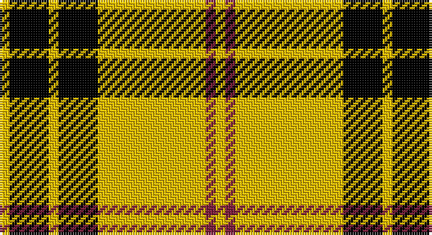

This page is one **sett** — a single exact thread-count. It belongs to the [tartan](/setts/ly1k4ly1k4ly11m1ly1/)
(the same proportion at any scale), whose colour order is pattern [YKYKYRY](/stripes/ykykyry/).

Part of the [Baillieville](/tartans/baillieville/) tartan — the named design grouping this sett with its other cloths.

Sourced from weddslist.  It is a [7 stripe tartan](/stripes/stripes7/).

Original link http://www.weddslist.com/cgi-bin/tartans/pg.pl?source=sts

## Thread count
Y/4 K16 Y4 K16 Y44 DR4 Y/4

One full sett is **176 threads**.

## Palette

Palette: <strong>Ingles Buchan</strong> <small style="color:#888">(1 of 3 colours)</small>
<table><thead><tr><th>Colour</th><th>Threads</th><th>Shade</th><th>Base</th><th>OKLCh</th></tr></thead><tbody><tr><td>Y/</td><td style="text-align:right;font-variant-numeric:tabular-nums">4</td><td><code style="background-color:#F0C000;">#F0C000</code> <small style="color:#888">#F0C000</small></td><td>Y <code style="background-color:#F2BF00;">#F2BF00</code></td><td><small style="color:#888">oklch(82.7% 0.169 90.5)</small></td></tr><tr><td>K</td><td style="text-align:right;font-variant-numeric:tabular-nums">16</td><td><code style="background-color:#000000;">#000000</code> <small style="color:#888">#000000</small></td><td>K <code style="background-color:#000000;">#000000</code></td><td><small style="color:#888">oklch(0.0% 0.000 0.0)</small></td></tr><tr><td>Y</td><td style="text-align:right;font-variant-numeric:tabular-nums">4</td><td><code style="background-color:#F0C000;">#F0C000</code> <small style="color:#888">#F0C000</small></td><td>Y <code style="background-color:#F2BF00;">#F2BF00</code></td><td><small style="color:#888">oklch(82.7% 0.169 90.5)</small></td></tr><tr><td>K</td><td style="text-align:right;font-variant-numeric:tabular-nums">16</td><td><code style="background-color:#000000;">#000000</code> <small style="color:#888">#000000</small></td><td>K <code style="background-color:#000000;">#000000</code></td><td><small style="color:#888">oklch(0.0% 0.000 0.0)</small></td></tr><tr><td>Y</td><td style="text-align:right;font-variant-numeric:tabular-nums">44</td><td><code style="background-color:#F0C000;">#F0C000</code> <small style="color:#888">#F0C000</small></td><td>Y <code style="background-color:#F2BF00;">#F2BF00</code></td><td><small style="color:#888">oklch(82.7% 0.169 90.5)</small></td></tr><tr><td>DR</td><td style="text-align:right;font-variant-numeric:tabular-nums">4</td><td><code style="background-color:#802040;">#802040</code> <small style="color:#888">#802040</small></td><td>R <code style="background-color:#CC0000;">#CC0000</code></td><td><small style="color:#888">oklch(40.8% 0.132 5.2)</small></td></tr><tr><td>Y/</td><td style="text-align:right;font-variant-numeric:tabular-nums">4</td><td><code style="background-color:#F0C000;">#F0C000</code> <small style="color:#888">#F0C000</small></td><td>Y <code style="background-color:#F2BF00;">#F2BF00</code></td><td><small style="color:#888">oklch(82.7% 0.169 90.5)</small></td></tr></tbody></table>

# Sample pattern

## Compared to the master

This cloth is one sett of its design; the master sett (the exemplar the design is anchored on) is below for comparison.

<figure style="margin:0"><figcaption style="color:#888;font-size:smaller">this sett</figcaption></figure>
<figure style="margin:0"><figcaption style="color:#888;font-size:smaller"><a href="/setts/k4ly1k4ly11r1ly1r1ly11k4ly1k4ly1/">master sett →</a></figcaption></figure>

## Nearest tartans

The nearest existing variants by ΔTartan distance, with this tartan at the top so the swatches line up against it.

ΔTartan

Tartan

Sett

—

<a href="/ttd/edit/#slug=ly1k4ly1k4ly11m1ly1~x4">Baillieville</a> <a class="nn-out" href="/variants/s7/ly1k4ly1k4ly11m1ly1~x4/" title="open its dictionary page">↗</a>

0.57

<a href="/ttd/edit/#slug=ly1k4ly1k4ly11r1ly1~x4&amp;base=ly1k4ly1k4ly11m1ly1~x4">Baileville (Personal)</a> <a class="nn-out" href="/variants/s7/ly1k4ly1k4ly11r1ly1~x4/" title="open its dictionary page">↗</a>

0.84

<a href="/ttd/edit/#slug=k1ly12r1ly2k4r1k4ly2k1~x4&amp;base=ly1k4ly1k4ly11m1ly1~x4">MacLeod (Snuffbox)</a> <a class="nn-out" href="/variants/s9/k1ly12r1ly2k4r1k4ly2k1~x4/" title="open its dictionary page">↗</a>

1.23

<a href="/ttd/edit/#slug=k4ly1k4ly11r1ly1r1ly11k4ly1k4ly1~x4&amp;base=ly1k4ly1k4ly11m1ly1~x4">Baillieville Family Tartan</a> <a class="nn-out" href="/variants/s12/k4ly1k4ly11r1ly1r1ly11k4ly1k4ly1~x4/" title="open its dictionary page">↗</a>

1.23

<a href="/ttd/edit/#slug=k2ly6k2ly11k9r1~x2&amp;base=ly1k4ly1k4ly11m1ly1~x4">Porter Drinkers', The</a> <a class="nn-out" href="/variants/s6/k2ly6k2ly11k9r1~x2/" title="open its dictionary page">↗</a>

1.32

<a href="/ttd/edit/#slug=k4ly32k16r3k16ly4~x2&amp;base=ly1k4ly1k4ly11m1ly1~x4">Unnamed C21st - Fashion</a> <a class="nn-out" href="/variants/s6/k4ly32k16r3k16ly4~x2/" title="open its dictionary page">↗</a>

1.39

<a href="/ttd/edit/#slug=dg11ly1dg1ly6k1ly1~x8&amp;base=ly1k4ly1k4ly11m1ly1~x4">Big Spruce Brewing</a> <a class="nn-out" href="/variants/s6/dg11ly1dg1ly6k1ly1~x8/" title="open its dictionary page">↗</a>

1.41

<a href="/ttd/edit/#slug=g3lo3k10lo26k3lo3~x2&amp;base=ly1k4ly1k4ly11m1ly1~x4">Volkswagen Orange Trim</a> <a class="nn-out" href="/variants/s6/g3lo3k10lo26k3lo3~x2/" title="open its dictionary page">↗</a>

1.41

<a href="/ttd/edit/#slug=lo26k10lo3g3lo3k3~x6&amp;base=ly1k4ly1k4ly11m1ly1~x4">Volkswagen Orange Trim (Fashion)</a> <a class="nn-out" href="/variants/s6/lo26k10lo3g3lo3k3~x6/" title="open its dictionary page">↗</a>

1.45

<a href="/ttd/edit/#slug=k6ly2k21ly2k6ly24k2ly6~x2&amp;base=ly1k4ly1k4ly11m1ly1~x4">MacLachlan (Chief's Dress)</a> <a class="nn-out" href="/variants/s8/k6ly2k21ly2k6ly24k2ly6~x2/" title="open its dictionary page">↗</a>

1.60

<a href="/ttd/edit/#slug=dy38w9dy3k9w3~x2&amp;base=ly1k4ly1k4ly11m1ly1~x4">Loch Tummel</a> <a class="nn-out" href="/variants/s5/dy38w9dy3k9w3~x2/" title="open its dictionary page">↗</a>

## Neighbour map

Every grey dot is one of 14360 variants placed by the first two principal components of the ΔTartan feature space (44% of its variance). Red is this tartan; blue dots are its nearest — click one to open its page.

<svg viewBox="0 0 640 380" role="img" style="max-width:100%;height:auto;border:1px solid #e0e0e0;border-radius:4px;display:block" xmlns="http://www.w3.org/2000/svg"><image href="/nn/cloud.v1.png" width="640" height="380"/><a href="/variants/s7/ly1k4ly1k4ly11r1ly1~x4/"><circle cx="334.4" cy="174.5" r="4" fill="#3465a4"><title>Baileville (Personal)</title></circle></a><a href="/variants/s9/k1ly12r1ly2k4r1k4ly2k1~x4/"><circle cx="311.8" cy="157.0" r="4" fill="#3465a4"><title>MacLeod (Snuffbox)</title></circle></a><a href="/variants/s12/k4ly1k4ly11r1ly1r1ly11k4ly1k4ly1~x4/"><circle cx="309.4" cy="157.4" r="4" fill="#3465a4"><title>Baillieville Family Tartan</title></circle></a><a href="/variants/s6/k2ly6k2ly11k9r1~x2/"><circle cx="286.5" cy="202.7" r="4" fill="#3465a4"><title>Porter Drinkers', The</title></circle></a><a href="/variants/s6/k4ly32k16r3k16ly4~x2/"><circle cx="266.6" cy="199.1" r="4" fill="#3465a4"><title>Unnamed C21st - Fashion</title></circle></a><a href="/variants/s6/dg11ly1dg1ly6k1ly1~x8/"><circle cx="329.2" cy="192.7" r="4" fill="#3465a4"><title>Big Spruce Brewing</title></circle></a><a href="/variants/s6/g3lo3k10lo26k3lo3~x2/"><circle cx="385.2" cy="196.1" r="4" fill="#3465a4"><title>Volkswagen Orange Trim</title></circle></a><a href="/variants/s6/lo26k10lo3g3lo3k3~x6/"><circle cx="385.2" cy="196.1" r="4" fill="#3465a4"><title>Volkswagen Orange Trim (Fashion)</title></circle></a><a href="/variants/s8/k6ly2k21ly2k6ly24k2ly6~x2/"><circle cx="321.8" cy="196.7" r="4" fill="#3465a4"><title>MacLachlan (Chief's Dress)</title></circle></a><a href="/variants/s5/dy38w9dy3k9w3~x2/"><circle cx="381.5" cy="193.6" r="4" fill="#3465a4"><title>Loch Tummel</title></circle></a><circle cx="329.7" cy="174.1" r="5" fill="#c00000"/></svg>

ID: /variants/s7/ly1k4ly1k4ly11m1ly1~x4/
