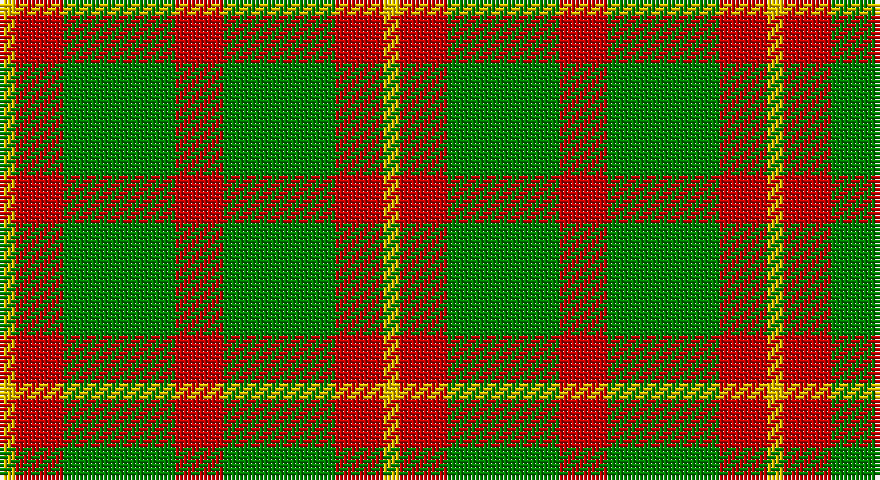

This page is one **sett** — a single exact thread-count. It belongs to the [tartan](/setts/ly1r3g7r3g7r3ly1/)
(the same proportion at any scale), whose colour order is pattern [YRGRGRY](/stripes/yrgrgry/).

Sourced from weddslist.  It is a [7 stripe tartan](/stripes/stripes7/).

Original link http://www.weddslist.com/cgi-bin/tartans/pg.pl?source=sts

## Thread count
Y/4 R12 G28 R12 G28 R12 Y/4

One full sett is **192 threads**.

## Palette

Palette: <strong>custom</strong>
<table><thead><tr><th>Colour</th><th>Threads</th><th>Shade</th><th>Base</th><th>OKLCh</th></tr></thead><tbody><tr><td>Y/</td><td style="text-align:right;font-variant-numeric:tabular-nums">4</td><td><code style="background-color:#F0C000;">#F0C000</code> <small style="color:#888">#F0C000</small></td><td>Y <code style="background-color:#F2BF00;">#F2BF00</code></td><td><small style="color:#888">oklch(82.7% 0.169 90.5)</small></td></tr><tr><td>R</td><td style="text-align:right;font-variant-numeric:tabular-nums">12</td><td><code style="background-color:#C00000;">#C00000</code> <small style="color:#888">#C00000</small></td><td>R <code style="background-color:#CC0000;">#CC0000</code></td><td><small style="color:#888">oklch(50.7% 0.208 29.2)</small></td></tr><tr><td>G</td><td style="text-align:right;font-variant-numeric:tabular-nums">28</td><td><code style="background-color:#008000;">#008000</code> <small style="color:#888">#008000</small></td><td>G <code style="background-color:#006100;">#006100</code></td><td><small style="color:#888">oklch(52.0% 0.177 142.5)</small></td></tr><tr><td>R</td><td style="text-align:right;font-variant-numeric:tabular-nums">12</td><td><code style="background-color:#C00000;">#C00000</code> <small style="color:#888">#C00000</small></td><td>R <code style="background-color:#CC0000;">#CC0000</code></td><td><small style="color:#888">oklch(50.7% 0.208 29.2)</small></td></tr><tr><td>G</td><td style="text-align:right;font-variant-numeric:tabular-nums">28</td><td><code style="background-color:#008000;">#008000</code> <small style="color:#888">#008000</small></td><td>G <code style="background-color:#006100;">#006100</code></td><td><small style="color:#888">oklch(52.0% 0.177 142.5)</small></td></tr><tr><td>R</td><td style="text-align:right;font-variant-numeric:tabular-nums">12</td><td><code style="background-color:#C00000;">#C00000</code> <small style="color:#888">#C00000</small></td><td>R <code style="background-color:#CC0000;">#CC0000</code></td><td><small style="color:#888">oklch(50.7% 0.208 29.2)</small></td></tr><tr><td>Y/</td><td style="text-align:right;font-variant-numeric:tabular-nums">4</td><td><code style="background-color:#F0C000;">#F0C000</code> <small style="color:#888">#F0C000</small></td><td>Y <code style="background-color:#F2BF00;">#F2BF00</code></td><td><small style="color:#888">oklch(82.7% 0.169 90.5)</small></td></tr></tbody></table>

# Sample pattern

## Nearest tartans

The nearest existing variants by ΔTartan distance, with this tartan at the top so the swatches line up against it.

ΔTartan

Tartan

Sett

—

<a href="/ttd/edit/#slug=ly1r3g7r3g7r3ly1~x4">Unidentified 24</a> <a class="nn-out" href="/variants/s7/ly1r3g7r3g7r3ly1~x4/" title="open its dictionary page">↗</a>

1.16

<a href="/ttd/edit/#slug=ly1r3dg7r3dg7r3ly1~x4&amp;base=ly1r3g7r3g7r3ly1~x4">Unidentified #42</a> <a class="nn-out" href="/variants/s7/ly1r3dg7r3dg7r3ly1~x4/" title="open its dictionary page">↗</a>

1.25

<a href="/ttd/edit/#slug=g5r9g10w2g2ly2g10r9g5~x2&amp;base=ly1r3g7r3g7r3ly1~x4">Wilson's, No 169</a> <a class="nn-out" href="/variants/s9/g5r9g10w2g2ly2g10r9g5~x2/" title="open its dictionary page">↗</a>

1.46

<a href="/ttd/edit/#slug=dg8lo1dg8lo12r1lo1~x4&amp;base=ly1r3g7r3g7r3ly1~x4">Forget Family (Yonne)</a> <a class="nn-out" href="/variants/s6/dg8lo1dg8lo12r1lo1~x4/" title="open its dictionary page">↗</a>

1.50

<a href="/ttd/edit/#slug=r3g18g4r3g4r5g4r5g4r5g2w2~x2&amp;base=ly1r3g7r3g7r3ly1~x4">Princess Marina</a> <a class="nn-out" href="/variants/s12/r3g18g4r3g4r5g4r5g4r5g2w2~x2/" title="open its dictionary page">↗</a>

1.58

<a href="/ttd/edit/#slug=dg2o14dg8o3dg12r2~x2&amp;base=ly1r3g7r3g7r3ly1~x4">Confederate Artillery</a> <a class="nn-out" href="/variants/s6/dg2o14dg8o3dg12r2~x2/" title="open its dictionary page">↗</a>

1.58

<a href="/ttd/edit/#slug=g9m2g2m2g2m8g11w2~x4&amp;base=ly1r3g7r3g7r3ly1~x4">Leeds University Corporate Tartan</a> <a class="nn-out" href="/variants/s8/g9m2g2m2g2m8g11w2~x4/" title="open its dictionary page">↗</a>

1.62

<a href="/ttd/edit/#slug=k1r5g10r5g1~x4&amp;base=ly1r3g7r3g7r3ly1~x4">Murray, Lord George (Hose)</a> <a class="nn-out" href="/variants/s5/k1r5g10r5g1~x4/" title="open its dictionary page">↗</a>

1.65

<a href="/ttd/edit/#slug=g2r3g4w1g1ly1g4r3g2~x2&amp;base=ly1r3g7r3g7r3ly1~x4">Unnamed 7</a> <a class="nn-out" href="/variants/s9/g2r3g4w1g1ly1g4r3g2~x2/" title="open its dictionary page">↗</a>

1.66

<a href="/ttd/edit/#slug=db6r15g41r15db20g41t6&amp;base=ly1r3g7r3g7r3ly1~x4">Bean Hunting</a> <a class="nn-out" href="/variants/s7/db6r15g41r15db20g41t6/" title="open its dictionary page">↗</a>

1.66

<a href="/ttd/edit/#slug=dg4r2dg13lb2r13dg2r4~x2&amp;base=ly1r3g7r3g7r3ly1~x4">Crossnor School</a> <a class="nn-out" href="/variants/s7/dg4r2dg13lb2r13dg2r4~x2/" title="open its dictionary page">↗</a>

## Neighbour map

Every grey dot is one of 14360 variants placed by the first two principal components of the ΔTartan feature space (44% of its variance). Red is this tartan; blue dots are its nearest — click one to open its page.

<svg viewBox="0 0 640 380" role="img" style="max-width:100%;height:auto;border:1px solid #e0e0e0;border-radius:4px;display:block" xmlns="http://www.w3.org/2000/svg"><image href="/nn/cloud.v1.png" width="640" height="380"/><a href="/variants/s7/ly1r3dg7r3dg7r3ly1~x4/"><circle cx="300.3" cy="245.0" r="4" fill="#3465a4"><title>Unidentified #42</title></circle></a><a href="/variants/s9/g5r9g10w2g2ly2g10r9g5~x2/"><circle cx="274.9" cy="248.0" r="4" fill="#3465a4"><title>Wilson's, No 169</title></circle></a><a href="/variants/s6/dg8lo1dg8lo12r1lo1~x4/"><circle cx="320.5" cy="212.1" r="4" fill="#3465a4"><title>Forget Family (Yonne)</title></circle></a><a href="/variants/s12/r3g18g4r3g4r5g4r5g4r5g2w2~x2/"><circle cx="358.2" cy="207.5" r="4" fill="#3465a4"><title>Princess Marina</title></circle></a><a href="/variants/s6/dg2o14dg8o3dg12r2~x2/"><circle cx="319.8" cy="263.9" r="4" fill="#3465a4"><title>Confederate Artillery</title></circle></a><a href="/variants/s8/g9m2g2m2g2m8g11w2~x4/"><circle cx="349.6" cy="250.8" r="4" fill="#3465a4"><title>Leeds University Corporate Tartan</title></circle></a><a href="/variants/s5/k1r5g10r5g1~x4/"><circle cx="323.1" cy="240.3" r="4" fill="#3465a4"><title>Murray, Lord George (Hose)</title></circle></a><a href="/variants/s9/g2r3g4w1g1ly1g4r3g2~x2/"><circle cx="266.2" cy="263.6" r="4" fill="#3465a4"><title>Unnamed 7</title></circle></a><a href="/variants/s7/db6r15g41r15db20g41t6/"><circle cx="283.8" cy="247.3" r="4" fill="#3465a4"><title>Bean Hunting</title></circle></a><a href="/variants/s7/dg4r2dg13lb2r13dg2r4~x2/"><circle cx="326.5" cy="251.0" r="4" fill="#3465a4"><title>Crossnor School</title></circle></a><circle cx="307.3" cy="251.0" r="5" fill="#c00000"/></svg>

ID: /variants/s7/ly1r3g7r3g7r3ly1~x4/
