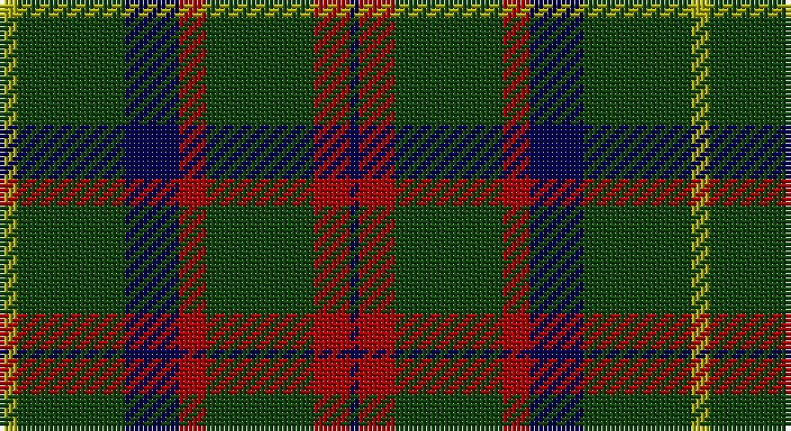

This page is one **sett** — a single exact thread-count. It belongs to the [tartan](/setts/ly2dg12db6r3dg12r4db1/)
(the same proportion at any scale), whose colour order is pattern [BRGRBGY](/stripes/brgrbgy/).

Part of the [MacKintosh Hunting](/tartans/mackintosh-hunting/) tartan — the named design grouping this sett with its other cloths.

Sourced from weddslist.  It is a [7 stripe tartan](/stripes/stripes7/).

Original link http://www.weddslist.com/cgi-bin/tartans/pg.pl?source=tinsel

## Also known as

This cloth is also recorded under:

- MacKintosh Htg
- MacKintosh, hunting

## Thread count
LG/4 DG24 DB12 DR6 DG24 DR8 DB/2

One full sett is **154 threads**.

## Palette

Palette: <strong>custom</strong>
<table><thead><tr><th>Colour</th><th>Threads</th><th>Shade</th><th>Base</th><th>OKLCh</th></tr></thead><tbody><tr><td>LG/</td><td style="text-align:right;font-variant-numeric:tabular-nums">4</td><td><code style="background-color:#AAAA00;">#AAAA00</code> <small style="color:#888">#AAAA00</small></td><td>Y <code style="background-color:#F2BF00;">#F2BF00</code></td><td><small style="color:#888">oklch(71.4% 0.156 109.8)</small></td></tr><tr><td>DG</td><td style="text-align:right;font-variant-numeric:tabular-nums">24</td><td><code style="background-color:#11450D;">#11450D</code> <small style="color:#888">#11450D</small></td><td>G <code style="background-color:#006100;">#006100</code></td><td><small style="color:#888">oklch(34.4% 0.101 142.1)</small></td></tr><tr><td>DB</td><td style="text-align:right;font-variant-numeric:tabular-nums">12</td><td><code style="background-color:#000052;">#000052</code> <small style="color:#888">#000052</small></td><td>B <code style="background-color:#2A418A;">#2A418A</code></td><td><small style="color:#888">oklch(19.8% 0.137 264.1)</small></td></tr><tr><td>DR</td><td style="text-align:right;font-variant-numeric:tabular-nums">6</td><td><code style="background-color:#AA0000;">#AA0000</code> <small style="color:#888">#AA0000</small></td><td>R <code style="background-color:#CC0000;">#CC0000</code></td><td><small style="color:#888">oklch(46.3% 0.190 29.2)</small></td></tr><tr><td>DG</td><td style="text-align:right;font-variant-numeric:tabular-nums">24</td><td><code style="background-color:#11450D;">#11450D</code> <small style="color:#888">#11450D</small></td><td>G <code style="background-color:#006100;">#006100</code></td><td><small style="color:#888">oklch(34.4% 0.101 142.1)</small></td></tr><tr><td>DR</td><td style="text-align:right;font-variant-numeric:tabular-nums">8</td><td><code style="background-color:#AA0000;">#AA0000</code> <small style="color:#888">#AA0000</small></td><td>R <code style="background-color:#CC0000;">#CC0000</code></td><td><small style="color:#888">oklch(46.3% 0.190 29.2)</small></td></tr><tr><td>DB/</td><td style="text-align:right;font-variant-numeric:tabular-nums">2</td><td><code style="background-color:#000052;">#000052</code> <small style="color:#888">#000052</small></td><td>B <code style="background-color:#2A418A;">#2A418A</code></td><td><small style="color:#888">oklch(19.8% 0.137 264.1)</small></td></tr></tbody></table>

# Sample pattern

## Nearest tartans

The nearest existing variants by ΔTartan distance, with this tartan at the top so the swatches line up against it.

ΔTartan

Tartan

Sett

—

<a href="/ttd/edit/#slug=ly2dg12db6r3dg12r4db1~x2">MacKintosh Hunting</a> <a class="nn-out" href="/variants/s7/ly2dg12db6r3dg12r4db1~x2/" title="open its dictionary page">↗</a>

0.88

<a href="/ttd/edit/#slug=k14dg7k2y8k4ly2k1~x4&amp;base=ly2dg12db6r3dg12r4db1~x2">Grass of Rasunda (Commemorative)</a> <a class="nn-out" href="/variants/s7/k14dg7k2y8k4ly2k1~x4/" title="open its dictionary page">↗</a>

0.95

<a href="/ttd/edit/#slug=db5dg8k1ly2k1dg8db4~x4&amp;base=ly2dg12db6r3dg12r4db1~x2">Salvation Army Htg (Corporate)</a> <a class="nn-out" href="/variants/s7/db5dg8k1ly2k1dg8db4~x4/" title="open its dictionary page">↗</a>

1.00

<a href="/ttd/edit/#slug=ly2g12db6r3g12r4db1~x2&amp;base=ly2dg12db6r3dg12r4db1~x2">MacKintosh Hunting</a> <a class="nn-out" href="/variants/s7/ly2g12db6r3g12r4db1~x2/" title="open its dictionary page">↗</a>

1.03

<a href="/ttd/edit/#slug=k14dg7k2y8k4lo2k1~x4&amp;base=ly2dg12db6r3dg12r4db1~x2">Grass of Rasunda (2009), The</a> <a class="nn-out" href="/variants/s7/k14dg7k2y8k4lo2k1~x4/" title="open its dictionary page">↗</a>

1.04

<a href="/ttd/edit/#slug=dt6r3g26dt26w2dt27r5g5~x2&amp;base=ly2dg12db6r3dg12r4db1~x2">MacHardy (Clan)</a> <a class="nn-out" href="/variants/s8/dt6r3g26dt26w2dt27r5g5~x2/" title="open its dictionary page">↗</a>

1.07

<a href="/ttd/edit/#slug=g6k16w1k16g8k4g12r2~x2&amp;base=ly2dg12db6r3dg12r4db1~x2">MacAulay Hunting</a> <a class="nn-out" href="/variants/s8/g6k16w1k16g8k4g12r2~x2/" title="open its dictionary page">↗</a>

1.10

<a href="/ttd/edit/#slug=ly2dg12db6r3dg12r4db1&amp;base=ly2dg12db6r3dg12r4db1~x2">MacKintosh Hunting</a> <a class="nn-out" href="/variants/s7/ly2dg12db6r3dg12r4db1/" title="open its dictionary page">↗</a>

1.11

<a href="/ttd/edit/#slug=r3dg10r3dg14db16dg3ly2~x2&amp;base=ly2dg12db6r3dg12r4db1~x2">Cameron Hunting</a> <a class="nn-out" href="/variants/s7/r3dg10r3dg14db16dg3ly2~x2/" title="open its dictionary page">↗</a>

1.13

<a href="/ttd/edit/#slug=g3db8g3k4g15r2~x2&amp;base=ly2dg12db6r3dg12r4db1~x2">Lauder (Family)</a> <a class="nn-out" href="/variants/s6/g3db8g3k4g15r2~x2/" title="open its dictionary page">↗</a>

1.17

<a href="/ttd/edit/#slug=r3g22db16g14r2g6lo2~x2&amp;base=ly2dg12db6r3dg12r4db1~x2">Scottish Scouts (1957) (Corporate)</a> <a class="nn-out" href="/variants/s7/r3g22db16g14r2g6lo2~x2/" title="open its dictionary page">↗</a>

## Neighbour map

Every grey dot is one of 14360 variants placed by the first two principal components of the ΔTartan feature space (44% of its variance). Red is this tartan; blue dots are its nearest — click one to open its page.

<svg viewBox="0 0 640 380" role="img" style="max-width:100%;height:auto;border:1px solid #e0e0e0;border-radius:4px;display:block" xmlns="http://www.w3.org/2000/svg"><image href="/nn/cloud.v1.png" width="640" height="380"/><a href="/variants/s7/k14dg7k2y8k4ly2k1~x4/"><circle cx="312.5" cy="218.7" r="4" fill="#3465a4"><title>Grass of Rasunda (Commemorative)</title></circle></a><a href="/variants/s7/db5dg8k1ly2k1dg8db4~x4/"><circle cx="295.3" cy="252.9" r="4" fill="#3465a4"><title>Salvation Army Htg (Corporate)</title></circle></a><a href="/variants/s7/ly2g12db6r3g12r4db1~x2/"><circle cx="322.1" cy="217.6" r="4" fill="#3465a4"><title>MacKintosh Hunting</title></circle></a><a href="/variants/s7/k14dg7k2y8k4lo2k1~x4/"><circle cx="320.6" cy="221.8" r="4" fill="#3465a4"><title>Grass of Rasunda (2009), The</title></circle></a><a href="/variants/s8/dt6r3g26dt26w2dt27r5g5~x2/"><circle cx="365.1" cy="216.7" r="4" fill="#3465a4"><title>MacHardy (Clan)</title></circle></a><a href="/variants/s8/g6k16w1k16g8k4g12r2~x2/"><circle cx="326.3" cy="217.2" r="4" fill="#3465a4"><title>MacAulay Hunting</title></circle></a><a href="/variants/s7/ly2dg12db6r3dg12r4db1/"><circle cx="301.7" cy="210.3" r="4" fill="#3465a4"><title>MacKintosh Hunting</title></circle></a><a href="/variants/s7/r3dg10r3dg14db16dg3ly2~x2/"><circle cx="285.2" cy="242.4" r="4" fill="#3465a4"><title>Cameron Hunting</title></circle></a><a href="/variants/s6/g3db8g3k4g15r2~x2/"><circle cx="328.7" cy="254.2" r="4" fill="#3465a4"><title>Lauder (Family)</title></circle></a><a href="/variants/s7/r3g22db16g14r2g6lo2~x2/"><circle cx="365.3" cy="227.3" r="4" fill="#3465a4"><title>Scottish Scouts (1957) (Corporate)</title></circle></a><circle cx="334.0" cy="227.1" r="5" fill="#c00000"/></svg>

ID: /variants/s7/ly2dg12db6r3dg12r4db1~x2/
