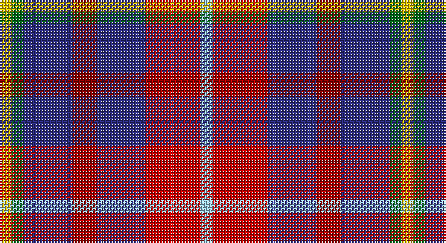

This page is one **sett** — a single exact thread-count. It belongs to the [tartan](/setts/ly2g2db8ri4db8r9lb2/)
(the same proportion at any scale), whose colour order is pattern [WRBRBGY](/stripes/wrbrbgy/).

Part of the [Feis An Eilein](/tartans/feis-an-eilein/) tartan — the named design grouping this sett with its other cloths.

Sourced from tartans-authority.  It is a [7 stripe tartan](/stripes/stripes7/).

Original link http://www.tartansauthority.com/tartan-ferret/display/7137/

## Register references

External register numbers recorded for this tartan.

- Scottish Tartans Authority (ITI): 7137

## Thread count
Y/8 G8 DB32 DR16 DB32 R36 LB/8

One full sett is **264 threads**.

## Palette

Palette: <strong>Tartan Register</strong>
<table><thead><tr><th>Colour</th><th>Threads</th><th>Shade</th><th>Base</th><th>OKLCh</th></tr></thead><tbody><tr><td>Y/</td><td style="text-align:right;font-variant-numeric:tabular-nums">8</td><td><code style="background-color:#E8C000;">#E8C000</code> <small style="color:#888">#E8C000</small></td><td>Y <code style="background-color:#F2BF00;">#F2BF00</code></td><td><small style="color:#888">oklch(81.9% 0.168 93.7)</small></td></tr><tr><td>G</td><td style="text-align:right;font-variant-numeric:tabular-nums">8</td><td><code style="background-color:#006818;">#006818</code> <small style="color:#888">#006818</small></td><td>G <code style="background-color:#006100;">#006100</code></td><td><small style="color:#888">oklch(45.0% 0.142 145.0)</small></td></tr><tr><td>DB</td><td style="text-align:right;font-variant-numeric:tabular-nums">32</td><td><code style="background-color:#2C2C80;">#2C2C80</code> <small style="color:#888">#2C2C80</small></td><td>B <code style="background-color:#2A418A;">#2A418A</code></td><td><small style="color:#888">oklch(35.0% 0.138 276.6)</small></td></tr><tr><td>DR</td><td style="text-align:right;font-variant-numeric:tabular-nums">16</td><td><code style="background-color:#880000;">#880000</code> <small style="color:#888">#880000</small></td><td>R <code style="background-color:#CC0000;">#CC0000</code></td><td><small style="color:#888">oklch(39.4% 0.162 29.2)</small></td></tr><tr><td>DB</td><td style="text-align:right;font-variant-numeric:tabular-nums">32</td><td><code style="background-color:#2C2C80;">#2C2C80</code> <small style="color:#888">#2C2C80</small></td><td>B <code style="background-color:#2A418A;">#2A418A</code></td><td><small style="color:#888">oklch(35.0% 0.138 276.6)</small></td></tr><tr><td>R</td><td style="text-align:right;font-variant-numeric:tabular-nums">36</td><td><code style="background-color:#C80000;">#C80000</code> <small style="color:#888">#C80000</small></td><td>R <code style="background-color:#CC0000;">#CC0000</code></td><td><small style="color:#888">oklch(52.3% 0.215 29.2)</small></td></tr><tr><td>LB/</td><td style="text-align:right;font-variant-numeric:tabular-nums">8</td><td><code style="background-color:#98C8E8;">#98C8E8</code> <small style="color:#888">#98C8E8</small></td><td>W <code style="background-color:#F7F7F7;">#F7F7F7</code></td><td><small style="color:#888">oklch(81.0% 0.068 237.9)</small></td></tr></tbody></table>

# Sample pattern

## Compared to the master

This cloth is one sett of its design; the master sett (the exemplar the design is anchored on) is below for comparison.

<figure style="margin:0"><figcaption style="color:#888;font-size:smaller">this sett</figcaption></figure>
<figure style="margin:0"><figcaption style="color:#888;font-size:smaller"><a href="/setts/y2r9db8m4db8dg2ly2/">master sett →</a></figcaption></figure>

## Nearest tartans

The nearest existing variants by ΔTartan distance, with this tartan at the top so the swatches line up against it.

ΔTartan

Tartan

Sett

—

<a href="/ttd/edit/#slug=ly2g2db8ri4db8r9lb2~x4">Feis An Eilein (Corporate)</a> <a class="nn-out" href="/variants/s7/ly2g2db8ri4db8r9lb2~x4/" title="open its dictionary page">↗</a>

0.58

<a href="/ttd/edit/#slug=y2r9db8m4db8dg2ly2~x8&amp;base=ly2g2db8ri4db8r9lb2~x4">Feis An Eilein</a> <a class="nn-out" href="/variants/s7/y2r9db8m4db8dg2ly2~x8/" title="open its dictionary page">↗</a>

1.11

<a href="/ttd/edit/#slug=db20k3g18r12t4r12db15ly4~x2&amp;base=ly2g2db8ri4db8r9lb2~x4">Sustainability (Fashion)</a> <a class="nn-out" href="/variants/s8/db20k3g18r12t4r12db15ly4~x2/" title="open its dictionary page">↗</a>

1.12

<a href="/ttd/edit/#slug=g3db8r11dt3k2dp2~x4&amp;base=ly2g2db8ri4db8r9lb2~x4">Nicolson of Tiree &amp; Coll (Clan)</a> <a class="nn-out" href="/variants/s6/g3db8r11dt3k2dp2~x4/" title="open its dictionary page">↗</a>

1.17

<a href="/ttd/edit/#slug=db12w4r12w5k4o12db20r4db5r4~x2&amp;base=ly2g2db8ri4db8r9lb2~x4">Commonwealth</a> <a class="nn-out" href="/variants/s10/db12w4r12w5k4o12db20r4db5r4~x2/" title="open its dictionary page">↗</a>

1.23

<a href="/ttd/edit/#slug=lo2db4k1db4m4lo4db1~x8&amp;base=ly2g2db8ri4db8r9lb2~x4">Isle of Gigha (District)</a> <a class="nn-out" href="/variants/s7/lo2db4k1db4m4lo4db1~x8/" title="open its dictionary page">↗</a>

1.29

<a href="/ttd/edit/#slug=r4w4r5b4r12gi4r12g8b13dt3b4~x2&amp;base=ly2g2db8ri4db8r9lb2~x4">Hueg (Formal) (Personal)</a> <a class="nn-out" href="/variants/s11/r4w4r5b4r12gi4r12g8b13dt3b4~x2/" title="open its dictionary page">↗</a>

1.33

<a href="/ttd/edit/#slug=w5o20k8r5dp36lo5~x2&amp;base=ly2g2db8ri4db8r9lb2~x4">Lord's Own Highlanders (Corporate)</a> <a class="nn-out" href="/variants/s6/w5o20k8r5dp36lo5~x2/" title="open its dictionary page">↗</a>

1.35

<a href="/ttd/edit/#slug=dti3dt5n2dg5r11w3~x4&amp;base=ly2g2db8ri4db8r9lb2~x4">Nicolson of Lewis (Clan?)</a> <a class="nn-out" href="/variants/s6/dti3dt5n2dg5r11w3~x4/" title="open its dictionary page">↗</a>

1.44

<a href="/ttd/edit/#slug=dt6lo2r6lb3k2lo6dt10r2dt3r2~x4&amp;base=ly2g2db8ri4db8r9lb2~x4">Commonwealth</a> <a class="nn-out" href="/variants/s10/dt6lo2r6lb3k2lo6dt10r2dt3r2~x4/" title="open its dictionary page">↗</a>

1.49

<a href="/ttd/edit/#slug=r3t4k11r11g11do3r3~x4&amp;base=ly2g2db8ri4db8r9lb2~x4">Stewart /Stuart- Fragment Cf 1452 &amp; 1445</a> <a class="nn-out" href="/variants/s7/r3t4k11r11g11do3r3~x4/" title="open its dictionary page">↗</a>

## Neighbour map

Every grey dot is one of 14360 variants placed by the first two principal components of the ΔTartan feature space (44% of its variance). Red is this tartan; blue dots are its nearest — click one to open its page.

<svg viewBox="0 0 640 380" role="img" style="max-width:100%;height:auto;border:1px solid #e0e0e0;border-radius:4px;display:block" xmlns="http://www.w3.org/2000/svg"><image href="/nn/cloud.v1.png" width="640" height="380"/><a href="/variants/s7/y2r9db8m4db8dg2ly2~x8/"><circle cx="151.9" cy="221.7" r="4" fill="#3465a4"><title>Feis An Eilein</title></circle></a><a href="/variants/s8/db20k3g18r12t4r12db15ly4~x2/"><circle cx="121.1" cy="204.1" r="4" fill="#3465a4"><title>Sustainability (Fashion)</title></circle></a><a href="/variants/s6/g3db8r11dt3k2dp2~x4/"><circle cx="127.8" cy="205.1" r="4" fill="#3465a4"><title>Nicolson of Tiree &amp; Coll (Clan)</title></circle></a><a href="/variants/s10/db12w4r12w5k4o12db20r4db5r4~x2/"><circle cx="146.5" cy="204.0" r="4" fill="#3465a4"><title>Commonwealth</title></circle></a><a href="/variants/s7/lo2db4k1db4m4lo4db1~x8/"><circle cx="115.1" cy="251.2" r="4" fill="#3465a4"><title>Isle of Gigha (District)</title></circle></a><a href="/variants/s11/r4w4r5b4r12gi4r12g8b13dt3b4~x2/"><circle cx="126.4" cy="199.4" r="4" fill="#3465a4"><title>Hueg (Formal) (Personal)</title></circle></a><a href="/variants/s6/w5o20k8r5dp36lo5~x2/"><circle cx="178.4" cy="177.2" r="4" fill="#3465a4"><title>Lord's Own Highlanders (Corporate)</title></circle></a><a href="/variants/s6/dti3dt5n2dg5r11w3~x4/"><circle cx="99.0" cy="208.6" r="4" fill="#3465a4"><title>Nicolson of Lewis (Clan?)</title></circle></a><a href="/variants/s10/dt6lo2r6lb3k2lo6dt10r2dt3r2~x4/"><circle cx="149.2" cy="210.9" r="4" fill="#3465a4"><title>Commonwealth</title></circle></a><a href="/variants/s7/r3t4k11r11g11do3r3~x4/"><circle cx="97.2" cy="234.7" r="4" fill="#3465a4"><title>Stewart /Stuart- Fragment Cf 1452 &amp; 1445</title></circle></a><circle cx="137.1" cy="214.0" r="5" fill="#c00000"/></svg>

ID: /variants/s7/ly2g2db8ri4db8r9lb2~x4/
