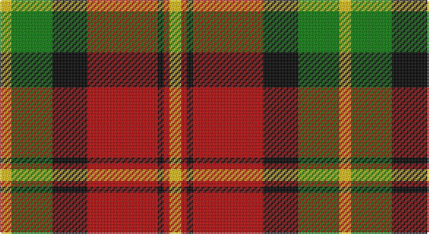

This page is one **sett** — a single exact thread-count. It belongs to the [tartan](/setts/ly2g7k6r12k1r1ly2/)
(the same proportion at any scale), whose colour order is pattern [YGKRKRY](/stripes/ygkrkry/).

Sourced from weddslist.  It is a [7 stripe tartan](/stripes/stripes7/).

Original link http://www.weddslist.com/cgi-bin/tartans/pg.pl?source=sts

## Provenance

Earliest known date: 1982 Commissioned by Herbert Earl Blackstock in 1983, President of the Clan Blackstock Society in the USA. Blackstocks were a 'Scotch-Irish' family who emigrated to the US from Ulster. Designed by kiltmaker and historian Bob Martin of Greenville, South Carolina. www.clanblackstocksociety.com

## Also known as

This cloth is also recorded under:

- Blackstock, dress

2 attestations — the source records this cloth was collapsed from (oldest owns this page)

<ul>
<li>undated — Blackstock, dress (weddslist, <a href="http://www.weddslist.com/cgi-bin/tartans/pg.pl?source=sts">record</a>)</li>
<li>undated — Blackstock Dress Family Tartan (house-of-tartan, <a href="http://www.house-of-tartan.scotland.net/house/TartanViewjs.asp?colr=Def&tnam=1881">record</a>)</li>
</ul>

## Thread count
Y/8 G28 K24 R48 K4 R4 Y/8

One full sett is **232 threads**.

## Palette

Palette: <strong>Ingles Buchan</strong> <small style="color:#888">(1 of 4 colours)</small>
<table><thead><tr><th>Colour</th><th>Threads</th><th>Shade</th><th>Base</th><th>OKLCh</th></tr></thead><tbody><tr><td>Y/</td><td style="text-align:right;font-variant-numeric:tabular-nums">8</td><td><code style="background-color:#F0C000;">#F0C000</code> <small style="color:#888">#F0C000</small></td><td>Y <code style="background-color:#F2BF00;">#F2BF00</code></td><td><small style="color:#888">oklch(82.7% 0.169 90.5)</small></td></tr><tr><td>G</td><td style="text-align:right;font-variant-numeric:tabular-nums">28</td><td><code style="background-color:#008000;">#008000</code> <small style="color:#888">#008000</small></td><td>G <code style="background-color:#006100;">#006100</code></td><td><small style="color:#888">oklch(52.0% 0.177 142.5)</small></td></tr><tr><td>K</td><td style="text-align:right;font-variant-numeric:tabular-nums">24</td><td><code style="background-color:#000000;">#000000</code> <small style="color:#888">#000000</small></td><td>K <code style="background-color:#000000;">#000000</code></td><td><small style="color:#888">oklch(0.0% 0.000 0.0)</small></td></tr><tr><td>R</td><td style="text-align:right;font-variant-numeric:tabular-nums">48</td><td><code style="background-color:#C00000;">#C00000</code> <small style="color:#888">#C00000</small></td><td>R <code style="background-color:#CC0000;">#CC0000</code></td><td><small style="color:#888">oklch(50.7% 0.208 29.2)</small></td></tr><tr><td>K</td><td style="text-align:right;font-variant-numeric:tabular-nums">4</td><td><code style="background-color:#000000;">#000000</code> <small style="color:#888">#000000</small></td><td>K <code style="background-color:#000000;">#000000</code></td><td><small style="color:#888">oklch(0.0% 0.000 0.0)</small></td></tr><tr><td>R</td><td style="text-align:right;font-variant-numeric:tabular-nums">4</td><td><code style="background-color:#C00000;">#C00000</code> <small style="color:#888">#C00000</small></td><td>R <code style="background-color:#CC0000;">#CC0000</code></td><td><small style="color:#888">oklch(50.7% 0.208 29.2)</small></td></tr><tr><td>Y/</td><td style="text-align:right;font-variant-numeric:tabular-nums">8</td><td><code style="background-color:#F0C000;">#F0C000</code> <small style="color:#888">#F0C000</small></td><td>Y <code style="background-color:#F2BF00;">#F2BF00</code></td><td><small style="color:#888">oklch(82.7% 0.169 90.5)</small></td></tr></tbody></table>

# Sample pattern

## Nearest tartans

The nearest existing variants by ΔTartan distance, with this tartan at the top so the swatches line up against it.

ΔTartan

Tartan

Sett

—

<a href="/ttd/edit/#slug=ly2g7k6r12k1r1ly2~x4">Blackstock, dress</a> <a class="nn-out" href="/variants/s7/ly2g7k6r12k1r1ly2~x4/" title="open its dictionary page">↗</a>

0.70

<a href="/ttd/edit/#slug=ly2dg7k6r11k1r1ly2~x4&amp;base=ly2g7k6r12k1r1ly2~x4">Blackstock Red (Dress)</a> <a class="nn-out" href="/variants/s7/ly2dg7k6r11k1r1ly2~x4/" title="open its dictionary page">↗</a>

0.71

<a href="/ttd/edit/#slug=k3ly18dg6r17k31dg3~x2&amp;base=ly2g7k6r12k1r1ly2~x4">MacMillan Varient (Unidentified)</a> <a class="nn-out" href="/variants/s6/k3ly18dg6r17k31dg3~x2/" title="open its dictionary page">↗</a>

0.96

<a href="/ttd/edit/#slug=k1lb1r16dg16k12lb8r16lb1k1~x2&amp;base=ly2g7k6r12k1r1ly2~x4">MacNaughton</a> <a class="nn-out" href="/variants/s9/k1lb1r16dg16k12lb8r16lb1k1~x2/" title="open its dictionary page">↗</a>

1.00

<a href="/ttd/edit/#slug=k15dg1k3r9dg1r3lo11k1~x4&amp;base=ly2g7k6r12k1r1ly2~x4">Island of Innis, The</a> <a class="nn-out" href="/variants/s8/k15dg1k3r9dg1r3lo11k1~x4/" title="open its dictionary page">↗</a>

1.04

<a href="/ttd/edit/#slug=k3ly18g6r17k31g3~x2&amp;base=ly2g7k6r12k1r1ly2~x4">MacMillan Variant (Unidentified)</a> <a class="nn-out" href="/variants/s6/k3ly18g6r17k31g3~x2/" title="open its dictionary page">↗</a>

1.06

<a href="/ttd/edit/#slug=g8r2g12k6g3db6r24k4~x2&amp;base=ly2g7k6r12k1r1ly2~x4">Dickie</a> <a class="nn-out" href="/variants/s8/g8r2g12k6g3db6r24k4~x2/" title="open its dictionary page">↗</a>

1.07

<a href="/ttd/edit/#slug=k6r2g17r16k1t2~x2&amp;base=ly2g7k6r12k1r1ly2~x4">Unidentified 12</a> <a class="nn-out" href="/variants/s6/k6r2g17r16k1t2~x2/" title="open its dictionary page">↗</a>

1.08

<a href="/ttd/edit/#slug=r24lb2ly3dg16k16lb2ly3&amp;base=ly2g7k6r12k1r1ly2~x4">MacLachlan W</a> <a class="nn-out" href="/variants/s7/r24lb2ly3dg16k16lb2ly3/" title="open its dictionary page">↗</a>

1.10

<a href="/ttd/edit/#slug=db1k1r12g12k6db5r12k1db1~x2&amp;base=ly2g7k6r12k1r1ly2~x4">Montrose</a> <a class="nn-out" href="/variants/s9/db1k1r12g12k6db5r12k1db1~x2/" title="open its dictionary page">↗</a>

1.13

<a href="/ttd/edit/#slug=k44lo9k3lo8lo16lo15lo6k7~x2&amp;base=ly2g7k6r12k1r1ly2~x4">Longford County Crest (Fashion)</a> <a class="nn-out" href="/variants/s8/k44lo9k3lo8lo16lo15lo6k7~x2/" title="open its dictionary page">↗</a>

## Neighbour map

Every grey dot is one of 14360 variants placed by the first two principal components of the ΔTartan feature space (44% of its variance). Red is this tartan; blue dots are its nearest — click one to open its page.

<svg viewBox="0 0 640 380" role="img" style="max-width:100%;height:auto;border:1px solid #e0e0e0;border-radius:4px;display:block" xmlns="http://www.w3.org/2000/svg"><image href="/nn/cloud.v1.png" width="640" height="380"/><a href="/variants/s7/ly2dg7k6r11k1r1ly2~x4/"><circle cx="187.8" cy="183.9" r="4" fill="#3465a4"><title>Blackstock Red (Dress)</title></circle></a><a href="/variants/s6/k3ly18dg6r17k31dg3~x2/"><circle cx="188.9" cy="191.9" r="4" fill="#3465a4"><title>MacMillan Varient (Unidentified)</title></circle></a><a href="/variants/s9/k1lb1r16dg16k12lb8r16lb1k1~x2/"><circle cx="207.8" cy="150.6" r="4" fill="#3465a4"><title>MacNaughton</title></circle></a><a href="/variants/s8/k15dg1k3r9dg1r3lo11k1~x4/"><circle cx="232.9" cy="163.7" r="4" fill="#3465a4"><title>Island of Innis, The</title></circle></a><a href="/variants/s6/k3ly18g6r17k31g3~x2/"><circle cx="179.4" cy="191.6" r="4" fill="#3465a4"><title>MacMillan Variant (Unidentified)</title></circle></a><a href="/variants/s8/g8r2g12k6g3db6r24k4~x2/"><circle cx="200.1" cy="181.3" r="4" fill="#3465a4"><title>Dickie</title></circle></a><a href="/variants/s6/k6r2g17r16k1t2~x2/"><circle cx="234.6" cy="171.3" r="4" fill="#3465a4"><title>Unidentified 12</title></circle></a><a href="/variants/s7/r24lb2ly3dg16k16lb2ly3/"><circle cx="139.3" cy="150.6" r="4" fill="#3465a4"><title>MacLachlan W</title></circle></a><a href="/variants/s9/db1k1r12g12k6db5r12k1db1~x2/"><circle cx="226.2" cy="169.7" r="4" fill="#3465a4"><title>Montrose</title></circle></a><a href="/variants/s8/k44lo9k3lo8lo16lo15lo6k7~x2/"><circle cx="212.1" cy="166.7" r="4" fill="#3465a4"><title>Longford County Crest (Fashion)</title></circle></a><circle cx="189.7" cy="169.2" r="5" fill="#c00000"/></svg>

ID: /variants/s7/ly2g7k6r12k1r1ly2~x4/
