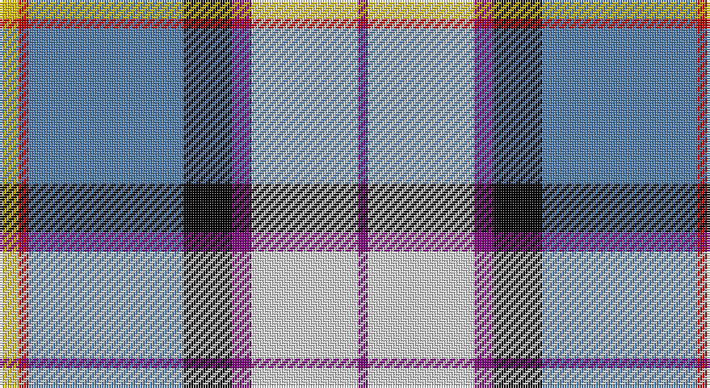

This page is one **sett** — a single exact thread-count. It belongs to the [tartan](/setts/ly2r1t16k5p2w11p1/)
(the same proportion at any scale), whose colour order is pattern [BWBKBRY](/stripes/bwbkbry/).

Sourced from weddslist.  It is a [7 stripe tartan](/stripes/stripes7/).

Original link http://www.weddslist.com/cgi-bin/tartans/pg.pl?source=sts

## Thread count
Y/8 R4 B64 K20 P8 LN44 P/4

One full sett is **292 threads**.

## Palette

Palette: <strong>Tartan Register</strong> <small style="color:#888">(2 of 6 colours)</small>
<table><thead><tr><th>Colour</th><th>Threads</th><th>Shade</th><th>Base</th><th>OKLCh</th></tr></thead><tbody><tr><td>Y/</td><td style="text-align:right;font-variant-numeric:tabular-nums">8</td><td><code style="background-color:#F0C000;">#F0C000</code> <small style="color:#888">#F0C000</small></td><td>Y <code style="background-color:#F2BF00;">#F2BF00</code></td><td><small style="color:#888">oklch(82.7% 0.169 90.5)</small></td></tr><tr><td>R</td><td style="text-align:right;font-variant-numeric:tabular-nums">4</td><td><code style="background-color:#C00000;">#C00000</code> <small style="color:#888">#C00000</small></td><td>R <code style="background-color:#CC0000;">#CC0000</code></td><td><small style="color:#888">oklch(50.7% 0.208 29.2)</small></td></tr><tr><td>B</td><td style="text-align:right;font-variant-numeric:tabular-nums">64</td><td><code style="background-color:#5480B0;">#5480B0</code> <small style="color:#888">#5480B0</small></td><td>B <code style="background-color:#2A418A;">#2A418A</code></td><td><small style="color:#888">oklch(58.8% 0.089 251.5)</small></td></tr><tr><td>K</td><td style="text-align:right;font-variant-numeric:tabular-nums">20</td><td><code style="background-color:#000000;">#000000</code> <small style="color:#888">#000000</small></td><td>K <code style="background-color:#000000;">#000000</code></td><td><small style="color:#888">oklch(0.0% 0.000 0.0)</small></td></tr><tr><td>P</td><td style="text-align:right;font-variant-numeric:tabular-nums">8</td><td><code style="background-color:#800080;">#800080</code> <small style="color:#888">#800080</small></td><td>B <code style="background-color:#2A418A;">#2A418A</code></td><td><small style="color:#888">oklch(42.1% 0.193 328.4)</small></td></tr><tr><td>LN</td><td style="text-align:right;font-variant-numeric:tabular-nums">44</td><td><code style="background-color:#E0E0E0;">#E0E0E0</code> <small style="color:#888">#E0E0E0</small></td><td>W <code style="background-color:#F7F7F7;">#F7F7F7</code></td><td><small style="color:#888">oklch(90.7% 0.000 89.9)</small></td></tr><tr><td>P/</td><td style="text-align:right;font-variant-numeric:tabular-nums">4</td><td><code style="background-color:#800080;">#800080</code> <small style="color:#888">#800080</small></td><td>B <code style="background-color:#2A418A;">#2A418A</code></td><td><small style="color:#888">oklch(42.1% 0.193 328.4)</small></td></tr></tbody></table>

# Sample pattern

## Nearest tartans

The nearest existing variants by ΔTartan distance, with this tartan at the top so the swatches line up against it.

ΔTartan

Tartan

Sett

—

<a href="/ttd/edit/#slug=ly2r1t16k5p2w11p1~x4">Dignan</a> <a class="nn-out" href="/variants/s7/ly2r1t16k5p2w11p1~x4/" title="open its dictionary page">↗</a>

0.78

<a href="/ttd/edit/#slug=db5w30lr9k9dp9g2dp2g5~x2&amp;base=ly2r1t16k5p2w11p1~x4">Alexander of Menstry Dress</a> <a class="nn-out" href="/variants/s8/db5w30lr9k9dp9g2dp2g5~x2/" title="open its dictionary page">↗</a>

0.82

<a href="/ttd/edit/#slug=dp4k2w3k2db30g9k4w20ly3~x2&amp;base=ly2r1t16k5p2w11p1~x4">Minnesota Dress</a> <a class="nn-out" href="/variants/s9/dp4k2w3k2db30g9k4w20ly3~x2/" title="open its dictionary page">↗</a>

0.82

<a href="/ttd/edit/#slug=k6w49dt50dp6t8lo4&amp;base=ly2r1t16k5p2w11p1~x4">Pipers' Trail Dance, The</a> <a class="nn-out" href="/variants/s6/k6w49dt50dp6t8lo4/" title="open its dictionary page">↗</a>

0.84

<a href="/ttd/edit/#slug=r3w2db27k19w27dp2ly3~x2&amp;base=ly2r1t16k5p2w11p1~x4">Christian Dress (Personal)</a> <a class="nn-out" href="/variants/s7/r3w2db27k19w27dp2ly3~x2/" title="open its dictionary page">↗</a>

0.86

<a href="/ttd/edit/#slug=k6w49db50dp6dbi8ly4&amp;base=ly2r1t16k5p2w11p1~x4">Pipers' Trail Dance, The</a> <a class="nn-out" href="/variants/s6/k6w49db50dp6dbi8ly4/" title="open its dictionary page">↗</a>

0.93

<a href="/ttd/edit/#slug=w18k1db4g4dp10lo2~x4&amp;base=ly2r1t16k5p2w11p1~x4">Edgar-Feyen (Personal)</a> <a class="nn-out" href="/variants/s6/w18k1db4g4dp10lo2~x4/" title="open its dictionary page">↗</a>

1.02

<a href="/ttd/edit/#slug=w4g3w19g8k1r4k1db18k1lo2~x2&amp;base=ly2r1t16k5p2w11p1~x4">Alberta Dress</a> <a class="nn-out" href="/variants/s10/w4g3w19g8k1r4k1db18k1lo2~x2/" title="open its dictionary page">↗</a>

1.06

<a href="/ttd/edit/#slug=g4w28dp8ly2db17g4~x2&amp;base=ly2r1t16k5p2w11p1~x4">Manx Dress</a> <a class="nn-out" href="/variants/s6/g4w28dp8ly2db17g4~x2/" title="open its dictionary page">↗</a>

1.07

<a href="/ttd/edit/#slug=r2db14k6g1w12g1w2~x4&amp;base=ly2r1t16k5p2w11p1~x4">Davidson (Wedding) (Personal)</a> <a class="nn-out" href="/variants/s7/r2db14k6g1w12g1w2~x4/" title="open its dictionary page">↗</a>

1.08

<a href="/ttd/edit/#slug=w4k2w30g3p3g3p7db14g3r3~x2&amp;base=ly2r1t16k5p2w11p1~x4">Edinburgh, dress</a> <a class="nn-out" href="/variants/s10/w4k2w30g3p3g3p7db14g3r3~x2/" title="open its dictionary page">↗</a>

## Neighbour map

Every grey dot is one of 14360 variants placed by the first two principal components of the ΔTartan feature space (44% of its variance). Red is this tartan; blue dots are its nearest — click one to open its page.

<svg viewBox="0 0 640 380" role="img" style="max-width:100%;height:auto;border:1px solid #e0e0e0;border-radius:4px;display:block" xmlns="http://www.w3.org/2000/svg"><image href="/nn/cloud.v1.png" width="640" height="380"/><a href="/variants/s8/db5w30lr9k9dp9g2dp2g5~x2/"><circle cx="130.8" cy="107.6" r="4" fill="#3465a4"><title>Alexander of Menstry Dress</title></circle></a><a href="/variants/s9/dp4k2w3k2db30g9k4w20ly3~x2/"><circle cx="142.1" cy="106.5" r="4" fill="#3465a4"><title>Minnesota Dress</title></circle></a><a href="/variants/s6/k6w49dt50dp6t8lo4/"><circle cx="157.7" cy="131.3" r="4" fill="#3465a4"><title>Pipers' Trail Dance, The</title></circle></a><a href="/variants/s7/r3w2db27k19w27dp2ly3~x2/"><circle cx="118.8" cy="125.1" r="4" fill="#3465a4"><title>Christian Dress (Personal)</title></circle></a><a href="/variants/s6/k6w49db50dp6dbi8ly4/"><circle cx="158.4" cy="129.3" r="4" fill="#3465a4"><title>Pipers' Trail Dance, The</title></circle></a><a href="/variants/s6/w18k1db4g4dp10lo2~x4/"><circle cx="183.6" cy="121.3" r="4" fill="#3465a4"><title>Edgar-Feyen (Personal)</title></circle></a><a href="/variants/s10/w4g3w19g8k1r4k1db18k1lo2~x2/"><circle cx="136.7" cy="89.0" r="4" fill="#3465a4"><title>Alberta Dress</title></circle></a><a href="/variants/s6/g4w28dp8ly2db17g4~x2/"><circle cx="180.7" cy="151.3" r="4" fill="#3465a4"><title>Manx Dress</title></circle></a><a href="/variants/s7/r2db14k6g1w12g1w2~x4/"><circle cx="148.7" cy="139.6" r="4" fill="#3465a4"><title>Davidson (Wedding) (Personal)</title></circle></a><a href="/variants/s10/w4k2w30g3p3g3p7db14g3r3~x2/"><circle cx="181.6" cy="90.6" r="4" fill="#3465a4"><title>Edinburgh, dress</title></circle></a><circle cx="159.1" cy="116.6" r="5" fill="#c00000"/></svg>

ID: /variants/s7/ly2r1t16k5p2w11p1~x4/
