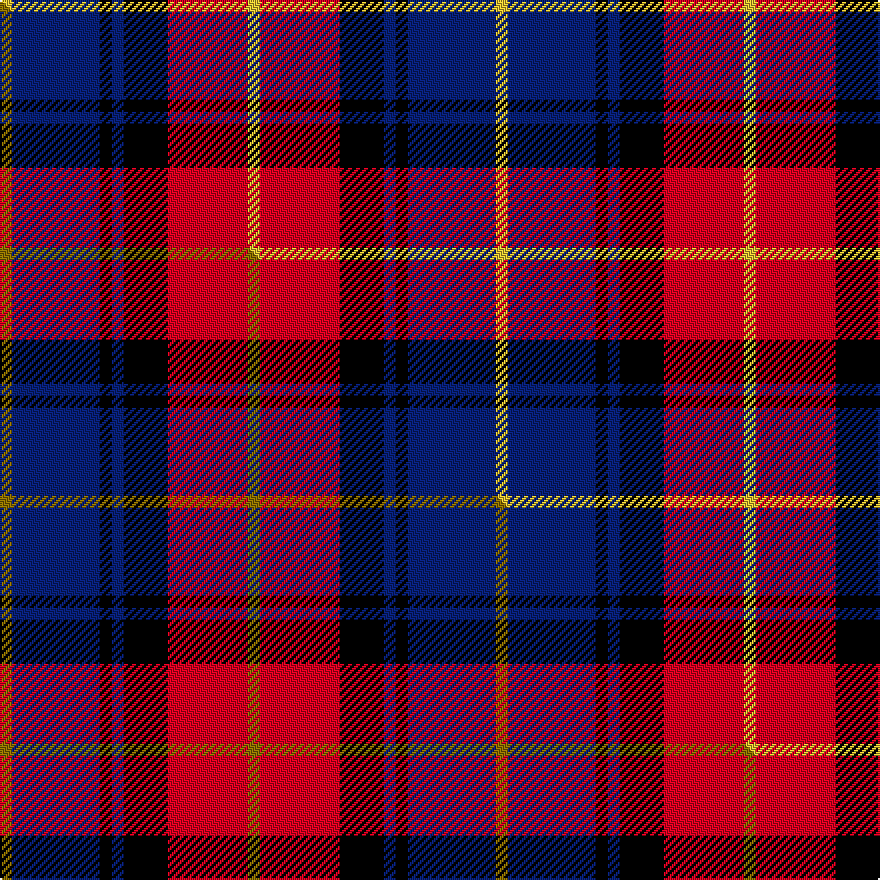

This page is one **sett** — a single exact thread-count. It belongs to the [tartan](/setts/ly3db22k3db3k11r20ly3/)
(the same proportion at any scale), whose colour order is pattern [YBKBKRY](/stripes/ybkbkry/).

Part of the [Biffy Clyro](/tartans/biffy-clyro/) tartan — the named design grouping this sett with its other cloths.

Sourced from tartans-authority.  It is a [7 stripe tartan](/stripes/stripes7/).

Original link http://www.tartansauthority.com/tartan-ferret/display/11100/

## Register references

External register numbers recorded for this tartan.

- Scottish Register of Tartans: [11100](https://www.tartanregister.gov.uk/tartanDetails?ref=11100)
- Scottish Tartans Authority (ITI): 11100

## Thread count
LY/6 DB44 K6 DB6 K22 R40 LY/6

One full sett is **248 threads**.

## Palette
<table><thead><tr><th>Colour</th><th>Shade</th><th>OKLCh</th></tr></thead><tbody><tr><td>DB</td><td><code style="background-color:#082077;">#082077</code> <small style="color:#888">#082077</small></td><td><small style="color:#888">oklch(30.0% 0.149 265.1)</small></td></tr><tr><td>K</td><td><code style="background-color:#000000;">#000000</code> <small style="color:#888">#000000</small></td><td><small style="color:#888">oklch(0.0% 0.000 0.0)</small></td></tr><tr><td>R</td><td><code style="background-color:#D60020;">#D60020</code> <small style="color:#888">#D60020</small></td><td><small style="color:#888">oklch(55.2% 0.224 25.5)</small></td></tr><tr><td>LY</td><td><code style="background-color:#DCBC32;">#DCBC32</code> <small style="color:#888">#DCBC32</small></td><td><small style="color:#888">oklch(80.0% 0.150 95.2)</small></td></tr></tbody></table>

# Sample pattern

## Compared to the master

This cloth is one sett of its design; the master sett (the exemplar the design is anchored on) is below for comparison.

Its **ΔTartan distance** from the master is **0.38** — the same measure the nearest-tartans table ranks by (0 is identical; a re-scale of the same cloth is near 0, a recolour or a different proportion further).

<figure class="master-compare" style="margin:0">

this sett
master sett ★

<figcaption style="color:#888;font-size:smaller">One weave of this sett against the <a href="/setts/y3db22k3db3k11r20y3/">master sett ★</a>, split on the diagonal: a shared proportion runs seamlessly across it with only the shades shifting; a different proportion breaks on it.</figcaption>
</figure>

## Nearest variants

The nearest existing variants by ΔTartan distance, with this cloth at the top so the swatches line up against it.

ΔTartan

Threads

Variant

Sett

—

248

<a href="/variants/s7/ly3db22k3db3k11r20ly3~x2/">Biffy Clyro</a>

<a href="/ttd/edit/#slug=y3db22k3db3k11r20y3~x2&amp;base=ly3db22k3db3k11r20ly3~x2" title="compare in the TTD">0.00</a>

248

<a href="/variants/s7/y3db22k3db3k11r20y3~x2/">Biffy Clyro</a>

<a href="/ttd/edit/#slug=db31lb4db6k19r20y4~x2&amp;base=ly3db22k3db3k11r20ly3~x2" title="compare in the TTD">1.72</a>

266

<a href="/variants/s6/db31lb4db6k19r20y4~x2/">Fife (McGill)</a>

<a href="/ttd/edit/#slug=db4r30k6db13k13db3~x2&amp;base=ly3db22k3db3k11r20ly3~x2" title="compare in the TTD">2.18</a>

262

<a href="/variants/s6/db4r30k6db13k13db3~x2/">Thompson/Thomson/MacTavish (Bonner)</a>

<a href="/ttd/edit/#slug=lb5k26y4lb24dp8k3r4~x2&amp;base=ly3db22k3db3k11r20ly3~x2" title="compare in the TTD">2.19</a>

278

<a href="/variants/s7/lb5k26y4lb24dp8k3r4~x2/">Pengelly, The Cornish (Name)</a>

<a href="/ttd/edit/#slug=r26lb3r4k16db16k4~x2&amp;base=ly3db22k3db3k11r20ly3~x2" title="compare in the TTD">2.50</a>

216

<a href="/variants/s6/r26lb3r4k16db16k4~x2/">Graham of Menteith, (Red)</a>

<a href="/ttd/edit/#slug=r36lb3r5k21db24k3~x2~db1406275&amp;base=ly3db22k3db3k11r20ly3~x2" title="compare in the TTD">2.53</a>

290

<a href="/variants/s6/r36lb3r5k21db24k3~x2~db1406275/">Graham of Menteith (Red)</a>

<a href="/ttd/edit/#slug=r3db3r20k20db20g3~x2&amp;base=ly3db22k3db3k11r20ly3~x2" title="compare in the TTD">2.56</a>

264

<a href="/variants/s6/r3db3r20k20db20g3~x2/">Unidentified #65</a>

<a href="/ttd/edit/#slug=db5k1g1k1r3k1~x4&amp;base=ly3db22k3db3k11r20ly3~x2" title="compare in the TTD">2.59</a>

72

<a href="/variants/s6/db5k1g1k1r3k1~x4/">Clerk</a>

<a href="/ttd/edit/#slug=dy4r27k12db15dy4~x2&amp;base=ly3db22k3db3k11r20ly3~x2" title="compare in the TTD">2.60</a>

232

<a href="/variants/s5/dy4r27k12db15dy4~x2/">Aberdeen University (1992)</a>

<a href="/ttd/edit/#slug=y2r15k7db8y2~x4&amp;base=ly3db22k3db3k11r20ly3~x2" title="compare in the TTD">2.61</a>

256

<a href="/variants/s5/y2r15k7db8y2~x4/">Aberdeen University</a>

## Neighbour map

Every grey dot is one of 13620 variants placed by the first two principal components of the ΔTartan feature space (42% of its variance). Red is this tartan; blue dots are its nearest — click one to open its page.

<svg viewBox="0 0 640 380" role="img" style="max-width:100%;height:auto;border:1px solid #e0e0e0;border-radius:4px;display:block" xmlns="http://www.w3.org/2000/svg"><image href="/nn/cloud.v1.png" width="640" height="380"/><a href="/variants/s7/y3db22k3db3k11r20y3~x2/"><circle cx="162.8" cy="191.8" r="4" fill="#3465a4"><title>Biffy Clyro</title></circle></a><a href="/variants/s6/db31lb4db6k19r20y4~x2/"><circle cx="157.9" cy="193.1" r="4" fill="#3465a4"><title>Fife (McGill)</title></circle></a><a href="/variants/s6/db4r30k6db13k13db3~x2/"><circle cx="217.4" cy="198.7" r="4" fill="#3465a4"><title>Thompson/Thomson/MacTavish (Bonner)</title></circle></a><a href="/variants/s7/lb5k26y4lb24dp8k3r4~x2/"><circle cx="135.4" cy="165.9" r="4" fill="#3465a4"><title>Pengelly, The Cornish (Name)</title></circle></a><a href="/variants/s6/r26lb3r4k16db16k4~x2/"><circle cx="181.0" cy="194.7" r="4" fill="#3465a4"><title>Graham of Menteith, (Red)</title></circle></a><a href="/variants/s6/r36lb3r5k21db24k3~x2~db1406275/"><circle cx="207.3" cy="176.2" r="4" fill="#3465a4"><title>Graham of Menteith (Red)</title></circle></a><a href="/variants/s6/r3db3r20k20db20g3~x2/"><circle cx="139.0" cy="210.8" r="4" fill="#3465a4"><title>Unidentified #65</title></circle></a><a href="/variants/s6/db5k1g1k1r3k1~x4/"><circle cx="156.4" cy="219.5" r="4" fill="#3465a4"><title>Clerk</title></circle></a><a href="/variants/s5/dy4r27k12db15dy4~x2/"><circle cx="177.5" cy="220.2" r="4" fill="#3465a4"><title>Aberdeen University (1992)</title></circle></a><a href="/variants/s5/y2r15k7db8y2~x4/"><circle cx="179.8" cy="212.6" r="4" fill="#3465a4"><title>Aberdeen University</title></circle></a><circle cx="152.7" cy="189.3" r="5" fill="#c00000"/><text x="320" y="376" text-anchor="middle" font-size="11" fill="#999">ground</text><text x="11" y="190" text-anchor="middle" font-size="11" fill="#999" transform="rotate(-90 11 190)">complexity</text></svg>

ID: /variants/s7/ly3db22k3db3k11r20ly3~x2/
