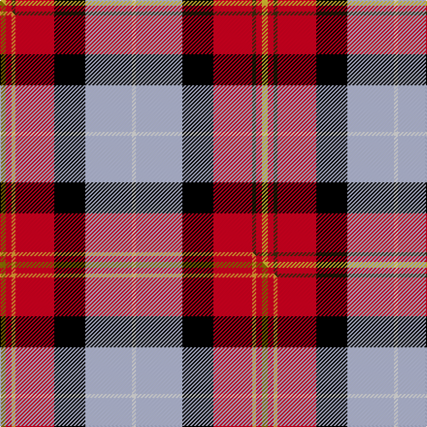

This page is one **sett** — a single exact thread-count. It belongs to the [tartan](/setts/ly3r3dy2r20k16lb24w2/)
(the same proportion at any scale), whose colour order is pattern [WWKRGRY](/stripes/wwkrgry/).

Part of the [Oor Wullie](/tartans/oor-wullie/) tartan — the named design grouping this sett with its other cloths.

Sourced from tartans-authority.  It is a [7 stripe tartan](/stripes/stripes7/).

Original link http://www.tartansauthority.com/tartan-ferret/display/10356/

## Register references

External register numbers recorded for this tartan.

- Scottish Register of Tartans: [10356](https://www.tartanregister.gov.uk/tartanDetails?ref=10356)
- Scottish Tartans Authority (ITI): 10356

## Thread count
LY/6 R6 DY4 R40 K32 LB48 W/4

One full sett is **270 threads**.

## Palette
<table><thead><tr><th>Colour</th><th>Shade</th><th>OKLCh</th></tr></thead><tbody><tr><td>K</td><td><code style="background-color:#000000;">#000000</code> <small style="color:#888">#000000</small></td><td><small style="color:#888">oklch(0.0% 0.000 0.0)</small></td></tr><tr><td>W</td><td><code style="background-color:#F7F7F7;">#F7F7F7</code> <small style="color:#888">#F7F7F7</small></td><td><small style="color:#888">oklch(97.6% 0.000 89.9)</small></td></tr><tr><td>LB</td><td><code style="background-color:#B5BBDE;">#B5BBDE</code> <small style="color:#888">#B5BBDE</small></td><td><small style="color:#888">oklch(79.9% 0.050 277.6)</small></td></tr><tr><td>R</td><td><code style="background-color:#D60020;">#D60020</code> <small style="color:#888">#D60020</small></td><td><small style="color:#888">oklch(55.2% 0.224 25.5)</small></td></tr><tr><td>LY</td><td><code style="background-color:#DCBC32;">#DCBC32</code> <small style="color:#888">#DCBC32</small></td><td><small style="color:#888">oklch(80.0% 0.150 95.2)</small></td></tr><tr><td>DY</td><td><code style="background-color:#3A2B0D;">#3A2B0D</code> <small style="color:#888">#3A2B0D</small></td><td><small style="color:#888">oklch(30.0% 0.049 82.0)</small></td></tr></tbody></table>

# Sample pattern

## Compared to the master

This cloth is one sett of its design; the master sett (the exemplar the design is anchored on) is below for comparison.

Its **ΔTartan distance** from the master is **0.09** — the same measure the nearest-tartans table ranks by (0 is identical; a re-scale of the same cloth is near 0, a recolour or a different proportion further).

<figure class="master-compare" style="margin:0">

this sett
master sett ★

<figcaption style="color:#888;font-size:smaller">One weave of this sett against the <a href="/setts/y3r3lo2r20k16lb24w2/">master sett ★</a>, split on the diagonal: a shared proportion runs seamlessly across it with only the shades shifting; a different proportion breaks on it.</figcaption>
</figure>

## Nearest variants

The nearest existing variants by ΔTartan distance, with this cloth at the top so the swatches line up against it.

ΔTartan

Threads

Variant

Sett

—

270

<a href="/variants/s7/ly3r3dy2r20k16lb24w2~x2/">Oor Wullie (Corporate)</a>

<a href="/ttd/edit/#slug=y3r3lo2r20k16lb24w2~x2&amp;base=ly3r3dy2r20k16lb24w2~x2" title="compare in the TTD">0.60</a>

270

<a href="/variants/s7/y3r3lo2r20k16lb24w2~x2/">Oor Wullie (DC Thomson)</a>

<a href="/ttd/edit/#slug=k3r3dy2r20k16lb24w2~x2&amp;base=ly3r3dy2r20k16lb24w2~x2" title="compare in the TTD">1.16</a>

270

<a href="/variants/s7/k3r3dy2r20k16lb24w2~x2/">Oor Wullie Corporate Tartan</a>

<a href="/ttd/edit/#slug=w3t12k12r20g2~x2&amp;base=ly3r3dy2r20k16lb24w2~x2" title="compare in the TTD">2.23</a>

186

<a href="/variants/s5/w3t12k12r20g2~x2/">Baillie of Polkemmet Red</a>

<a href="/ttd/edit/#slug=dg3g3r22k5db22dy2w2~x2~dg1806142-g2408144&amp;base=ly3r3dy2r20k16lb24w2~x2" title="compare in the TTD">2.28</a>

226

<a href="/variants/s7/dg3g3r22k5db22dy2w2~x2~dg1806142-g2408144/">MacLeod Soc. of Scotland, (Comm)</a>

<a href="/ttd/edit/#slug=dg3g3r22k5db22dy2~x2~dg1806142-g2408144&amp;base=ly3r3dy2r20k16lb24w2~x2" title="compare in the TTD">2.29</a>

218

<a href="/variants/s6/dg3g3r22k5db22dy2~x2~dg1806142-g2408144/">MacLeod Society of Scotland</a>

<a href="/ttd/edit/#slug=r16y2dy7y2lb24k2g2~x2&amp;base=ly3r3dy2r20k16lb24w2~x2" title="compare in the TTD">2.55</a>

184

<a href="/variants/s7/r16y2dy7y2lb24k2g2~x2/">Traill (Personal)</a>

<a href="/ttd/edit/#slug=lb8k1r22ly1r6k3dg10w1k3lb20w1~x2&amp;base=ly3r3dy2r20k16lb24w2~x2" title="compare in the TTD">2.76</a>

286

<a href="/variants/s11/lb8k1r22ly1r6k3dg10w1k3lb20w1~x2/">Unnamed C20th - National Archives</a>

## Neighbour map

Every grey dot is one of 13620 variants placed by the first two principal components of the ΔTartan feature space (42% of its variance). Red is this tartan; blue dots are its nearest — click one to open its page.

<svg viewBox="0 0 640 380" role="img" style="max-width:100%;height:auto;border:1px solid #e0e0e0;border-radius:4px;display:block" xmlns="http://www.w3.org/2000/svg"><image href="/nn/cloud.v1.png" width="640" height="380"/><a href="/variants/s7/y3r3lo2r20k16lb24w2~x2/"><circle cx="109.5" cy="138.6" r="4" fill="#3465a4"><title>Oor Wullie (DC Thomson)</title></circle></a><a href="/variants/s7/k3r3dy2r20k16lb24w2~x2/"><circle cx="105.6" cy="136.9" r="4" fill="#3465a4"><title>Oor Wullie Corporate Tartan</title></circle></a><a href="/variants/s5/w3t12k12r20g2~x2/"><circle cx="138.1" cy="190.9" r="4" fill="#3465a4"><title>Baillie of Polkemmet Red</title></circle></a><a href="/variants/s7/dg3g3r22k5db22dy2w2~x2~dg1806142-g2408144/"><circle cx="130.6" cy="124.1" r="4" fill="#3465a4"><title>MacLeod Soc. of Scotland, (Comm)</title></circle></a><a href="/variants/s6/dg3g3r22k5db22dy2~x2~dg1806142-g2408144/"><circle cx="164.6" cy="152.1" r="4" fill="#3465a4"><title>MacLeod Society of Scotland</title></circle></a><a href="/variants/s7/r16y2dy7y2lb24k2g2~x2/"><circle cx="182.9" cy="138.6" r="4" fill="#3465a4"><title>Traill (Personal)</title></circle></a><a href="/variants/s11/lb8k1r22ly1r6k3dg10w1k3lb20w1~x2/"><circle cx="152.1" cy="91.1" r="4" fill="#3465a4"><title>Unnamed C20th - National Archives</title></circle></a><circle cx="107.2" cy="137.8" r="5" fill="#c00000"/><text x="320" y="376" text-anchor="middle" font-size="11" fill="#999">ground</text><text x="11" y="190" text-anchor="middle" font-size="11" fill="#999" transform="rotate(-90 11 190)">complexity</text></svg>

ID: /variants/s7/ly3r3dy2r20k16lb24w2~x2/
