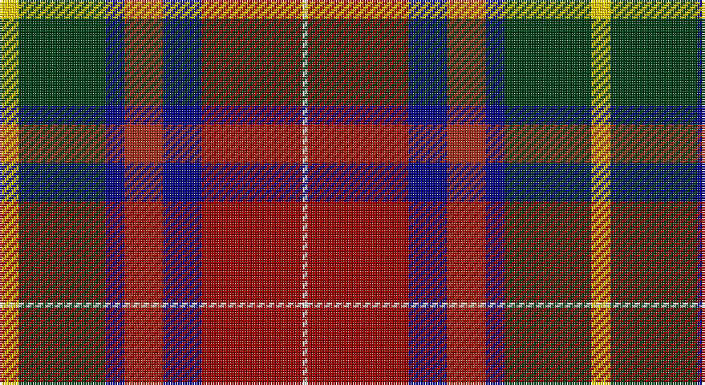

This page is one **sett** — a single exact thread-count. It belongs to the [tartan](/setts/ly4dg18db4o8db8r21w1/)
(the same proportion at any scale), whose colour order is pattern [WRBRBGY](/stripes/wrbrbgy/).

Sourced from register-of-tartans.  It is a [7 stripe tartan](/stripes/stripes7/).

Original link https://www.tartanregister.gov.uk/tartanDetails.aspx?ref=10690

## Also known as

This cloth is also recorded under:

- Bathija

## Register references

External register numbers recorded for this tartan.

- Scottish Register of Tartans: [10690](https://www.tartanregister.gov.uk/tartanDetails.aspx?ref=10690)

## Thread count
Y/8 DG36 DB8 R16 DB16 DR42 W/2

One full sett is **246 threads**.

## Palette

Palette: <strong>Tartan Register</strong> <small style="color:#888">(3 of 6 colours)</small>
<table><thead><tr><th>Colour</th><th>Threads</th><th>Shade</th><th>Base</th><th>OKLCh</th></tr></thead><tbody><tr><td>Y/</td><td style="text-align:right;font-variant-numeric:tabular-nums">8</td><td><code style="background-color:#FCCC00;">#FCCC00</code> <small style="color:#888">#FCCC00</small></td><td>Y <code style="background-color:#F2BF00;">#F2BF00</code></td><td><small style="color:#888">oklch(86.2% 0.176 91.5)</small></td></tr><tr><td>DG</td><td style="text-align:right;font-variant-numeric:tabular-nums">36</td><td><code style="background-color:#003C14;">#003C14</code> <small style="color:#888">#003C14</small></td><td>G <code style="background-color:#006100;">#006100</code></td><td><small style="color:#888">oklch(31.1% 0.089 148.5)</small></td></tr><tr><td>DB</td><td style="text-align:right;font-variant-numeric:tabular-nums">8</td><td><code style="background-color:#000080;">#000080</code> <small style="color:#888">#000080</small></td><td>B <code style="background-color:#2A418A;">#2A418A</code></td><td><small style="color:#888">oklch(27.1% 0.188 264.1)</small></td></tr><tr><td>R</td><td style="text-align:right;font-variant-numeric:tabular-nums">16</td><td><code style="background-color:#A32D18;">#A32D18</code> <small style="color:#888">#A32D18</small></td><td>R <code style="background-color:#CC0000;">#CC0000</code></td><td><small style="color:#888">oklch(47.8% 0.158 32.4)</small></td></tr><tr><td>DB</td><td style="text-align:right;font-variant-numeric:tabular-nums">16</td><td><code style="background-color:#000080;">#000080</code> <small style="color:#888">#000080</small></td><td>B <code style="background-color:#2A418A;">#2A418A</code></td><td><small style="color:#888">oklch(27.1% 0.188 264.1)</small></td></tr><tr><td>DR</td><td style="text-align:right;font-variant-numeric:tabular-nums">42</td><td><code style="background-color:#960000;">#960000</code> <small style="color:#888">#960000</small></td><td>R <code style="background-color:#CC0000;">#CC0000</code></td><td><small style="color:#888">oklch(42.3% 0.173 29.2)</small></td></tr><tr><td>W/</td><td style="text-align:right;font-variant-numeric:tabular-nums">2</td><td><code style="background-color:#F9F5EF;">#F9F5EF</code> <small style="color:#888">#F9F5EF</small></td><td>W <code style="background-color:#F7F7F7;">#F7F7F7</code></td><td><small style="color:#888">oklch(97.2% 0.009 78.3)</small></td></tr></tbody></table>

# Sample pattern

## Nearest tartans

The nearest existing variants by ΔTartan distance, with this tartan at the top so the swatches line up against it.

ΔTartan

Tartan

Sett

—

<a href="/ttd/edit/#slug=ly4dg18db4o8db8r21w1~x2">G P Bathija (Shikarpur, Sindh)</a> <a class="nn-out" href="/variants/s7/ly4dg18db4o8db8r21w1~x2/" title="open its dictionary page">↗</a>

1.03

<a href="/ttd/edit/#slug=r15g6db36w2k6w2g30r32k6t4&amp;base=ly4dg18db4o8db8r21w1~x2">Steiff</a> <a class="nn-out" href="/variants/s10/r15g6db36w2k6w2g30r32k6t4/" title="open its dictionary page">↗</a>

1.13

<a href="/ttd/edit/#slug=g3k24ly1r18db18w1~x2&amp;base=ly4dg18db4o8db8r21w1~x2">Hegarty, Philip David (Personal)</a> <a class="nn-out" href="/variants/s6/g3k24ly1r18db18w1~x2/" title="open its dictionary page">↗</a>

1.20

<a href="/ttd/edit/#slug=dg3k24lo1r18db18w1~x2&amp;base=ly4dg18db4o8db8r21w1~x2">Hegarty, Philip David (Personal)</a> <a class="nn-out" href="/variants/s6/dg3k24lo1r18db18w1~x2/" title="open its dictionary page">↗</a>

1.22

<a href="/ttd/edit/#slug=w6gi10r22db16g2k4k5~x2&amp;base=ly4dg18db4o8db8r21w1~x2">Nicolson of Taransay (Personal)</a> <a class="nn-out" href="/variants/s7/w6gi10r22db16g2k4k5~x2/" title="open its dictionary page">↗</a>

1.22

<a href="/ttd/edit/#slug=db6k3r14k3g14k3db6ly1~x4&amp;base=ly4dg18db4o8db8r21w1~x2">Kilgour (Asymmetrical)</a> <a class="nn-out" href="/variants/s8/db6k3r14k3g14k3db6ly1~x4/" title="open its dictionary page">↗</a>

1.22

<a href="/ttd/edit/#slug=db6ly1db6k3r14k3g14k3~x4&amp;base=ly4dg18db4o8db8r21w1~x2">Kilgour (Cant)</a> <a class="nn-out" href="/variants/s8/db6ly1db6k3r14k3g14k3~x4/" title="open its dictionary page">↗</a>

1.22

<a href="/ttd/edit/#slug=db6k3g14k3r14k3db6ly1~x4&amp;base=ly4dg18db4o8db8r21w1~x2">Kilgour (Symmetrical)</a> <a class="nn-out" href="/variants/s8/db6k3g14k3r14k3db6ly1~x4/" title="open its dictionary page">↗</a>

1.22

<a href="/ttd/edit/#slug=ly4g18b4ri8b8r21w1~x2&amp;base=ly4dg18db4o8db8r21w1~x2">Bathija (Name)</a> <a class="nn-out" href="/variants/s7/ly4g18b4ri8b8r21w1~x2/" title="open its dictionary page">↗</a>

1.24

<a href="/ttd/edit/#slug=dg1r24dg8k8dg8r1k4db16w1~x2&amp;base=ly4dg18db4o8db8r21w1~x2">Manson</a> <a class="nn-out" href="/variants/s9/dg1r24dg8k8dg8r1k4db16w1~x2/" title="open its dictionary page">↗</a>

1.28

<a href="/ttd/edit/#slug=r5k16t7dp16w1g21ly5~x2&amp;base=ly4dg18db4o8db8r21w1~x2">Gallowater New District Tartan</a> <a class="nn-out" href="/variants/s7/r5k16t7dp16w1g21ly5~x2/" title="open its dictionary page">↗</a>

## Neighbour map

Every grey dot is one of 14360 variants placed by the first two principal components of the ΔTartan feature space (44% of its variance). Red is this tartan; blue dots are its nearest — click one to open its page.

<svg viewBox="0 0 640 380" role="img" style="max-width:100%;height:auto;border:1px solid #e0e0e0;border-radius:4px;display:block" xmlns="http://www.w3.org/2000/svg"><image href="/nn/cloud.v1.png" width="640" height="380"/><a href="/variants/s10/r15g6db36w2k6w2g30r32k6t4/"><circle cx="158.4" cy="123.3" r="4" fill="#3465a4"><title>Steiff</title></circle></a><a href="/variants/s6/g3k24ly1r18db18w1~x2/"><circle cx="196.4" cy="141.3" r="4" fill="#3465a4"><title>Hegarty, Philip David (Personal)</title></circle></a><a href="/variants/s6/dg3k24lo1r18db18w1~x2/"><circle cx="211.8" cy="149.0" r="4" fill="#3465a4"><title>Hegarty, Philip David (Personal)</title></circle></a><a href="/variants/s7/w6gi10r22db16g2k4k5~x2/"><circle cx="104.3" cy="161.2" r="4" fill="#3465a4"><title>Nicolson of Taransay (Personal)</title></circle></a><a href="/variants/s8/db6k3r14k3g14k3db6ly1~x4/"><circle cx="136.7" cy="175.1" r="4" fill="#3465a4"><title>Kilgour (Asymmetrical)</title></circle></a><a href="/variants/s8/db6ly1db6k3r14k3g14k3~x4/"><circle cx="136.7" cy="175.1" r="4" fill="#3465a4"><title>Kilgour (Cant)</title></circle></a><a href="/variants/s8/db6k3g14k3r14k3db6ly1~x4/"><circle cx="136.7" cy="175.1" r="4" fill="#3465a4"><title>Kilgour (Symmetrical)</title></circle></a><a href="/variants/s7/ly4g18b4ri8b8r21w1~x2/"><circle cx="154.2" cy="142.9" r="4" fill="#3465a4"><title>Bathija (Name)</title></circle></a><a href="/variants/s9/dg1r24dg8k8dg8r1k4db16w1~x2/"><circle cx="202.6" cy="136.5" r="4" fill="#3465a4"><title>Manson</title></circle></a><a href="/variants/s7/r5k16t7dp16w1g21ly5~x2/"><circle cx="87.9" cy="135.9" r="4" fill="#3465a4"><title>Gallowater New District Tartan</title></circle></a><circle cx="149.2" cy="146.6" r="5" fill="#c00000"/></svg>

ID: /variants/s7/ly4dg18db4o8db8r21w1~x2/
