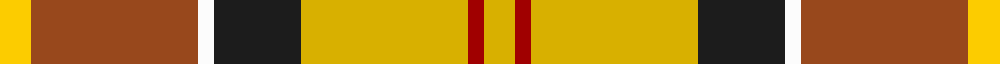
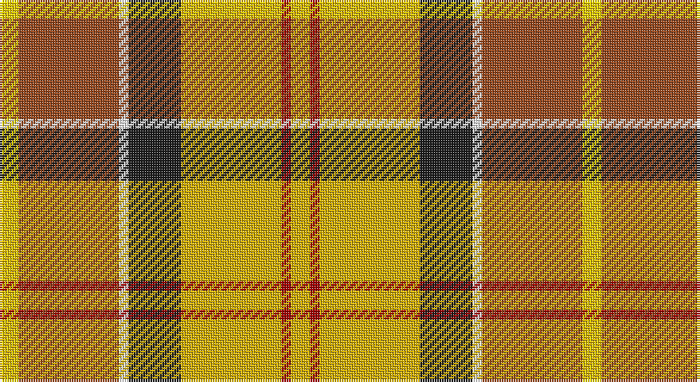

This page is one **sett** — a single exact thread-count. It belongs to the [tartan](/setts/ly4r2ly21dt11w2o21lyi4/)
(the same proportion at any scale), whose colour order is pattern [YRWBYRY](/stripes/yrwbyry/).

Part of the [Barbour](/tartans/barbour/) tartan — the named design grouping this sett with its other cloths.

Sourced from tartans-authority.  It is a [7 stripe tartan](/stripes/stripes7/).

Original link http://www.tartansauthority.com/tartan-ferret/display/8735/

## Register references

External register numbers recorded for this tartan.

- Scottish Register of Tartans: [8735](https://www.tartanregister.gov.uk/tartanDetails?ref=8735)
- Scottish Tartans Authority (ITI): 8735

## Thread count
Y/8 T42 W4 K22 Ya42 DR4 Ya/8

One full sett is **244 threads**.

## Palette

Palette: <strong>Tartan Register</strong>
<table><thead><tr><th>Colour</th><th>Threads</th><th>Shade</th><th>Base</th><th>OKLCh</th></tr></thead><tbody><tr><td>Y/</td><td style="text-align:right;font-variant-numeric:tabular-nums">8</td><td><code style="background-color:#FCCC00;">#FCCC00</code> <small style="color:#888">#FCCC00</small></td><td>Y <code style="background-color:#F2BF00;">#F2BF00</code></td><td><small style="color:#888">oklch(86.2% 0.176 91.5)</small></td></tr><tr><td>T</td><td style="text-align:right;font-variant-numeric:tabular-nums">42</td><td><code style="background-color:#98481C;">#98481C</code> <small style="color:#888">#98481C</small></td><td>R <code style="background-color:#CC0000;">#CC0000</code></td><td><small style="color:#888">oklch(49.6% 0.121 46.1)</small></td></tr><tr><td>W</td><td style="text-align:right;font-variant-numeric:tabular-nums">4</td><td><code style="background-color:#FCFCFC;">#FCFCFC</code> <small style="color:#888">#FCFCFC</small></td><td>W <code style="background-color:#F7F7F7;">#F7F7F7</code></td><td><small style="color:#888">oklch(99.1% 0.000 89.9)</small></td></tr><tr><td>K</td><td style="text-align:right;font-variant-numeric:tabular-nums">22</td><td><code style="background-color:#1C1C1C;">#1C1C1C</code> <small style="color:#888">#1C1C1C</small></td><td>B <code style="background-color:#2A418A;">#2A418A</code></td><td><small style="color:#888">oklch(22.6% 0.000 89.9)</small></td></tr><tr><td>Ya</td><td style="text-align:right;font-variant-numeric:tabular-nums">42</td><td><code style="background-color:#D8B000;">#D8B000</code> <small style="color:#888">#D8B000</small></td><td>Y <code style="background-color:#F2BF00;">#F2BF00</code></td><td><small style="color:#888">oklch(77.1% 0.158 92.3)</small></td></tr><tr><td>DR</td><td style="text-align:right;font-variant-numeric:tabular-nums">4</td><td><code style="background-color:#A00000;">#A00000</code> <small style="color:#888">#A00000</small></td><td>R <code style="background-color:#CC0000;">#CC0000</code></td><td><small style="color:#888">oklch(44.3% 0.182 29.2)</small></td></tr><tr><td>Ya/</td><td style="text-align:right;font-variant-numeric:tabular-nums">8</td><td><code style="background-color:#D8B000;">#D8B000</code> <small style="color:#888">#D8B000</small></td><td>Y <code style="background-color:#F2BF00;">#F2BF00</code></td><td><small style="color:#888">oklch(77.1% 0.158 92.3)</small></td></tr></tbody></table>

# Sample pattern

## Compared to the master

This cloth is one sett of its design; the master sett (the exemplar the design is anchored on) is below for comparison.

<figure style="margin:0"><figcaption style="color:#888;font-size:smaller">this sett</figcaption></figure>
<figure style="margin:0"><figcaption style="color:#888;font-size:smaller"><a href="/setts/r3k20w2dy11o21ly2o2/">master sett →</a></figcaption></figure>

## Nearest tartans

The nearest existing variants by ΔTartan distance, with this tartan at the top so the swatches line up against it.

ΔTartan

Tartan

Sett

—

<a href="/ttd/edit/#slug=ly4r2ly21dt11w2o21lyi4~x2">Barbour - Muted</a> <a class="nn-out" href="/variants/s7/ly4r2ly21dt11w2o21lyi4~x2/" title="open its dictionary page">↗</a>

1.14

<a href="/ttd/edit/#slug=r12g3ly4k2ly4g12ly2r3w1~x4&amp;base=ly4r2ly21dt11w2o21lyi4~x2">Prince Charles Edward</a> <a class="nn-out" href="/variants/s9/r12g3ly4k2ly4g12ly2r3w1~x4/" title="open its dictionary page">↗</a>

1.20

<a href="/ttd/edit/#slug=w3g24r13gi4lo11r8db2~x2&amp;base=ly4r2ly21dt11w2o21lyi4~x2">Elystan Glodrydd (Name)</a> <a class="nn-out" href="/variants/s7/w3g24r13gi4lo11r8db2~x2/" title="open its dictionary page">↗</a>

1.28

<a href="/ttd/edit/#slug=r34w3dg4g23w24k3dg4~x2&amp;base=ly4r2ly21dt11w2o21lyi4~x2">MacLachlan, dress</a> <a class="nn-out" href="/variants/s7/r34w3dg4g23w24k3dg4~x2/" title="open its dictionary page">↗</a>

1.29

<a href="/ttd/edit/#slug=loi22ly22dr2lb6dr2lo2dr16lg5loi8lb2~x2&amp;base=ly4r2ly21dt11w2o21lyi4~x2">Bruce of Kinnaird (Fashion)</a> <a class="nn-out" href="/variants/s10/loi22ly22dr2lb6dr2lo2dr16lg5loi8lb2~x2/" title="open its dictionary page">↗</a>

1.29

<a href="/ttd/edit/#slug=k2ly30g4w2g14r13ly2~x2&amp;base=ly4r2ly21dt11w2o21lyi4~x2">Red Rum Commemorative Tartan</a> <a class="nn-out" href="/variants/s7/k2ly30g4w2g14r13ly2~x2/" title="open its dictionary page">↗</a>

1.30

<a href="/variants/s8/w24r8dy2r8dy2r8dyi15dg2~x2/">Unidentified from Winnipeg</a>

1.31

<a href="/ttd/edit/#slug=t4dy27lr8k4lr8k4lr8r11ly3~x2&amp;base=ly4r2ly21dt11w2o21lyi4~x2">Brittany Hunting French Fancy Tartan</a> <a class="nn-out" href="/variants/s9/t4dy27lr8k4lr8k4lr8r11ly3~x2/" title="open its dictionary page">↗</a>

1.31

<a href="/ttd/edit/#slug=lo7ly12dg30o12ri14r11ly2~x2&amp;base=ly4r2ly21dt11w2o21lyi4~x2">Unidentified Silk Plaid #2</a> <a class="nn-out" href="/variants/s7/lo7ly12dg30o12ri14r11ly2~x2/" title="open its dictionary page">↗</a>

1.33

<a href="/ttd/edit/#slug=w2ri8o5ly6w5g21w6ri8r4w2&amp;base=ly4r2ly21dt11w2o21lyi4~x2">Jacobite, Silk sash</a> <a class="nn-out" href="/variants/s10/w2ri8o5ly6w5g21w6ri8r4w2/" title="open its dictionary page">↗</a>

1.33

<a href="/ttd/edit/#slug=dy18ly4t10w2r20ly5r2w2dy6~x2&amp;base=ly4r2ly21dt11w2o21lyi4~x2">Satchidananda (Personal)</a> <a class="nn-out" href="/variants/s9/dy18ly4t10w2r20ly5r2w2dy6~x2/" title="open its dictionary page">↗</a>

## Neighbour map

Every grey dot is one of 14360 variants placed by the first two principal components of the ΔTartan feature space (44% of its variance). Red is this tartan; blue dots are its nearest — click one to open its page.

<svg viewBox="0 0 640 380" role="img" style="max-width:100%;height:auto;border:1px solid #e0e0e0;border-radius:4px;display:block" xmlns="http://www.w3.org/2000/svg"><image href="/nn/cloud.v1.png" width="640" height="380"/><a href="/variants/s9/r12g3ly4k2ly4g12ly2r3w1~x4/"><circle cx="153.0" cy="149.0" r="4" fill="#3465a4"><title>Prince Charles Edward</title></circle></a><a href="/variants/s7/w3g24r13gi4lo11r8db2~x2/"><circle cx="162.0" cy="166.9" r="4" fill="#3465a4"><title>Elystan Glodrydd (Name)</title></circle></a><a href="/variants/s7/r34w3dg4g23w24k3dg4~x2/"><circle cx="148.0" cy="151.7" r="4" fill="#3465a4"><title>MacLachlan, dress</title></circle></a><a href="/variants/s10/loi22ly22dr2lb6dr2lo2dr16lg5loi8lb2~x2/"><circle cx="131.9" cy="134.8" r="4" fill="#3465a4"><title>Bruce of Kinnaird (Fashion)</title></circle></a><a href="/variants/s7/k2ly30g4w2g14r13ly2~x2/"><circle cx="193.8" cy="122.5" r="4" fill="#3465a4"><title>Red Rum Commemorative Tartan</title></circle></a><a href="/variants/s8/w24r8dy2r8dy2r8dyi15dg2~x2/"><circle cx="152.4" cy="142.5" r="4" fill="#3465a4"><title>Unidentified from Winnipeg</title></circle></a><a href="/variants/s9/t4dy27lr8k4lr8k4lr8r11ly3~x2/"><circle cx="118.8" cy="151.3" r="4" fill="#3465a4"><title>Brittany Hunting French Fancy Tartan</title></circle></a><a href="/variants/s7/lo7ly12dg30o12ri14r11ly2~x2/"><circle cx="106.7" cy="154.6" r="4" fill="#3465a4"><title>Unidentified Silk Plaid #2</title></circle></a><a href="/variants/s10/w2ri8o5ly6w5g21w6ri8r4w2/"><circle cx="88.7" cy="138.8" r="4" fill="#3465a4"><title>Jacobite, Silk sash</title></circle></a><a href="/variants/s9/dy18ly4t10w2r20ly5r2w2dy6~x2/"><circle cx="151.5" cy="154.7" r="4" fill="#3465a4"><title>Satchidananda (Personal)</title></circle></a><circle cx="147.8" cy="145.2" r="5" fill="#c00000"/></svg>

ID: /variants/s7/ly4r2ly21dt11w2o21lyi4~x2/
