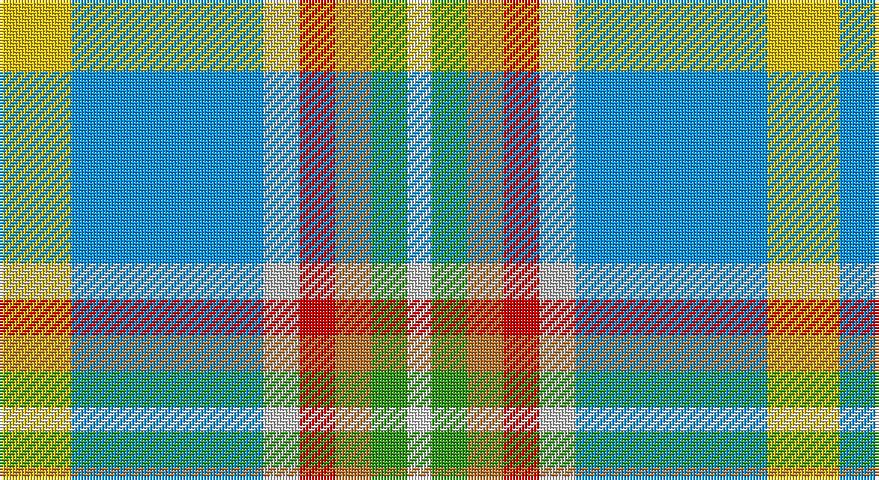

This page is one **sett** — a single exact thread-count. It belongs to the [tartan](/setts/ly6b16lb3r3o3g3w2/)
(the same proportion at any scale), whose colour order is pattern [WGRRWBY](/stripes/wgrrwby/).

Part of the [Atikokan](/tartans/atikokan/) tartan — the named design grouping this sett with its other cloths.

Sourced from register-of-tartans.  It is a [7 stripe tartan](/stripes/stripes7/).

Original link https://www.tartanregister.gov.uk/tartanDetails.aspx?ref=126

2 attestations — the source records this cloth was collapsed from (oldest owns this page)

<ul>
<li>01/01/1981 — Atikokan (register-of-tartans, <a href="https://www.tartanregister.gov.uk/tartanDetails.aspx?ref=126">record</a>)</li>
<li>undated — Atikokan (weddslist, <a href="http://www.weddslist.com/cgi-bin/tartans/pg.pl?source=sts">record</a>)</li>
</ul>

## Register references

External register numbers recorded for this tartan.

- Scottish Register of Tartans: [126](https://www.tartanregister.gov.uk/tartanDetails.aspx?ref=126)
- Scottish Tartans World Register: 2596

## Thread count
Y/24 B64 N12 R12 DO12 G12 LN/8

One full sett is **256 threads**.

## Palette

Palette: <strong>Tartan Register</strong> <small style="color:#888">(6 of 7 colours)</small>
<table><thead><tr><th>Colour</th><th>Threads</th><th>Shade</th><th>Base</th><th>OKLCh</th></tr></thead><tbody><tr><td>Y/</td><td style="text-align:right;font-variant-numeric:tabular-nums">24</td><td><code style="background-color:#E8C000;">#E8C000</code> <small style="color:#888">#E8C000</small></td><td>Y <code style="background-color:#F2BF00;">#F2BF00</code></td><td><small style="color:#888">oklch(81.9% 0.168 93.7)</small></td></tr><tr><td>B</td><td style="text-align:right;font-variant-numeric:tabular-nums">64</td><td><code style="background-color:#0596FA;">#0596FA</code> <small style="color:#888">#0596FA</small></td><td>B <code style="background-color:#2A418A;">#2A418A</code></td><td><small style="color:#888">oklch(66.0% 0.180 248.9)</small></td></tr><tr><td>N</td><td style="text-align:right;font-variant-numeric:tabular-nums">12</td><td><code style="background-color:#C0C0C0;">#C0C0C0</code> <small style="color:#888">#C0C0C0</small></td><td>W <code style="background-color:#F7F7F7;">#F7F7F7</code></td><td><small style="color:#888">oklch(80.8% 0.000 89.9)</small></td></tr><tr><td>R</td><td style="text-align:right;font-variant-numeric:tabular-nums">12</td><td><code style="background-color:#DC0000;">#DC0000</code> <small style="color:#888">#DC0000</small></td><td>R <code style="background-color:#CC0000;">#CC0000</code></td><td><small style="color:#888">oklch(56.2% 0.230 29.2)</small></td></tr><tr><td>DO</td><td style="text-align:right;font-variant-numeric:tabular-nums">12</td><td><code style="background-color:#BE7832;">#BE7832</code> <small style="color:#888">#BE7832</small></td><td>R <code style="background-color:#CC0000;">#CC0000</code></td><td><small style="color:#888">oklch(63.5% 0.121 62.2)</small></td></tr><tr><td>G</td><td style="text-align:right;font-variant-numeric:tabular-nums">12</td><td><code style="background-color:#309C18;">#309C18</code> <small style="color:#888">#309C18</small></td><td>G <code style="background-color:#006100;">#006100</code></td><td><small style="color:#888">oklch(60.8% 0.188 140.8)</small></td></tr><tr><td>LN/</td><td style="text-align:right;font-variant-numeric:tabular-nums">8</td><td><code style="background-color:#E0E0E0;">#E0E0E0</code> <small style="color:#888">#E0E0E0</small></td><td>W <code style="background-color:#F7F7F7;">#F7F7F7</code></td><td><small style="color:#888">oklch(90.7% 0.000 89.9)</small></td></tr></tbody></table>

# Sample pattern

## Nearest tartans

The nearest existing variants by ΔTartan distance, with this tartan at the top so the swatches line up against it.

ΔTartan

Tartan

Sett

—

<a href="/ttd/edit/#slug=ly6b16lb3r3o3g3w2~x4">Atikokan</a> <a class="nn-out" href="/variants/s7/ly6b16lb3r3o3g3w2~x4/" title="open its dictionary page">↗</a>

1.13

<a href="/ttd/edit/#slug=lo6t16lb3y3o3g3w2~x4&amp;base=ly6b16lb3r3o3g3w2~x4">Atikokan (District)</a> <a class="nn-out" href="/variants/s7/lo6t16lb3y3o3g3w2~x4/" title="open its dictionary page">↗</a>

1.42

<a href="/ttd/edit/#slug=w3lb2p4lb14n2t14lo2~x4&amp;base=ly6b16lb3r3o3g3w2~x4">Seaside (Fashion)</a> <a class="nn-out" href="/variants/s7/w3lb2p4lb14n2t14lo2~x4/" title="open its dictionary page">↗</a>

1.52

<a href="/ttd/edit/#slug=t8ly2g4ly2dp4ly2t8w15lo2~x4&amp;base=ly6b16lb3r3o3g3w2~x4">Edmonton, City of</a> <a class="nn-out" href="/variants/s9/t8ly2g4ly2dp4ly2t8w15lo2~x4/" title="open its dictionary page">↗</a>

1.56

<a href="/ttd/edit/#slug=r1g1ly1t9ly3w3lr9t1~x4&amp;base=ly6b16lb3r3o3g3w2~x4">Curd (2013)</a> <a class="nn-out" href="/variants/s8/r1g1ly1t9ly3w3lr9t1~x4/" title="open its dictionary page">↗</a>

1.58

<a href="/ttd/edit/#slug=m5g2m2g26k9lr9lb13w5~x2&amp;base=ly6b16lb3r3o3g3w2~x4">Alexander of Menstry Hunting</a> <a class="nn-out" href="/variants/s8/m5g2m2g26k9lr9lb13w5~x2/" title="open its dictionary page">↗</a>

1.58

<a href="/ttd/edit/#slug=dp2g6r1ly1db3t10w1~x2&amp;base=ly6b16lb3r3o3g3w2~x4">Manx National District Tartan</a> <a class="nn-out" href="/variants/s7/dp2g6r1ly1db3t10w1~x2/" title="open its dictionary page">↗</a>

1.60

<a href="/ttd/edit/#slug=p2g6r1y1db3b10w1~x2&amp;base=ly6b16lb3r3o3g3w2~x4">Manx National</a> <a class="nn-out" href="/variants/s7/p2g6r1y1db3b10w1~x2/" title="open its dictionary page">↗</a>

1.61

<a href="/ttd/edit/#slug=g25r9b3ly7w3dp11&amp;base=ly6b16lb3r3o3g3w2~x4">Montessori School of Denver</a> <a class="nn-out" href="/variants/s6/g25r9b3ly7w3dp11/" title="open its dictionary page">↗</a>

1.66

<a href="/ttd/edit/#slug=db3r2lr15w10k2lo3~x2&amp;base=ly6b16lb3r3o3g3w2~x4">SCH '67 Class</a> <a class="nn-out" href="/variants/s6/db3r2lr15w10k2lo3~x2/" title="open its dictionary page">↗</a>

1.68

<a href="/ttd/edit/#slug=r4b3lr2k2lr12k2db10t25w2~x2&amp;base=ly6b16lb3r3o3g3w2~x4">O'Reilly (Estimated threadcount)</a> <a class="nn-out" href="/variants/s9/r4b3lr2k2lr12k2db10t25w2~x2/" title="open its dictionary page">↗</a>

## Neighbour map

Every grey dot is one of 14360 variants placed by the first two principal components of the ΔTartan feature space (44% of its variance). Red is this tartan; blue dots are its nearest — click one to open its page.

<svg viewBox="0 0 640 380" role="img" style="max-width:100%;height:auto;border:1px solid #e0e0e0;border-radius:4px;display:block" xmlns="http://www.w3.org/2000/svg"><image href="/nn/cloud.v1.png" width="640" height="380"/><a href="/variants/s7/lo6t16lb3y3o3g3w2~x4/"><circle cx="167.6" cy="168.1" r="4" fill="#3465a4"><title>Atikokan (District)</title></circle></a><a href="/variants/s7/w3lb2p4lb14n2t14lo2~x4/"><circle cx="166.2" cy="181.8" r="4" fill="#3465a4"><title>Seaside (Fashion)</title></circle></a><a href="/variants/s9/t8ly2g4ly2dp4ly2t8w15lo2~x4/"><circle cx="87.9" cy="154.3" r="4" fill="#3465a4"><title>Edmonton, City of</title></circle></a><a href="/variants/s8/r1g1ly1t9ly3w3lr9t1~x4/"><circle cx="164.3" cy="163.1" r="4" fill="#3465a4"><title>Curd (2013)</title></circle></a><a href="/variants/s8/m5g2m2g26k9lr9lb13w5~x2/"><circle cx="131.8" cy="146.5" r="4" fill="#3465a4"><title>Alexander of Menstry Hunting</title></circle></a><a href="/variants/s7/dp2g6r1ly1db3t10w1~x2/"><circle cx="145.5" cy="151.8" r="4" fill="#3465a4"><title>Manx National District Tartan</title></circle></a><a href="/variants/s7/p2g6r1y1db3b10w1~x2/"><circle cx="137.8" cy="142.4" r="4" fill="#3465a4"><title>Manx National</title></circle></a><a href="/variants/s6/g25r9b3ly7w3dp11/"><circle cx="126.3" cy="168.8" r="4" fill="#3465a4"><title>Montessori School of Denver</title></circle></a><a href="/variants/s6/db3r2lr15w10k2lo3~x2/"><circle cx="132.3" cy="156.7" r="4" fill="#3465a4"><title>SCH '67 Class</title></circle></a><a href="/variants/s9/r4b3lr2k2lr12k2db10t25w2~x2/"><circle cx="161.1" cy="123.1" r="4" fill="#3465a4"><title>O'Reilly (Estimated threadcount)</title></circle></a><circle cx="139.3" cy="150.6" r="5" fill="#c00000"/></svg>

ID: /variants/s7/ly6b16lb3r3o3g3w2~x4/
