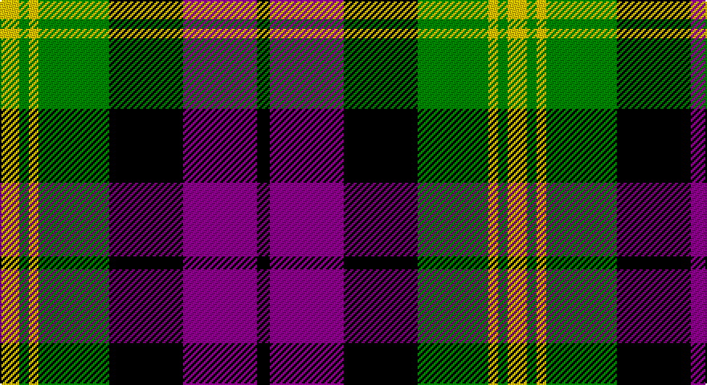

This page is one **sett** — a single exact thread-count. It belongs to the [tartan](/setts/ly6g3ly3g22k23p23k4/)
(the same proportion at any scale), whose colour order is pattern [KBKGYGY](/stripes/kbkgygy/).

Part of the [Gordon of Esslemont](/tartans/gordon-of-esslemont/) tartan — the named design grouping this sett with its other cloths.

Sourced from weddslist.  It is a [7 stripe tartan](/stripes/stripes7/).

Original link http://www.weddslist.com/cgi-bin/tartans/pg.pl?source=sts

## Thread count
Y/12 G6 Y6 G44 K46 P46 K/8

One full sett is **316 threads**.

## Palette

Palette: <strong>Ingles Buchan</strong> <small style="color:#888">(1 of 4 colours)</small>
<table><thead><tr><th>Colour</th><th>Threads</th><th>Shade</th><th>Base</th><th>OKLCh</th></tr></thead><tbody><tr><td>Y/</td><td style="text-align:right;font-variant-numeric:tabular-nums">12</td><td><code style="background-color:#F0C000;">#F0C000</code> <small style="color:#888">#F0C000</small></td><td>Y <code style="background-color:#F2BF00;">#F2BF00</code></td><td><small style="color:#888">oklch(82.7% 0.169 90.5)</small></td></tr><tr><td>G</td><td style="text-align:right;font-variant-numeric:tabular-nums">6</td><td><code style="background-color:#008000;">#008000</code> <small style="color:#888">#008000</small></td><td>G <code style="background-color:#006100;">#006100</code></td><td><small style="color:#888">oklch(52.0% 0.177 142.5)</small></td></tr><tr><td>Y</td><td style="text-align:right;font-variant-numeric:tabular-nums">6</td><td><code style="background-color:#F0C000;">#F0C000</code> <small style="color:#888">#F0C000</small></td><td>Y <code style="background-color:#F2BF00;">#F2BF00</code></td><td><small style="color:#888">oklch(82.7% 0.169 90.5)</small></td></tr><tr><td>G</td><td style="text-align:right;font-variant-numeric:tabular-nums">44</td><td><code style="background-color:#008000;">#008000</code> <small style="color:#888">#008000</small></td><td>G <code style="background-color:#006100;">#006100</code></td><td><small style="color:#888">oklch(52.0% 0.177 142.5)</small></td></tr><tr><td>K</td><td style="text-align:right;font-variant-numeric:tabular-nums">46</td><td><code style="background-color:#000000;">#000000</code> <small style="color:#888">#000000</small></td><td>K <code style="background-color:#000000;">#000000</code></td><td><small style="color:#888">oklch(0.0% 0.000 0.0)</small></td></tr><tr><td>P</td><td style="text-align:right;font-variant-numeric:tabular-nums">46</td><td><code style="background-color:#800080;">#800080</code> <small style="color:#888">#800080</small></td><td>B <code style="background-color:#2A418A;">#2A418A</code></td><td><small style="color:#888">oklch(42.1% 0.193 328.4)</small></td></tr><tr><td>K/</td><td style="text-align:right;font-variant-numeric:tabular-nums">8</td><td><code style="background-color:#000000;">#000000</code> <small style="color:#888">#000000</small></td><td>K <code style="background-color:#000000;">#000000</code></td><td><small style="color:#888">oklch(0.0% 0.000 0.0)</small></td></tr></tbody></table>

# Sample pattern

## Compared to the master

This cloth is one sett of its design; the master sett (the exemplar the design is anchored on) is below for comparison.

<figure style="margin:0"><figcaption style="color:#888;font-size:smaller">this sett</figcaption></figure>
<figure style="margin:0"><figcaption style="color:#888;font-size:smaller"><a href="/setts/ly6dg3ly3dg22k23dp23k4/">master sett →</a></figcaption></figure>

## Nearest tartans

The nearest existing variants by ΔTartan distance, with this tartan at the top so the swatches line up against it.

ΔTartan

Tartan

Sett

—

<a href="/ttd/edit/#slug=ly6g3ly3g22k23p23k4~x2">Gordon of Esslemont</a> <a class="nn-out" href="/variants/s7/ly6g3ly3g22k23p23k4~x2/" title="open its dictionary page">↗</a>

0.72

<a href="/ttd/edit/#slug=k3g17ly2k18p17g3~x2&amp;base=ly6g3ly3g22k23p23k4~x2">Wilson's, No 100</a> <a class="nn-out" href="/variants/s6/k3g17ly2k18p17g3~x2/" title="open its dictionary page">↗</a>

0.74

<a href="/ttd/edit/#slug=k3g17w2k18p17g3~x2&amp;base=ly6g3ly3g22k23p23k4~x2">Wilson's, No 76</a> <a class="nn-out" href="/variants/s6/k3g17w2k18p17g3~x2/" title="open its dictionary page">↗</a>

0.82

<a href="/ttd/edit/#slug=ly6g3ly3g22k23dp23k4~x2&amp;base=ly6g3ly3g22k23p23k4~x2">Gordon of Esslemont Family Tartan</a> <a class="nn-out" href="/variants/s7/ly6g3ly3g22k23dp23k4~x2/" title="open its dictionary page">↗</a>

0.98

<a href="/ttd/edit/#slug=p3k1p8k6g8k1w2~x2&amp;base=ly6g3ly3g22k23p23k4~x2">Baillie</a> <a class="nn-out" href="/variants/s7/p3k1p8k6g8k1w2~x2/" title="open its dictionary page">↗</a>

1.04

<a href="/ttd/edit/#slug=p6k3p21k23w3g24r3~x2&amp;base=ly6g3ly3g22k23p23k4~x2">Colquhoun</a> <a class="nn-out" href="/variants/s7/p6k3p21k23w3g24r3~x2/" title="open its dictionary page">↗</a>

1.09

<a href="/ttd/edit/#slug=oi4db19oi3k20o24db3~x2&amp;base=ly6g3ly3g22k23p23k4~x2">Edinburgh International Conference Centre</a> <a class="nn-out" href="/variants/s6/oi4db19oi3k20o24db3~x2/" title="open its dictionary page">↗</a>

1.11

<a href="/ttd/edit/#slug=g12k2r12k3y12k16y12k3r6~x2&amp;base=ly6g3ly3g22k23p23k4~x2">Borthwick</a> <a class="nn-out" href="/variants/s9/g12k2r12k3y12k16y12k3r6~x2/" title="open its dictionary page">↗</a>

1.12

<a href="/ttd/edit/#slug=w2db12lo1k12lo12k1~x2&amp;base=ly6g3ly3g22k23p23k4~x2">Dutch</a> <a class="nn-out" href="/variants/s6/w2db12lo1k12lo12k1~x2/" title="open its dictionary page">↗</a>

1.12

<a href="/ttd/edit/#slug=k2g10t2k9p8g2~x2&amp;base=ly6g3ly3g22k23p23k4~x2">Lennie</a> <a class="nn-out" href="/variants/s6/k2g10t2k9p8g2~x2/" title="open its dictionary page">↗</a>

1.13

<a href="/ttd/edit/#slug=w2p10k10g9k3w2~x2&amp;base=ly6g3ly3g22k23p23k4~x2">MacNeil 2</a> <a class="nn-out" href="/variants/s6/w2p10k10g9k3w2~x2/" title="open its dictionary page">↗</a>

## Neighbour map

Every grey dot is one of 14360 variants placed by the first two principal components of the ΔTartan feature space (44% of its variance). Red is this tartan; blue dots are its nearest — click one to open its page.

<svg viewBox="0 0 640 380" role="img" style="max-width:100%;height:auto;border:1px solid #e0e0e0;border-radius:4px;display:block" xmlns="http://www.w3.org/2000/svg"><image href="/nn/cloud.v1.png" width="640" height="380"/><a href="/variants/s6/k3g17ly2k18p17g3~x2/"><circle cx="155.6" cy="214.0" r="4" fill="#3465a4"><title>Wilson's, No 100</title></circle></a><a href="/variants/s6/k3g17w2k18p17g3~x2/"><circle cx="154.6" cy="213.6" r="4" fill="#3465a4"><title>Wilson's, No 76</title></circle></a><a href="/variants/s7/ly6g3ly3g22k23dp23k4~x2/"><circle cx="143.4" cy="212.0" r="4" fill="#3465a4"><title>Gordon of Esslemont Family Tartan</title></circle></a><a href="/variants/s7/p3k1p8k6g8k1w2~x2/"><circle cx="147.8" cy="208.6" r="4" fill="#3465a4"><title>Baillie</title></circle></a><a href="/variants/s7/p6k3p21k23w3g24r3~x2/"><circle cx="121.2" cy="186.8" r="4" fill="#3465a4"><title>Colquhoun</title></circle></a><a href="/variants/s6/oi4db19oi3k20o24db3~x2/"><circle cx="153.2" cy="224.2" r="4" fill="#3465a4"><title>Edinburgh International Conference Centre</title></circle></a><a href="/variants/s9/g12k2r12k3y12k16y12k3r6~x2/"><circle cx="99.9" cy="215.3" r="4" fill="#3465a4"><title>Borthwick</title></circle></a><a href="/variants/s6/w2db12lo1k12lo12k1~x2/"><circle cx="152.1" cy="183.6" r="4" fill="#3465a4"><title>Dutch</title></circle></a><a href="/variants/s6/k2g10t2k9p8g2~x2/"><circle cx="126.9" cy="245.7" r="4" fill="#3465a4"><title>Lennie</title></circle></a><a href="/variants/s6/w2p10k10g9k3w2~x2/"><circle cx="106.7" cy="239.6" r="4" fill="#3465a4"><title>MacNeil 2</title></circle></a><circle cx="122.0" cy="203.0" r="5" fill="#c00000"/></svg>

ID: /variants/s7/ly6g3ly3g22k23p23k4~x2/
