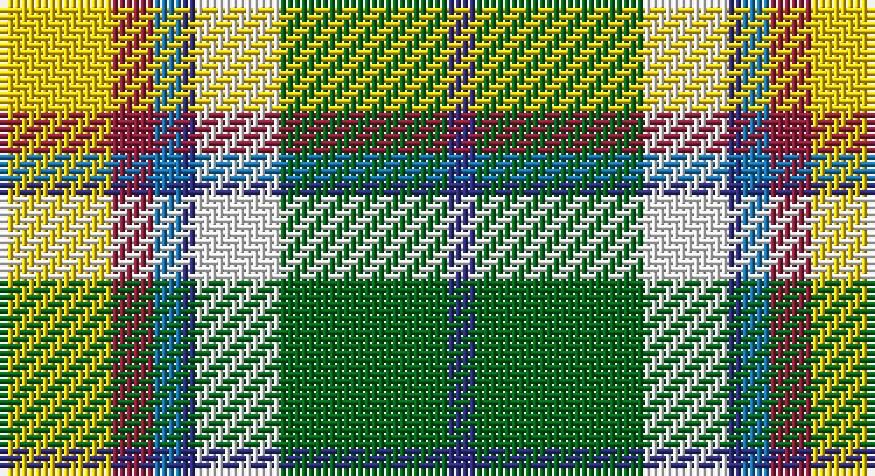

This page is one **sett** — a single exact thread-count. It belongs to the [tartan](/setts/ly8r3b2db1w6g12db2/)
(the same proportion at any scale), whose colour order is pattern [BGWBBRY](/stripes/bgwbbry/).

Part of the [Carmen Lau](/tartans/carmen-lau/) tartan — the named design grouping this sett with its other cloths.

Sourced from tartans-authority.  It is a [7 stripe tartan](/stripes/stripes7/).

Original link http://www.tartansauthority.com/tartan-ferret/display/10340/

## Register references

External register numbers recorded for this tartan.

- Scottish Register of Tartans: [10340](https://www.tartanregister.gov.uk/tartanDetails?ref=10340)
- Scottish Tartans Authority (ITI): 10340

## Thread count
Y/16 DR6 B4 DB2 W12 G24 DB/4

One full sett is **116 threads**.

## Palette

Palette: <strong>Tartan Register</strong>
<table><thead><tr><th>Colour</th><th>Threads</th><th>Shade</th><th>Base</th><th>OKLCh</th></tr></thead><tbody><tr><td>Y/</td><td style="text-align:right;font-variant-numeric:tabular-nums">16</td><td><code style="background-color:#FCCC00;">#FCCC00</code> <small style="color:#888">#FCCC00</small></td><td>Y <code style="background-color:#F2BF00;">#F2BF00</code></td><td><small style="color:#888">oklch(86.2% 0.176 91.5)</small></td></tr><tr><td>DR</td><td style="text-align:right;font-variant-numeric:tabular-nums">6</td><td><code style="background-color:#901C38;">#901C38</code> <small style="color:#888">#901C38</small></td><td>R <code style="background-color:#CC0000;">#CC0000</code></td><td><small style="color:#888">oklch(43.2% 0.150 13.1)</small></td></tr><tr><td>B</td><td style="text-align:right;font-variant-numeric:tabular-nums">4</td><td><code style="background-color:#1474B4;">#1474B4</code> <small style="color:#888">#1474B4</small></td><td>B <code style="background-color:#2A418A;">#2A418A</code></td><td><small style="color:#888">oklch(54.0% 0.129 245.1)</small></td></tr><tr><td>DB</td><td style="text-align:right;font-variant-numeric:tabular-nums">2</td><td><code style="background-color:#2C2C80;">#2C2C80</code> <small style="color:#888">#2C2C80</small></td><td>B <code style="background-color:#2A418A;">#2A418A</code></td><td><small style="color:#888">oklch(35.0% 0.138 276.6)</small></td></tr><tr><td>W</td><td style="text-align:right;font-variant-numeric:tabular-nums">12</td><td><code style="background-color:#FCFCFC;">#FCFCFC</code> <small style="color:#888">#FCFCFC</small></td><td>W <code style="background-color:#F7F7F7;">#F7F7F7</code></td><td><small style="color:#888">oklch(99.1% 0.000 89.9)</small></td></tr><tr><td>G</td><td style="text-align:right;font-variant-numeric:tabular-nums">24</td><td><code style="background-color:#006818;">#006818</code> <small style="color:#888">#006818</small></td><td>G <code style="background-color:#006100;">#006100</code></td><td><small style="color:#888">oklch(45.0% 0.142 145.0)</small></td></tr><tr><td>DB/</td><td style="text-align:right;font-variant-numeric:tabular-nums">4</td><td><code style="background-color:#2C2C80;">#2C2C80</code> <small style="color:#888">#2C2C80</small></td><td>B <code style="background-color:#2A418A;">#2A418A</code></td><td><small style="color:#888">oklch(35.0% 0.138 276.6)</small></td></tr></tbody></table>

# Sample pattern

## Compared to the master

This cloth is one sett of its design; the master sett (the exemplar the design is anchored on) is below for comparison.

<figure style="margin:0"><figcaption style="color:#888;font-size:smaller">this sett</figcaption></figure>
<figure style="margin:0"><figcaption style="color:#888;font-size:smaller"><a href="/setts/ly8k3t2do1w6g12do2/">master sett →</a></figcaption></figure>

## Nearest tartans

The nearest existing variants by ΔTartan distance, with this tartan at the top so the swatches line up against it.

ΔTartan

Tartan

Sett

—

<a href="/ttd/edit/#slug=ly8r3b2db1w6g12db2~x2">Carmen Lau (Hong Kong) (Personal)</a> <a class="nn-out" href="/variants/s7/ly8r3b2db1w6g12db2~x2/" title="open its dictionary page">↗</a>

0.32

<a href="/ttd/edit/#slug=ly8k3t2do1w6g12do2~x2&amp;base=ly8r3b2db1w6g12db2~x2">Carmen Lau (Hong Kong) (Personal)</a> <a class="nn-out" href="/variants/s7/ly8k3t2do1w6g12do2~x2/" title="open its dictionary page">↗</a>

0.89

<a href="/ttd/edit/#slug=db7w30k13g9r6g16k2ly7~x2&amp;base=ly8r3b2db1w6g12db2~x2">MacLaren dress</a> <a class="nn-out" href="/variants/s8/db7w30k13g9r6g16k2ly7~x2/" title="open its dictionary page">↗</a>

0.90

<a href="/ttd/edit/#slug=lo13g8k5lb3w2r1~x4&amp;base=ly8r3b2db1w6g12db2~x2">Ball Hunting</a> <a class="nn-out" href="/variants/s6/lo13g8k5lb3w2r1~x4/" title="open its dictionary page">↗</a>

0.98

<a href="/ttd/edit/#slug=dy17o5db2w12db2ly4g7~x2&amp;base=ly8r3b2db1w6g12db2~x2">Ontario Northern Canadian District Tartan</a> <a class="nn-out" href="/variants/s7/dy17o5db2w12db2ly4g7~x2/" title="open its dictionary page">↗</a>

0.99

<a href="/ttd/edit/#slug=r6w20g12o3g8t20k2t3~x2&amp;base=ly8r3b2db1w6g12db2~x2">Coulter Dress (Personal)</a> <a class="nn-out" href="/variants/s8/r6w20g12o3g8t20k2t3~x2/" title="open its dictionary page">↗</a>

1.01

<a href="/ttd/edit/#slug=ly6k2g12r4g8k10w24b2w3b2~x2&amp;base=ly8r3b2db1w6g12db2~x2">Gillies Dress, Green (Dance)</a> <a class="nn-out" href="/variants/s10/ly6k2g12r4g8k10w24b2w3b2~x2/" title="open its dictionary page">↗</a>

1.03

<a href="/ttd/edit/#slug=ly6k2g15r6g8k12w25t2w3t2~x2&amp;base=ly8r3b2db1w6g12db2~x2">Gillies, dress Green</a> <a class="nn-out" href="/variants/s10/ly6k2g15r6g8k12w25t2w3t2~x2/" title="open its dictionary page">↗</a>

1.08

<a href="/ttd/edit/#slug=db2w12k8g8r2g8k1lo2~x2&amp;base=ly8r3b2db1w6g12db2~x2">MacLaren Dress</a> <a class="nn-out" href="/variants/s8/db2w12k8g8r2g8k1lo2~x2/" title="open its dictionary page">↗</a>

1.16

<a href="/ttd/edit/#slug=k20ly4r4ly20g20w5g2lg2~x2&amp;base=ly8r3b2db1w6g12db2~x2">Hackett William (Coatbridge) Hunting (Personal)</a> <a class="nn-out" href="/variants/s8/k20ly4r4ly20g20w5g2lg2~x2/" title="open its dictionary page">↗</a>

1.18

<a href="/ttd/edit/#slug=r2k2w16dg13g6ly2k2w2~x2&amp;base=ly8r3b2db1w6g12db2~x2">Madewell Dress</a> <a class="nn-out" href="/variants/s8/r2k2w16dg13g6ly2k2w2~x2/" title="open its dictionary page">↗</a>

## Neighbour map

Every grey dot is one of 14360 variants placed by the first two principal components of the ΔTartan feature space (44% of its variance). Red is this tartan; blue dots are its nearest — click one to open its page.

<svg viewBox="0 0 640 380" role="img" style="max-width:100%;height:auto;border:1px solid #e0e0e0;border-radius:4px;display:block" xmlns="http://www.w3.org/2000/svg"><image href="/nn/cloud.v1.png" width="640" height="380"/><a href="/variants/s7/ly8k3t2do1w6g12do2~x2/"><circle cx="82.7" cy="141.4" r="4" fill="#3465a4"><title>Carmen Lau (Hong Kong) (Personal)</title></circle></a><a href="/variants/s8/db7w30k13g9r6g16k2ly7~x2/"><circle cx="75.3" cy="133.4" r="4" fill="#3465a4"><title>MacLaren dress</title></circle></a><a href="/variants/s6/lo13g8k5lb3w2r1~x4/"><circle cx="140.7" cy="153.5" r="4" fill="#3465a4"><title>Ball Hunting</title></circle></a><a href="/variants/s7/dy17o5db2w12db2ly4g7~x2/"><circle cx="87.2" cy="167.3" r="4" fill="#3465a4"><title>Ontario Northern Canadian District Tartan</title></circle></a><a href="/variants/s8/r6w20g12o3g8t20k2t3~x2/"><circle cx="81.8" cy="153.8" r="4" fill="#3465a4"><title>Coulter Dress (Personal)</title></circle></a><a href="/variants/s10/ly6k2g12r4g8k10w24b2w3b2~x2/"><circle cx="91.8" cy="115.8" r="4" fill="#3465a4"><title>Gillies Dress, Green (Dance)</title></circle></a><a href="/variants/s10/ly6k2g15r6g8k12w25t2w3t2~x2/"><circle cx="83.8" cy="117.3" r="4" fill="#3465a4"><title>Gillies, dress Green</title></circle></a><a href="/variants/s8/db2w12k8g8r2g8k1lo2~x2/"><circle cx="97.3" cy="145.6" r="4" fill="#3465a4"><title>MacLaren Dress</title></circle></a><a href="/variants/s8/k20ly4r4ly20g20w5g2lg2~x2/"><circle cx="87.9" cy="144.3" r="4" fill="#3465a4"><title>Hackett William (Coatbridge) Hunting (Personal)</title></circle></a><a href="/variants/s8/r2k2w16dg13g6ly2k2w2~x2/"><circle cx="110.9" cy="139.5" r="4" fill="#3465a4"><title>Madewell Dress</title></circle></a><circle cx="88.9" cy="145.2" r="5" fill="#c00000"/></svg>

ID: /variants/s7/ly8r3b2db1w6g12db2~x2/
